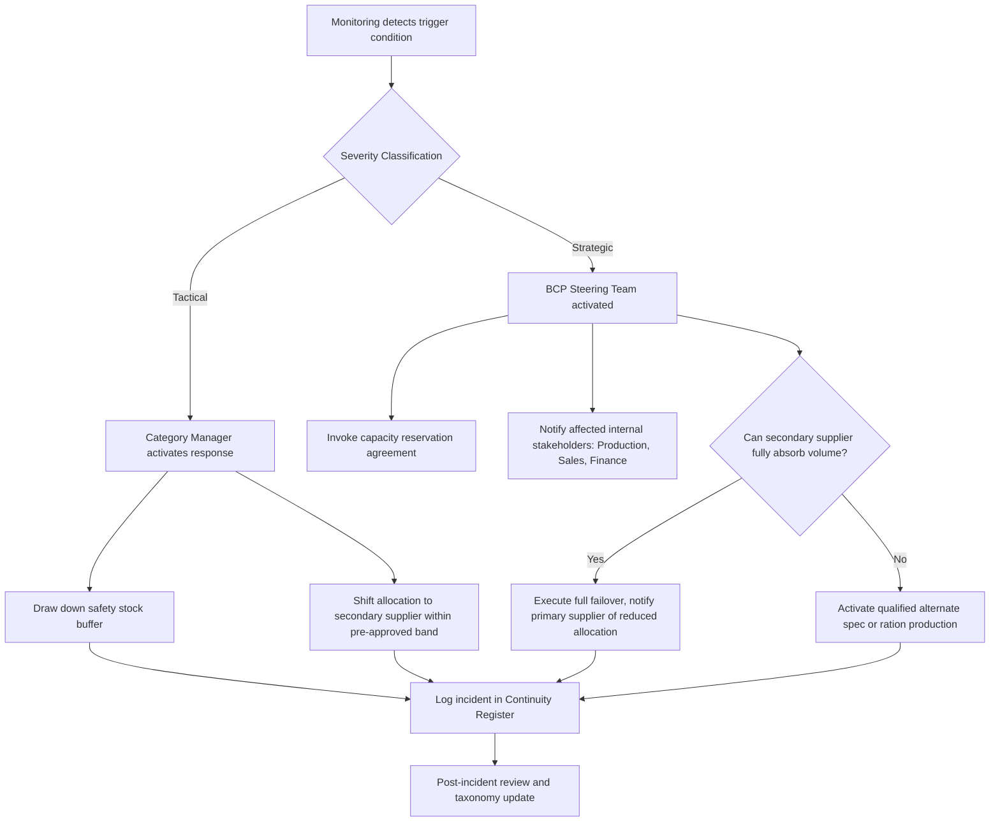

## Business Continuity Planning for Critical Components

### Overview

Business continuity planning (BCP) for critical components addresses the specific procedures, thresholds, and pre-negotiated mechanisms needed to maintain supply continuity when a critical part or material faces disruption risk. In a dual-sourcing context, BCP is not a fallback plan invoked only during crisis — it is a continuously maintained operational readiness state that determines how quickly and cleanly the organization can shift volume, activate reserve capacity, or fail over entirely to a secondary supplier.

The distinguishing feature of BCP for critical components (versus general business continuity) is that it centers on a single point of material or part failure with potentially cascading downstream effects on production, and therefore requires component-level (not just supplier-level) contingency logic.

### Identifying Criticality

Not all components warrant the same level of continuity investment. Criticality is typically assessed using a matrix combining **supply risk** and **business impact**.

```mermaid
quadrantChart
    title Component Criticality Matrix (svg_diagram)
    x-axis Low Supply Risk --> High Supply Risk
    y-axis Low Business Impact --> High Business Impact
    quadrant-1 Strategic (Critical)
    quadrant-2 Bottleneck
    quadrant-3 Non-Critical/Routine
    quadrant-4 Leverage
```

*Note: rendered here as unrendered Mermaid source per formatting rules; treat as a four-quadrant Kraljic-style matrix.*

**Key Points**

- **Strategic/Critical quadrant** (high risk, high impact): components requiring full BCP treatment — dual sourcing, safety stock, and formal continuity plans
- **Bottleneck quadrant** (high risk, lower impact): components needing risk monitoring but not necessarily dual sourcing if impact is contained
- **Leverage quadrant** (low risk, high impact): typically well-supplied but high spend; BCP focus is contractual protection, not physical redundancy
- **Non-critical quadrant**: minimal BCP investment justified

A component typically qualifies as "critical" for BCP purposes when it meets criteria such as: single point of failure in the bill of materials, long lead time relative to production cycle, limited number of qualified alternate suppliers, or regulatory/safety certification requirements that make substitution slow.

### BCP Framework Components

#### 1. Risk Assessment and Trigger Definition

Each critical component requires documented trigger conditions that initiate BCP activation:

| Trigger Type | Example Threshold | Activation Level |
| --- | --- | --- |
| Delivery delay | Confirmed delay > 2x standard lead time | Tactical |
| Quality escape | Defect rate exceeding contractual PPM limit on 2 consecutive lots | Tactical |
| Supplier financial distress signal | Credit rating downgrade below investment grade | Strategic |
| Force majeure declaration | Formal notice received from supplier | Strategic (immediate) |
| Geopolitical event | Export control or sanction affecting supplier's country | Strategic (immediate) |

#### 2. Continuity Response Mechanisms

**Key Points**

- **Safety stock buffer**: pre-positioned inventory sized to cover the qualification/ramp-up lead time of the secondary supplier
- **Capacity reservation agreements**: pre-negotiated contractual commitments with the secondary supplier guaranteeing access to a defined production capacity within a defined notice period
- **Dual-source failover ratio shift**: pre-approved allocation rebalancing (e.g., shifting from 70/30 to 30/70) without requiring a new procurement cycle
- **Qualified alternate specification**: engineering pre-approval of substitute materials or components that can be used if both primary options fail

#### 3. Safety Stock Sizing for Critical Components

Safety stock for critical components under dual sourcing is typically sized against the **failover lead time** (the time needed for the secondary supplier to ramp to full replacement volume), not just standard demand variability.

$$SS = Z \times \sigma_D \times \sqrt{LT_{failover}}$$

Where $Z$ is the service level factor (e.g., 1.65 for ~95% service level), $\sigma_D$ is the standard deviation of daily demand, and $LT_{failover}$ is the time in days for the secondary supplier to reach full replacement capacity.

**Example**

If daily demand has $\sigma_D = 50$ units, target service level requires $Z = 1.65$, and the secondary supplier needs 21 days to ramp to full volume:

$$SS = 1.65 \times 50 \times \sqrt{21} \approx 1.65 \times 50 \times 4.58 \approx 378 \text{ units}$$

This buffer is held specifically to bridge the ramp-up gap, distinct from normal cycle safety stock.

### BCP Activation Workflow



### Roles and Responsibilities

| Role | BCP Responsibility |
| --- | --- |
| Category Manager | Owns component criticality assessment, maintains supplier relationships supporting BCP terms |
| Supply Chain Risk Function | Monitors trigger conditions, maintains the Continuity Register, runs simulation exercises |
| Production/Operations | Provides ramp-up feasibility input, executes rationing if failover is partial |
| Legal/Contracts | Ensures capacity reservation and force majeure clauses are enforceable and current |
| Executive Sponsor | Approves strategic-level activation and any associated cost overruns |

### Testing and Maintenance

**Key Points**

- BCPs for critical components should be tested via tabletop exercises or limited-scope drills at least annually, since untested plans frequently fail on execution details (e.g., outdated contact lists, expired capacity agreements)
- Safety stock sizing and failover lead-time assumptions should be revalidated whenever supplier capacity, geography, or sub-tier dependencies change
- The Continuity Register (log of past activations, near-misses, and drill results) should feed back into the risk taxonomy and criticality matrix on a recurring basis
- [Inference] Organizations that run periodic live failover drills (actually shifting a small percentage of real volume to the secondary supplier under simulated stress) tend to surface ramp-up gaps that tabletop exercises alone do not reveal, though the practice adds real operational cost and is not universal

### Common Pitfalls

- **Stale capacity reservation agreements**: contracts signed years earlier without revalidating the secondary supplier's actual current capacity
- **Correlated failure blind spot**: BCP plans that assume supplier independence without verifying shared sub-tier dependencies (see risk taxonomy correlation analysis)
- **Under-scoped safety stock**: sizing buffers against average lead time rather than the true failover ramp-up time
- **No clear activation authority**: ambiguity over who can authorize a full failover, causing delay precisely when speed matters most

### Related Topics

- Component Criticality Assessment and Kraljic Matrix Application
- Capacity Reservation Agreement Contract Design
- Safety Stock Modeling Under Supply Uncertainty
- Sub-Tier Supplier Mapping and Correlated Risk Detection
- Failover Drill Design and Simulation Exercises
- Force Majeure Clause Drafting for Dual-Source Contracts