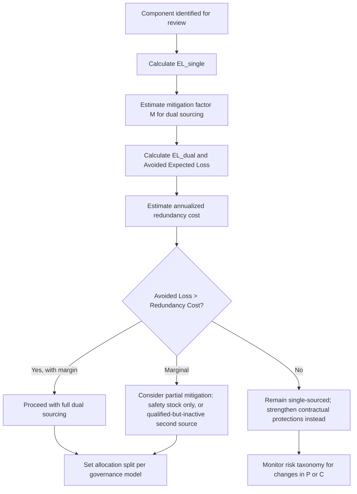

## Balancing Resilience Benefits Against Redundancy Costs

### Overview

Dual sourcing trades a measurable, recurring cost premium for a probabilistic, often-uncertain reduction in disruption risk. Balancing resilience benefits against redundancy costs is the analytical discipline of quantifying both sides of that trade so the decision to dual-source (and how aggressively) is based on expected-value economics rather than intuition or blanket risk-aversion policy. This is the economic counterpart to the risk taxonomy and BCP frameworks: those define *what* can go wrong and *how* to respond; this defines *whether the investment in redundancy is justified* for a given component.

### The Core Tension

**Key Points**

- Redundancy costs are largely certain, immediate, and recurring (price premiums, split-order inefficiencies, dual qualification overhead)
- Resilience benefits are probabilistic, delayed, and often invisible when they succeed (a disruption that never materializes into a production stoppage produces no observable "win")
- This asymmetry causes organizations to systematically underinvest in resilience during stable periods and overreact immediately after a disruption event
- The correct framing is not "single source vs. dual source" as a binary but "how much redundancy, for which components, funded to what service level"

### Cost Side: Components of Redundancy Cost

| Cost Category | Description | Typical Driver |
| --- | --- | --- |
| Price premium | Loss of volume-based pricing leverage when splitting spend | Reduced economies of scale with either supplier |
| Qualification cost | Engineering, testing, and certification of a second source | One-time, but recurring for spec changes |
| Administrative overhead | Managing two contracts, two scorecards, two relationships | Ongoing category management capacity |
| Inventory carrying cost | Additional safety stock to bridge failover ramp-up | Working capital tied up |
| Quality variance cost | Two suppliers rarely perform identically; managing the gap | Inspection, rework, or yield differences |
| Idle capacity cost | Paying for reserved capacity at the secondary supplier that may go unused | Capacity reservation agreements |

### Benefit Side: Quantifying Avoided Risk

The resilience benefit of dual sourcing is best expressed as **avoided expected loss** — the reduction in expected disruption cost achieved by holding a second qualified source.

$$EL_{single} = \sum_{i=1}^{n} P_i \times C_i$$

Where $P_i$ is the probability of disruption event $i$ and $C_i$ is the cost of that disruption (lost production, expedited freight, penalty clauses, lost sales) under single sourcing.

$$EL_{dual} = \sum_{i=1}^{n} P_i \times C_i \times (1 - M_i)$$

Where $M_i$ is the mitigation factor dual sourcing provides for event $i$ (drawing on the correlation analysis from the risk taxonomy — a correlated risk has low $M_i$, an uncorrelated risk has high $M_i$).

$$\text{Avoided Expected Loss} = EL_{single} - EL_{dual}$$

**Example**

A critical component has one plausible disruption scenario: supplier plant shutdown, $P = 0.08$ (8% annual probability), with cost $C = \$1{,}200{,}000$ if it causes a production stoppage.

$$EL_{single} = 0.08 \times 1{,}200{,}000 = \$96{,}000$$

If dual sourcing (with a geographically separate secondary supplier) provides mitigation $M = 0.75$:

$$EL_{dual} = 0.08 \times 1{,}200{,}000 \times (1 - 0.75) = \$24{,}000$$

$$\text{Avoided Expected Loss} = 96{,}000 - 24{,}000 = \$72{,}000 \text{ per year}$$

### The Break-Even Comparison

Dual sourcing is economically justified when:

$$\text{Avoided Expected Loss} > \text{Annualized Redundancy Cost}$$

**Example (continued)**

If the annualized redundancy cost (price premium + qualification amortization + extra safety stock carrying cost + administrative overhead) totals $45,000/year, the decision is favorable:

$$\$72{,}000 \text{ (benefit)} > \$45{,}000 \text{ (cost)} \Rightarrow \text{Dual sourcing justified}$$

If the same component instead had a low-probability, low-mitigation risk profile (e.g., $P=0.02$, $C=\$300{,}000$, $M=0.3$), the avoided expected loss would be only $1,800/year — far below almost any realistic redundancy cost, indicating single sourcing with strong contractual protections may be more efficient than physical dual sourcing.

### Decision Framework

### Non-Financial Factors That Adjust the Calculation

**Key Points**

- **Regulatory/compliance mandates**: some industries (defense, aerospace, pharma) require dual sourcing for certain component classes regardless of the pure cost-benefit outcome
- **Strategic customer requirements**: a key customer contract may mandate demonstrated supply resilience as a condition of business
- **Innovation access**: a second supplier can provide access to alternative technology or process improvements, a benefit not captured in the disruption-avoidance calculation alone
- **Negotiating leverage**: even a small, low-volume second source can meaningfully improve pricing and service terms from the primary supplier — a benefit sometimes larger than the direct risk mitigation value
- [Inference] Organizations often justify dual sourcing on leverage/negotiation grounds even when the pure risk-avoidance math is marginal, though this rationale is harder to quantify precisely than direct disruption cost avoidance

### Partial Redundancy Options (Between Single and Full Dual Sourcing)

When full dual sourcing fails the cost-benefit test but the risk is not negligible, intermediate options exist:

| Option | Description | Relative Cost |
| --- | --- | --- |
| Qualified-but-dormant second source | Supplier is fully qualified but receives no regular orders; activated only on disruption | Low (mainly qualification + periodic requalification) |
| Safety stock only | No second supplier; buffer inventory sized to cover expected disruption duration | Low-Medium |
| Capacity option contract | Pay a smaller fee for the right (not obligation) to activate secondary capacity on short notice | Medium |
| Full dual sourcing | Active ongoing allocation split between two suppliers | High |

### Common Pitfalls

- **Ignoring correlation in the mitigation factor**: assuming $M$ is uniformly high across all risk types without checking sub-tier dependency overlap
- **Static cost-benefit analysis**: redundancy cost and risk probability both change over time (commodity price shifts, geopolitical developments); the calculation should be revisited on the same cadence as the risk taxonomy review
- **Omitting soft costs**: administrative and quality-variance costs are frequently underestimated relative to the more visible price premium
- **Post-crisis overcorrection**: expanding dual sourcing broadly after a single disruption event without re-running the quantitative justification for each component

### Related Topics

- Expected Loss Modeling and Probability Estimation Techniques
- Supply Chain Risk Category Taxonomy (correlation inputs to mitigation factor)
- Capacity Option Contracts and Qualified-but-Dormant Sourcing
- Total Cost of Ownership Analysis for Dual-Sourced Components
- Governance Model for Managing Two Active Suppliers (allocation execution)
- Post-Disruption Review and Redundancy Policy Recalibration