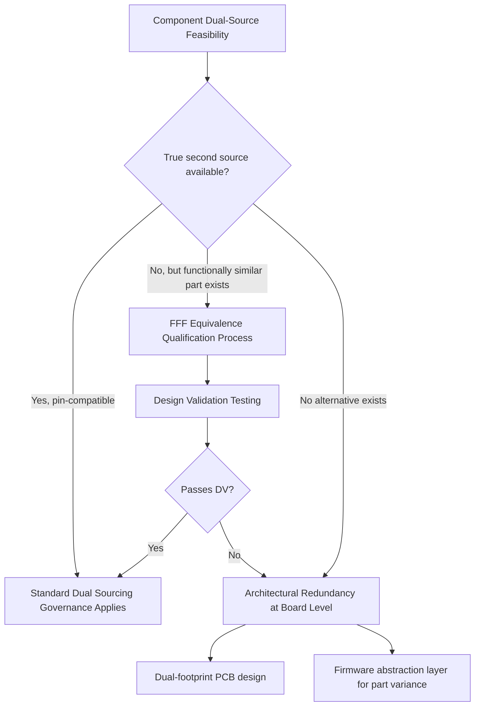

## Dual Sourcing Patterns in Semiconductors and Electronics

### Overview

Semiconductors and electronic components present the most structurally challenging environment for dual sourcing due to long lead times, high capital intensity of fabrication, IP protection constraints, and deep sub-tier concentration (particularly at the wafer fab and substrate levels). Dual sourcing patterns in this domain differ meaningfully from general manufacturing dual sourcing because component-level substitution is often not a simple "same part, different supplier" swap — it frequently requires form-fit-function (FFF) equivalence validation, board redesign, or firmware changes.

### Why Semiconductors Are a Distinct Case

**Key Points**

- Fabrication capacity is extremely concentrated: advanced nodes are produced by a small number of foundries globally, making true dual sourcing at the wafer level difficult or impossible for leading-edge parts
- Design-specific parts (ASICs, custom SoCs) may have no true second source at all — the "second source" must be a redesign-compatible alternative, not an identical part
- Long qualification cycles: automotive and industrial-grade semiconductors often require 6–18 months of qualification testing before a second source can be approved for production use
- Allocation during shortages is frequently controlled by the supplier/distributor, not the buyer, inverting the normal governance model during constrained periods

### Common Dual Sourcing Patterns

#### 1. True Second Source (Pin-Compatible/Drop-In)

The most straightforward pattern: two suppliers produce electrically and mechanically identical parts (same package, pinout, electrical specs), often under a cross-licensing or second-source manufacturing agreement.

- Common for: standard logic ICs, memory (DRAM, NAND flash), passive components, connectors
- Example pattern: JEDEC-standardized memory allows multiple manufacturers (e.g., Samsung, SK Hynix, Micron) to produce interchangeable parts to the same specification

#### 2. Form-Fit-Function (FFF) Equivalent

Parts that are not identical but meet the same footprint, electrical interface, and functional behavior, validated through a formal equivalence process rather than being literally the same design.

- Common for: power management ICs, sensors, microcontrollers where a "pin-compatible alternative" from a different vendor exists
- Requires engineering sign-off and often a design validation (DV) test cycle before qualification

#### 3. Multi-Source Distribution Model

Rather than qualifying two competing manufacturers, the buyer sources the *same* part from multiple authorized distributors, mitigating distribution/logistics risk without addressing manufacturing concentration risk.

- Mitigates: distributor-level stockouts, regional logistics disruption
- Does NOT mitigate: fab-level capacity constraints or manufacturer-specific quality issues (this is a key correlation gap — see risk taxonomy)

#### 4. Architectural Redundancy (Design-Level Second Source)

For components with no true second source (custom silicon, certain analog ICs), resilience is built at the board or system design level rather than the component level — designing the PCB to accept either of two different (non-pin-compatible) parts via alternate footprints or configurable firmware.

### Sub-Tier Concentration Risk in Semiconductors

This is the sharpest illustration of the correlation problem discussed in the general risk taxonomy: two "different" chip suppliers may both depend on the same upstream fab.

**Example**

A buyer dual-sources a microcontroller from Vendor A and Vendor B, believing this provides supply resilience. Investigation reveals both vendors are **fabless** semiconductor companies and both manufacture at the same foundry (e.g., a shared TSMC or GlobalFoundries node). A single fab disruption event would therefore affect both "independent" suppliers simultaneously.

$$M_{c} \approx 0.1 \text{–} 0.2 \text{ (low mitigation credit despite two distinct commercial suppliers)}$$

This is why sub-tier mapping (fab, substrate supplier, and even raw wafer source) is disproportionately important in electronics dual sourcing compared to most other industries.

### Lead Time and Allocation Dynamics

Semiconductor lead times vary enormously by category and market condition, and allocation governance must account for this volatility rather than assuming stable, buyer-controlled ordering:

| Condition | Typical Lead Time Pattern | Governance Implication |
| --- | --- | --- |
| Normal market | Weeks to a few months | Standard allocation split governance applies |
| Shortage/allocation market | Many months to over a year | Supplier allocates to buyer based on relationship tier, not buyer's requested split |
| Oversupply | Short lead times, price pressure | Opportunity to requalify or rebalance allocation favorably |

**Key Points**

- During allocation-constrained periods, buyers often cannot enforce a pre-set governance split (e.g., 60/40) because the supplier itself is rationing output across its entire customer base
- Long-term supply agreements (LTSAs) with capacity guarantees have become a common mitigation, trading a capacity/price commitment for priority allocation during shortages
- Buffer/safety stock strategy shifts during shortage conditions from "just enough to bridge failover" to "as much as can be secured," which conflicts with standard inventory carrying cost optimization

### Industry-Specific Qualification Requirements

- **Automotive (AEC-Q100/Q200)**: qualification testing for temperature, humidity, vibration, and reliability standards; second-source qualification can take 12+ months due to these requirements
- **Aerospace/Defense**: often requires traceability to specific fab and lot, sometimes prohibiting substitution without formal re-certification (DFARS, ITAR considerations)
- **Consumer electronics**: generally faster qualification cycles but higher price sensitivity, making the redundancy cost-benefit calculation (see prior chapter topic) more stringent

### Governance Adaptations for Electronics Dual Sourcing

The general governance model requires specific adaptations for this domain:

- **Design authority involvement**: unlike commodity dual sourcing, engineering/design authority must be a permanent member of the governance structure (not just consulted ad hoc) because part substitution has functional implications
- **Obsolescence monitoring**: semiconductor parts face end-of-life (EOL) risk on a compressed timeline compared to mechanical components; governance must track last-time-buy (LTB) notices for both sources
- **Allocation-aware scorecarding**: supplier delivery performance scoring must account for market-wide shortage conditions rather than penalizing a supplier for delays caused by industry-wide capacity constraints

### Common Pitfalls

- **False redundancy from shared fab dependency**: believing two vendor relationships equal two independent supply sources without verifying the fab/foundry level
- **Underestimating FFF qualification timelines**: treating electronics second-sourcing like commodity dual sourcing with comparable qualification speed
- **Static LTSA terms in a shortage-then-glut cycle**: capacity commitments negotiated during a shortage can become costly, underutilized obligations once the market normalizes
- [Inference] Some organizations have begun incorporating fab-level and wafer-source disclosure requirements directly into supplier qualification questionnaires specifically to close the sub-tier concentration blind spot, though this practice is not yet universal across the industry

### Related Topics

- Sub-Tier Supplier Mapping and Correlated Risk Detection
- Form-Fit-Function Equivalence Qualification Processes
- Long-Term Supply Agreements and Capacity Guarantee Structures
- Component Obsolescence and Last-Time-Buy Management
- Automotive and Aerospace Semiconductor Qualification Standards (AEC-Q100, DFARS)
- Balancing Resilience Benefits Against Redundancy Costs (applied to semiconductor economics)