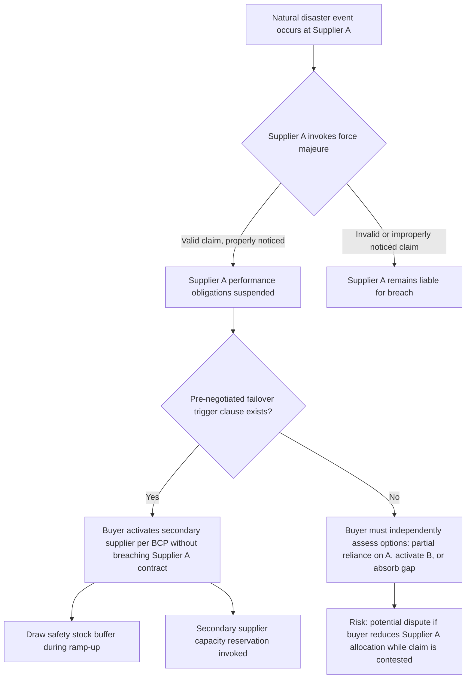

## Natural Disaster and Force Majeure Contingencies

### Overview

Natural disaster and force majeure contingencies address the specific subset of supply chain risk arising from sudden, often unpredictable events that fall outside either party's control — earthquakes, hurricanes, floods, fires, and similarly disruptive occurrences, along with the contractual mechanisms (force majeure clauses) that govern each party's obligations when such events occur. In a dual-sourcing context, this topic sits at the intersection of the risk taxonomy (environmental/external risk category), BCP execution, and contract law, because the legal excusal of performance under force majeure directly affects whether and how quickly failover to a secondary supplier can be triggered.

### Distinguishing Natural Disaster Risk from Other Categories

**Key Points**

- Unlike supplier financial distress or quality failure, natural disaster risk is largely uncorrelated with supplier management quality — even a well-managed, financially sound supplier can be disabled by a geographically-triggered event
- This makes geographic separation the primary (and often only effective) mitigation lever, distinguishing it from risks mitigated through supplier selection criteria or contract terms alone
- Force majeure is fundamentally a *legal* concept governing excusal of contractual performance, distinct from the *operational* fact of a disaster occurring — a supplier can suffer a disaster without a valid force majeure claim, or invoke force majeure for events that arguably don't qualify

### Force Majeure Clause Mechanics

A force majeure clause typically defines three elements: qualifying events, notice obligations, and consequences.

#### 1. Qualifying Event Definition

Contracts vary widely in how broadly or narrowly force majeure events are defined:

| Clause Style | Description | Risk to Buyer |
| --- | --- | --- |
| Enumerated list (narrow) | Specific events listed (earthquake, flood, war, government action) | Lower ambiguity, but gaps if an event isn't listed |
| Enumerated list + catch-all | List plus "or other events beyond reasonable control" | Balances specificity with flexibility |
| Broad/general | Any event "beyond reasonable control" without enumeration | Higher ambiguity, more prone to disputed invocation |

**Key Points**

- A well-drafted dual-sourcing contract should explicitly exclude foreseeable and preventable events (e.g., failure to maintain adequate insurance, poor facility maintenance) from qualifying as force majeure
- Pandemic and public health events have increasingly been explicitly added to force majeure definitions following widespread contract disputes where "disease" or "pandemic" was not originally enumerated
- [Unverified] Whether a given event qualifies as force majeure is ultimately a matter of contract interpretation and, in disputed cases, judicial or arbitral determination — this varies by jurisdiction and specific clause language, and general guidance here should not substitute for legal review of actual contract terms

#### 2. Notice and Documentation Obligations

Most force majeure clauses require the affected party to:

- Provide written notice within a specified window (commonly 3–10 business days) of the event's onset
- Provide reasonable evidence supporting the claim (e.g., government disaster declarations, insurance claims, third-party damage assessments)
- Provide a mitigation plan and estimated duration of the disruption
- Continue partial performance where feasible

#### 3. Consequences of a Valid Force Majeure Claim

- Temporary suspension of performance obligations without penalty or breach liability
- Extension of delivery deadlines by the duration of the qualifying event
- In extended cases, a termination right if the disruption exceeds a defined threshold (e.g., 60–90 days)

### Force Majeure and Failover Interaction

The critical dual-sourcing-specific question: **does invoking force majeure at the primary supplier trigger, delay, or complicate failover to the secondary supplier?**

**Key Points**

- A well-structured dual-sourcing contract includes an explicit **failover trigger clause**: language stating that a force majeure event of a defined duration (e.g., exceeding 14 days) permits the buyer to reallocate volume to a secondary source without penalty, and without waiving rights against the primary supplier
- Without this clause, buyers face genuine ambiguity about whether shifting volume during an active force majeure claim could be construed as a breach of minimum-purchase commitments to the primary supplier
- Symmetric protection matters: the secondary supplier's own contract should permit rapid volume increase without requiring a full renegotiation, which is why capacity reservation agreements are typically paired with force majeure failover clauses

### Geographic Risk Mapping for Natural Disaster Mitigation

Effective natural disaster mitigation through dual sourcing requires mapping supplier locations against known hazard zones, not simply confirming suppliers are "in different countries."

| Hazard Type | Mapping Consideration |
| --- | --- |
| Seismic | Fault line proximity, historical earthquake frequency/magnitude by region |
| Flood/hurricane | Coastal exposure, river basin flood plains, storm track history |
| Wildfire | Regional wildfire risk zones (increasingly relevant in parts of North America, Australia, Mediterranean Europe) |
| Extreme heat/drought | Water-dependent process risk (e.g., semiconductor fabs, textile dyeing) |

**Key Points**

- Two suppliers in different countries but the same seismic belt or the same hurricane corridor provide materially less protection than the geographic separation might suggest
- [Inference] Organizations with mature resilience programs often overlay supplier locations on hazard maps (e.g., USGS seismic hazard data, NOAA storm track data) as part of the annual risk taxonomy review, though the rigor of this practice varies considerably by company size and risk management maturity

### BCP Activation Specific to Disaster Events

Referencing the general BCP activation workflow, natural disaster events typically warrant **strategic-level, immediate activation** rather than tactical-level review, given their sudden onset and potential severity:

- Immediate safety stock draw-down authorization (often pre-approved for disaster-triggered scenarios specifically, bypassing normal approval delay)
- Rapid supplier contact to assess facility damage, workforce safety, and realistic recovery timeline
- Parallel activation of secondary supplier capacity reservation, initiated concurrently with (not after) confirming the primary supplier's status, given the time-sensitivity

### Post-Event Considerations

- **Requalification after facility rebuild**: if a primary supplier's facility is damaged and rebuilt, processes and equipment may differ from the originally qualified state, potentially requiring re-qualification
- **Renegotiation of allocation split**: a disaster event often becomes the natural trigger point for a strategic-layer review of whether the allocation split should permanently shift toward the more resilient supplier
- **Insurance and liability recovery**: contingent business interruption insurance considerations are typically handled by risk/finance functions but should be coordinated with the same Continuity Register used for BCP tracking

### Common Pitfalls

- **Assuming force majeure automatically permits volume shift**: without an explicit failover trigger clause, reallocating volume during a disputed or ambiguous claim can create legal exposure
- **Narrow force majeure definitions missing emerging risk types**: clauses drafted before recent events (pandemics, extreme heat events) may not explicitly cover them, creating interpretive disputes at the worst possible time
- **Geographic separation without hazard-zone verification**: treating "different country" as equivalent to "different hazard exposure"
- **Delayed secondary activation while awaiting primary supplier's formal notice**: given notice windows can be several business days, waiting for formal confirmation before beginning informal BCP preparation costs valuable response time

### Related Topics

- Force Majeure Clause Drafting and Failover Trigger Language
- Geographic Hazard Mapping for Supplier Location Risk
- Business Continuity Planning for Critical Components (activation workflow)
- Contingent Business Interruption Insurance
- Supply Chain Risk Category Taxonomy (environmental/external risk category)
- Post-Disruption Requalification Processes