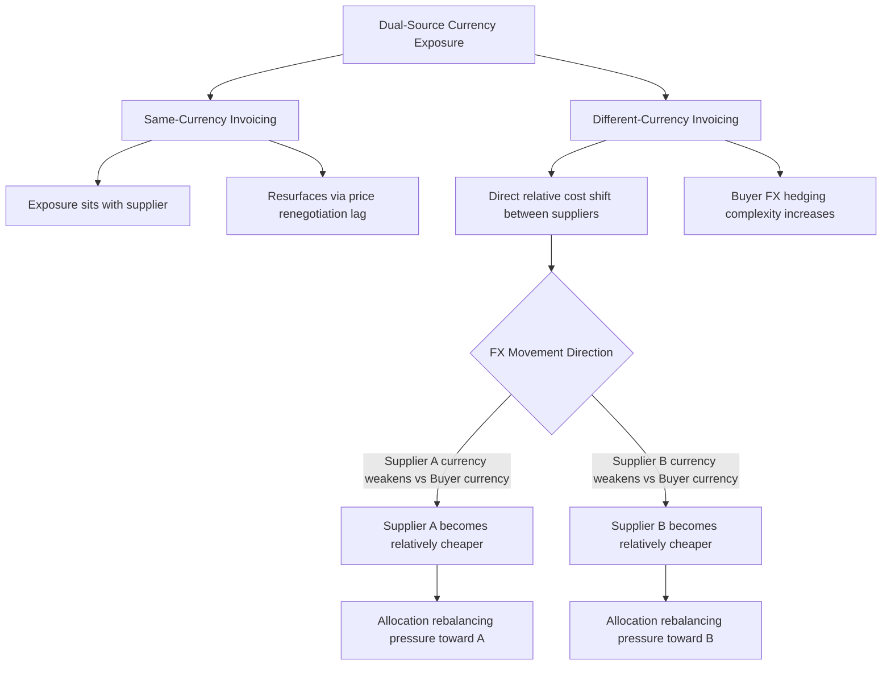

## Currency and Cost Volatility Across Dual Sources

### Overview

Currency and cost volatility across dual sources addresses how exchange rate movements and input cost fluctuations affect the relative economics of two suppliers priced differently, and how this volatility interacts with allocation governance, contract structure, and hedging strategy. Unlike the operational risks covered elsewhere in this chapter, this risk category is financial in nature: it does not threaten supply continuity directly, but it can silently erode the cost advantage that justified a given allocation split, or create allocation decisions driven by currency movements rather than actual supplier performance.

### Why Dual Sourcing Introduces Distinct Currency Exposure

**Key Points**

- Single sourcing carries currency exposure too, but it is a single, well-understood exposure that can be hedged with a single instrument or strategy
- Dual sourcing across suppliers in different currency zones creates **relative** exposure: the allocation split's cost-effectiveness shifts as the two currencies move relative to each other, not just relative to the buyer's home currency
- If suppliers are priced in the same currency (e.g., both invoice in USD regardless of manufacturing location), currency risk is transferred to the suppliers rather than eliminated — it resurfaces indirectly through future price renegotiations
- Cost volatility extends beyond currency to shared input costs (energy, raw materials, freight) that can move independently at each supplier's location due to local market conditions, tariffs, or regional supply-demand imbalances

### Currency Exposure Patterns in Dual Sourcing

### The Allocation Distortion Problem

A central governance risk: currency movements can create pressure to shift allocation toward the currently cheaper supplier for reasons unrelated to performance, undermining the stability and fairness the governance model is designed to protect.

$$\Delta C_{relative} = \left(P_A \times \frac{FX_{A,t}}{FX_{A,0}}\right) - \left(P_B \times \frac{FX_{B,t}}{FX_{B,0}}\right)$$

Where $P_A$ and $P_B$ are the base local-currency prices from Supplier A and Supplier B, and $FX_{A,t}/FX_{A,0}$ represents the exchange rate movement from the baseline period (t=0) to the current period (t) for each supplier's currency.

**Example**

Supplier A (Mexico, priced in MXN, converted to USD) and Supplier B (Vietnam, priced in VND, converted to USD) were cost-equivalent at contract signing. Over 12 months, the Mexican peso appreciates 8% against the USD while the Vietnamese dong stays flat. Even with zero change in either supplier's local-currency pricing or performance, Supplier A's landed cost in USD rises approximately 8% relative to Supplier B — a purely currency-driven cost shift.

**Key Points**

- Without a governance rule distinguishing currency-driven cost shifts from genuine performance or pricing differences, this could trigger an unwarranted reallocation away from Supplier A despite no change in underlying supplier quality
- A disciplined approach separates the composite scorecard's cost component (see governance model) into a currency-adjusted and currency-unadjusted view, so allocation decisions are not inadvertently currency-driven

### Hedging Strategies for Dual-Source Currency Exposure

| Strategy | Mechanism | Best Fit |
| --- | --- | --- |
| Natural hedge | Match currency of revenue/costs where possible (e.g., sourcing from a region where the buyer also sells) | Companies with matching regional revenue streams |
| Forward contracts | Lock in exchange rate for anticipated future purchase volumes | Predictable, contracted volume commitments |
| Currency clauses in contract | Price adjustment formulas tied to a reference exchange rate band | Long-term supply agreements with volume stability |
| Multi-currency invoicing option | Contractually allow the buyer to choose invoicing currency per shipment | Sophisticated treasury functions with active FX management |
| Do nothing (accept exposure) | Treat currency movement as a cost of doing business, absorbed into margin | Low-materiality spend categories |

### Currency Adjustment Clauses in Dual-Source Contracts

A common contractual mechanism to manage this risk directly in the supplier agreement:

$$P_{adjusted} = P_{base} \times \left[1 + \alpha \times \left(\frac{FX_t - FX_0}{FX_0}\right)\right]$$

Where $\alpha$ is a pass-through coefficient (0 to 1) negotiated between buyer and supplier, representing what portion of currency movement is passed through to price versus absorbed by the supplier.

**Example**

If $\alpha = 0.5$ (50% pass-through) and the supplier's local currency depreciates 10% against the buyer's currency ($\frac{FX_t - FX_0}{FX_0} = -0.10$ from the supplier's cost perspective, meaning their costs rise in relative terms):

$$P_{adjusted} = P_{base} \times [1 + 0.5 \times 0.10] = P_{base} \times 1.05$$

This 50/50 sharing structure is common because it discourages either party from treating currency movement as a one-sided windfall or burden, and it reduces the frequency of contentious full-repricing negotiations.

### Non-Currency Cost Volatility Factors

Beyond FX, several other cost volatility sources affect dual-source economics independently at each supplier:

- **Energy costs**: regional energy price differences (e.g., natural gas price divergence between regions) directly affect manufacturing cost structures differently at each supplier
- **Raw material indices**: commodity inputs (steel, resin, rare earth elements) may be sourced locally by each supplier at different prevailing prices
- **Labor cost inflation**: wage growth rates differ significantly by country/region and can shift relative cost competitiveness over a multi-year contract term
- **Freight and logistics cost**: fuel surcharges and shipping rate volatility affect landed cost differently depending on each supplier's shipping lane and distance to the buyer

### Governance Integration

Currency and cost volatility monitoring should feed into the same governance cadence established for supplier performance review, but with distinct ownership:

| Cadence | Activity | Owner |
| --- | --- | --- |
| Monthly | FX rate tracking against contract baseline; flag threshold breaches | Finance/Treasury, informing Category Manager |
| Quarterly | Currency-adjusted vs. unadjusted cost scorecard review | Category Manager |
| Contract renewal | Renegotiation of pass-through coefficient ($\alpha$) and reference FX baseline | Procurement + Finance |

**Key Points**

- Treasury/finance functions are typically not part of standard supplier performance governance but must be integrated specifically for this risk category
- A common threshold-based governance rule: currency movements beyond a defined band (e.g., ±5% from baseline) trigger a scheduled review rather than an automatic allocation change, preserving governance stability while still responding to material shifts
- [Inference] Organizations with mature treasury-procurement integration often maintain a shared FX dashboard visible to both functions, though the degree of formal integration varies significantly by company size and the materiality of cross-border sourcing spend

### Common Pitfalls

- **Conflating currency-driven and performance-driven cost changes** in the supplier scorecard, leading to allocation decisions that penalize a supplier for macroeconomic factors outside their control
- **No pass-through mechanism defined**, forcing ad hoc renegotiation every time currency moves materially, straining the supplier relationship
- **Ignoring correlated currency movements**: some currency pairs move together during global risk-off events (e.g., many emerging market currencies depreciating simultaneously against the USD), meaning geographic currency diversification may provide less protection than assumed during systemic events
- **Static baseline exchange rates**: using an outdated FX baseline in adjustment formulas long after market conditions have permanently shifted, creating a growing gap between contractual and actual cost reality

### Related Topics

- Currency Hedging Instruments and Treasury-Procurement Collaboration
- Contract Price Adjustment Clause Design (FX and commodity indexation)
- Total Cost of Ownership Analysis Across Currency Zones
- Governance Model for Managing Two Active Suppliers (scorecard integration)
- Commodity Price Index Tracking and Raw Material Cost Pass-Through
- Balancing Resilience Benefits Against Redundancy Costs (currency as a cost-side input)