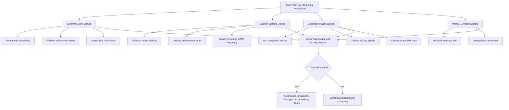
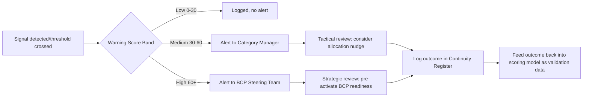

## Early-Warning and Disruption Monitoring Capability

### Overview

Early-warning and disruption monitoring capability is the continuous, forward-looking sensing infrastructure that detects emerging supply chain risk signals before they escalate into confirmed disruptions. Where the risk taxonomy classifies *what* can go wrong and BCP defines *how* to respond once it does, this capability closes the gap between the two: it determines *how much lead time* the organization has to activate a BCP response, shift allocation, or draw down safety stock before a disruption actually impacts supply. In dual sourcing specifically, early warning also directly feeds the allocation governance model — enabling proactive rebalancing rather than reactive failover.

### Why Lead Time Is the Central Value Driver

**Key Points**

- The value of any early-warning system is measured almost entirely in the additional response time it creates, not in prediction accuracy alone
- A monitoring system that detects a disruption 48 hours before it materializes but is not connected to any activation workflow provides near-zero practical value
- Conversely, a system with moderate false-positive rates but tightly integrated into BCP and allocation processes can meaningfully reduce disruption impact even without perfect predictive accuracy
- The governing design principle: optimize for *signal-to-action latency*, not just signal detection

### Monitoring Capability Layers

### Signal Categories in Detail

#### 1. External Macro Signals

- **News and media monitoring**: automated scanning for events (natural disasters, political unrest, regulatory announcements) affecting supplier regions, typically via news aggregation APIs or dedicated risk intelligence platforms
- **Weather and seismic feeds**: real-time hazard data (e.g., storm tracking, earthquake alerts) cross-referenced against mapped supplier facility locations
- **Geopolitical risk indices**: third-party country risk scores tracking trade policy shifts, sanctions activity, and political stability trends

#### 2. Supplier-Specific Signals

- **Financial health scoring**: credit rating changes, Days Sales Outstanding (DSO) trend if visible, public financial filings for publicly traded suppliers, or third-party financial risk scoring services
- **Delivery performance trend**: leading indicator value comes from the *trend direction*, not the absolute value — a supplier still meeting SLA but showing a declining trend over three consecutive periods is a meaningful early signal
- **Quality trend and CAPA (Corrective and Preventive Action) frequency**: an increasing rate of corrective action requests often precedes a more serious quality escape

#### 3. Logistics/Network Signals

- **Port congestion indices**: publicly available or subscription-based data on dwell times and vessel queue lengths at key ports in the supplier's shipping lane
- **Carrier capacity signals**: freight rate spikes or capacity announcements from shipping lines/airlines indicating tightening logistics markets
- **Customs/trade flow data**: changes in inspection rates or clearance times that may signal new regulatory friction

#### 4. Internal Demand Signals

- **Forecast accuracy drift**: while technically internal, sustained forecast error can mask emerging supply issues (e.g., a supplier quietly reducing informal buffer stock in response to their own constraints, causing order fulfillment patterns to shift)
- **Order pattern anomalies**: sudden partial shipments, backorder frequency increases, or unrequested substitutions from a supplier

### Signal Scoring and Threshold Design

Raw signals require aggregation into an actionable composite score to avoid alert fatigue from noisy individual data points.

$$W_i = \sum_{j} w_j \times S_{ij}$$

Where $W_i$ is the composite warning score for supplier or component $i$, $w_j$ is the weight assigned to signal category $j$, and $S_{ij}$ is the normalized (0–100) signal strength for that category.

**Example**

A component's warning score is built from three weighted signals: financial health trend (weight 0.4, score 65), delivery trend (weight 0.35, score 40), and geopolitical risk (weight 0.25, score 20):

$$W_i = (0.4 \times 65) + (0.35 \times 40) + (0.25 \times 20) = 26 + 14 + 5 = 45$$

A governance rule might define: scores below 30 require no action, 30–60 trigger a tactical-layer review, and above 60 trigger strategic-layer BCP pre-activation (readiness posturing without full failover).

### Integration with Dual-Source Allocation Governance

**Key Points**

- Early-warning scores should feed directly into the allocation rebalancing triggers defined in the governance model, allowing proactive allocation shifts before a performance-threshold breach forces a reactive one
- A rising warning score at Supplier A, even without a confirmed disruption, can justify a pre-emptive tactical-layer allocation shift toward Supplier B within the pre-approved band — this is the mechanism by which early warning converts detection lead time into actual risk reduction
- This requires the monitoring capability to be organizationally connected to category management, not siloed within a separate risk function that only produces periodic reports

### Alerting and Escalation Workflow

### Data Sources and Tooling Categories

| Capability Type | Examples of Function | Notes |
| --- | --- | --- |
| Risk intelligence platforms | Aggregated news, geopolitical, and supplier risk scoring | Often subscription-based third-party services |
| Supply chain visibility platforms | Multi-tier mapping, shipment tracking, control tower dashboards | Value increases significantly with sub-tier visibility (see risk taxonomy) |
| ERP/SRM-native analytics | Internal delivery, quality, and order pattern trend tracking | Lower cost but limited to internally visible data |
| Manual relationship intelligence | Buyer/category manager qualitative observations from routine supplier contact | Often undervalued but catches signals no automated feed detects |

**Key Points**

- [Inference] Organizations frequently underinvest in the "manual relationship intelligence" layer relative to automated tooling, despite experienced category managers often detecting early signals (e.g., a supplier's unusual reluctance to commit to normal lead times) well before they appear in any formal data feed, though this observation is difficult to quantify systematically
- Sub-tier visibility (mapping beyond the direct/Tier-1 supplier) substantially increases the value of monitoring, since many disruption events originate at Tier 2 or Tier 3 and would otherwise go undetected until they surface as a Tier-1 delay

### Maintenance and Calibration

- **False positive/negative tracking**: warning scores that consistently fail to predict actual disruptions (or that generate excessive false alarms) should trigger recalibration of signal weights
- **Feedback loop to the Continuity Register**: every BCP activation or near-miss should be traced back to whether early-warning signals existed and whether they were acted upon, closing the loop between detection and governance response
- **Periodic signal source review**: data feeds and risk intelligence subscriptions should be reassessed against the current risk taxonomy, since supplier geographic footprint and risk exposure change over time

### Common Pitfalls

- **Alert fatigue from poorly calibrated thresholds**: too many medium-severity alerts causing category managers to deprioritize or ignore the monitoring system entirely
- **Monitoring without action authority**: a well-built detection system that has no formal connection to allocation or BCP decision rights produces reports, not risk reduction
- **Over-reliance on Tier-1 visibility**: missing the sub-tier disruptions that are often the actual root cause of a Tier-1 delay
- **Static signal weighting**: failing to recalibrate $w_j$ weights as the relative importance of different risk categories shifts (e.g., geopolitical risk weight increasing during periods of trade policy volatility)

### Related Topics

- Supply Chain Risk Category Taxonomy (signal categories mirror taxonomy structure)
- Sub-Tier Supplier Mapping and Multi-Tier Visibility Platforms
- Governance Model for Managing Two Active Suppliers (allocation trigger integration)
- Business Continuity Planning for Critical Components (activation workflow linkage)
- Supplier Financial Health Monitoring Techniques
- Continuity Register Design and Post-Incident Feedback Loops