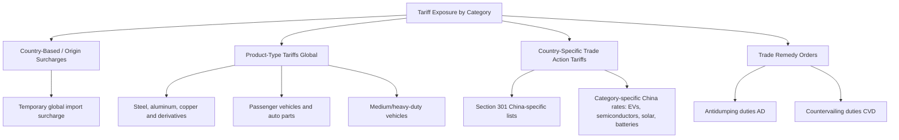
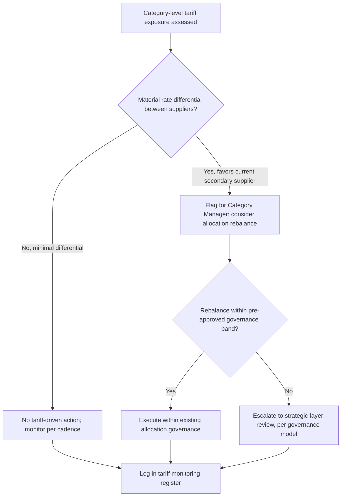

## Tariff Exposure Assessment by Product Category

### Overview

Tariff exposure assessment by product category is the systematic process of identifying, quantifying, and monitoring duty-related cost risk across a company's sourced components, organized by the tariff regime each category falls under (rather than by supplier or region alone). In a dual-sourcing context, this assessment is the analytical foundation that makes geographic and country-of-origin diversification a genuine risk mitigation strategy rather than a coincidental byproduct of supplier selection. Because tariff structures are frequently product-category-specific and legally distinct (Section 301, Section 232, country-based surcharges), a component-by-component assessment is necessary — a single supplier relationship can carry multiple, differently-triggered tariff exposures simultaneously.

**Note on currency of this material**: trade policy in this domain has been unusually volatile through 2026. A February 2026 Supreme Court ruling held that IEEPA does not authorize the prior "reciprocal" tariff schedule, which was replaced by a temporary Section 122 import surcharge of 10% ad valorem on most countries' imports, while an April 2026 proclamation restructured Section 232 duty assessment to apply to a covered good's full customs value rather than only its metal content. Given this pace of change, the *structural framework* below should be treated as durable; specific rates should always be reverified against current CBP/USTR guidance before use in a live procurement decision. [wakeo](https://content.wakeo.co/content-a-snapshot-of-recent-us-tariff-changes)[mohawkglobal](https://mohawkglobal.com/word-from-the-white-house/new-section-232-tariff-changes-on-steel-aluminum-copper-what-importers-need-to-know/)

### Why Tariff Exposure Is Categorical, Not Just Geographic

**Key Points**

- Two components sourced from the same country can carry entirely different tariff exposure if they fall under different Harmonized Tariff Schedule (HTS) classifications and different legal authorities (e.g., a Section 301 China-specific list vs. a Section 232 metals-derivative category)
- A single component can be subject to **stacked** tariffs — multiple duty layers applying simultaneously — which materially changes the total landed cost calculation beyond a single headline rate
- Combined effective rates can exceed 50% when MFN duties, Section 301 tariffs, Section 232 tariffs, and antidumping/countervailing duty (AD/CVD) orders are stacked together, making category-level stacking analysis essential rather than optional [camtomx](https://camtomx.com/en/guia/china-tariffs-us-importers-guide-2026)

### Tariff Regime Taxonomy Relevant to Dual Sourcing

### Category-Level Exposure Reference (Illustrative, as of mid-2026)

| Product Category | Applicable Regime(s) | Approximate Rate Range | Notes |
| --- | --- | --- | --- |
| Steel, aluminum, copper (primary) | Section 232 | Around 50% on many primary products | Products with at least 85% US-origin covered metal content may qualify for a reduced 10% rate |
| Steel/aluminum/copper derivatives | Section 232 | Generally 25% for most derivative products; 15–25% for certain industrial machinery and power equipment | Products under 15% covered metal content by weight are generally exempt |
| Passenger vehicles / auto parts | Section 232 | 25%, with the non-US content of qualifying vehicles assessed rather than full value for CUSMA/USMCA-compliant vehicles | Origin-content verification required, often model-by-model |
| Medium/heavy-duty vehicles, buses | Section 232 | 25% for MHDVs/parts; 10% for buses | Distinct rate structure from passenger vehicles |
| China-origin goods generally (Lists 1–2 / 3–4A) | Section 301 | 25% on Lists 1 and 2; 7.5% on Lists 3 and 4A | Stacks with other applicable regimes |
| China-origin EVs | Section 301 | 100% | Category-specific escalated rate |
| China-origin semiconductors, solar cells | Section 301 | 50% | Category-specific escalated rate |
| China-origin EV batteries | Section 301 | 25% | Category-specific escalated rate |
| Most other imports (global, non-exempt) | Section 122 surcharge | 10% ad valorem, implemented as a temporary measure following the invalidation of the prior IEEPA-based schedule | [Unverified] Duration and successor policy were still evolving as of mid-2026; verify current status before use |

[Unverified] Given the pace of proclamation-level change documented above, treat every rate in this table as a snapshot requiring reverification against the current CBP tariff schedule and USTR notices at time of use — this is not a stable reference table in the way a technical specification would be.

### Building a Category-Level Exposure Assessment

#### Step 1: HTS Classification Mapping

Every sourced component must be mapped to its correct HTS code, since tariff treatment is determined at this granularity, not at the product-family or supplier level. Misclassification is both a compliance risk and a source of inaccurate exposure assessment.

#### Step 2: Regime Overlay per HTS Code

For each classified component, identify every applicable regime layer:

$$\text{Effective Duty Rate} = MFN + \sum_{k} T_k$$

Where $MFN$ is the baseline Most Favored Nation rate and $T_k$ represents each additional applicable tariff layer (Section 301, Section 232, surcharge, AD/CVD), summed across all layers that legally stack for that HTS code and country of origin.

**Example**

A steel derivative component sourced from China, classified under an HTS code subject to: MFN baseline (2%) + Section 301 List 1 rate (25%) + Section 232 derivative rate (25%) + Section 122 surcharge (10%, if not exempted for this category):

$$\text{Effective Duty Rate} = 2\% + 25\% + 25\% + 10\% = 62\%$$

This stacked exposure, rather than any single headline rate, is what should drive the dual-sourcing cost-benefit comparison against an alternate-country supplier.

#### Step 3: Cross-Supplier Comparative Exposure

For dual-sourced categories, calculate the effective duty rate independently for each supplier's country of origin and HTS treatment, since the entire strategic rationale for geographic dual sourcing often hinges on this differential.

| Supplier | Country of Origin | HTS Classification | Applicable Regimes | Effective Duty Rate |
| --- | --- | --- | --- | --- |
| Supplier A | China | [Category-specific code] | MFN + Section 301 + Section 232 + surcharge | High (potentially 50%+) |
| Supplier B | Vietnam (or USMCA partner) | Same functional part, different origin | MFN + surcharge only (if applicable) | Substantially lower |

**Key Points**

- This differential is frequently the primary economic justification for a dual-sourcing or resourcing decision independent of the underlying supply-risk rationale covered elsewhere in this chapter
- The comparison must account for content-origin rules (e.g., minimum domestic/regional content thresholds for preferential treatment), not just the country of final assembly, since verified US-content percentage can materially change the applicable rate for USMCA-qualifying goods [langleychamber](https://www.langleychamber.com/Tariffs/)

### Integration with Dual-Sourcing Allocation Governance

**Key Points**

- Tariff-driven allocation shifts should route through the same governance decision-rights structure used for performance-driven rebalancing, rather than being executed informally by procurement staff reacting to a rate announcement
- Given the frequency of proclamation-level changes observed through 2026, a formal monitoring cadence (see Early-Warning and Disruption Monitoring Capability) should treat trade policy announcements as a distinct signal category requiring rapid category-level reassessment, not just an annual review item

### Classification and Compliance Risk Considerations

**Key Points**

- Ongoing Harmonized System revisions have introduced new subheadings for items such as specific lithium-ion battery types, rare earth materials, and semiconductor components, allowing more precise but also more complex classification [camtomx](https://camtomx.com/blog/harmonized-tariff-schedule-updates-2026)
- Misclassification carries both financial risk (incorrect duty payment, retroactive assessment) and compliance risk (penalties), making this assessment a joint exercise between procurement, trade compliance, and finance functions rather than procurement alone
- Section 301 exclusion requests and renewal processes exist for some categories and should be tracked as part of the category assessment, since a successful exclusion can materially change the effective rate for a specific HTS code [camtomx](https://camtomx.com/en/guia/china-tariffs-us-importers-guide-2026)

### Common Pitfalls

- **Assuming a single supplier country implies a single tariff rate**: different components from the same country, under different HTS codes, can carry very different exposure
- **Failing to model duty stacking**: evaluating only the most prominent tariff layer (e.g., Section 301) while ignoring the surcharge or Section 232 layer that also applies
- **Static exposure assessment**: given the demonstrated pace of proclamation-level change in this policy area, an assessment performed even a few months earlier may already be materially outdated
- **Treating tariff exposure as purely a finance/compliance concern**: disconnecting it from the dual-sourcing allocation governance model means a favorable tariff differential goes unexploited, or an adverse one goes unmitigated

### Related Topics

- HTS Classification Methodology and Compliance Risk Management
- Duty Stacking and Effective Rate Calculation Across Trade Remedy Layers
- Content-Origin Rules and Regional Trade Agreement Qualification (USMCA/CUSMA)
- Section 301 Exclusion Request Processes
- Governance Model for Managing Two Active Suppliers (tariff-driven rebalancing integration)
- Currency and Cost Volatility Across Dual Sources (combined landed-cost modeling)