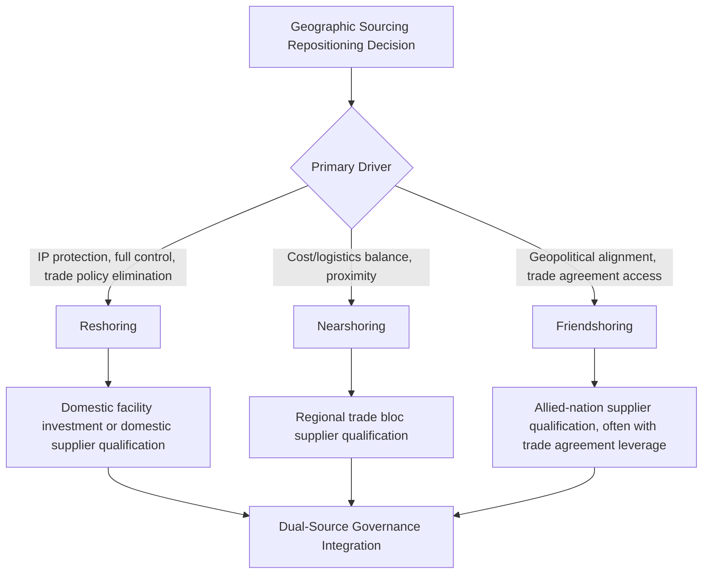
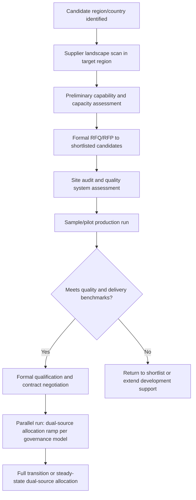

## Reshoring, Nearshoring, and Friendshoring Strategies

### Overview

Reshoring, nearshoring, and friendshoring are three related but distinct geographic sourcing repositioning strategies, each responding to a different combination of cost, risk, and geopolitical pressure. Where the prior topic assessed tariff exposure at the product-category level, this topic addresses the strategic response: relocating supply sources geographically to reduce that exposure and other geopolitical risks, while managing the trade-offs each relocation strategy introduces. In a dual-sourcing context, these strategies are frequently how the "second source" in a dual-sourcing arrangement gets selected in the first place — the geographic diversification decision and the dual-sourcing decision are often made together.

### Definitions and Distinctions

**Key Points**

- **Reshoring**: relocating production or sourcing back to the buyer's home country, prioritizing maximum control, IP protection, and elimination of cross-border trade policy exposure at the cost of typically higher labor and operating costs
- **Nearshoring**: relocating sourcing to a geographically proximate country (often sharing a border, trade bloc, or short-haul shipping lane), balancing cost reduction against logistics and cultural/time-zone proximity benefits
- **Friendshoring** (also called "ally-shoring"): relocating sourcing to countries with favorable political and trade relationships with the buyer's home country, prioritizing geopolitical alignment and trade agreement stability over pure geographic proximity or cost
- These strategies are not mutually exclusive — a company might reshore its most IP-sensitive component while friendshoring a mid-criticality component and maintaining an existing low-criticality supplier in a geopolitically distant location

### Comparative Framework

| Dimension | Reshoring | Nearshoring | Friendshoring |
| --- | --- | --- | --- |
| Primary risk addressed | Geopolitical/tariff exposure, IP leakage | Logistics disruption, lead time, currency exposure | Geopolitical/sanctions exposure specifically |
| Typical cost impact | Highest increase (labor, facility) | Moderate increase | Variable — depends on ally-nation cost structure |
| Typical lead time impact | Shortest (same time zone, short transit) | Short (regional transit) | Variable — depends on selected ally nation's distance |
| Qualification complexity | High if building new domestic capability from scratch | Moderate | Moderate to high, depending on existing supplier base maturity in ally nations |
| Trade agreement leverage | Not applicable (domestic) | Often high (e.g., USMCA/CUSMA) | High if targeting FTA partner countries |

### Strategic Drivers by Category

#### Tariff and Trade Policy Avoidance

Directly connects to the category-level tariff exposure assessment: when a product category's effective duty rate is dominated by a country-specific regime (e.g., China-specific Section 301 rates), relocating that category's sourcing to a non-targeted country can eliminate the exposure entirely rather than merely reducing it through negotiation.

$$\Delta TCO_{relocation} = (\text{Effective Duty Rate}_{origin} - \text{Effective Duty Rate}_{new}) \times \text{Annual Spend} - \text{Relocation/Requalification Cost}$$

**Example**

A component with $4,000,000 annual spend faces a stacked effective duty rate of 55% from its current China-based source. A qualified nearshoring alternative in Mexico faces an effective rate of 5% (MFN only, USMCA-qualifying). One-time requalification cost is estimated at $350,000.

$$\Delta TCO = (0.55 - 0.05) \times 4{,}000{,}000 - 350{,}000 = 2{,}000{,}000 - 350{,}000 = \$1{,}650{,}000 \text{ net first-year benefit}$$

This calculation should be run using the same expected-loss and cost-benefit discipline established for the general resilience-versus-redundancy analysis, since relocation carries its own transition risk that should be weighed against the tariff savings.

#### Supply Chain Resilience

Beyond tariffs, geographic repositioning directly serves the risk-taxonomy correlation logic: a nearshored or friendshored second source in a different hazard zone and different geopolitical bloc than the primary source provides higher mitigation credit ($M_c$) against both natural disaster and geopolitical risk categories than a second source that is merely a different company in the same region.

#### Talent and Innovation Access

Reshoring in particular is sometimes driven by access to domestic engineering talent or co-location with R&D functions, a benefit not directly captured in landed-cost or risk-avoidance calculations but relevant to overall sourcing strategy.

### Qualification and Transition Process

**Key Points**

- The transition period typically runs as a parallel-sourcing ramp rather than an abrupt cutover, allowing the new source to be validated under real production conditions before the original source's allocation is reduced
- This ramp period is functionally identical to the failover ramp-up concept used in BCP safety stock sizing — the same lead-time buffering logic applies whether the transition is disruption-driven (emergency failover) or strategy-driven (planned relocation)
- Total qualification timelines vary significantly by industry, ranging from a few months for simple commodity parts to well over a year for regulated components requiring formal certification (e.g., automotive AEC-Q qualification, aerospace traceability requirements)

### Trade-Offs and Limitations

**Key Points**

- **Cost premium is often durable, not transitional**: labor cost differentials between reshoring destinations and prior offshore locations frequently persist rather than converging over time, meaning the tariff-avoidance savings must be weighed against a permanent cost structure change, not a temporary one
- **Nearshoring concentration risk**: if many companies nearshore to the same regional hub in response to similar trade pressures, that region can develop its own capacity constraints, labor cost inflation, and infrastructure strain, partially eroding the anticipated benefit
- **Friendshoring political durability**: "ally" status is not permanent — trade relationships and political alignment can shift over a multi-year sourcing horizon, meaning friendshoring reduces but does not eliminate geopolitical risk
- **Capability gaps**: some manufacturing capabilities (e.g., certain electronics assembly ecosystems, specialized tooling clusters) have developed deep, hard-to-replicate industrial ecosystems in specific regions over decades; relocating away from these clusters can mean accepting a capability or scale trade-off, not just a cost trade-off
- [Inference] Some organizations have found that a full domestic ecosystem — the dense network of sub-tier suppliers, specialized labor, and tooling infrastructure surrounding certain component categories — takes considerably longer to rebuild through reshoring than the primary facility itself, though the extent of this effect is highly category- and region-specific

### Governance Integration

Relocation strategy decisions should be governed at the strategic layer of the dual-sourcing governance model (see governance model), given their scale, cost, and multi-year time horizon, with the tactical layer managing the parallel-run ramp execution once a relocation decision is approved.

| Decision Point | Owner |
| --- | --- |
| Whether to pursue reshoring/nearshoring/friendshoring for a category | Procurement Director + Executive Sponsor (strategic layer) |
| Target region/country selection | Category Manager, informed by trade compliance and risk functions |
| Supplier qualification within target region | Category Manager (tactical layer) |
| Allocation ramp execution during transition | Buyer/Planner (operational layer), per governance-defined ramp schedule |

### Common Pitfalls

- **Underestimating requalification cost and timeline**, particularly for regulated or safety-critical components
- **Treating tariff-driven relocation as a one-time fix** without accounting for the demonstrated volatility of trade policy — a relocation optimized against today's tariff schedule may face a different exposure profile within the same year
- **Ignoring correlated concentration risk** created by nearshoring to a popular regional hub alongside many other companies responding to the same trade pressures
- **Conflating geographic proximity with risk decorrelation**: a nearshored supplier in the same hazard zone or reliant on the same shared sub-tier base as the primary supplier may not meaningfully improve the risk-adjusted mitigation factor discussed in the risk taxonomy

### Related Topics

- Tariff Exposure Assessment by Product Category (primary driver for relocation economics)
- Supply Chain Risk Category Taxonomy (correlation and geographic mitigation credit)
- Business Continuity Planning for Critical Components (parallel-run ramp mechanics)
- Governance Model for Managing Two Active Suppliers (strategic-layer decision rights)
- Regional Trade Agreement Qualification (USMCA/CUSMA content rules)
- Supplier Qualification and Onboarding Process Design