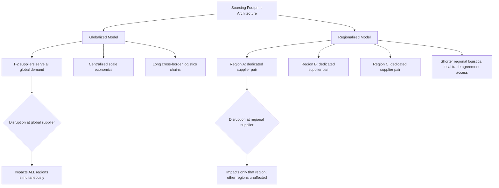
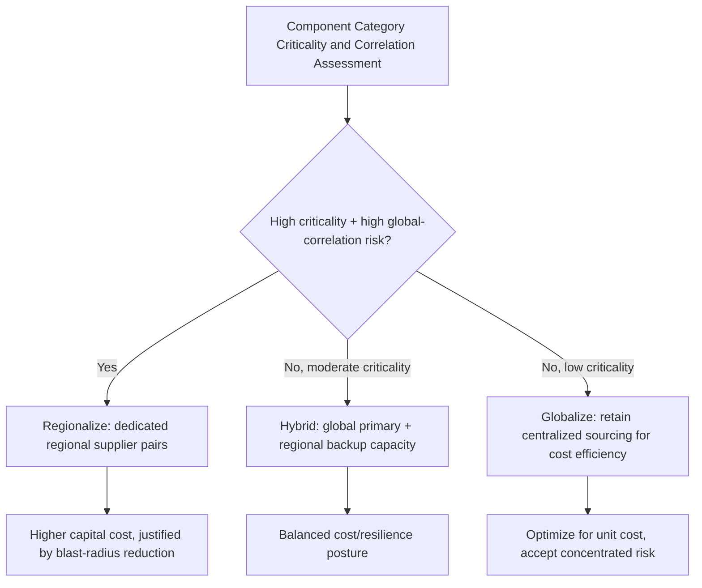

## Regionalization Versus Globalization Trade-Offs

### Overview

Regionalization versus globalization trade-offs address a strategic sourcing footprint question distinct from the tactical relocation strategies covered previously: not "should we move this specific supplier," but "should our overall sourcing architecture be organized around a small number of globally optimized suppliers serving all markets, or around regional supply clusters that each serve their own geography semi-independently." This is a portfolio-level design decision that shapes how dual sourcing itself is structured — whether the "two suppliers" in a dual-sourcing arrangement serve as global alternates to each other, or as regional-specific primary sources each serving a defined geographic market.

### Defining the Two Models

**Key Points**

- **Globalized sourcing model**: a small number of suppliers (often one primary, one backup) serve the buyer's entire worldwide demand from centralized or near-centralized production locations, optimized for economies of scale and unit cost minimization
- **Regionalized sourcing model**: multiple suppliers, each serving a defined region (e.g., Americas, EMEA, APAC), with production located within or near the region it serves, optimized for reduced cross-border exposure, shorter logistics chains, and market-specific responsiveness
- Dual sourcing can exist within either model — the distinction is *organizational geometry*, not the presence or absence of supplier redundancy

### Comparative Trade-Off Framework

| Dimension | Globalized Model | Regionalized Model |
| --- | --- | --- |
| Unit cost | Typically lower (scale economics concentrated) | Typically higher (scale fragmented across regions) |
| Disruption blast radius | Global — a single-source disruption affects all markets simultaneously | Contained — a regional disruption affects only that region |
| Tariff/trade policy exposure | Concentrated — a single country-specific tariff action can affect the entire global supply base | Distributed — trade policy shifts in one region affect only that region's sourcing |
| Logistics complexity and lead time | Higher (long-haul shipping to distant markets) | Lower (short-haul, regional distribution) |
| Organizational/governance complexity | Lower (fewer relationships to manage) | Higher (multiple regional governance structures needed) |
| Responsiveness to local demand/spec variation | Lower (one-size-fits-all production) | Higher (regional production can adapt to local requirements) |
| Capital intensity | Lower (single or few facility investments) | Higher (redundant regional capacity investment) |

### The Correlation Problem in Globalized Models

This connects directly to the risk taxonomy's correlation analysis: a globalized sourcing model, even with nominal dual sourcing (two suppliers), can produce **globally correlated risk** if both suppliers are located in the same region or rely on the same regional infrastructure — a single event can simultaneously disrupt both "redundant" sources and every market they serve.

$$\text{Global Blast Radius Risk} = P(\text{disruption}) \times \sum_{r=1}^{n} D_r$$

Where $D_r$ is the demand dependent on the disrupted source in region $r$, summed across all $n$ regions served. In a fully globalized model, this sum approaches total worldwide demand for the component; in a regionalized model, a single disruption's impact is bounded to $D_r$ for the one affected region.

**Example**

A globally centralized supplier serving $50,000,000 in annual demand across all regions experiences a facility-level disruption with $P = 0.05$ (5% annual probability) and near-total impact:

$$\text{Expected Global Impact} = 0.05 \times 50{,}000{,}000 = \$2{,}500{,}000$$

Under a regionalized model with four roughly equal regional clusters (each ~$12,500,000 in demand) and the same per-cluster disruption probability, but with disruptions treated as largely uncorrelated across regions:

$$\text{Expected Regional Impact (any one region)} = 0.05 \times 12{,}500{,}000 = \$625{,}000$$

The regionalized model's *total* expected loss across all four regions combined may be similar in aggregate (assuming similar per-region risk), but the *maximum single-event impact* is reduced by roughly 75%, which matters significantly for business continuity planning and worst-case scenario management even when average expected cost is comparable.

### Drivers Pushing Toward Regionalization

**Key Points**

- **Trade policy volatility**: as tariff exposure assessment has shown, country-specific and category-specific trade actions can rapidly and substantially change the economics of a globally concentrated sourcing footprint, making regional diversification a hedge against future, currently-unknown policy shifts
- **"Produce where you sell" pressure**: some governments and trade agreements create incentives (or requirements) for regional content, pushing multinational companies toward regional production naturally
- **Logistics resilience**: recent large-scale logistics disruptions (port congestion, canal transit constraints, carrier capacity shocks) have demonstrated that long global supply chains carry compounding lead-time risk that regional chains avoid
- **Currency and cost volatility management**: regionalized sourcing paired with regional revenue creates natural currency hedging (matching regional costs to regional revenue), reducing the relative-exposure problem discussed in the currency volatility topic

### Drivers Preserving Globalization

**Key Points**

- **Scale economics remain real**: many manufacturing processes have genuine unit-cost advantages at higher volumes that regional fragmentation directly undermines
- **Specialized capability concentration**: certain component categories (as noted in the semiconductor dual-sourcing discussion) have deep, geographically concentrated industrial ecosystems that cannot be easily or affordably replicated regionally
- **Governance and quality consistency**: managing fewer, larger supplier relationships is operationally simpler than managing a larger number of regional relationships, each requiring its own governance, quality system, and performance management
- **Capital constraints**: building redundant regional capacity requires capital investment that may not be justified for lower-criticality component categories

### Hybrid Approaches

Most organizations do not choose a pure model but instead apply the regionalization-versus-globalization decision at the component-category level, consistent with the criticality-based approach used in BCP planning.

**Key Points**

- A common hybrid pattern: maintain a globally optimized primary supplier for cost efficiency, paired with regionally distributed secondary/backup capacity that is not fully cost-competitive in normal conditions but exists specifically to bound the blast radius during a primary-supplier disruption
- This hybrid pattern directly extends the "qualified-but-dormant second source" concept discussed in the resilience-versus-redundancy balancing framework, applied at a regional rather than purely supplier level

### Governance Implications

Regionalization decisions operate at the strategic layer of the dual-sourcing governance model and typically require cross-functional input beyond procurement alone, given their capital intensity and long time horizon:

| Stakeholder | Input Provided |
| --- | --- |
| Procurement/Category Management | Supplier landscape and cost differential analysis |
| Finance | Capital investment justification, TCO modeling across footprint scenarios |
| Trade Compliance/Legal | Tariff and trade agreement exposure by footprint scenario |
| Operations/Manufacturing | Feasibility and lead time for regional capacity build-out |
| Executive Leadership | Final footprint strategy approval given multi-year, capital-intensive nature |

### Common Pitfalls

- **Treating "dual sourcing" as sufficient risk mitigation without checking regional concentration**: two suppliers in the same region provide far less blast-radius protection than the term "dual sourcing" implies
- **Underweighting scale economics loss when regionalizing**: assuming resilience benefits are free, without properly quantifying the unit-cost premium of fragmented regional production
- **Overcorrecting after a single major disruption**: shifting from globalized to fully regionalized sourcing across all categories without the criticality-based, category-by-category justification that a disciplined cost-benefit approach requires
- **Static footprint strategy in a volatile trade policy environment**: given demonstrated trade policy volatility, footprint decisions optimized for a single point in time should be revisited on a defined cadence rather than treated as permanent architecture

### Related Topics

- Reshoring, Nearshoring, and Friendshoring Strategies (execution mechanisms for footprint change)
- Supply Chain Risk Category Taxonomy (correlation and blast-radius concepts)
- Tariff Exposure Assessment by Product Category (trade policy driver for regionalization)
- Balancing Resilience Benefits Against Redundancy Costs (cost-benefit framework applied to footprint decisions)
- Total Cost of Ownership Modeling Across Sourcing Footprint Scenarios
- Business Continuity Planning for Critical Components (blast-radius containment logic)