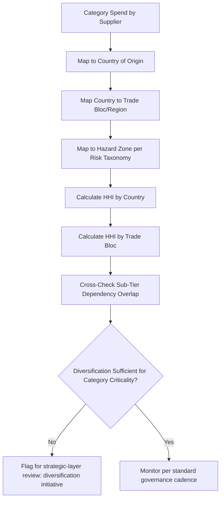

## Supplier Diversification Across Countries and Regions

### Overview

Supplier diversification across countries and regions is the specific practice of distributing sourcing spend across multiple geographic locations to reduce risk concentration — the operational discipline that connects the strategic footprint question (regionalization vs. globalization) to concrete supplier selection and portfolio management decisions. Where regionalization addresses the overall architecture of the sourcing network, diversification addresses the narrower question of how many countries/regions to source a given category from, and how to measure whether meaningful diversification has actually been achieved, since nominal supplier-count diversity does not guarantee true geographic or risk diversity.

### Diversification Versus Dual Sourcing: A Key Distinction

**Key Points**

- Dual sourcing (two suppliers) and geographic diversification are related but not identical — two suppliers in the same country provide commercial redundancy but minimal geographic risk diversification
- True diversification requires distributing exposure across independent risk domains: different countries, different trade blocs, different hazard zones, and ideally different sub-tier dependencies (per the correlation analysis in the risk taxonomy)
- Diversification can extend beyond two suppliers (multi-sourcing across three or more countries) for the highest-criticality categories, while dual sourcing may be sufficient for moderate-criticality categories

### Measuring Diversification: Concentration Metrics

A common quantitative approach borrows from portfolio concentration analysis, most notably the Herfindahl-Hirschman Index (HHI), applied to supplier spend by country or region.

$$HHI = \sum_{i=1}^{n} s_i^2 \times 10{,}000$$

Where $s_i$ is the fractional share of total category spend sourced from country/region $i$ (as a decimal), and the result is conventionally scaled to a 0–10,000 range.

**Example**

A category sourced 70% from Country A and 30% from Country B:

$$HHI = (0.70^2 + 0.30^2) \times 10{,}000 = (0.49 + 0.09) \times 10{,}000 = 5{,}800$$

Compare to a category sourced 40% / 35% / 25% across three countries:

$$HHI = (0.40^2 + 0.35^2 + 0.25^2) \times 10{,}000 = (0.16 + 0.1225 + 0.0625) \times 10{,}000 = 3{,}450$$

A lower HHI indicates lower concentration (more diversification). [Inference] Some organizations adapt antitrust-style HHI interpretation bands (e.g., above 2,500 considered "highly concentrated," 1,500–2,500 "moderately concentrated," below 1,500 "diversified") for internal supply-risk purposes, though there is no single industry-standard threshold, and the appropriate band depends on the category's criticality and the organization's risk tolerance.

### Diversification Assessment Framework

**Key Points**

- The assessment should be run at multiple geographic granularities simultaneously — country-level HHI can look diversified while trade-bloc-level or hazard-zone-level HHI reveals hidden concentration (e.g., two "different" countries in the same free-trade area subject to the same regional trade policy shift)
- This mirrors the semiconductor sub-tier concentration problem: diversification metrics calculated only at the visible commercial-supplier level miss concentration that exists one or two tiers upstream

### Dimensions of Diversification

| Dimension | What It Protects Against | Measurement Approach |
| --- | --- | --- |
| Country of origin | Country-specific tariff/trade actions, single-country political instability | HHI on spend-by-country |
| Trade bloc/agreement membership | Bloc-wide trade policy shifts (e.g., a regional tariff or sanctions regime) | HHI on spend-by-bloc |
| Hazard zone (seismic, hurricane, etc.) | Natural disaster correlation | Geographic overlay against hazard maps (per BCP hazard mapping) |
| Currency zone | Correlated currency movements across supposedly separate suppliers | Grouping by currency regime, not just political geography |
| Sub-tier/raw material source | Hidden upstream concentration | Multi-tier supply chain mapping |

### Building a Diversification Strategy by Criticality Tier

Consistent with the criticality-based approach used for BCP investment, diversification effort should scale with category importance rather than being applied uniformly.

| Criticality Tier | Diversification Target | Typical Approach |
| --- | --- | --- |
| Strategic/Critical | 3+ countries, ideally spanning 2+ trade blocs and hazard zones | Active multi-sourcing with formal allocation governance |
| Bottleneck | 2 countries minimum, different hazard zones preferred | Dual sourcing with geographic separation as a selection criterion |
| Leverage | 2 suppliers acceptable even within one country/region | Focus on commercial terms over geographic spread |
| Non-critical | Single source acceptable | Diversification investment not justified |

### The Diversification-Cost Trade-Off

Diversification is not free, and the cost-benefit discipline established for resilience-versus-redundancy applies equally here — adding a third or fourth country of supply for a category introduces the same categories of redundancy cost (qualification overhead, reduced per-supplier volume leverage, administrative complexity) at a compounding rate as more sources are added.

$$\text{Marginal Diversification Value} = \Delta(\text{Avoided Expected Loss}) - \Delta(\text{Redundancy Cost})$$

**Key Points**

- The marginal risk-reduction benefit of adding a third geographically-independent source is typically smaller than the benefit of moving from one to two sources, since much of the correlated-risk exposure is already addressed by the first geographic split — this is a classic diminishing-returns pattern
- Beyond a certain point, additional diversification primarily protects against increasingly low-probability, high-severity tail events (e.g., simultaneous multi-region disruption), which may or may not justify the incremental cost depending on the category's true criticality
- [Inference] Organizations tend to apply three-or-more-country diversification selectively to a small number of truly strategic categories rather than broadly, reflecting this diminishing-returns dynamic, though the specific threshold varies by industry risk tolerance and category economics

### Practical Diversification Levers

**Key Points**

- **New supplier qualification in an underrepresented region**: the most direct lever, following the same qualification and transition process used for reshoring/nearshoring initiatives
- **Volume reallocation among existing qualified suppliers**: if multiple qualified sources already exist but volume is concentrated, rebalancing allocation (per the governance model) can improve HHI without new qualification cost
- **Contractual minimum-diversification clauses**: some organizations write internal policy or even supplier contract terms establishing a maximum permissible spend share per country for a given category
- **M&A and investment-driven diversification**: in some industries, equity investment or joint ventures with suppliers in underrepresented regions are used to accelerate capability build-out beyond what standard qualification timelines would allow

### Governance Integration

Diversification targets and HHI thresholds by criticality tier should be formally adopted as part of the strategic layer of the dual-sourcing governance model, with the tactical layer responsible for tracking actual concentration against target and flagging drift.

| Cadence | Activity | Owner |
| --- | --- | --- |
| Quarterly | HHI recalculation by country/bloc/hazard-zone for strategic categories | Category Manager |
| Annual | Diversification target review against evolving risk taxonomy and trade policy landscape | Procurement Director, informed by Trade Compliance |
| Ad hoc | Reassessment triggered by early-warning signals (geopolitical, tariff, disaster) | Per early-warning monitoring workflow |

### Common Pitfalls

- **Counting suppliers instead of measuring geographic concentration**: three suppliers in the same country is not diversification in any meaningful risk sense
- **Ignoring trade-bloc-level concentration**: diversifying across countries within the same trade agreement or political alliance provides less protection against bloc-wide policy shifts than cross-bloc diversification
- **Missing sub-tier concentration**: as with semiconductors, commercially diverse suppliers can share upstream dependencies invisible at the HHI-on-commercial-supplier level
- **Applying uniform diversification targets regardless of criticality**, wasting redundancy cost on low-criticality categories while potentially under-diversifying genuinely strategic ones
- **Treating diversification as a one-time achievement** rather than a metric requiring ongoing monitoring as supplier circumstances, trade policy, and the risk taxonomy itself evolve

### Related Topics

- Regionalization Versus Globalization Trade-Offs (architectural context for diversification)
- Supply Chain Risk Category Taxonomy (correlation and hazard-zone inputs)
- Herfindahl-Hirschman Index and Concentration Risk Measurement
- Sub-Tier Supplier Mapping and Correlated Risk Detection
- Balancing Resilience Benefits Against Redundancy Costs (marginal diversification value)
- Governance Model for Managing Two Active Suppliers (diversification target enforcement)