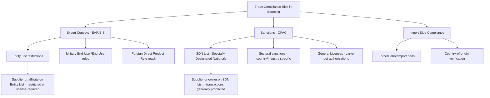
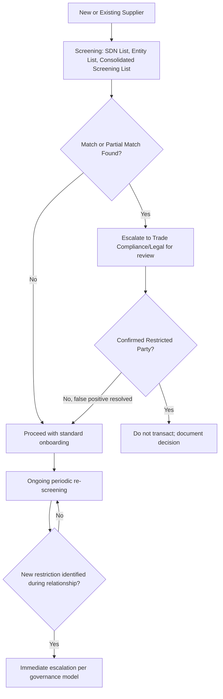

## Export Controls, Sanctions, and Trade Compliance

### Overview

Export controls, sanctions, and trade compliance address a legally distinct risk category from the tariff and diversification topics covered earlier in this chapter: rather than a cost or logistics consideration, this domain governs whether a transaction with a given supplier, country, or component is *legally permissible at all*. In a dual-sourcing context, this matters acutely because a supplier that is fully qualified, financially sound, and geographically well-positioned can nonetheless become instantly unusable if it, its parent entity, or the underlying technology becomes subject to a restriction — and unlike tariff cost increases, which are absorbable, export control and sanctions violations can carry criminal liability, meaning this category requires compliance-function ownership rather than procurement judgment alone.

**Note on currency of this material**: this is an active, fast-moving regulatory area. As of mid-2026, the U.S. Bureau of Industry and Security (BIS) has continued expanding Entity List and Military End-User List restrictions with heightened diligence obligations, and OFAC has continued issuing and amending general licenses and sanctions designations on a near-weekly cadence across multiple country programs (Russia, Iran-related smuggling networks, and others). The structural framework below is durable; specific designations, license numbers, and entity listings change frequently and must be verified against current BIS/OFAC sources — this material is not a substitute for legal or trade-compliance review of a specific transaction.

### Distinguishing the Three Compliance Domains

**Key Points**

- **Export controls** (in the U.S., primarily the Export Administration Regulations, EAR, administered by BIS) govern whether a good, software, or technology can be shipped, transferred, or even disclosed to a foreign person, based on the item's classification and the destination, end-user, or end-use
- **Sanctions** (in the U.S., primarily administered by OFAC) restrict or prohibit transactions with specific countries, entities, or individuals, generally for foreign policy or national security reasons, regardless of what is being transacted
- **Trade compliance** is the broader organizational function and set of internal controls (screening, licensing, recordkeeping) that ensures both of the above are respected across procurement and supply chain activity
- These three domains overlap significantly in supplier dual-sourcing decisions: a supplier can be legally headquartered in an unrestricted country while still being restricted due to ownership structure, listed affiliates, or the specific technology being transacted

### Core Legal Mechanisms Relevant to Sourcing

### Entity List and Military End-User Restrictions

**Key Points**

- The Entity List identifies specific parties for whom export, reexport, or transfer of certain items requires a license, often with a presumption of denial
- BIS has significantly expanded the scope of Entity List and Military End-User List restrictions, imposing heightened diligence obligations and complicating compliance for companies with complex supplier and affiliate structures
- A key diligence challenge for dual sourcing specifically: a supplier itself may not be listed, but a parent company, subsidiary, or joint-venture partner might be — full ownership-chain screening, not just direct-counterparty screening, is required for genuine assurance
- The Foreign Direct Product Rule (FDPR) can extend U.S. export jurisdiction to foreign-made items that use even minimal amounts of U.S.-origin technology or software in their production, meaning a foreign supplier with no direct U.S. presence can still fall under EAR jurisdiction depending on its production inputs

### OFAC Sanctions Mechanics

- **SDN List (Specially Designated Nationals and Blocked Persons)**: parties with whom U.S. persons are generally prohibited from transacting; assets are blocked
- **Sectoral and country-based sanctions**: narrower restrictions targeting specific sectors (e.g., financial services, energy) within a sanctioned country, short of a comprehensive embargo
- **General Licenses (GLs)**: specific, published authorizations permitting otherwise-prohibited categories of transactions (e.g., certain administrative or civil-nuclear-related transactions), which are frequently issued, reissued, and amended — recent examples include Russia-related general licenses covering specific administrative transaction categories and civil nuclear energy activities, illustrating how the sanctions landscape for even a single country program shifts through targeted carve-outs on an ongoing basis
- [Unverified] The current status of any specific general license, SDN designation, or country program should always be verified directly against OFAC's published list and FAQ updates at time of use, given the frequency of amendment

### Sanctions Circumvention Risk in Multi-Tier Supply Chains

A distinct risk pattern relevant to global sourcing: sanctioned parties or restricted goods can enter a supply chain indirectly through intermediary countries or transshipment, a pattern regulators have specifically flagged. Enforcement authorities have highlighted coordinated smuggling networks moving restricted goods through multiple intermediary jurisdictions to reach ultimate sanctioned destinations — illustrating that geographic distance from a sanctioned country does not by itself establish compliance, particularly for commodities with high diversion risk.

**Key Points**

- This connects directly to the sub-tier mapping discipline established in the risk taxonomy and semiconductor sourcing topics: the same multi-tier visibility gap that hides correlated supply risk also hides sanctions circumvention risk
- Enhanced due diligence for higher-risk categories or regions may include reviewing a supplier's own customer base and downstream distribution, not just its immediate corporate structure

### Trade Compliance Program Structure

**Key Points**

- Screening should occur at onboarding **and** on an ongoing periodic basis, since restricted-party lists are updated frequently and a previously-clear supplier can become restricted during an active relationship
- The Commerce Department's Consolidated Screening List aggregates multiple restricted-party lists (Entity List, SDN List, and others) into a single reference for screening purposes
- Recordkeeping and documentation of screening decisions is itself a compliance obligation — the absence of a documented screening process is a distinct finding in enforcement actions, separate from the underlying transaction's legality

### Integration with Dual-Sourcing Governance

This compliance category interacts with the dual-sourcing governance model differently than performance or cost triggers: a confirmed restriction is not a rebalancing trigger but an **immediate mandatory failover** trigger, since continued sourcing from a restricted party is not a business judgment call.

| Trigger | Governance Response |
| --- | --- |
| Supplier or affiliate newly added to Entity List (license required) | Legal/Trade Compliance determines license feasibility; if denied or infeasible, immediate reallocation to secondary source |
| Supplier or owner added to SDN List | Immediate cessation of transactions; strategic-layer and Legal notification; secondary source activation |
| New sectoral sanctions affecting supplier's country/industry | Trade Compliance assessment of scope; may require partial restriction rather than full cutoff depending on general license availability |
| Screening reveals sub-tier connection to restricted party | Enhanced due diligence; may not require immediate action but should feed the risk taxonomy and monitoring capability |

**Key Points**

- Legal and Trade Compliance functions must have a defined, fast-acting role in the governance decision-rights structure for this category specifically — the escalation speed required here is faster than most performance-based tactical reviews, given potential legal liability accruing per day of continued prohibited activity
- Having a secondary source already qualified (per the dual-sourcing governance model) provides genuine practical value here: a sanctions-driven cutoff of the primary supplier can be absorbed operationally if the secondary source can be activated quickly, whereas an unprepared organization faces both a legal exposure and a supply gap simultaneously

### Enforcement Risk and Penalties

**Key Points**

- Enforcement actions in this domain have included substantial civil settlements against freight forwarders and other intermediaries for sanctions violations, illustrating that liability extends beyond the direct contracting party to logistics and freight intermediaries in the transaction chain
- Criminal prosecution is a realized risk, not merely theoretical, including custodial sentences for individuals involved in export control violations
- The statute of limitations for sanctions violations was extended from five years to ten years, materially increasing the enforcement exposure window for historical transactions
- [Unverified] Specific penalty amounts, enforcement priorities, and prosecutorial focus areas shift with policy priorities and should be verified against current BIS/OFAC enforcement guidance rather than relied upon as static figures

### Common Pitfalls

- **Screening only the direct commercial counterparty**, missing restricted parties in the ownership chain, affiliate network, or downstream customer base
- **Treating export control jurisdiction as purely a function of physical location**, missing Foreign Direct Product Rule exposure created by underlying U.S.-origin technology content
- **One-time onboarding screening without periodic re-screening**, missing restrictions that arise during an active supplier relationship
- **Assuming geographic diversification (from the earlier diversification topic) inherently addresses sanctions risk**: a geographically diversified supplier base can still share compliance exposure if suppliers share ownership structures, sub-tier dependencies, or transshipment routes with restricted parties
- **Slow internal escalation paths** for this specific risk category, given that speed of response has direct legal liability implications unlike most other governance triggers in this framework

### Related Topics

- Supplier Diversification Across Countries and Regions (does not substitute for sanctions/export-control screening)
- Supply Chain Risk Category Taxonomy (geopolitical/regulatory risk category)
- Sub-Tier Supplier Mapping and Correlated Risk Detection (applied to ownership-chain and transshipment screening)
- Governance Model for Managing Two Active Suppliers (immediate failover trigger design)
- Foreign Direct Product Rule and Extraterritorial Export Jurisdiction
- Trade Compliance Program Design and Restricted-Party Screening Tools