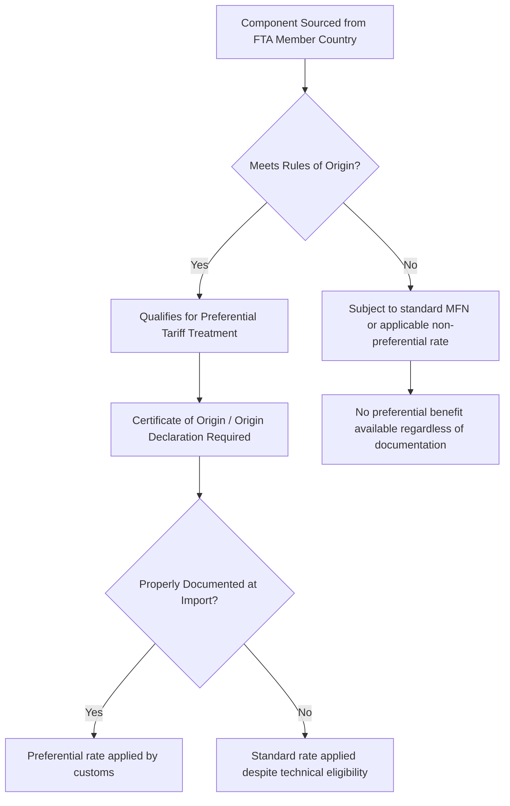
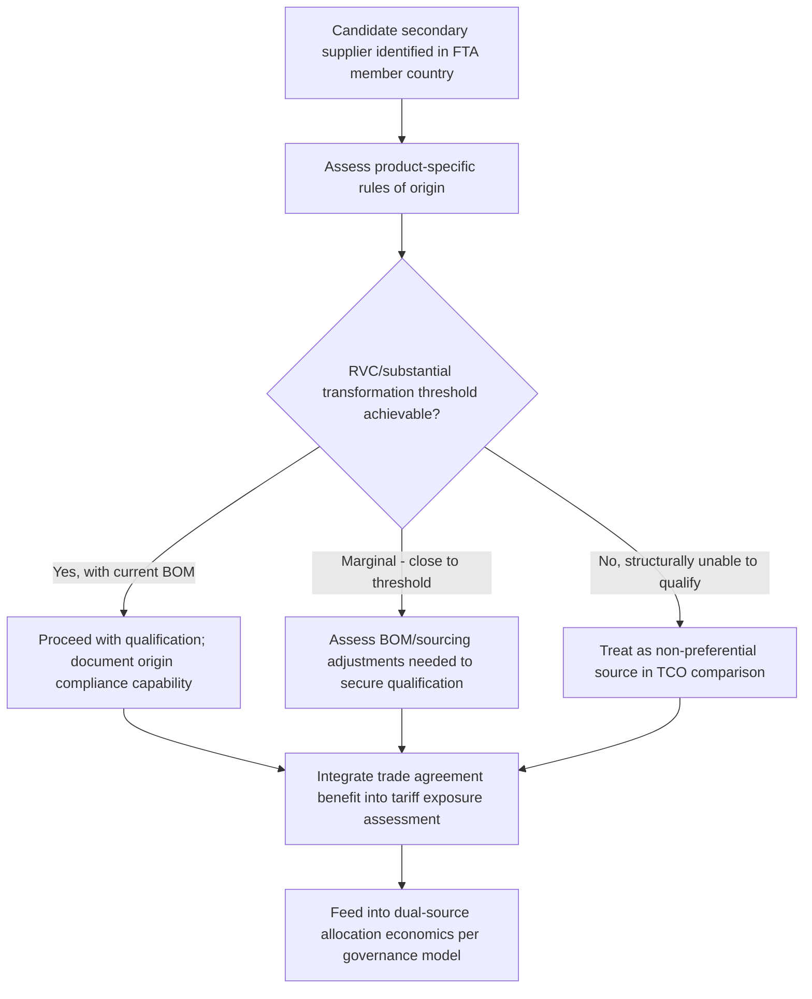

## Leveraging Regional Trade Agreements

### Overview

Leveraging regional trade agreements addresses how procurement organizations identify, qualify for, and operationally capture the preferential duty treatment and market-access benefits that free trade agreements (FTAs) and regional trade blocs provide. This topic connects directly to several earlier discussions in this chapter: it is the mechanism by which the friendshoring and nearshoring strategies actually translate into the favorable "effective duty rate" outcomes shown in the tariff exposure comparisons, and it is a primary lever for reducing the country-specific tariff exposure identified through category-level assessment.

### Why Trade Agreement Leverage Matters for Dual Sourcing

**Key Points**

- A trade agreement does not automatically apply to a shipment simply because a supplier is located in a member country — preferential treatment must be actively qualified for, documented, and claimed at the time of import
- In dual-sourcing scenarios, one supplier may qualify for FTA preferential treatment while an otherwise-similar second supplier in the same country does not, if the second supplier's content or production process fails the agreement's specific rules of origin
- This makes trade agreement qualification a supplier-specific and even product-specific attribute, not a blanket country-level characteristic — a critical nuance often missed when comparing "Country A tariff rate" against "Country B tariff rate" without verifying rules-of-origin compliance for the actual supplier and part

### Core Mechanics of Preferential Trade Agreement Access

### Rules of Origin: The Central Qualification Mechanism

**Key Points**

- **Wholly obtained/produced** goods (raw materials extracted or grown entirely within a member country) generally qualify without complex calculation
- **Substantial transformation** rules require that a product undergo a defined level of processing or a tariff classification change within the member country/region to qualify, even if some inputs originate elsewhere
- **Regional Value Content (RVC) thresholds** require that a specified percentage of a product's value originate within the trade bloc, calculated via defined formulas (e.g., net cost method or transaction value method, depending on the specific agreement)
- Each trade agreement defines its own rules of origin — qualification under one FTA does not imply qualification under another, even for identical products and even when the country of production overlaps in a company's supplier base

### Regional Value Content Calculation (Illustrative Structure)

A common RVC formula structure used across various trade agreements:

$$RVC = \frac{TV - VNM}{TV} \times 100$$

Where $TV$ is the transaction value of the good and $VNM$ is the value of non-originating materials used in production.

**Example**

A component has a transaction value of $100 per unit. Non-originating materials (inputs sourced from outside the trade bloc) account for $35 of that value:

$$RVC = \frac{100 - 35}{100} \times 100 = 65\%$$

If the applicable agreement's threshold for this product category is 60%, the component qualifies for preferential treatment; if the threshold is 70%, it does not — illustrating why marginal cases require careful, product-specific calculation rather than a general assumption that "regional sourcing" automatically confers preferential status.

**Key Points**

- [Unverified] Specific RVC thresholds, calculation methods, and qualifying criteria vary by agreement and by product category (often defined at the HTS-chapter or heading level within the agreement's annexes) — this structure illustrates the general mechanism, not a universal formula applicable to any specific agreement without verification against that agreement's actual text
- For USMCA/CUSMA specifically, automotive content requirements have historically included both an RVC threshold and additional requirements (e.g., labor value content, steel/aluminum sourcing requirements) layered on top of the general RVC calculation, illustrating that some sectors carry materially more complex qualification requirements than others

### Documentation and Compliance Requirements

| Requirement | Purpose |
| --- | --- |
| Certificate of Origin / Origin Declaration | Formal document (self-certified or issued by an authority, depending on the agreement) attesting the good meets rules of origin |
| Supporting cost/BOM documentation | Evidence substantiating the RVC calculation, retained for audit purposes |
| Supplier-level origin declarations | For multi-tier supply chains, upstream suppliers must provide origin data for their own inputs to support the buyer's overall calculation |
| Recordkeeping retention | Most agreements require retention of supporting documentation for a defined period (commonly several years) in case of a post-import verification audit |

**Key Points**

- A common operational failure point is not the rules-of-origin calculation itself but the recordkeeping and documentation trail supporting it — a technically-qualifying good can still lose preferential treatment (and face retroactive duty assessment plus penalties) if the buyer cannot produce adequate supporting documentation during a customs audit
- This creates a specific data requirement for dual-sourcing governance: when qualifying a new supplier partly on the basis of trade agreement access, the qualification process should explicitly capture and verify the supplier's ability to provide compliant origin documentation, not just their stated country of manufacture

### Strategic Use in Dual-Sourcing Decisions

**Key Points**

- Trade agreement qualification should be assessed *before* finalizing a nearshoring or friendshoring decision, since the tariff-avoidance benefit central to those strategies' economics depends entirely on actual qualification, not merely geographic proximity to or nominal membership in an agreement
- Where a candidate supplier is marginal against an RVC threshold, buyers sometimes work with the supplier to adjust the bill of materials (substituting a non-qualifying input with a regionally-sourced equivalent) specifically to secure preferential treatment — a form of supply chain design decision driven by trade compliance economics rather than pure cost or quality optimization
- This qualification status should be tracked as a formal attribute in the same governance data structures used for scorecarding and allocation, since a change in a supplier's own upstream sourcing could cause a previously-qualifying part to lose preferential status without any change in the buyer-facing relationship

### Common Trade Agreement Structures Relevant to Sourcing Strategy

| Agreement Type | Structure | Relevance to Dual Sourcing |
| --- | --- | --- |
| Comprehensive regional FTA (e.g., USMCA/CUSMA-style) | Broad tariff elimination/reduction across most goods, with sector-specific rules (notably automotive) | Common nearshoring target structure for North American supply chains |
| Bilateral FTAs | Two-country agreements with negotiated tariff schedules | Useful for specific friendshoring pairings outside larger blocs |
| Regional economic partnerships (multi-country blocs) | Broader membership, often phased tariff elimination schedules | Relevant when diversifying across multiple countries within a single qualifying bloc |
| Preferential programs for developing economies | Non-reciprocal preferential access, often with eligibility conditions tied to labor/environmental standards | Requires ongoing eligibility monitoring, as preferential status can be suspended for policy reasons |

### Governance and Monitoring Integration

- **Onboarding**: origin qualification assessment should be a formal step in supplier qualification, alongside quality and financial due diligence
- **Ongoing monitoring**: since a supplier's own sourcing changes can affect RVC calculations, periodic re-verification (not just at initial qualification) is necessary — this connects to the same early-warning monitoring discipline applied to other supplier risk signals
- **Audit readiness**: documentation supporting origin claims should be retained and periodically reviewed for completeness, ideally before a customs audit rather than reactively during one

### Common Pitfalls

- **Assuming country membership equals qualification**: treating "supplier is in an FTA member country" as sufficient without verifying product-specific rules of origin
- **Inadequate documentation trail**: technically qualifying goods losing preferential treatment (and incurring retroactive duties and penalties) due to insufficient supporting records at audit
- **Static qualification assumption**: failing to re-verify origin status when a supplier's own upstream sourcing changes, silently invalidating previously-secured preferential treatment
- **Ignoring qualification in TCO comparisons**: comparing headline MFN or non-preferential rates between candidate suppliers without factoring in achievable preferential treatment, leading to an inaccurate cost comparison in the sourcing decision

### Related Topics

- Tariff Exposure Assessment by Product Category (preferential rate as a mitigating factor)
- Reshoring, Nearshoring, and Friendshoring Strategies (execution context for FTA-driven relocation)
- Regional Value Content Calculation Methodologies
- Export Controls, Sanctions, and Trade Compliance (adjacent compliance/documentation discipline)
- Supplier Qualification and Onboarding Process Design (origin compliance as a qualification criterion)
- Customs Audit Preparedness and Origin Documentation Retention