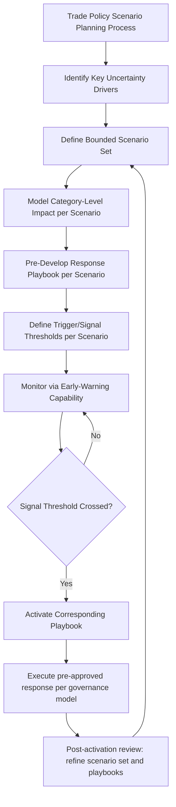
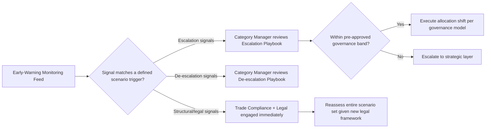

## Scenario Planning for Trade Policy Shifts

### Overview

Scenario planning for trade policy shifts is the structured practice of modeling multiple plausible future trade policy states — rather than forecasting a single expected outcome — and pre-developing sourcing responses for each, so that when a shift actually occurs, the organization executes a rehearsed response rather than improvising under time pressure. This topic serves as the synthesis point for the chapter: it takes the tariff exposure assessment, diversification metrics, trade agreement qualification, and export control monitoring covered previously and organizes them into forward-looking decision frameworks that anticipate policy volatility rather than merely reacting to it after the fact.

### Why Scenario Planning Rather Than Forecasting

**Key Points**

- Point forecasting ("tariffs on Category X will be 15% next year") has repeatedly proven unreliable in this domain — the tariff exposure assessment topic documented multiple mid-year proclamation-level changes to duty structures within a single year, illustrating that trade policy does not move on predictable timelines
- Scenario planning instead defines a bounded set of plausible future states (e.g., "escalation," "status quo," "de-escalation") and pre-builds a response plan for each, so the organization is prepared regardless of which state materializes
- This is the same probabilistic, expected-value discipline applied in the resilience-versus-redundancy cost-benefit framework, extended across multiple future policy states rather than a single current-state calculation
- The goal is decision *speed* when a shift occurs, not prediction *accuracy* beforehand — an organization with a pre-built response to a scenario that occurs, even imperfectly matched, generally outperforms one starting from zero

### Scenario Planning Framework Structure

### Step 1: Identifying Key Uncertainty Drivers

Rather than attempting to model all conceivable trade policy futures, effective scenario planning identifies a small number of high-impact, genuinely uncertain drivers specific to the organization's sourcing footprint:

- **Bilateral relationship trajectory** with key sourcing countries (e.g., escalating, stable, or normalizing trade tension)
- **Legal/judicial constraints on executive trade authority** (as demonstrated by the 2026 Supreme Court ruling affecting IEEPA-based tariff authority, judicial and legislative checks on trade policy mechanisms are themselves a source of structural uncertainty, not just the policy content itself)
- **Trade agreement renewal or renegotiation cycles**, where existing preferential treatment is not guaranteed to continue in its current form
- **Sanctions/export control escalation potential** tied to specific geopolitical developments

### Step 2: Defining a Bounded Scenario Set

A typical structure uses three to five scenarios spanning a plausible range, avoiding both false precision (dozens of granular scenarios) and false simplicity (a single "most likely" case):

| Scenario | Description | Illustrative Trigger Signals |
| --- | --- | --- |
| Escalation | Existing tariffs increase further; new categories or countries added to restriction lists | New Section 301 investigation outcomes; new Entity List additions; diplomatic deterioration |
| Status Quo | Current tariff and sanctions structure persists with only incremental, expected changes | Absence of new proclamations beyond routine general license renewals |
| Partial De-escalation | Negotiated reductions in specific categories; targeted exclusions granted | Bilateral trade talks announced; exclusion request approval trends improving |
| Structural Change | Legal or legislative action fundamentally alters the tariff mechanism itself (e.g., judicial rulings on executive authority) | Court rulings, new trade legislation, WTO dispute outcomes |

**Key Points**

- The "Structural Change" scenario category is specifically important given the demonstrated 2026 precedent of judicial intervention invalidating a prior tariff authority basis and its replacement with a different legal mechanism (Section 122 surcharge) — this illustrates that even the *legal basis* for trade policy, not just its rates, is a genuine source of scenario uncertainty
- Scenarios should be organization-specific, weighted toward the countries, categories, and trade relationships that matter most to the actual sourcing footprint, rather than generic macro scenarios copied from external commentary

### Step 3: Category-Level Impact Modeling per Scenario

For each scenario, the tariff exposure assessment methodology should be re-run against the scenario's assumed policy state, producing a comparative exposure table:

$$\text{Scenario Impact}_{s} = \sum_{c} \left(\text{Effective Duty Rate}_{c,s} \times \text{Annual Spend}_c\right) - \text{Current Baseline Cost}$$

Where $c$ indexes each affected component category and $s$ indexes the scenario.

**Example**

A category with $5,000,000 annual spend, currently at a 15% effective duty rate ($750,000 current cost):

- **Escalation scenario**: modeled rate rises to 35% → $1,750,000 → impact of +$1,000,000
- **Status Quo scenario**: rate remains 15% → $750,000 → impact of $0
- **Partial De-escalation scenario**: rate falls to 8% via exclusion → $400,000 → impact of −$350,000

This range (a potential swing of roughly $1,350,000 across scenarios for a single category) is the kind of output that justifies proactive playbook development rather than treating the current rate as a stable planning assumption.

### Step 4: Pre-Developed Response Playbooks

For each scenario, a playbook defines the specific, pre-approved actions available without requiring a fresh decision cycle when the scenario materializes:

**Key Points**

- **Escalation playbook**: pre-identified alternate-country suppliers (drawing on the diversification and friendshoring frameworks) with qualification status already assessed, allocation shift thresholds pre-approved within the governance model's bands
- **Status Quo playbook**: no structural action; continue standard monitoring cadence
- **Partial De-escalation playbook**: criteria for potentially reversing a prior tariff-driven relocation decision, since de-escalation can sometimes make a previously more expensive established source cost-competitive again — but reversal decisions should weigh switching costs already sunk, not just current-period tariff comparison
- **Structural Change playbook**: engagement protocol with trade compliance/legal counsel to reassess the entire tariff and compliance framework, given that a change in legal mechanism can alter which categories, exemption processes, and duty stacking rules apply

### Step 5: Trigger Signals and Governance Integration

Scenario activation should not be a subjective judgment call made in the moment; it should be tied to the same early-warning monitoring infrastructure and threshold-based governance triggers established elsewhere in this framework.

**Key Points**

- This integration means scenario planning is not a standalone annual exercise but a living framework connected to the ongoing monitoring capability, allocation governance, and trade compliance functions covered throughout this chapter
- Playbooks should specify which governance layer (tactical vs. strategic, per the governance model) has authority to activate each response, avoiding delay caused by ambiguous decision rights during a fast-moving policy shift

### Maintenance and Review Cadence

| Activity | Cadence | Owner |
| --- | --- | --- |
| Full scenario set and playbook review | Annual, or after a major structural policy event | Procurement Director + Trade Compliance |
| Category-level impact remodeling | Quarterly, or upon material tariff schedule change | Category Manager |
| Trigger signal calibration | Ongoing, integrated with early-warning monitoring maintenance | Supply Chain Risk Function |
| Post-activation retrospective | After any playbook activation | Cross-functional (Procurement, Trade Compliance, Finance) |

**Key Points**

- [Inference] Given the demonstrated frequency of trade policy change through 2026 — including multiple proclamation-level revisions within months of each other — organizations sourcing from tariff-sensitive categories likely benefit from a more frequent review cadence than the traditional annual strategic planning cycle common in less volatile risk categories, though the appropriate frequency depends on the specific categories and countries involved
- Every playbook activation, successful or not, should feed back into refining both the scenario set (were the right scenarios defined?) and the trigger thresholds (did the signal fire with adequate lead time?), mirroring the feedback loop discipline established in the early-warning monitoring topic

### Common Pitfalls

- **Single-point forecasting disguised as scenario planning**: building only a "most likely" case rather than a genuine bounded range, which fails precisely when policy moves outside that single assumption
- **Playbooks without pre-approved authority**: a well-modeled scenario with no governance decision-rights clarity still requires an ad hoc approval cycle when activated, defeating the speed purpose of the exercise
- **Treating legal/structural mechanism risk as out of scope**: focusing scenario planning only on rate changes while ignoring the possibility that the underlying legal authority for a tariff regime itself could be invalidated or replaced, as demonstrated in 2026
- **Stale scenario sets**: failing to refresh scenarios and impact models as actual policy developments diverge from what was originally modeled, allowing the framework to become disconnected from the current trade policy reality
- **Disconnected from monitoring infrastructure**: building playbooks that are never actually triggered because no early-warning signal is mapped to them

### Related Topics

- Tariff Exposure Assessment by Product Category (impact modeling input)
- Early-Warning and Disruption Monitoring Capability (trigger signal infrastructure)
- Supplier Diversification Across Countries and Regions (escalation playbook response option)
- Reshoring, Nearshoring, and Friendshoring Strategies (structural response mechanisms)
- Governance Model for Managing Two Active Suppliers (activation authority and decision rights)
- Export Controls, Sanctions, and Trade Compliance (structural-change scenario category)