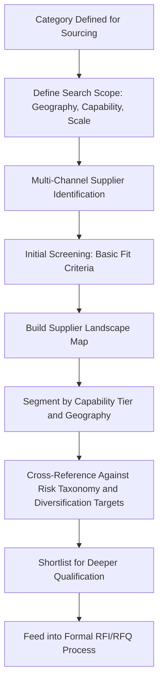
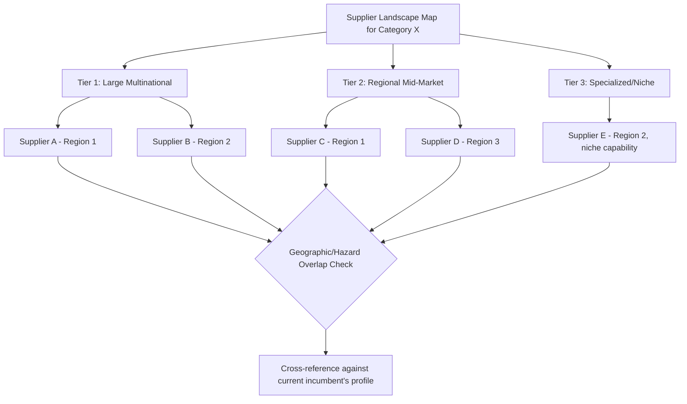

## Supplier Discovery and Market Mapping

### Overview

Supplier discovery and market mapping is the foundational research process for identifying the full universe of potential suppliers for a given category and organizing that universe into a structured view of market capacity, capability, and concentration. This topic sits upstream of everything discussed in the preceding chapters: before a governance model can allocate volume between two suppliers, before a risk taxonomy can assess correlation, and before a diversification strategy can target specific countries, an organization must first know which suppliers exist, where they are located, and what they are capable of. In a dual-sourcing context, market mapping is what reveals whether a genuine second-source option exists at all, and what trade-offs it carries relative to the incumbent.

### Objectives of Supplier Discovery

**Key Points**

- Build a comprehensive, not merely convenient, view of the supply market — relying only on suppliers already known to the organization or suggested by the incumbent supplier systematically under-discovers viable alternatives
- Establish a factual baseline of market structure (number of players, concentration, geographic distribution) that later informs diversification targets and negotiation leverage
- Surface capability gaps early, before they become blocking issues during formal qualification
- Create a maintained, living resource rather than a one-time research exercise, since supply markets shift over time

### Market Mapping Framework

### Discovery Channels

A comprehensive discovery process draws on multiple, complementary channels rather than a single source, since each channel has different blind spots:

| Channel | Strength | Limitation |
| --- | --- | --- |
| Industry trade shows and associations | Access to active, engaged market participants; direct capability demonstration | Skews toward suppliers with marketing budget for events, may miss smaller specialized players |
| Trade directories and databases | Broad, searchable coverage across categories and geographies | Data currency varies; self-reported information requires verification |
| Existing supplier referrals | Fast, often pre-vetted through the referring party's own experience | Risk of network homogeneity — referred suppliers often resemble the referrer |
| Industry publications and analyst reports | Market structure context, capability trend awareness | Coverage typically skews toward larger, more visible market participants |
| Direct outreach/cold sourcing (LinkedIn, company websites, regional chambers of commerce) | Reaches suppliers not actively marketing for new business | Higher research effort per supplier identified |
| Trade agreement and export promotion agency resources | Often includes government-vetted supplier directories for specific countries/regions | Availability and quality vary significantly by country |
| Existing customer/competitor supply chain disclosure (where public) | Reveals suppliers serving comparable buyers in the same industry | Limited to publicly disclosed relationships; may raise competitive-intelligence considerations |

**Key Points**

- For dual-sourcing purposes specifically, discovery should be deliberately weighted toward the geographic regions and trade-bloc memberships identified as gaps in the diversification assessment (see Supplier Diversification Across Countries and Regions), rather than defaulting to wherever discovery is easiest
- Relying primarily on referrals from an existing incumbent supplier for second-source candidates risks producing a candidate with correlated sub-tier dependencies or similar geographic exposure, undermining the risk-decorrelation purpose of dual sourcing before qualification even begins

### Building the Market Landscape Map

Once candidates are identified, organizing them into a structured landscape view makes market structure visible rather than leaving it as an unstructured list.

**Key dimensions typically mapped:**

- **Geography**: country, region, trade-bloc membership, hazard-zone classification (feeding directly into the risk taxonomy and diversification frameworks)
- **Scale tier**: large multinational, mid-market regional player, small specialized shop — each carrying different capacity, financial stability, and relationship-management implications
- **Capability specialization**: general-purpose vs. niche/specialized production capability relevant to the specific component
- **Market concentration**: how many credible suppliers exist globally or regionally for this category — a category with only two or three global players requires a fundamentally different dual-sourcing strategy than one with dozens of qualified candidates

### Market Concentration Assessment

Understanding overall market structure — not just individual supplier attributes — informs realistic dual-sourcing strategy. This connects to, but is distinct from, the diversification HHI calculation discussed earlier (which measures the buyer's own spend concentration); here the relevant question is the concentration of the *supply market itself*.

**Key Points**

- A highly concentrated supply market (few global producers, as seen in certain semiconductor fabrication segments) constrains dual-sourcing options structurally — market mapping in this case should focus on identifying which of the few available options offers the best available geographic or risk decorrelation, rather than assuming a wide field of candidates exists
- A fragmented supply market (many capable regional producers) offers more strategic flexibility but requires more rigorous initial screening to narrow a potentially large candidate pool to a manageable shortlist
- [Inference] Market concentration often correlates with capital intensity and technical barrier to entry of the production process — categories requiring specialized tooling or certification tend toward more concentrated markets, though this relationship is not absolute and varies by specific category dynamics

### Initial Screening Criteria

Before investing in deeper qualification effort, an initial screening pass filters the landscape map down to a viable shortlist using lightweight, verifiable criteria:

- Basic scale/capacity fit (can the supplier plausibly serve the required volume at all)
- Geographic and hazard-zone fit against diversification targets
- Preliminary trade compliance screening (restricted-party list check, per the export controls and sanctions topic) — a candidate that fails this check should be eliminated immediately regardless of other merits
- Basic financial viability indicators (publicly available where possible)
- General capability alignment (does the supplier's stated production capability plausibly match the component category)

**Key Points**

- This initial screen is intentionally lightweight compared to the full qualification process — its purpose is to avoid investing deep qualification resources (site audits, sample runs) in candidates that fail basic fit criteria
- Trade compliance screening at this early discovery stage, rather than only at formal onboarding, prevents wasted relationship-building effort with a candidate that will ultimately be disqualified on compliance grounds

### Maintaining the Market Map Over Time

**Key Points**

- Supply markets are not static — new entrants emerge, existing suppliers exit or get acquired, and capability profiles shift, meaning a market map built once during an initial sourcing event degrades in accuracy over time
- A periodic refresh cadence (commonly informed by category criticality, similar to the criticality-tiered approach used in BCP investment) keeps the map usable for future resourcing decisions without requiring a full re-discovery exercise each time
- Market mapping intelligence should feed the same early-warning monitoring capability discussed earlier — awareness of emerging alternative suppliers is itself a form of resilience, since it shortens the response time needed if an existing dual-sourcing arrangement needs to be supplemented or replaced

### Common Pitfalls

- **Discovery limited to convenient or already-known sources**, systematically missing viable candidates in underrepresented geographies
- **Treating referral-sourced candidates as sufficiently diverse** without verifying they don't share the same sub-tier dependencies or geographic exposure as the incumbent
- **Skipping preliminary trade compliance screening** until late in the qualification process, wasting effort on candidates that were disqualifiable from the outset
- **One-time market mapping** treated as permanently valid, missing market structure changes (new entrants, consolidation, capability shifts) that would have surfaced a better dual-sourcing candidate
- **Confusing market concentration with buyer spend concentration**: a fragmented supply market does not by itself mean a buyer's own sourcing is diversified, and a concentrated supply market does not excuse skipping the diversification effort — it simply constrains available options

### Related Topics

- Supplier Diversification Across Countries and Regions (target-setting for discovery scope)
- Export Controls, Sanctions, and Trade Compliance (preliminary screening integration)
- Supply Chain Risk Category Taxonomy (geographic/hazard mapping dimensions)
- RFI/RFQ Process Design and Structured Supplier Evaluation
- Supplier Qualification and Onboarding Process Design
- Market Concentration Analysis and Capability Benchmarking