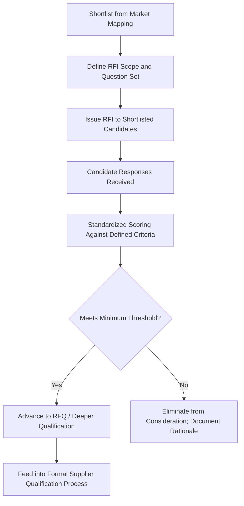

## Request for Information (RFI) Process

### Overview

The Request for Information (RFI) process is the structured mechanism by which a buying organization gathers standardized, comparable information from candidate suppliers identified during market mapping, before committing resources to formal pricing negotiations or deep qualification audits. Positioned between market discovery and the Request for Quote (RFQ)/formal qualification stages, the RFI's purpose is narrowing: converting a broad shortlist of plausible candidates into a smaller set of genuinely viable ones, based on structured, comparable data rather than informal conversation or marketing material.

### Purpose and Positioning in the Sourcing Pipeline

**Key Points**

- The RFI is an information-gathering instrument, not a competitive bidding instrument — pricing is typically not the focus (that is the RFQ's role), though high-level cost bands may be requested to filter obviously non-viable candidates early
- It exists specifically to reduce wasted qualification effort: site audits, sample runs, and detailed technical qualification (discussed in later chapter topics) are resource-intensive, and the RFI's structured screening should occur before that investment, not after
- For dual-sourcing purposes, the RFI response set provides the first genuinely comparable, apples-to-apples view of candidates against the criteria that matter for a second-source decision — capability, capacity, geography, compliance posture — replacing the less structured discovery-stage information gathered during market mapping

### RFI Process Flow

### Core RFI Content Areas

A well-structured RFI typically requests information across several standardized categories, each mapped to a specific downstream governance or risk concern established earlier in this material:

| Content Area | What It Establishes | Downstream Relevance |
| --- | --- | --- |
| Company profile and ownership structure | Corporate structure, parent/subsidiary relationships, years in operation | Trade compliance screening (ownership-chain restricted-party checks) |
| Manufacturing/service capability | Process capability, equipment, relevant certifications | Basic fit against component requirements |
| Capacity and scalability | Current utilization, expansion capability, typical lead times | Feasibility for meaningful dual-source allocation volume |
| Geographic footprint | Facility locations, sub-tier supplier locations where disclosable | Risk taxonomy hazard-zone mapping, diversification HHI calculation |
| Financial stability indicators | Revenue scale, credit references, ownership stability | Early-warning financial health monitoring baseline |
| Quality systems and certifications | ISO certifications, industry-specific quality standards | Initial quality-risk screening |
| Trade compliance posture | Export control classifications the supplier itself handles, sanctions exposure awareness, prior compliance history if disclosable | Preliminary trade compliance screening |
| Existing customer base (where disclosable) | Reference customers, industries served | Credibility signal; potential conflict-of-interest awareness for competitors |
| Sustainability/ESG practices (where relevant to the buyer's requirements) | Labor practices, environmental compliance, relevant certifications | Increasingly a formal qualification criterion in many industries |

### Designing the RFI Question Set

**Key Points**

- Questions should be structured for comparability — open-ended questions that invite marketing narrative produce responses that are difficult to score consistently across candidates, while structured questions (multiple choice, quantitative ranges, yes/no with detail) enable direct comparison
- The question set should be scaled to the category's criticality: a high-criticality strategic component justifies a more extensive RFI than a low-criticality commodity item, mirroring the criticality-tiered investment principle established in the BCP and diversification topics
- Questions probing sub-tier dependency and geographic overlap with existing suppliers should be included explicitly for dual-sourcing purposes, since this is precisely the correlation blind spot the risk taxonomy identifies as commonly missed
- A dedicated section requesting disclosure of shared upstream suppliers, shared fabrication facilities, or shared logistics providers with the buyer's existing primary supplier directly operationalizes the correlation-check principle from earlier in this material

### Standardized Scoring Framework

To keep the narrowing decision objective and defensible, RFI responses are typically scored against a weighted rubric defined before responses are received (avoiding the temptation to adjust criteria retroactively to favor a preferred candidate).

$$RFI\ Score = \sum_{i} w_i \times S_i$$

Where $w_i$ is the weight assigned to criterion $i$ (e.g., capability fit, capacity, financial stability, geographic fit) and $S_i$ is the candidate's normalized score on that criterion.

**Example**

A candidate scored across four weighted criteria: capability fit (weight 0.35, score 85), capacity/scalability (weight 0.25, score 70), geographic/diversification fit (weight 0.20, score 90), financial stability (weight 0.20, score 60):

$$RFI\ Score = (0.35 \times 85) + (0.25 \times 70) + (0.20 \times 90) + (0.20 \times 60) = 29.75 + 17.5 + 18 + 12 = 77.25$$

A pre-defined threshold (e.g., 70) determines advancement to the RFQ/deeper qualification stage, keeping the narrowing decision rule-based rather than subjective.

**Key Points**

- Weighting should reflect the specific strategic purpose of the search — an RFI issued specifically to find a geographically decorrelated second source should weight geographic/diversification fit more heavily than an RFI issued for a routine, low-criticality replenishment sourcing event
- Documenting the scoring rubric and weights before responses arrive also supports procurement governance and audit defensibility, particularly relevant if a rejected candidate later challenges the selection process

### Common RFI Structural Formats

- **Standardized questionnaire/template**: consistent question set issued identically to all candidates, most common and most defensible for comparability
- **Structured interview supplement**: RFI questionnaire followed by a scheduled discussion to clarify ambiguous responses, useful for capability areas that are difficult to fully capture in written form
- **Staged RFI**: a shorter initial RFI to further narrow a large shortlist, followed by a more detailed RFI for the reduced set — useful when market mapping produces an unusually large candidate pool

### Integration with Trade Compliance and Risk Screening

**Key Points**

- Trade compliance screening (restricted-party list checks against the RFI-disclosed ownership structure) should occur immediately upon RFI response receipt, before scoring effort is invested — a candidate that fails this screen should be eliminated regardless of how strong its other RFI responses are
- Financial stability indicators gathered during the RFI establish the baseline against which the early-warning monitoring capability's ongoing financial health tracking will later measure trend changes, so RFI-stage financial data should be retained rather than discarded once the sourcing decision is made
- Geographic and sub-tier disclosure from the RFI feeds directly into the diversification HHI calculation and risk taxonomy correlation assessment for the eventual dual-sourcing allocation decision

### Common Pitfalls

- **Under-scoping the RFI for critical categories**: treating a high-criticality dual-source decision with the same lightweight RFI process used for routine commodity sourcing, missing important risk and correlation signals
- **Scoring rubric defined after responses are received**: introduces bias risk and undermines the defensibility of the narrowing decision
- **Omitting sub-tier and correlation disclosure questions**: missing the opportunity to catch shared-dependency risk before investing in deeper qualification of a candidate that ultimately provides little genuine diversification benefit
- **Treating RFI responses as static after the sourcing decision**: failing to retain and reuse the baseline data for ongoing monitoring purposes, duplicating research effort later
- **Delaying trade compliance screening** until after RFI scoring is complete, wasting evaluation effort on candidates that were disqualifiable from the outset

### Related Topics

- Supplier Discovery and Market Mapping (shortlist input to the RFI process)
- Supply Chain Risk Category Taxonomy (correlation disclosure questions)
- Supplier Diversification Across Countries and Regions (geographic fit scoring criterion)
- Export Controls, Sanctions, and Trade Compliance (screening integration point)
- Request for Quote (RFQ) Process and Competitive Bidding Design
- Supplier Qualification and Onboarding Process Design