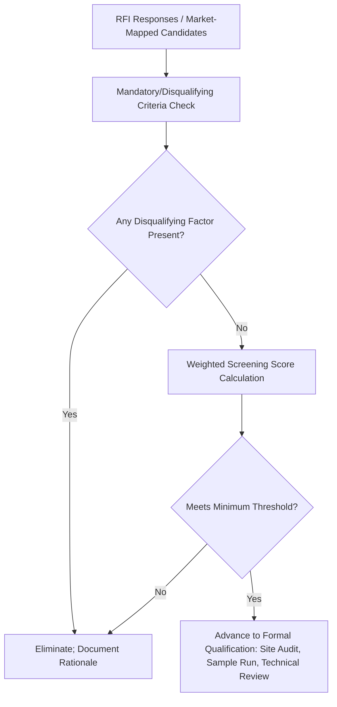

## Preliminary Supplier Screening Criteria

### Overview

Preliminary supplier screening criteria define the lightweight, first-pass filters applied to candidates emerging from market mapping and RFI responses before committing resources to formal qualification (site audits, sample production runs, detailed technical review). This topic operationalizes the "initial screening" step referenced in the market mapping and RFI discussions into a concrete, structured criteria set — establishing the specific pass/fail and scoring gates that determine which candidates justify further investment. The design principle throughout is proportionality: screening should be cheap enough to apply broadly across a candidate pool, while still catching the disqualifying issues that would otherwise waste significant downstream qualification effort.

### Purpose and Position in the Screening Funnel

**Key Points**

- Preliminary screening sits between RFI response collection and formal qualification, serving as the narrowing gate that determines which RFI respondents advance to resource-intensive qualification steps
- Unlike the RFI's broader, information-gathering purpose, preliminary screening applies specific, largely binary or threshold-based criteria designed to eliminate clearly unviable candidates quickly and defensibly
- The screening criteria set should be defined and weighted before responses are evaluated, for the same audit-defensibility reasons established in the RFI scoring discussion

### Category 1: Disqualifying (Gate) Criteria

Certain criteria function as hard gates rather than weighted scoring factors — failure on any of these eliminates a candidate regardless of how strong their other attributes are, since no amount of capability or cost advantage offsets these specific failure modes.

**Key Points**

- **Trade compliance restriction**: presence on a restricted-party list (Entity List, SDN List) at any point in the ownership chain, per the export controls and sanctions screening discipline established earlier — this is legal disqualification, not a risk-weighted judgment call
- **Insufficient basic capacity**: a candidate that structurally cannot produce at even the minimum volume the buyer requires for a meaningful dual-source allocation is not viable regardless of other merits
- **Fundamental capability mismatch**: the candidate's core production process or technical capability does not match the component's basic requirements (as distinct from marginal capability gaps, which may be addressable through the qualification/development process)
- **Active, unresolved legal or regulatory action** of a severity indicating fundamental business risk (e.g., active bankruptcy proceedings, major unresolved regulatory sanctions in the supplier's home jurisdiction)

### Category 2: Weighted Screening Criteria

Beyond hard gates, most screening decisions involve weighing multiple factors against each other, since few real candidates are uniformly strong or weak across every dimension.

| Criterion | What It Assesses | Typical Data Source |
| --- | --- | --- |
| Financial stability | Basic solvency and viability indicators | RFI response, credit reference services, public filings where available |
| Capacity fit | Whether current or near-term capacity plausibly matches required allocation volume | RFI response, capacity utilization disclosure |
| Quality system maturity | Presence and currency of relevant quality certifications | RFI response, certification body verification |
| Geographic/diversification fit | Alignment with diversification targets and hazard-zone decorrelation goals | Market mapping data, RFI geographic disclosure |
| Price competitiveness (directional) | High-level cost band relative to incumbent or market benchmark | RFI response (if requested), market intelligence |
| Relationship/communication responsiveness | Timeliness and completeness of RFI response itself, as a proxy for future account management quality | Observed during RFI process |
| Existing customer/reference quality | Credibility signal from disclosed reference customers | RFI response, direct reference checks where feasible |

### Weighted Scoring Structure

Consistent with the RFI scoring approach, preliminary screening applies a weighted formula to the non-gate criteria, with weights reflecting the specific strategic purpose of the search:

$$\text{Screening Score} = \sum_{i} w_i \times S_i$$

Where $w_i$ is the assigned weight for criterion $i$ and $S_i$ is the candidate's normalized score.

**Example**

A candidate is scored across five weighted criteria: financial stability (weight 0.25, score 75), capacity fit (weight 0.25, score 80), quality system maturity (weight 0.20, score 65), geographic/diversification fit (weight 0.20, score 95), price competitiveness (weight 0.10, score 55):

$$\text{Screening Score} = (0.25 \times 75) + (0.25 \times 80) + (0.20 \times 65) + (0.20 \times 95) + (0.10 \times 55)$$

$$= 18.75 + 20 + 13 + 19 + 5.5 = 76.25$$

A defined minimum threshold (e.g., 65) determines advancement to formal qualification.

**Key Points**

- When screening is specifically for a dual-sourcing second-source candidate, geographic/diversification fit weighting should typically be elevated relative to a routine single-source replacement search, since the entire strategic value of the search depends on achieving genuine risk decorrelation rather than simply finding "another vendor"
- Price competitiveness is typically weighted lower at this preliminary stage than it will be in formal RFQ/negotiation, since precise, comparable pricing is usually not yet available with confidence this early in the process

### Screening Criteria Calibration by Category Criticality

Mirroring the criticality-tiered investment principle used throughout this material (BCP, diversification targets, RFI scope), screening rigor should scale with the component category's importance:

| Criticality Tier | Screening Approach |
| --- | --- |
| Strategic/Critical | Full criteria set applied rigorously; lower tolerance for marginal scores; sub-tier and correlation disclosure weighted heavily |
| Bottleneck | Full criteria set applied; moderate tolerance for marginal scores if capability is otherwise strong |
| Leverage | Streamlined criteria set focused primarily on commercial terms and basic capability fit |
| Non-critical | Minimal screening; basic disqualifying-gate check may be sufficient |

### Documentation and Defensibility

**Key Points**

- Every screening decision — advance or eliminate — should be documented with the specific criteria and scores that drove the outcome, both for internal audit purposes and to support consistent treatment across candidates
- This documentation discipline mirrors the governance-record principle established in the BCP and governance model topics: a documented, criteria-based screening process is defensible if a rejected candidate challenges the outcome, whereas an undocumented or inconsistently-applied process is not
- Screening data (financial baseline, capacity figures, quality certifications) gathered at this stage should be retained as the baseline for later performance scorecarding and early-warning monitoring if the candidate advances and is eventually onboarded, avoiding duplicated data collection effort

### Common Pitfalls

- **Treating price as the dominant early filter**: eliminating candidates on preliminary, often imprecise cost signals before capability, capacity, and risk-decorrelation value have been properly weighed
- **Inconsistent criteria application across candidates**: applying stricter scrutiny to some candidates than others without a documented rationale, undermining both fairness and audit defensibility
- **Skipping the disqualifying-gate check before weighted scoring**: investing scoring effort in a candidate that should have been eliminated immediately on a trade compliance or fundamental capability gate
- **Static screening weights regardless of search purpose**: applying the same generic weighting to a dual-source diversification search as to a routine replacement sourcing event, missing the elevated importance of geographic/correlation fit in the former case
- **Discarding screening data after the decision**: losing the baseline financial, capacity, and quality data that would otherwise feed efficiently into onboarding and ongoing monitoring processes

### Related Topics

- Request for Information (RFI) Process (data source for screening criteria)
- Supplier Discovery and Market Mapping (candidate pool feeding into screening)
- Export Controls, Sanctions, and Trade Compliance (disqualifying-gate criterion)
- Supplier Diversification Across Countries and Regions (geographic fit weighting rationale)
- Supplier Qualification and Onboarding Process Design (next stage after screening)
- Governance Model for Managing Two Active Suppliers (documentation and defensibility principles)