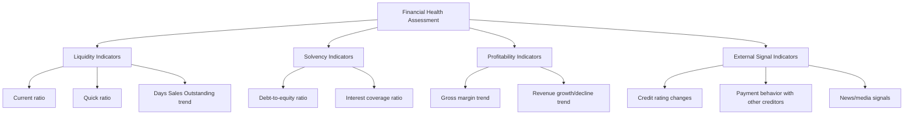
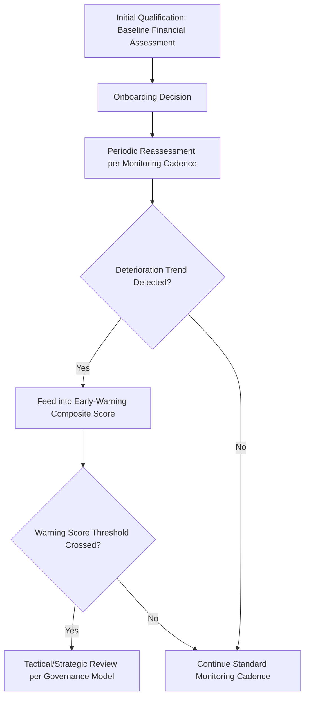

## Financial Health and Viability Assessment

### Overview

Financial health and viability assessment is the structured process of evaluating a supplier's financial stability and solvency risk, both at initial qualification and on an ongoing basis throughout the relationship. This topic deepens a criterion introduced only briefly in the preliminary screening and RFI discussions into its full analytical treatment: financial distress was identified in the risk taxonomy as a supply-side risk category, and this topic defines the specific metrics, data sources, and monitoring cadence used to detect that risk before it manifests as a delivery failure. In a dual-sourcing context, financial assessment matters for both suppliers independently — a financially fragile secondary supplier undermines the resilience value the dual-sourcing arrangement was meant to provide.

### Why Financial Assessment Is a Distinct Discipline

**Key Points**

- Financial distress often precedes operational failure by a meaningful lead time — a supplier can continue shipping product on schedule for months while underlying financial deterioration builds toward an eventual disruption, making financial assessment a genuine early-warning input rather than a lagging indicator
- Unlike quality or delivery performance, financial health is not directly observable through normal buyer-supplier transactions, requiring dedicated data sources and analytical techniques
- Financial assessment differs meaningfully between publicly traded suppliers (with mandated financial disclosure) and privately held suppliers (where financial transparency depends on voluntary disclosure or third-party estimation), a distinction that materially shapes what assessment approach is even possible

### Core Financial Health Indicators

#### 1. Liquidity Indicators

Measure a supplier's ability to meet short-term obligations, which is often the first place financial stress becomes visible.

$$\text{Current Ratio} = \frac{\text{Current Assets}}{\text{Current Liabilities}}$$

$$\text{Quick Ratio} = \frac{\text{Current Assets} - \text{Inventory}}{\text{Current Liabilities}}$$

**Example**

A supplier reports current assets of $8,000,000, inventory of $3,000,000, and current liabilities of $5,000,000:

$$\text{Current Ratio} = \frac{8{,}000{,}000}{5{,}000{,}000} = 1.6$$

$$\text{Quick Ratio} = \frac{8{,}000{,}000 - 3{,}000{,}000}{5{,}000{,}000} = \frac{5{,}000{,}000}{5{,}000{,}000} = 1.0$$

A quick ratio around 1.0 is generally considered adequate, though acceptable ranges vary meaningfully by industry, business model, and inventory-intensity of the specific sector — a single benchmark number should not be applied uniformly across very different supplier types without adjustment.

#### 2. Solvency Indicators

Measure longer-term financial structure and capacity to service debt obligations.

$$\text{Debt-to-Equity Ratio} = \frac{\text{Total Liabilities}}{\text{Shareholders' Equity}}$$

**Key Points**

- A rising debt-to-equity trend over successive reporting periods is often a more meaningful signal than the absolute ratio at a single point in time, consistent with the trend-over-snapshot principle established in the early-warning monitoring topic
- Interest coverage ratio (earnings before interest and taxes divided by interest expense) indicates how comfortably a supplier can service its debt load from ongoing operations — a declining trend can signal building financial stress even while the supplier remains current on payments

#### 3. Profitability and Growth Indicators

- Gross margin trend: a declining margin trend can indicate cost pressures the supplier has not yet passed through to pricing, potentially foreshadowing either a future price increase request or a quality/service degradation as the supplier cuts costs elsewhere
- Revenue growth or decline trend: sustained revenue decline can indicate broader business viability concerns beyond the specific relationship with the buyer

#### 4. External Signal Indicators

- **Credit rating changes**: for suppliers rated by major credit agencies, rating downgrades are a direct, third-party-validated financial distress signal
- **Payment behavior with other creditors**: trade credit reporting services can reveal payment delays to other suppliers or lenders, often visible before the buyer's own relationship experiences delivery impact
- **News/media signals**: layoffs, facility closures, leadership departures, and litigation disclosures are qualitative but often meaningful early indicators, particularly for privately held suppliers with limited formal financial disclosure

### Data Source Availability by Supplier Type

| Supplier Type | Primary Data Sources | Assessment Confidence |
| --- | --- | --- |
| Publicly traded | SEC/regulatory filings, audited financial statements, analyst coverage, credit ratings | High — standardized, regularly updated, third-party verified |
| Large private company | Voluntary disclosure, trade credit reporting services, D&B-style commercial credit reports | Moderate — depends on disclosure willingness and reporting service coverage |
| Small/regional private supplier | Limited formal disclosure; often reliant on direct financial statement requests, bank references, trade references | Lower — assessment often qualitative or based on proxy indicators |
| State-owned or government-linked entity | Varies significantly by jurisdiction and transparency regime | [Unverified] Assessment approach and reliability vary substantially by country and should be evaluated case-by-case rather than assumed |

**Key Points**

- For smaller or privately held suppliers common in nearshoring and diversification-driven second-source qualification, formal financial statement access may need to be a specific, negotiated qualification requirement rather than an assumed availability
- [Inference] Organizations sourcing from a more geographically diversified supplier base — a natural outcome of the diversification and friendshoring strategies discussed earlier — likely encounter this data availability challenge more frequently than organizations sourcing exclusively from large, established multinational suppliers, though the practical impact depends heavily on the specific supplier tier and region

### Assessment Cadence and Integration

Financial health assessment is not a one-time qualification gate but a continuous monitoring input, directly feeding the early-warning monitoring capability discussed earlier in this material.

| Cadence | Activity | Owner |
| --- | --- | --- |
| At qualification | Full baseline financial assessment across all available indicators | Category Manager, informed by Finance |
| Quarterly | Trend monitoring for strategic/critical category suppliers | Supply Chain Risk Function |
| Annual | Full reassessment for all active suppliers regardless of criticality tier | Category Manager |
| Triggered | Immediate reassessment upon external signal (credit downgrade, news event) | Early-Warning Monitoring Capability |

### Integration with Dual-Sourcing Governance

**Key Points**

- Financial health scores feed directly into the composite scorecard framework established in the governance model, typically as a component of or input to the broader risk/responsiveness weighting
- A material financial deterioration signal at the primary supplier should be evaluated against the same allocation-rebalancing triggers used for performance and quality signals, potentially justifying a proactive tactical-layer shift toward the secondary supplier before an actual disruption occurs
- Financial fragility discovered at the secondary supplier is a distinct governance concern: it undermines confidence in the failover capability the dual-sourcing arrangement depends on, and should trigger a review of whether a tertiary backup or accelerated re-qualification of an alternate is warranted (per the diversification framework's criticality-tiered approach)

### Common Pitfalls

- **Relying on a single-point-in-time assessment**: financial deterioration is a trend phenomenon, and snapshot assessments at long intervals can miss meaningful early warning
- **Applying identical benchmark ratios across very different supplier types**: acceptable liquidity and solvency ranges vary substantially by industry and business model; a benchmark appropriate for a large multinational may be inappropriate for a specialized small supplier
- **Under-assessing privately held or smaller suppliers** due to data availability challenges, rather than proactively negotiating disclosure requirements as part of the qualification process
- **Disconnected from allocation governance**: producing financial risk assessments that sit in a report without a defined pathway into the allocation-rebalancing decision process
- **Treating the secondary supplier's financial health as less important than the primary's**: a financially fragile backup undermines the entire resilience rationale for dual sourcing, yet often receives less scrutiny than the higher-volume primary relationship

### Related Topics

- Supply Chain Risk Category Taxonomy (financial distress as a supply-side risk category)
- Early-Warning and Disruption Monitoring Capability (financial signal integration)
- Preliminary Supplier Screening Criteria (initial financial gate criteria)
- Governance Model for Managing Two Active Suppliers (scorecard and rebalancing integration)
- Business Continuity Planning for Critical Components (financial distress as a BCP trigger)
- Credit Rating Agencies and Trade Credit Reporting Services