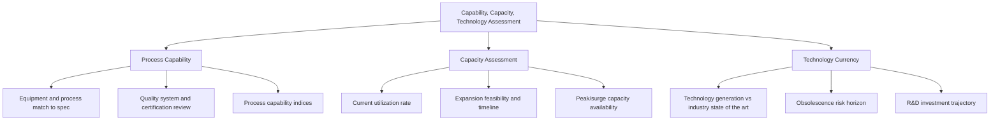
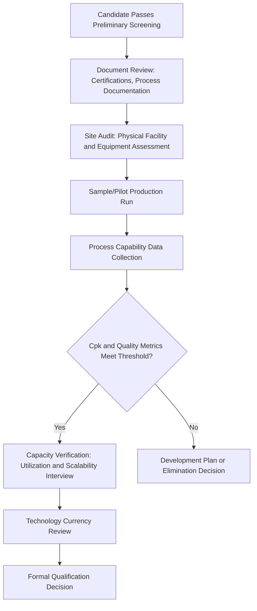

## Capability, Capacity, and Technology Assessment

### Overview

Capability, capacity, and technology assessment is the structured evaluation of whether a candidate supplier can actually produce a given component to the required specification, at the required volume, using processes and technology suitable for the buyer's needs — both today and over the life of the relationship. Where financial health assessment addresses whether a supplier will remain viable, and preliminary screening applies a lightweight first filter, this topic addresses the deeper operational question of whether the supplier's actual production capability matches what the component genuinely requires. In a dual-sourcing context, this assessment is where the aspiration of geographic or commercial redundancy meets the reality of whether a true, functionally equivalent second source actually exists — a distinction made sharply clear in the semiconductor dual-sourcing discussion, where "capability" often could not be assumed equivalent across vendors.

### Three Distinct Dimensions

**Key Points**

- **Capability**: does the supplier possess the technical process, equipment, and quality systems needed to produce the component to specification at all
- **Capacity**: can the supplier produce at the volume and pace the buyer requires, both currently and with reasonable ability to scale
- **Technology**: is the supplier's underlying production technology current, appropriately matched to the component's requirements, and not at risk of near-term obsolescence
- These three dimensions are related but genuinely independent — a supplier can have excellent capability and technology but insufficient capacity, or ample capacity built on aging technology that creates future risk, and each combination implies a different qualification and governance response

### Capability Assessment

#### Process Capability Verification

Process capability assessment confirms the supplier's equipment and methods can reliably produce output within the component's required specification tolerances, typically quantified through process capability indices.

$$C_{pk} = \min\left(\frac{USL - \mu}{3\sigma}, \frac{\mu - LSL}{3\sigma}\right)$$

Where $USL$ and $LSL$ are the upper and lower specification limits, $\mu$ is the process mean, and $\sigma$ is the process standard deviation.

**Example**

A dimensional specification requires a part measuring between 9.90mm and 10.10mm ($LSL = 9.90$, $USL = 10.10$). A candidate supplier's process produces a mean of 10.00mm with a standard deviation of 0.03mm:

$$C_{pk} = \min\left(\frac{10.10 - 10.00}{3 \times 0.03}, \frac{10.00 - 9.90}{3 \times 0.03}\right) = \min(1.11, 1.11) = 1.11$$

A $C_{pk}$ of 1.11 is generally considered marginal for many industrial applications (a common target threshold is 1.33 or higher for critical dimensions), indicating this candidate's process may need improvement before qualification, or may only be acceptable for less critical dimensions of the component.

**Key Points**

- Process capability should be assessed on the specific dimensions or characteristics that matter most for the component's function, not as a single blanket score — a supplier may show strong capability on most characteristics while being marginal on one critical dimension
- [Unverified] Acceptable $C_{pk}$ thresholds vary meaningfully by industry, criticality of the characteristic, and applicable quality standards (e.g., automotive vs. general industrial applications), so specific threshold values should be confirmed against the buyer's own quality requirements rather than treated as universal

#### Quality System and Certification Review

- Relevant certifications (e.g., ISO 9001 general quality management, industry-specific standards) establish a baseline quality system maturity signal
- Certification currency matters as much as certification existence — an expired or soon-to-expire certification is a meaningful flag
- Beyond certification checklists, review of the supplier's actual corrective and preventive action (CAPA) process maturity provides insight into how the supplier handles the inevitable quality deviations that arise in production, not just whether they can avoid them entirely

### Capacity Assessment

#### Current Utilization and Available Headroom

**Key Points**

- A supplier's stated maximum theoretical capacity is less useful than their current utilization rate, since a facility running near full utilization on existing commitments has little genuine headroom to absorb new dual-sourcing allocation volume regardless of nameplate capacity
- Capacity assessment should distinguish between capacity available immediately versus capacity requiring capital investment or lead time to activate — this distinction directly feeds the failover ramp-up lead time calculations used in BCP safety stock sizing
- For dual-sourcing purposes specifically, the relevant capacity question is not simply "can this supplier produce the full component volume" but "can this supplier scale from an initial modest allocation to a larger share if the governance model later shifts volume toward them" — a supplier only capable of small, fixed-volume production may be unsuitable as a true dual-source partner even if capable of the component itself

#### Surge and Peak Capacity

- Assessing whether a supplier maintains any buffer capacity for demand spikes or as part of an emergency failover response (directly relevant to the BCP failover mechanisms discussed earlier)
- Surge capacity assessment should include realistic activation lead time, not just theoretical maximum output, since the practical BCP value of surge capacity depends on how quickly it can actually be brought online

### Technology Currency Assessment

**Key Points**

- Production technology that is current relative to industry state-of-the-art generally implies lower obsolescence risk and better positioning for future specification changes, while aging technology may create risk of the supplier being unable to support future design evolution
- This connects to the semiconductor dual-sourcing discussion's emphasis on fabrication node currency — a supplier producing on an older process node may face capacity allocation deprioritization by their own upstream foundry during shortage conditions, and may face rising relative costs as the broader industry migrates to newer nodes
- Technology assessment should also consider the supplier's R&D investment trajectory as a forward-looking indicator, since a supplier investing in next-generation capability is a different long-term partner than one milking existing, aging equipment without reinvestment

### Assessment Methodology

**Key Points**

- Site audits provide direct verification of claims made during the RFI and preliminary screening stages, since self-reported capability and capacity figures should be validated rather than accepted at face value, particularly for a candidate the organization has no prior working history with
- A sample or pilot production run is the most reliable capability verification method, since it tests actual output against specification under real (if limited-scale) production conditions rather than relying on the supplier's own historical data or documentation alone
- Where a candidate shows marginal but promising results (e.g., the $C_{pk} = 1.11$ example above), a supplier development plan — a formal, time-bound improvement commitment — may be appropriate rather than immediate elimination, particularly when the candidate offers otherwise strong strategic value (e.g., significant diversification benefit)

### Integration with Dual-Sourcing Decisions

| Assessment Outcome | Governance Implication |
| --- | --- |
| Strong capability, ample capacity, current technology | Strong dual-source candidate; proceed to full qualification |
| Strong capability, limited capacity | May be viable for a smaller allocation share within the governance model's split, but limits ultimate failover value |
| Marginal capability on critical characteristics | Consider supplier development plan before final qualification decision, or restrict to non-critical characteristics only |
| Strong capability but aging technology | Qualify with awareness of medium-term technology risk; monitor via ongoing early-warning capability |
| Capability gap requiring redesign or FFF equivalence | May still be viable via the architectural redundancy or FFF qualification patterns discussed in the semiconductor dual-sourcing topic |

### Common Pitfalls

- **Relying on self-reported capability data without independent verification**, particularly for candidates with no prior working relationship history
- **Assessing nameplate capacity rather than actual available headroom**, overestimating a candidate's genuine ability to absorb meaningful dual-sourcing allocation
- **Treating capability assessment as a one-time qualification gate** rather than periodically reassessing as the supplier's own technology and capacity evolve over the relationship's life
- **Ignoring technology currency in favor of current-state capability alone**, missing forward-looking risk of a supplier falling behind industry technology curves
- **Applying uniform Cpk or capability thresholds across all component characteristics** rather than focusing rigor on the characteristics that are actually critical to component function

### Related Topics

- Preliminary Supplier Screening Criteria (upstream lightweight filter before this deeper assessment)
- Dual Sourcing Patterns in Semiconductors and Electronics (capability equivalence and FFF qualification context)
- Business Continuity Planning for Critical Components (capacity and ramp-up lead time linkage)
- Financial Health and Viability Assessment (parallel qualification dimension)
- Governance Model for Managing Two Active Suppliers (allocation feasibility based on capacity findings)
- Process Capability Analysis and Statistical Process Control Methods