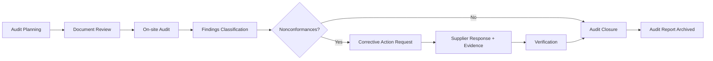
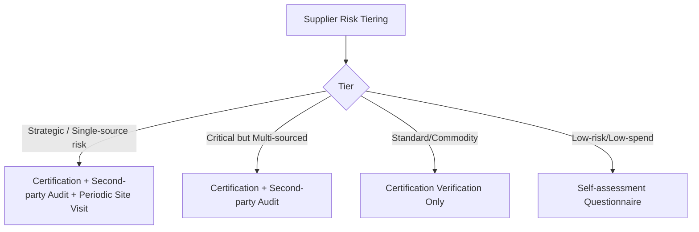

## Site Visits, Audits, and Certifications

### Overview

Site visits, audits, and certifications form the verification layer of supplier identification and market research — the mechanisms by which claims made in RFI/RFQ responses, marketing materials, and self-assessment questionnaires are validated against physical and operational reality. Where desk research (financial screening, market mapping, database checks) establishes whether a supplier *should* be capable, on-site verification and third-party certification establish whether the supplier *is* capable, compliant, and stable enough to onboard.

These three mechanisms operate at different depths:

- **Site visits**: direct, often unannounced or scheduled, physical/operational observation
- **Audits**: structured, criteria-based assessments (first-, second-, or third-party) against a defined standard
- **Certifications**: standing attestations issued by accredited bodies, substituting recurring first-party verification with periodic third-party assurance

### Site Visits

#### Purpose and Triggers

Site visits are typically triggered by:

- New supplier onboarding above a spend or risk threshold
- Category risk classification (single-source, safety-critical, regulated components)
- Post-incident investigation (quality escape, delivery failure, ethical complaint)
- Periodic re-qualification cycles (annual, biannual)
- Pre-award due diligence for strategic or dual-source candidates

#### Types of Site Visits

| Type | Purpose | Typical Trigger |
| --- | --- | --- |
| Capability assessment | Verify production capacity, equipment, technology fit | New supplier qualification |
| Quality system walkthrough | Observe QMS in practice, not just on paper | ISO 9001 gap validation |
| Financial/operational health check | Cross-reference stated capacity against actual utilization | High-risk or financially distressed supplier |
| Social/ethical compliance visit | Labor conditions, working hours, safety practices | CSR/ESG program requirement |
| Security/IP protection review | Physical and data security controls | Sensitive IP or defense-adjacent sourcing |

#### Structured Site Visit Protocol

**Key Points**

- Pre-visit: send agenda, request documentation in advance (process flow, org chart, equipment list, last audit reports), define scorecard criteria before arrival
- During visit: follow the physical material/process flow (receiving → storage → production → QC → shipping), not a scripted office tour — this exposes gaps between stated and actual process
- Interview shop-floor personnel, not only management, to validate that documented procedures are actually followed
- Cross-check capacity claims: compare nameplate/theoretical capacity against observed utilization, backlog, and shift patterns
- Photograph/document findings where permitted; note any areas where access was restricted (a risk signal itself)
- Post-visit: issue a formal report with scored findings, categorized as critical/major/minor, and a corrective action request (CAR) with deadlines

**Example**

A dual-sourcing qualification visit to a secondary supplier for a critical component might use a weighted scorecard:



```
Category                  Weight   Score (1-5)   Weighted
Quality Systems           25%      4             1.00
Production Capacity       20%      3             0.60
Equipment/Technology      15%      4             0.60
Financial Stability Cues  15%      3             0.45
Labor/Ethical Compliance  15%      5             0.75
Business Continuity Plan  10%      2             0.20
                                    Total:        3.60 / 5.00
```

A score below a pre-agreed threshold (e.g., 3.5) typically triggers conditional approval with mandatory CARs rather than outright rejection, especially where the supplier is being developed as a second source.

### Audits

#### Audit Party Types

- **First-party (internal)**: supplier self-audits its own operations against its own procedures
- **Second-party**: the buying organization (or its agent) audits the supplier directly — most common in SRM
- **Third-party**: an independent, often accredited, certification body audits against a published standard (e.g., ISO, IATF) and issues certification

Second-party audits are the primary SRM tool because they allow the buyer to weight criteria according to its own risk priorities, whereas third-party certifications validate against a generic standard that may not cover buyer-specific requirements (e.g., a specific customer's PPAP requirements beyond baseline IATF 16949).

#### Common Audit Frameworks in SRM

| Framework | Focus | Common Use Case |
| --- | --- | --- |
| Process audit (e.g., VDA 6.3) | Process capability, control | Automotive, manufacturing dual-sourcing |
| System audit (e.g., ISO 9001 internal audit logic) | QMS structural compliance | Broad supplier base qualification |
| Product audit | Conformance of a specific SKU/batch | High-defect-risk components |
| Supplier Corrective Action Report (SCAR) | Root cause + containment + systemic fix | Post-nonconformance follow-up |
| Social compliance audit (SMETA, SA8000) | Labor, ethics, environment | CSR/ESG-driven sourcing |

#### Audit Lifecycle



**Key Points**

- Findings are typically classified as **Critical** (immediate risk to product/safety/legal compliance), **Major** (systemic process gap), or **Minor** (isolated, low-impact deviation)
- A CAR/SCAR should require root cause analysis (e.g., 5-Why or fishbone), not just a symptom fix, to prevent recurrence
- Re-audit cadence should scale with risk tier: critical/single-source suppliers annually or biannually; low-risk commodity suppliers on a 3–5 year cycle or certification-based reliance
- Audit findings feed directly into the supplier scorecard and requalification/disqualification decisions used in dual-sourcing strategy

### Certifications

#### Why Certifications Matter in SRM

Certifications shift the verification burden from the buyer to an accredited third party, reducing the frequency and cost of buyer-led audits. In dual-sourcing strategy specifically, certification status is often used as a **gating criterion** — a supplier lacking a required certification may be excluded from the qualified pool regardless of price or capacity, because the certification substitutes for capabilities the buyer cannot economically verify itself across a broad supplier base.

#### Common Certification Categories

| Category | Standard(s) | Relevance |
| --- | --- | --- |
| Quality management | ISO 9001, IATF 16949 (automotive), AS9100 (aerospace) | Baseline process consistency |
| Environmental | ISO 14001 | Regulatory and ESG alignment |
| Information security | ISO 27001, SOC 2 | Data-sensitive supply relationships |
| Social/labor | SA8000, SMETA (Sedex) | Ethical sourcing, CSR reporting |
| Industry-specific | ISO 13485 (medical devices), FSSC 22000 (food safety) | Regulated sector compliance |
| Business continuity | ISO 22301 | Dual-sourcing risk mitigation validation |

#### Certification Verification Practice

**Key Points**

- Never accept a certificate at face value — verify directly with the issuing/accreditation body's public registry or database, since fraudulent or expired certificates are a recurring supply-chain risk
- Confirm scope: a certificate often applies to a specific site, product line, or process, not the entire legal entity — a supplier may hold ISO 9001 for one facility while proposing to supply from an uncertified plant
- Check certificate validity dates and surveillance audit history; a certification body typically conducts annual surveillance audits between three-year recertification cycles — a lapsed surveillance audit is a red flag even if the certificate hasn't formally expired
- Distinguish "certified" from "compliant with the certification's intent" — certification confirms a system exists and was audited at a point in time; it does not guarantee ongoing conformance, which is why certification is typically paired with, not substituted for, periodic second-party audits for critical suppliers

[Inference] The specific surveillance audit cadence and nonconformance grace periods can vary by certification body and accreditation scheme, so buyers relying on certification as a gating control should confirm the issuing body's specific surveillance schedule rather than assuming a universal ISO cycle.

### Integrating Site Visits, Audits, and Certifications into Dual Sourcing

For dual-sourcing decisions specifically, these three mechanisms are typically layered by risk tier rather than applied uniformly:



This tiering ensures that verification cost and effort scale proportionally with supply risk — a principle central to building a resilient dual-sourcing pool without incurring unsustainable qualification overhead across the entire supplier base.

**Related Topics**

- Supplier Risk Segmentation and Tiering Models
- Corrective Action Request (CAR/SCAR) Management Processes
- Supplier Scorecards and Weighted Evaluation Criteria
- Business Continuity Planning (BCP) Verification for Dual Sourcing
- Fraud Detection in Certification and Compliance Documentation
- ESG and Social Compliance Auditing Frameworks (SMETA, SA8000)