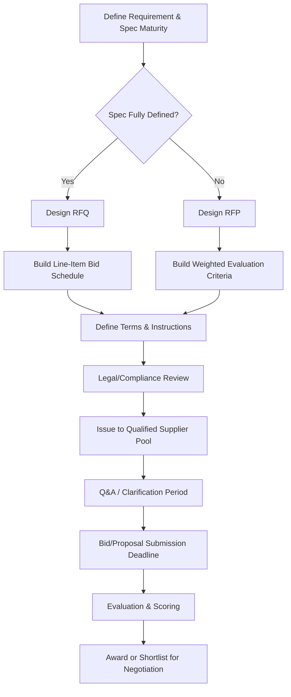
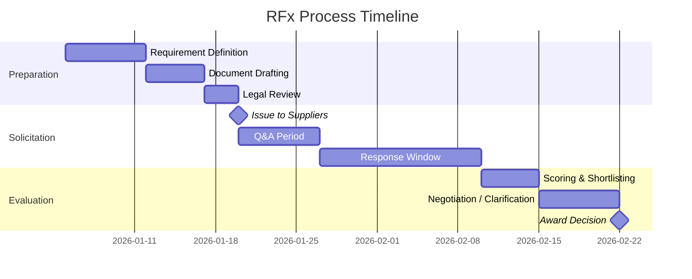

## Request for Proposal (RFP) and Request for Quotation (RFQ) Design

### Overview

RFPs and RFQs are the two dominant structured solicitation instruments used to move from a qualified supplier pool into competitive selection. Though often used interchangeably in casual procurement language, they serve distinct purposes and are triggered by different levels of specification maturity and decision complexity. Designing them well — rather than defaulting to a boilerplate template — directly determines the quality of supplier responses, comparability of bids, and defensibility of the award decision, especially in dual-sourcing scenarios where two suppliers must be evaluated against identical, objective criteria.

### RFQ vs. RFP: Core Distinction

| Dimension | RFQ | RFP |
| --- | --- | --- |
| Primary variable | Price | Solution/approach + price |
| Specification maturity | Fully defined (drawings, specs, SOW fixed) | Partially defined (problem/outcome defined, method open) |
| Supplier discretion | Low — quote against fixed spec | High — propose how to meet the requirement |
| Evaluation basis | Lowest price meeting spec (or weighted cost model) | Weighted scoring across technical, commercial, risk criteria |
| Typical use case | Commodity parts, standard materials, repeat buys | Complex services, new component development, strategic sourcing |
| Dual-sourcing fit | Straightforward — identical spec to two bidders | Requires normalized scoring to compare differing proposals |

**Key Points**

- Issuing an RFQ when the requirement is actually underspecified produces incomparable quotes, because suppliers fill gaps with different assumptions
- Issuing an RFP when the spec is fully fixed wastes supplier effort on proposal-writing for a decision that is really just a price competition
- A common failure mode is a hybrid RFQ dressed as an RFP (or vice versa) without adjusting the evaluation model to match — this is corrected at the design stage, not after responses arrive

### RFx Design Process



### RFQ Design Components

#### Structure

1. **Cover instructions**: submission deadline, format, point of contact, confidentiality terms
2. **Scope of supply**: exact part numbers, drawings/specs, quantities, delivery schedule
3. **Bid schedule (line-item pricing table)**: structured so every supplier prices identical units
4. **Commercial terms**: Incoterms, payment terms, validity period of the quote, currency
5. **Qualification reaffirmation**: certifications, capacity confirmation, lead time commitment

**Example — RFQ Bid Schedule**



```
Line | Part No.   | Description        | Qty/Yr | Unit Price | Tooling Cost | Lead Time (wks)
1    | PN-4471-A  | Bracket, steel      | 50,000 | $______    | $______      | ____
2    | PN-4471-B  | Bracket, aluminum   | 20,000 | $______    | $______      | ____
```

**Key Points**

- Every cell suppliers must fill should be explicitly structured (locked template, not free text) to prevent apples-to-oranges responses
- Include a "assumptions/exceptions" field so deviations are visible and flagged, rather than buried in a cover letter
- For dual-sourcing RFQs, issue identical bid schedules to both incumbent and candidate suppliers simultaneously, with the same deadline, to preserve comparability and auditability

### RFP Design Components

#### Structure

1. **Background and objective**: business context, why the sourcing event is happening
2. **Scope of work / statement of requirement**: outcome-based description of what must be achieved, deliberately leaving implementation method open
3. **Evaluation criteria and weighting**: published in advance so suppliers know what's being scored
4. **Technical response requirements**: proposed approach, capability evidence, references, risk mitigation plan
5. **Commercial response requirements**: pricing model, cost breakdown, payment terms
6. **Compliance/legal requirements**: insurance, data protection, terms and conditions acceptance
7. **Submission logistics**: format, deadline, Q&A process, evaluation timeline

**Example — RFP Evaluation Scoring Model**



```
Criterion                    Weight   Supplier A   Supplier B
Technical Approach           30%      4/5          3/5
Relevant Experience          15%      5/5          4/5
Capacity & Scalability       15%      3/5          5/5
Commercial Competitiveness   25%      4/5          4/5
Risk Mitigation / BCP        10%      3/5          4/5
Sustainability/ESG           5%       4/5          3/5

Weighted Total: A = 3.85 | B = 3.90
```

**Key Points**

- Publishing weights in the RFP itself (not just internally) increases the quality of responses, since suppliers invest effort where it counts most in scoring
- Technical and commercial responses are often required as **separately sealed sections**, scored independently, so technical evaluators are not influenced by price
- For dual-sourcing programs evaluating a second supplier alongside an incumbent, the criteria should explicitly include transition/ramp-up risk and cross-qualification cost, which a single-source RFP would not need to weight

### Common Pitfalls in RFx Design

**Key Points**

- **Ambiguous scope**: vague statements of work produce non-comparable proposals; outcome and boundary conditions must be explicit even in an RFP
- **Unweighted or undisclosed criteria**: makes the award decision non-defensible and invites protest/challenge in regulated or public-sector procurement contexts
- **No Q&A mechanism**: forces suppliers to guess at ambiguities, and different suppliers may guess differently, undermining comparability — a published Q&A log distributed to all bidders equally prevents this
- **Unrealistic response windows**: compressed timelines bias responses toward suppliers with existing capacity/relationship rather than best fit, undermining dual-sourcing objectives specifically designed to widen the supplier base
- **Mixing must-haves with nice-to-haves without distinction**: pass/fail (gating) requirements should be separated from scored/weighted requirements, so a supplier failing a mandatory certification is disqualified before scoring effort is wasted on their technical proposal

### RFx Timeline Template



**Related Topics**

- Statement of Work (SOW) Drafting for Complex Services
- Supplier Scoring Models and Weighted Decision Matrices
- Should-Cost Modeling as an RFQ Benchmark
- Negotiation Strategy Following RFx Evaluation
- Reverse Auctions vs. Sealed-Bid RFQs
- Managing Q&A and Addenda in Competitive Solicitations