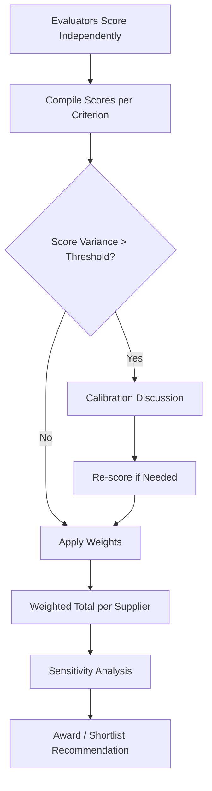

## Bid Evaluation Frameworks and Weighted Scoring

### Overview

Bid evaluation frameworks are the structured decision-making systems used to convert RFP/RFQ responses into an objective, defensible award decision. Weighted scoring is the most widely used method within these frameworks, translating qualitative and quantitative supplier attributes into a single comparable metric. In dual-sourcing contexts, evaluation frameworks carry additional weight because they must justify not just "who wins" but "why two suppliers, in what proportion, and under what risk trade-offs" — decisions that unweighted or purely price-based evaluation cannot support.

### Core Evaluation Framework Types

| Framework | Mechanism | Best Fit |
| --- | --- | --- |
| Lowest compliant price | Award to lowest bid meeting mandatory pass/fail criteria | Commodity RFQs, fully specified goods |
| Weighted scoring model | Multi-criteria, weighted, numeric scoring | RFPs, complex/strategic sourcing |
| Total Cost of Ownership (TCO) | Price plus quantified lifecycle costs (logistics, quality, risk) | High-value or long-term contracts |
| Best Value / Value-for-Money | Weighted scoring blended with qualitative judgment | Public sector, regulated procurement |
| Multi-round competitive negotiation | Iterative scoring with negotiation between rounds | High-complexity, high-value strategic buys |

**Key Points**

- Lowest compliant price is fast and auditable but ignores quality, risk, and capability differentials — poorly suited to dual-sourcing decisions where resilience matters as much as cost
- Weighted scoring is the default framework for most RFP-based supplier selection because it makes trade-offs explicit and traceable
- TCO evaluation is particularly relevant to dual-sourcing since a second source often carries hidden costs (tooling duplication, qualification testing, lower initial yield) that a price-only comparison would miss

### Weighted Scoring Model — Mechanics

#### Step 1: Define Evaluation Criteria and Categories

Criteria are typically grouped into three to five categories:

- **Technical/Quality**: capability, technology fit, process maturity, defect history
- **Commercial**: unit price, total cost, payment terms, price stability/escalation clauses
- **Delivery/Capacity**: lead time, on-time delivery history, scalability
- **Risk/Resilience**: financial stability, geographic/geopolitical exposure, business continuity plan
- **Compliance/ESG**: certifications, labor practices, sustainability commitments

#### Step 2: Assign Weights

Weights reflect the buying organization's strategic priorities and must be set **before** bids are received to avoid bias.

**Example — Weight Allocation by Sourcing Objective**



```
Criterion              Cost-Driven Sourcing   Resilience-Driven Dual Sourcing
Price/TCO              45%                    25%
Quality/Technical       25%                    25%
Delivery/Capacity       15%                    20%
Risk/BCP                10%                    20%
ESG/Compliance          5%                     10%
```

**Key Points**

- Shifting weight toward Risk/BCP and Capacity is the primary mechanism by which weighted scoring operationalizes a dual-sourcing strategy — it structurally favors suppliers who reduce single-source exposure, not merely those with the lowest price
- Weights should sum to 100% and be documented in the RFP itself for transparency and defensibility

#### Step 3: Score Each Supplier Per Criterion

A defined scale (commonly 1–5 or 1–10) with explicit anchor definitions prevents inconsistent scoring across evaluators.

**Example — Scoring Anchor Definitions (1–5 scale)**



```
Score   Definition
5       Exceeds requirement; best-in-class evidence provided
4       Fully meets requirement; strong supporting evidence
3       Meets requirement; adequate evidence
2       Partially meets requirement; gaps identified
1       Does not meet requirement; significant risk
```

#### Step 4: Calculate Weighted Scores

$$\text{Weighted Score} = \sum_{i=1}^{n} (w_i \times s_i)$$

Where $w_i$ is the weight of criterion $i$ (as a decimal) and $s_i$ is the raw score for criterion $i$.

**Example — Full Calculation**



```
Criterion         Weight   Supplier A Score   A Weighted   Supplier B Score   B Weighted
Price/TCO         25%      4                  1.00         5                  1.25
Technical         25%      5                  1.25         3                  0.75
Delivery/Capacity 20%      3                  0.60         5                  1.00
Risk/BCP          20%      2                  0.40         5                  1.00
ESG/Compliance    10%      4                  0.40         3                  0.30
                                    Total:     3.65                            4.30
```

In this example, Supplier B scores higher overall despite a lower technical score, driven by superior delivery capacity and risk/BCP performance — precisely the profile a dual-sourcing program is designed to surface and reward over a marginally cheaper, higher-risk incumbent.

### Multi-Evaluator Scoring and Consensus

**Key Points**

- Independent scoring by multiple evaluators (technical, commercial, quality, procurement) reduces single-evaluator bias
- Divergent scores (e.g., a spread greater than 2 points on a 5-point scale) should trigger a calibration discussion, not automatic averaging, since large divergence often indicates evaluators interpreted the criterion differently
- Blind/sealed scoring — evaluators score without seeing other evaluators' scores or, ideally, without seeing price during technical scoring — reduces anchoring bias



### Sensitivity Analysis

**Key Points**

- Because weight assignment is itself a judgment call, a robust evaluation re-runs the weighted totals under alternative plausible weight scenarios (e.g., ±5–10% shifts) to check whether the ranking is stable
- If a small weight change flips the winner, the decision is fragile and warrants further scrutiny (additional criteria, deeper due diligence, or a negotiation round) rather than a straight award
- In dual-sourcing allocation decisions, sensitivity analysis is also used to determine volume split ratios (e.g., 70/30 vs. 60/40) rather than a binary win/lose outcome

**Example — Sensitivity Check**



```
Scenario                          Supplier A Total   Supplier B Total   Winner
Base weights                      3.65                4.30               B
Price weight +10%, Risk -10%      3.85                4.00               B
Risk weight +10%, Price -10%      3.45                4.60               B
```

Stable ranking across scenarios strengthens the defensibility of awarding B as primary or co-primary source.

### Handling Disqualifying (Gating) Criteria

**Key Points**

- Certain criteria (valid certification, financial minimum, legal compliance) should be pass/fail gates applied *before* weighted scoring, not folded into the weighted average — a supplier scoring well on price should not offset a failed mandatory safety certification
- Document gating failures separately from scored evaluation to keep the audit trail clear on *why* a supplier was excluded versus *how* it ranked

### Common Pitfalls

**Key Points**

- **Reverse-engineering weights to justify a preferred supplier** — undermines the framework's defensibility and can expose the organization to protest or legal challenge in regulated procurement
- **Too many criteria**: beyond roughly 8–10 weighted criteria, scoring becomes noisy and evaluators struggle to differentiate meaningfully between adjacent scores
- **Ignoring correlation between criteria**: e.g., scoring both "on-time delivery history" and "logistics capability" separately when they measure largely the same underlying trait, double-counting its influence on the total
- **Static weighting across dissimilar sourcing events**: applying identical weights to a commodity RFQ and a strategic dual-source RFP produces misleading comparisons; weights should be re-derived per sourcing event objective

**Related Topics**

- Total Cost of Ownership (TCO) Modeling in Supplier Selection
- Dual-Sourcing Volume Allocation Strategies (e.g., 70/30 Splits)
- Supplier Risk Scoring and Financial Health Indicators
- Negotiation Strategy Post-Evaluation
- Should-Cost Analysis as an Evaluation Benchmark
- Evaluator Bias Mitigation in Procurement Scoring