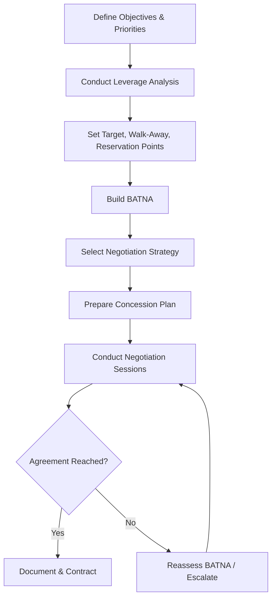

## Negotiation Planning and Tactics


### Overview

Negotiation is the stage that follows bid evaluation and converts a shortlisted or ranked supplier position into finalized commercial and contractual terms. In supplier relationship management, negotiation is rarely a single event — it is a planned process combining preparation, leverage analysis, and tactical execution. In dual-sourcing contexts, negotiation strategy is further complicated by the need to negotiate simultaneously or sequentially with multiple suppliers while preserving competitive tension without damaging long-term relationships with either party.

### Negotiation Planning Framework



### Step 1: Define Objectives and Priorities

**Key Points**

- Separate objectives into **must-haves** (non-negotiable minimums), **target outcomes** (realistic aim), and **nice-to-haves** (tradeable value-adds)
- Prioritize across multiple variables — price, payment terms, lead time, quality guarantees, capacity commitments, IP terms — rather than treating price as the sole objective
- In dual-sourcing negotiations, an explicit objective is often *volume allocation certainty* (guaranteed minimum share) rather than price alone, since suppliers are typically less willing to invest in qualification/tooling for an uncertain volume split

**Example — Objective Prioritization Matrix**



```
Variable              Must-Have           Target                Nice-to-Have
Unit Price            ≤ $4.50             $4.20                 $4.00
Payment Terms         Net 30              Net 45                Net 60
Lead Time             ≤ 6 weeks           4 weeks                3 weeks
Volume Commitment     30% allocation      40% allocation         50% allocation
Tooling Cost Share    Supplier ≥ 50%      Supplier 75%           Supplier 100%
```

### Step 2: Leverage Analysis

**Key Points**

- Leverage is relative, not absolute — it depends on switching costs, market alternatives, and urgency on both sides
- Use a positioning tool such as the Kraljic-style power/dependency assessment or a simple leverage matrix comparing "our dependency on supplier" against "supplier's dependency on us"

**Example — Leverage Assessment**



```
Factor                          Buyer Leverage    Supplier Leverage
Alternative suppliers available  High (3+ qualified)   —
Our share of supplier revenue    —                     High (20% of their output)
Switching cost for us            Low (dual-sourced)     —
Switching cost for supplier      —                     Medium (dedicated tooling)
Market capacity constraint       —                      High (industry-wide shortage)
```

- A dual-sourcing strategy itself is a leverage-building move: qualifying a second source materially increases buyer leverage against the incumbent by demonstrably lowering switching cost, and this leverage should be made explicit (though not necessarily aggressively brandished) during negotiation

### Step 3: BATNA, Reservation Point, and Target Setting

**Key Points**

- **BATNA (Best Alternative to a Negotiated Agreement)**: the course of action if this negotiation fails — for dual-sourcing, the BATNA is often literally "award more volume to the other qualified supplier," which is a uniquely strong BATNA compared to single-source negotiations
- **Reservation point**: the walk-away threshold — the worst acceptable outcome before BATNA becomes preferable
- **Target point**: the realistic best-case goal, informed by market data (should-cost models, benchmark pricing, RFQ comparables)
- The **ZOPA (Zone of Possible Agreement)** exists where the buyer's reservation point and the supplier's reservation point overlap; negotiation planning should estimate the supplier's likely reservation point using cost modeling and market intelligence

$$\text{ZOPA exists if } R_{buyer} \geq R_{supplier}$$

Where $R_{buyer}$ is the buyer's maximum acceptable price and $R_{supplier}$ is the supplier's minimum acceptable price.

### Step 4: Negotiation Strategy Selection

| Strategy | Description | Best Fit |
| --- | --- | --- |
| Distributive (win-lose) | Fixed-pie, price-focused, zero-sum | Commodity, low-relationship-value, short-term buys |
| Integrative (win-win) | Expands value through trade-offs across multiple variables | Strategic, long-term, high-complexity relationships |
| Competitive multi-source | Parallel negotiation with 2+ suppliers, transparent or implied competition | Dual/multi-sourcing qualification and volume allocation |
| Principled negotiation | Focus on interests over positions, objective criteria as basis | Complex relationships needing durable agreement |

**Key Points**

- Dual-sourcing negotiations most often blend competitive multi-source dynamics with integrative elements — competition on price/terms, but collaboration on things like joint capacity planning or shared tooling investment
- Distributive tactics used carelessly in a strategic dual-source relationship can damage the collaborative behaviors (transparency, flexibility) that make a second source valuable beyond pure price competition

### Common Negotiation Tactics

**Key Points**

- **Anchoring**: opening with a number/position that shifts the perceived midpoint of negotiation in your favor; most effective when the counterpart has weaker information about market rates
- **Bundling/unbundling**: combining or separating issues (price + volume + payment terms) to create trade space — e.g., conceding on payment terms in exchange for price movement
- **Silence and deadlines**: strategic pauses or time pressure to prompt concessions, used carefully to avoid signaling weakness or urgency
- **Good cop/bad cop**: role differentiation across a negotiation team; effectiveness is context- and culture-dependent and can damage trust if perceived as manipulative
- **Nibbling**: small incremental asks after the main terms are agreed; should be anticipated and capped in planning to avoid erosion of the agreed position
- **Competitive signaling**: making the existence (not necessarily the details) of a parallel negotiation with an alternative supplier known, to reinforce leverage — a core dual-sourcing tactic, though signaling too aggressively can damage trust if the second source is not genuinely viable

[Inference] The relative effectiveness of specific tactics (e.g., anchoring magnitude, silence duration) varies significantly by culture, relationship history, and negotiator experience, so tactical playbooks should be treated as starting heuristics rather than guaranteed outcomes.

### Concession Planning

**Key Points**

- Pre-plan a concession sequence: what will be conceded, in what order, and what is expected in return for each concession — never concede unilaterally without reciprocity
- Diminishing concession pattern (larger early concessions, progressively smaller) signals approach to the limit without an explicit statement of the reservation point
- Track concessions in real time during the session to prevent drift beyond the pre-approved authority level

**Example — Concession Ladder**



```
Round   Buyer Concession              Expected Supplier Reciprocation
1       Extend contract to 2 years    Reduce unit price by $0.15
2       Increase order predictability  Reduce lead time by 1 week
3       Share forecast data monthly    Hold price flat through Year 2
```

### Negotiation Team Roles

| Role | Responsibility |
| --- | --- |
| Lead negotiator | Primary voice, controls pacing and concessions |
| Subject matter expert (technical/quality) | Validates technical claims and feasibility in real time |
| Commercial/finance analyst | Runs live cost/TCO recalculations during session |
| Note-taker/scribe | Documents commitments precisely to prevent post-negotiation disputes |

**Key Points**

- Defining authority limits (maximum price concession, maximum term length) before the session prevents a negotiator from being pressured into unauthorized commitments under time pressure
- For dual-sourcing negotiations run in parallel with two suppliers, consistency of information shared across both negotiating tracks should be deliberately managed to avoid inadvertent favoritism or information asymmetry that could later be challenged

### Post-Negotiation Documentation

**Key Points**

- All agreed terms should be captured in a written memorandum of understanding or term sheet immediately following the session, before memory of specific commitments degrades or diverges between parties
- Formal contract drafting should trace directly back to the negotiation record to prevent scope creep or unintended term changes during legal drafting

**Related Topics**

- BATNA Development and Market Benchmarking
- Contract Structuring Following Negotiation
- Dual-Sourcing Volume Allocation and Tooling Cost Sharing
- Should-Cost Modeling to Support Negotiation Targets
- Supplier Relationship Segmentation and Long-Term Partnership Negotiation
- Cross-Cultural Negotiation Considerations in Global Sourcing