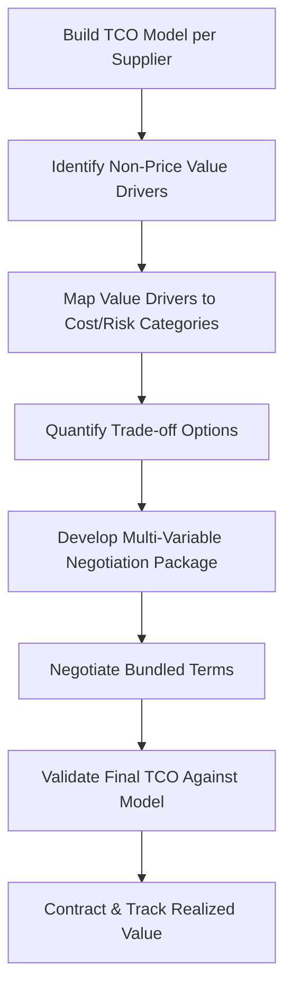

## Total Cost and Value-Based Negotiation

### Overview

Total cost and value-based negotiation shifts the negotiation frame away from unit price as the sole variable and toward the full economic and strategic value exchanged between buyer and supplier. This approach uses Total Cost of Ownership (TCO) modeling and value-driver analysis to identify trade space that pure price negotiation misses — enabling both parties to find efficiencies that reduce total cost or increase total value without necessarily reducing the supplier's margin, which produces more durable agreements than distributive price-only bargaining. In dual-sourcing programs, this approach is particularly important because a second source's *lowest unit price* is frequently not its most competitive dimension — the value case for dual sourcing usually rests on total cost and risk reduction rather than headline price.

### Why Price-Only Negotiation Is Insufficient

**Key Points**

- Unit price typically represents only a portion of the total cost incurred to acquire, use, and dispose of/support a good or service — freight, inventory carrying cost, quality failure cost, and administrative overhead are frequently excluded from price-only comparisons
- Price-only negotiation incentivizes suppliers to cut costs in ways invisible at the unit-price level (lower-grade inputs, reduced QA sampling), which can increase downstream total cost even as unit price falls
- A price-only frame also forecloses trade-offs that could benefit both parties — e.g., a supplier may accept a lower price in exchange for a longer contract term or predictable volume, which reduces their cost of capital and sales overhead in ways a term sheet negotiated on price alone would never surface

### Total Cost of Ownership (TCO) Components

| Category | Examples |
| --- | --- |
| Acquisition cost | Unit price, tooling, NRE (non-recurring engineering), setup/onboarding |
| Logistics cost | Freight, duties/tariffs, packaging, expediting fees |
| Inventory cost | Carrying cost, safety stock required due to lead time variability |
| Quality cost | Incoming inspection, defect/scrap rate, warranty claims, rework |
| Administrative cost | PO processing, supplier management overhead, audit/compliance cost |
| Risk cost | Cost of supply disruption, expedite premiums, dual-source qualification cost amortized |
| End-of-life cost | Disposal, environmental compliance, decommissioning |

#### TCO Formula

$$TCO = P_{unit} \times Q + C_{logistics} + C_{inventory} + C_{quality} + C_{admin} + C_{risk}$$

Where $P_{unit}$ is unit price and $Q$ is annual quantity.

**Example — TCO Comparison, Two Bidders**



```
Component                    Supplier A (lower price)   Supplier B (higher price)
Unit Price × Annual Qty       $450,000                    $468,000
Freight (higher due to distance) $28,000                   $9,000
Inventory carrying (longer lead time) $15,000               $6,000
Quality/rework (higher defect rate)   $22,000               $4,000
Administrative overhead        $6,000                       $6,000
                               ─────────                     ─────────
Total Cost of Ownership        $521,000                     $493,000
```

Despite a $18,000 higher unit-price spend, Supplier B has a $28,000 lower TCO — a result invisible to price-only evaluation, and a common finding when comparing an established local supplier against a lower-priced but more distant or logistically constrained dual-source candidate.

### Value-Based Negotiation Framework



### Identifying Value Drivers Beyond Price

**Key Points**

- **Payment terms**: extended terms improve buyer working capital; suppliers often value price stability or volume commitment more than early payment, creating trade space
- **Inventory/VMI arrangements**: vendor-managed inventory shifts carrying cost and can reduce both parties' total cost simultaneously through better demand visibility
- **Forecast sharing**: sharing longer-horizon demand forecasts can reduce supplier safety stock and setup costs, value that can be partially returned to the buyer as price concessions
- **Packaging and logistics optimization**: consolidated shipments, returnable packaging, or shifting Incoterms responsibility to the lower-cost-capable party reduces total cost without margin pressure
- **Quality cost sharing**: cost-sharing formulas for defect-related costs (chargebacks, cost-of-poor-quality clauses) align incentives better than penalty-only clauses
- **Tooling and NRE amortization structure**: spreading tooling cost over volume commitments versus upfront payment changes cash flow and risk allocation without changing total spend

### Should-Cost Modeling as a Negotiation Anchor

**Key Points**

- A should-cost model independently estimates what a product/service *should* cost based on material, labor, overhead, and reasonable margin — built from bottom-up cost breakdown rather than accepting the supplier's quoted price as the starting reference point
- Should-cost models are used to set realistic target and reservation points (see negotiation planning) grounded in cost structure rather than market price alone, which is particularly valuable when negotiating with a new dual-source candidate who lacks an established price history with the buyer

**Example — Should-Cost Breakdown**



```
Cost Element              Estimated Cost   % of Total
Raw Material               $2.10            42%
Direct Labor                $0.85            17%
Manufacturing Overhead      $0.60            12%
SG&A Allocation              $0.45            9%
Logistics/Packaging          $0.30            6%
Margin (target 14%)          $0.70           14%
                             ────
Should-Cost Target            $5.00
Supplier Quoted Price          $5.60
Gap to Investigate              $0.60           —
```

A $0.60 gap between should-cost and quoted price becomes a specific, defensible negotiation target rather than an arbitrary "ask for 10% off" position.

### Structuring a Value-Based Negotiation Package

**Key Points**

- Rather than negotiating price in isolation, present or negotiate toward a bundled package where multiple variables move together — this is more effective at finding a mutually beneficial outcome than sequential single-issue negotiation
- Trade-offs should be quantified in TCO terms on both sides where possible, so neither party is guessing at the value of a concession

**Example — Bundled Trade-off Package**



```
Buyer Offers                          Supplier Provides
2-year contract (vs. annual)          3% price reduction
Monthly rolling forecast sharing      1-week lead time reduction
50% tooling cost upfront              50% tooling amortized over volume
Consolidated bi-weekly shipments      Freight cost reduction passed through
```

### Application to Dual Sourcing

**Key Points**

- When qualifying and negotiating with a second source, the TCO comparison should explicitly include the **cost of qualification** (testing, audits, PPAP/FAI costs) amortized appropriately, since this is a real cost unique to the dual-sourcing decision that a single-source renewal negotiation would not incur
- The value case for dual sourcing to internal stakeholders is strengthened by quantifying the **risk cost avoided** — e.g., expected cost of a single-source disruption (probability × impact) — and including it explicitly in the TCO comparison rather than treating resilience as a qualitative, unpriced benefit
- Volume allocation between two sources can itself be treated as a value-based negotiation lever: offering a supplier a larger allocation share in exchange for total-cost improvements (not just unit price) preserves competitive tension while optimizing total spend across both suppliers combined

$$\text{Risk-Adjusted TCO} = TCO + (P_{disruption} \times C_{disruption}) - C_{dual\text{-}source\text{ }mitigation}$$

Where $P_{disruption}$ is the estimated probability of a supply disruption and $C_{disruption}$ is its estimated cost impact, offset by the cost reduction in disruption risk attributable to maintaining a qualified second source.

[Inference] Precise quantification of disruption probability and impact typically requires organization-specific historical data or industry benchmarks; where such data is unavailable, risk-adjusted TCO figures should be treated as directional estimates to support decision-making rather than precise financial commitments.

### Common Pitfalls

**Key Points**

- **Building the TCO model after negotiation begins**: value-based negotiation requires the TCO/should-cost model to be built *before* the session, or the buyer loses the analytical grounding that differentiates this approach from ad hoc haggling
- **One-sided value capture**: presenting bundled trade-offs as buyer-only asks (all concessions expected from supplier) undermines the integrative premise and reduces supplier willingness to disclose true cost structure in future negotiations
- **Ignoring implementation cost of the deal structure itself**: e.g., a complex quality cost-sharing formula that is expensive to administer can offset the total cost benefit it was designed to capture
- **Treating TCO models as static**: cost structures shift with commodity prices, freight rates, and currency; models used for multi-year agreements should include review triggers or indexed adjustment mechanisms

**Related Topics**

- Should-Cost Modeling Methodology and Data Sources
- Risk-Adjusted Total Cost of Ownership for Dual-Source Decisions
- Vendor-Managed Inventory (VMI) and Consignment Arrangements
- Cost-Sharing and Chargeback Clause Design in Supplier Contracts
- Negotiation Planning and Tactics
- Volume Allocation Modeling Across Dual Sources