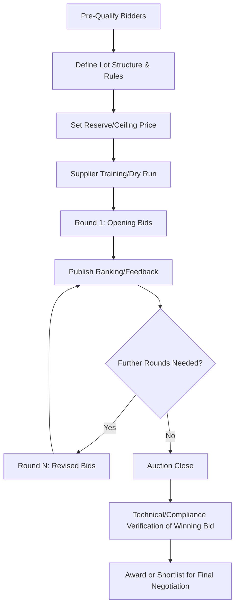

## Multi-Round and Reverse Auction Techniques

### Overview

Multi-round and reverse auction techniques are structured, iterative competitive bidding mechanisms used to drive price and term convergence among qualified suppliers through repeated bidding rounds rather than a single sealed-bid submission. These mechanisms sit at the more distributive/competitive end of the RFx spectrum and are most effective where specifications are well-defined and suppliers are genuinely substitutable — conditions that make them a natural fit for dual-sourcing volume allocation decisions among an already-qualified supplier pool, but a poor fit for complex, differentiated, or strategic sourcing events.

### Reverse Auction Fundamentals

In a reverse auction, the roles of a traditional auction are inverted: multiple **suppliers** compete by submitting progressively lower bids (or improved terms) to win business from a single **buyer**, visible in real time within a defined bidding window.

**Key Points**

- Reverse auctions work best for commoditized, well-specified goods/services where quality and capability differences between qualified bidders are minimal — auction mechanics compress differentiated value propositions into a single price signal, which misrepresents suppliers who compete on non-price value
- Only suppliers who have already passed a qualification/RFI gate should be admitted to the auction, since the auction format itself provides no mechanism to evaluate capability, quality, or risk
- Auctions are typically conducted via dedicated e-sourcing/e-auction platforms that provide real-time bid visibility, automated ranking, and audit trails

### Auction Formats

| Format | Mechanism | Characteristics |
| --- | --- | --- |
| English (ascending-price) reverse auction | Suppliers submit descending bids until no further bids are offered | Most common; high time pressure, transparent ranking |
| Japanese reverse auction | Auctioneer sets a price, suppliers indicate "in/out" at each price step | Slower, gives weaker suppliers earlier visibility of exit points |
| Sealed-bid multi-round | Suppliers submit sealed bids each round, informed only of their own rank/position | Reduces pure price-matching behavior, adds strategic uncertainty |
| Dutch (descending) auction | Auctioneer lowers price from a high starting point until a supplier accepts | Rare in reverse procurement auctions; more common in asset liquidation |

**Key Points**

- English reverse auctions are the dominant format in B2B procurement due to platform availability and supplier familiarity
- Sealed-bid multi-round formats reduce the risk of suppliers "bid-matching" just enough to stay marginally ahead of visible competitors, which can suppress genuine price discovery in fully transparent English auctions

### Multi-Round Auction Process



### Designing the Auction

#### Lot Structuring

**Key Points**

- **Single lot**: all volume awarded to one winner — simplest, but concentrates risk and eliminates dual-sourcing outcomes by design
- **Split-award/multi-lot**: volume divided into lots (e.g., by geography, product line, or percentage split) that can go to different winners — the standard structure for auctions intended to support dual sourcing
- **Volume-tiered bidding**: suppliers bid different prices at different volume tiers, allowing the buyer to optimize allocation based on marginal price/volume trade-offs across multiple winners simultaneously

**Example — Split-Lot Structure for Dual Sourcing**



```
Lot Structure:
Lot A: 60% of annual volume — awarded to lowest qualifying bidder
Lot B: 40% of annual volume — awarded to second-lowest qualifying bidder
Rule: No single supplier may win more than 70% of total volume
```

This structure allows the auction to converge on competitive pricing while mechanically guaranteeing a minimum two-supplier outcome, directly operationalizing a dual-sourcing objective within the auction rules rather than as a post-hoc override.

#### Setting Reserve and Ceiling Prices

**Key Points**

- A **reserve price** (maximum acceptable price) prevents award at an uneconomical level if competitive tension fails to develop
- The reserve should be derived from should-cost modeling or benchmark data (see Total Cost and Value-Based Negotiation), not set arbitrarily, since an unrealistic reserve either fails to bind (too high) or causes the auction to fail entirely (too low, no bids clear it)

#### Bid Decrements and Timing Rules

**Key Points**

- **Minimum bid decrement**: the smallest allowable price reduction between bids, preventing negligible symbolic bids that waste round time
- **Auto-extend rules**: rounds automatically extend by a short window (e.g., 2–5 minutes) if a bid is placed near the closing time, preventing "bid sniping" and ensuring all participants have a fair opportunity to respond
- **Round duration and count**: typically 15–60 minutes per round with 3–6 rounds; excessively long auctions fatigue participants and can suppress aggressive bidding, while overly short auctions don't allow suppliers to consult internally on cost floors

### Bidder Preparation and Rules of Engagement

**Key Points**

- Suppliers should receive a **dry run/training session** on the platform beforehand — unfamiliarity with auction mechanics under time pressure produces noisy results unrelated to true cost competitiveness
- Publish clear rules in advance: what bid information is visible to competitors (own rank only vs. all bids), anti-collusion terms, and explicit reservation of the buyer's right not to award regardless of final price
- Anti-collusion clauses and monitoring are particularly important in reverse auctions, since real-time visibility of competitor behavior creates more opportunity for tacit coordination than sealed-bid RFQs

### Auction Feedback and Ranking Display

| Feedback Level | Description | Effect on Bidding Behavior |
| --- | --- | --- |
| Full transparency | All bids and bidder identities visible | Maximum price pressure; risk of collusion/signaling |
| Rank only | Supplier sees own rank (1st, 2nd, etc.) but not competitor prices | Balances competitive pressure with reduced collusion risk |
| Blind | Supplier sees no ranking, only round close notification | Minimizes gaming; reduces aggressive real-time competitive response |

**Key Points**

- Rank-only feedback is the most common configuration in professional e-sourcing platforms, balancing competitive pressure against collusion risk and information leakage

### Post-Auction Validation

**Key Points**

- The lowest bid at auction close is **not** automatically the award — technical compliance, capacity confirmation, and any gating criteria from the original RFx must be re-verified before award, since aggressive auction bidding can produce bids a supplier cannot sustainably fulfill
- A common practice is to treat auction results as input to a **final negotiation round** rather than an automatic binding award, preserving the buyer's ability to address feasibility concerns before contract execution
- For dual-sourcing programs, post-auction validation should specifically confirm that the second-place/second-lot winner has genuine capacity and quality standing equivalent to a primary source — an auction's price-focused mechanics can otherwise surface a technically weaker "second source" purely on price aggressiveness

### When Reverse Auctions Are Inappropriate

**Key Points**

- Complex, differentiated services or engineered-to-order goods where capability and approach vary meaningfully between suppliers — auction format cannot capture this variance
- Strategic, high-relationship-value suppliers where aggressive price-compression tactics risk damaging long-term collaboration and trust
- Markets with few qualified suppliers, where auction dynamics can be easily gamed or where competitive tension is illusory
- Situations requiring integrative, multi-variable trade-offs (see Total Cost and Value-Based Negotiation) that a single-variable price auction structurally cannot accommodate

### Common Pitfalls

**Key Points**

- **Running an auction before qualification is complete**: admits unqualified bidders who distort price discovery and may be unable to fulfill an aggressive winning bid
- **No reserve price**: risks awarding at an uneconomical price if competitive dynamics produce an artificially low clearing price
- **Single-lot structure when dual sourcing is the objective**: structurally forecloses a multi-supplier outcome; lot design must be set before the auction, not adjusted after results are in
- **Treating auction results as final without feasibility re-verification**: the single greatest cause of post-award supplier failure in auction-sourced contracts

**Related Topics**

- Split-Lot and Volume-Tiered Bid Design for Dual Sourcing
- Should-Cost Modeling for Reserve Price Setting
- E-Sourcing Platform Selection and Configuration
- Anti-Collusion Safeguards in Competitive Bidding
- Post-Award Supplier Feasibility Verification
- Negotiation Planning and Tactics