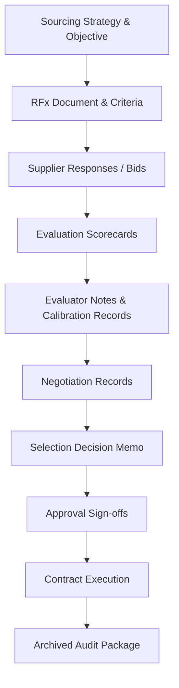

## Documenting Selection Rationale and Audit Trail

### Overview

Documenting selection rationale and maintaining an audit trail is the governance layer that converts an RFx and negotiation process into a defensible, repeatable, and legally sound record of how and why a supplier decision was made. This documentation serves multiple audiences simultaneously — internal audit, legal/compliance, finance, future procurement teams, and, in regulated or public-sector contexts, external oversight bodies or unsuccessful bidders exercising a right to challenge. In dual-sourcing programs specifically, audit trail quality is what allows a volume-split or multi-award decision to withstand scrutiny that a simple single-winner award would not attract to the same degree.

### Why Audit Trail Discipline Matters

**Key Points**

- Without documented rationale, a selection decision cannot be reconstructed months or years later when questioned by auditors, new personnel, or a disputing supplier — institutional memory alone is not a defensible record
- In many jurisdictions and for many public-sector or government-adjacent buyers, procurement decisions are subject to formal challenge/protest processes; an incomplete audit trail is the most common cause of a successful challenge, independent of whether the underlying decision was sound
- A defensible audit trail also protects the *decision-makers* individually — clear documentation of an objective, criteria-based process reduces exposure to allegations of favoritism, conflict of interest, or corruption
- For dual-sourcing decisions, the rationale must explicitly justify **why two suppliers rather than one** (or the specific volume split chosen), since this is a more complex decision to defend than "lowest compliant bid wins"

### Core Documentation Components



#### 1. Sourcing Strategy Documentation

**Key Points**

- Record the business case and objective for the sourcing event *before* the RFx is issued — for dual sourcing specifically, this should state the risk/resilience rationale driving the decision to qualify a second source, independent of the eventual pricing outcome
- Include the risk tiering or category classification that determined the RFx approach used (see Site Visits, Audits, and Certifications; Bid Evaluation Frameworks)

#### 2. RFx and Evaluation Criteria Records

**Key Points**

- Retain the exact RFx document version issued to suppliers, including any addenda or Q&A clarifications distributed during the solicitation period — later disputes often hinge on what suppliers were actually told, not what was intended
- Evaluation criteria and weights must be archived **as published**, timestamped prior to bid receipt, to demonstrate criteria were not adjusted after seeing results (a key defense against challenge)

#### 3. Evaluation Scorecards and Evaluator Records

**Key Points**

- Retain individual evaluator scorecards, not only the consolidated/averaged result — this allows reconstruction of how consensus was reached and supports defense against claims of a single biased evaluator driving the outcome
- Document calibration discussions where evaluator scores diverged significantly (see Bid Evaluation Frameworks and Weighted Scoring), including the reasoning for any score adjustments made during calibration
- Retain sensitivity analysis outputs where performed, showing the decision was tested against alternative weight scenarios and found stable — or, if not stable, the additional reasoning that resolved the ambiguity

**Example — Audit Trail Entry Structure**



```
Record Type:        Evaluation Scorecard
Evaluator:           [Name/Role]
Date:                2026-03-14
Supplier Evaluated:  Supplier B
Criteria Scores:     [attached, per-criterion with justification notes]
Deviation from
Consensus:            Technical score 2 pts below team average
Resolution:           Calibration call 2026-03-15; evaluator cited
                       outdated capability data; revised to 4/5
                       after supplier clarification received
```

#### 4. Negotiation Records

**Key Points**

- Document the negotiation planning position (target, reservation point, BATNA — see Negotiation Planning and Tactics) *before* sessions begin, and the final agreed terms after, to show the negotiated outcome relative to the pre-defined plan
- Retain written confirmation (memorandum of understanding, term sheet, or email confirmation) of all material commitments made verbally during negotiation sessions, since verbal-only commitments are a common source of post-award disputes

#### 5. Selection Decision Memo

The decision memo is the synthesizing document that ties the process together into a single defensible narrative.

**Key Points**

- Should state: the objective, the evaluated alternatives, the criteria and weights applied, the final scores, the negotiation outcome, and the specific rationale for the final decision — including, for dual sourcing, the rationale for the volume split or multi-award structure chosen
- Should explicitly address why any higher-scored or lower-priced alternative was *not* selected, or was selected for a smaller allocation — silence on this point is a common weakness exploited in supplier challenges
- Should reference and attach (or link to) all supporting evidence: scorecards, TCO models, site visit/audit reports, financial risk assessments

**Example — Decision Memo Structure**



```
1. Sourcing Objective and Strategy Rationale
2. Suppliers Evaluated (qualified pool)
3. Evaluation Criteria and Weights (as published)
4. Evaluation Results Summary (weighted scores table)
5. Sensitivity Analysis Summary
6. Negotiation Outcomes vs. Planning Targets
7. Final Decision and Allocation
8. Rationale for Non-Selected/Lower-Allocated Suppliers
9. Approvals and Sign-offs
10. Attachments/References
```

#### 6. Approval Sign-offs

**Key Points**

- Document who approved the decision, at what authority level, and on what date — approval chains should match the organization's delegation of authority (DOA) matrix for the spend value and risk tier involved
- For dual-sourcing decisions above a materiality threshold, cross-functional sign-off (procurement, quality, finance, and often legal) is standard practice, and each function's specific concurrence should be individually captured rather than assumed from a single combined approval

### Retention and Accessibility

**Key Points**

- Audit trail records should be retained for the duration required by applicable procurement regulation, contract term, and organizational policy — often significantly longer than the active contract period, particularly in public-sector or regulated environments
- Records should be stored in a system that preserves version history and timestamps (rather than editable shared documents without change tracking), since the *timing* of when criteria or scores were recorded is often as legally significant as their content
- Accessibility for future audits requires records to be retrievable independent of the individuals who created them — reliance on a single procurement officer's personal files is a common audit finding requiring remediation

### Handling Unsuccessful Bidder Communication

**Key Points**

- Debrief communications to unsuccessful bidders should be consistent with, and traceable to, the documented evaluation rationale — inconsistency between what was told to a losing bidder and what is in the internal record is a significant challenge/dispute risk
- Where feedback is provided to unsuccessful suppliers (common practice to maintain supplier relationship health for future sourcing events, including potential future dual-source qualification), document what specific feedback was given, since this itself becomes part of the audit record

### Common Pitfalls

**Key Points**

- **Reconstructing rationale after the fact**: memos written well after the decision, without contemporaneous scorecards and notes, are far less defensible and can appear (even if unintentionally) as post-hoc justification
- **Retaining only the final consolidated score**: losing the individual evaluator and calibration detail that shows how consensus was actually reached
- **Undocumented verbal negotiation commitments**: creates ambiguity between what was agreed and what was contracted, a frequent source of post-award disputes
- **Inconsistent criteria application across evaluators without a calibration record**: undermines the defensibility of the weighted scoring model even when the final outcome was reasonable
- **No explicit rationale for dual-source allocation splits**: a volume split (e.g., 70/30) without documented reasoning is harder to defend than a single-winner award, since it invites scrutiny on why that specific ratio was chosen over alternatives

**Related Topics**

- Delegation of Authority (DOA) Matrices in Procurement Governance
- Supplier Challenge and Protest Response Procedures
- Records Retention Policy for Procurement Documentation
- Bid Evaluation Frameworks and Weighted Scoring
- Negotiation Planning and Tactics
- Conflict of Interest Management in Supplier Selection