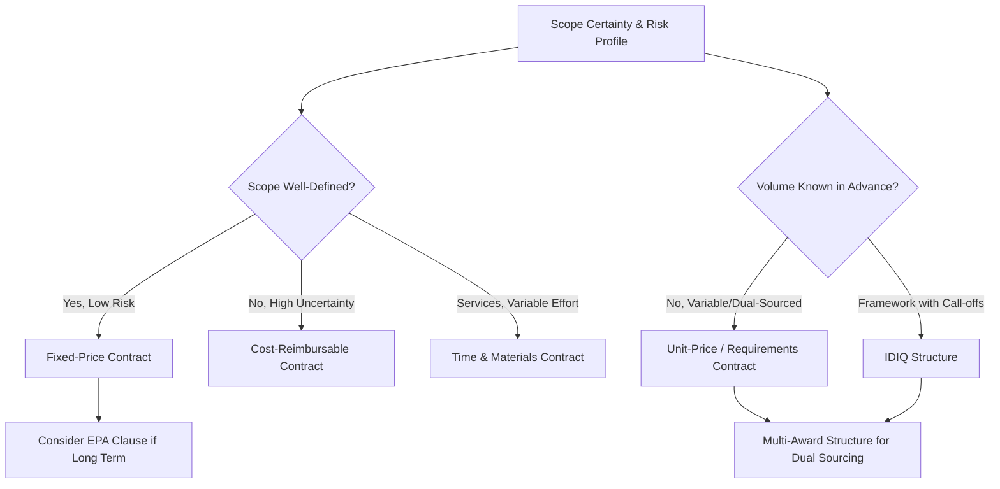

## Contract Types and Structures


### Overview

Contract types and structures define the legal and commercial framework that governs the ongoing supplier relationship following selection and negotiation. The choice of contract type determines how risk, cost, and performance incentives are allocated between buyer and supplier, and directly shapes behavior throughout the contract term. In dual-sourcing programs, contract structure decisions are further complicated by the need to coordinate terms across two (or more) concurrent agreements — often requiring consistency in certain clauses (IP, quality standards) while allowing differentiation in others (volume commitments, pricing mechanisms) to reflect each supplier's role in the sourcing strategy.

### Primary Contract Type Categories

| Contract Type | Payment Basis | Risk Allocation |
| --- | --- | --- |
| Fixed-price | Set price regardless of supplier's actual cost | Supplier bears cost overrun risk |
| Cost-reimbursable | Actual allowable costs plus fee/margin | Buyer bears cost overrun risk |
| Time and materials (T&M) | Hourly/unit rate × actual hours/materials used | Shared; buyer bears scope/duration risk |
| Unit-price / requirements | Fixed price per unit, quantity not guaranteed | Buyer bears volume risk, supplier bears cost risk |
| Indefinite Delivery/Indefinite Quantity (IDIQ) | Framework with call-off orders against min/max quantities | Shared, bounded by min/max commitments |

### Fixed-Price Contracts

**Key Points**

- **Firm fixed-price (FFP)**: single set price for defined scope; maximum supplier cost-risk exposure, strongest supplier incentive for cost control and efficiency
- **Fixed-price with economic price adjustment (FP-EPA)**: base fixed price with a defined adjustment mechanism (indexed to a commodity price, currency, or published index) to handle long-term contracts where input cost volatility would otherwise make a pure fixed price unsustainable for the supplier
- **Fixed-price incentive (FPI)**: fixed target price with a share ratio for cost overruns/underruns up to a ceiling, blending fixed-price discipline with cost-sharing incentive alignment

**Example — FP-EPA Adjustment Clause Logic**



```
Base Price:        $10.00/unit (set at contract signing)
Index Reference:   LME Aluminum Price Index
Adjustment Trigger: Quarterly review if index moves >5% from baseline
Adjustment Formula: New Price = Base Price × (1 + 0.4 × %Index Change)
                     (0.4 = material cost share of total unit price)
```

**Key Points**

- Fixed-price contracts are best suited to well-specified, low-technical-risk goods where cost estimation is reliable — the dominant structure for RFQ-based commodity and standard-part sourcing
- Applying a pure fixed-price structure to a poorly specified or high-uncertainty scope shifts excessive risk onto the supplier, which typically results in inflated pricing to cover contingency, or supplier failure/dispute if costs exceed the price

### Cost-Reimbursable Contracts

**Key Points**

- **Cost-plus-fixed-fee (CPFF)**: allowable costs reimbursed plus a fixed dollar fee, independent of final cost — fee does not increase with cost overruns, limiting (but not eliminating) incentive misalignment
- **Cost-plus-incentive-fee (CPIF)**: fee varies based on performance against target cost/schedule/quality metrics, aligning supplier incentive more closely with buyer objectives than CPFF
- **Cost-plus-percentage-of-cost (CPPC)**: fee calculated as a percentage of actual cost — creates a perverse incentive for the supplier to increase costs, and is prohibited outright in many public-sector procurement regulations
- Cost-reimbursable structures are appropriate for high-uncertainty scope (R&D, new product development, emergency response) where accurate fixed pricing is not feasible at contract signing, but require significantly more buyer oversight (cost audit rights, allowable cost definitions) to control spend

### Time and Materials (T&M) Contracts

**Key Points**

- Used predominantly for services where scope cannot be fully defined upfront (engineering support, maintenance, consulting)
- Should include a **not-to-exceed (NTE)** ceiling to cap buyer exposure, since T&M structures otherwise provide limited supplier incentive to control duration or resource utilization
- Labor category rate cards should be negotiated and fixed at contract execution to prevent rate escalation disputes during the performance period

### Unit-Price / Requirements Contracts

**Key Points**

- Buyer commits to purchase requirements from the supplier at a fixed unit price, but total volume is not guaranteed — common in dual-sourcing arrangements where volume is deliberately variable/split between two suppliers based on ongoing performance or allocation decisions
- Should specify whether the arrangement is **exclusive requirements** (all buyer demand for the category) or **non-exclusive**, since a dual-sourcing strategy by definition requires non-exclusive requirements language across both supplier agreements to remain legally coherent

### Indefinite Delivery/Indefinite Quantity (IDIQ) Structures

**Key Points**

- Establishes a framework agreement (terms, pricing mechanism, quality standards) with actual orders placed via individual call-offs/purchase orders against a stated minimum and maximum quantity range
- Well suited to dual-sourcing programs: an IDIQ framework can be executed with multiple qualified suppliers simultaneously (a "multi-award IDIQ"), with individual call-offs allocated between them based on performance, price, or capacity at time of order — this is one of the most common contract structures specifically used to operationalize ongoing dual/multi-sourcing allocation

**Example — Multi-Award IDIQ Structure**



```
Framework Agreement: 3-year IDIQ, $5M-$20M aggregate ceiling
Awarded Suppliers:   Supplier A (primary, target 65% of call-offs)
                      Supplier B (secondary, target 35% of call-offs)
Call-off Mechanism:  Each PO >$50K issued via mini-competition between
                      A and B based on then-current price and lead time
Minimum Guarantee:   Each supplier guaranteed minimum $500K over term
```

### Contract Structure Diagram



### Core Structural Elements Common Across Contract Types

**Key Points**

- **Term and renewal**: fixed term, auto-renewal, or evergreen with termination notice; dual-sourced agreements often align term lengths across suppliers to enable synchronized re-competition
- **Pricing mechanism**: fixed, indexed, tiered by volume, or benchmarked against market rate reviews
- **Volume commitments**: guaranteed minimums, "up to" ceilings, or pure requirements-based with no guarantee
- **Performance standards and SLAs**: quality, delivery, and service-level metrics tied to remedies (credits, termination rights)
- **Termination provisions**: for cause, for convenience, and their respective notice periods and wind-down obligations
- **IP and data rights**: ownership and licensing of any IP developed or data exchanged during the relationship
- **Liability and indemnification**: caps, exclusions, and insurance requirements
- **Governing law and dispute resolution**: jurisdiction, arbitration vs. litigation, escalation procedures

### Structuring Contracts for Dual Sourcing Specifically

**Key Points**

- **Consistency vs. differentiation**: certain clauses (quality standards, IP terms, confidentiality, compliance/ESG requirements) should typically be held consistent across both supplier contracts to simplify governance and comparison; commercial terms (price, volume commitment, incentive structures) are expected to differ and reflect each supplier's competitive position
- **Volume flexibility clauses**: dual-source contracts should explicitly address the buyer's right to shift volume allocation between suppliers based on performance, without that shift constituting a breach of either agreement — this is a critical clause often overlooked when contracts are drafted from a single-source template
- **Most-favored-customer/parity clauses**: some dual-sourcing programs include clauses ensuring neither supplier receives materially worse pricing than the other for equivalent volume tiers, though this can reduce a supplier's incentive to compete aggressively and should be used deliberately rather than by default
- **Coordinated termination timing**: avoid structuring both supplier contracts to expire or require renewal simultaneously, since this recreates single-source-like disruption risk at the point of re-competition — staggering terms preserves continuity

### Common Pitfalls

**Key Points**

- **Defaulting to a single contract template across dissimilar sourcing scenarios**: applying a fixed-price commodity template to a high-uncertainty engineered scope (or vice versa) misallocates risk and produces either supplier margin padding or buyer cost exposure
- **Omitting an NTE ceiling on T&M contracts**: removes the primary buyer cost control mechanism in a structure that already has weak supplier cost-discipline incentives
- **Drafting dual-source contracts independently without cross-referencing consistency requirements**: produces inconsistent quality or compliance obligations between the two suppliers, undermining the interchangeability that dual sourcing is meant to provide
- **No volume-shift flexibility language**: locks the buyer into rigid allocation ratios that cannot respond to performance differences, defeating a core purpose of maintaining two qualified sources

**Related Topics**

- Service Level Agreements (SLAs) and Performance Remedies
- Termination for Cause vs. Convenience Clause Drafting
- Multi-Award IDIQ Governance and Call-off Mini-Competitions
- Intellectual Property and Data Rights in Supplier Contracts
- Economic Price Adjustment (EPA) Clause Design
- Total Cost and Value-Based Negotiation