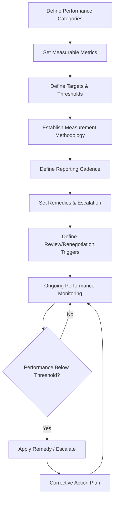
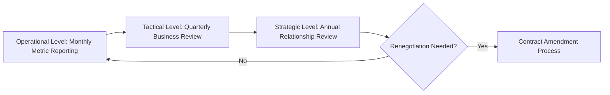

## Service Level Agreements and Key Terms

### Overview

Service Level Agreements (SLAs) translate contractual performance expectations into specific, measurable metrics with defined targets, monitoring mechanisms, and consequences for non-performance. Where the contract type and structure establish the commercial and legal framework (see Contract Types and Structures), the SLA operationalizes ongoing performance management — it is the mechanism by which "the supplier will deliver reliably" becomes a measurable, enforceable, and auditable commitment. In dual-sourcing programs, SLAs additionally serve as the primary comparative instrument for evaluating relative supplier performance over time, directly informing volume allocation adjustments between sources.

### Core SLA Components



### Common SLA Performance Categories

| Category | Typical Metrics |
| --- | --- |
| Delivery | On-time delivery (OTD) %, lead time adherence, fill rate |
| Quality | Defect rate (PPM), first-pass yield, rejection/return rate |
| Responsiveness | Response time to inquiries, quote turnaround, issue resolution time |
| Availability/Capacity | Order fulfillment %, capacity commitment adherence |
| Documentation/Compliance | Certificate of conformance accuracy, regulatory documentation timeliness |
| Communication | Forecast accuracy provided by supplier, proactive disruption notification lead time |

### Defining Measurable Metrics

**Key Points**

- Every SLA metric must have an unambiguous measurement methodology — what counts as "on time," how defects are counted, what the denominator is — defined in the contract itself, not left to interpretation during a dispute
- Metrics should be **outcome-based** where possible (on-time delivery rate) rather than **activity-based** (supplier confirms they shipped on time), since activity-based metrics can be satisfied without the underlying outcome being achieved
- Avoid vague qualitative language ("respond promptly," "maintain high quality") without a quantified standard — these are effectively unenforceable

**Example — Metric Definition Specification**



```
Metric:              On-Time Delivery (OTD)
Definition:          % of purchase order line items received within
                      the agreed delivery window (±2 days of PO date)
Measurement Window:   Rolling 3-month average, calculated monthly
Data Source:          Buyer's receiving system timestamp vs. PO due date
Exclusions:           Buyer-caused delays (late PO release, changed
                      delivery instructions) explicitly excluded
Target:               ≥ 95%
Minimum Threshold:    90% (below triggers remedy per Section 8.2)
```

### Target Setting and Threshold Tiers

**Key Points**

- SLAs commonly use a tiered structure: a **target** (aspirational/expected performance), a **minimum acceptable threshold** (below which remedies apply), and sometimes a **critical threshold** (below which termination rights or escalated remedies apply)
- Targets should be benchmarked against realistic historical or industry performance data, not set arbitrarily — an unachievable target undermines the SLA's credibility and can create constant low-level dispute rather than genuine performance improvement
- For dual-sourcing arrangements, identical metric definitions and measurement methodology should be applied across both suppliers even if numeric targets differ, to preserve apples-to-apples comparability for allocation decisions

**Example — Tiered Threshold Structure**



```
Metric: Defect Rate (PPM)
Target:            ≤ 500 PPM    (no action)
Minimum Threshold: 501–1,500 PPM (corrective action plan required)
Critical Threshold: > 1,500 PPM  (escalation to executive review;
                                   repeat breach triggers termination
                                   review under Section 12)
```

### Remedies and Consequences

| Remedy Type | Mechanism | Use Case |
| --- | --- | --- |
| Service credits | Financial credit against future invoices, scaled to breach severity | Most common for measurable, recurring metrics |
| Corrective action plan (CAP) requirement | Formal root-cause and remediation plan with deadlines | Systemic or repeated breaches |
| Volume/allocation reduction | Reduce share of business awarded (especially relevant in dual sourcing) | Sustained underperformance relative to alternate source |
| Right to audit | Triggered inspection or audit rights upon breach | Quality or compliance-related breaches |
| Termination rights | Right to exit contract, typically after cure period | Critical threshold or repeated CAP failure |

**Key Points**

- Service credits should be meaningful enough to influence supplier behavior but proportionate to actual business impact — token credits are frequently absorbed as a cost of doing business rather than driving genuine improvement
- **Volume/allocation reduction as a remedy is a distinctly dual-sourcing-relevant mechanism**: rather than only financial penalty, underperformance against SLA can trigger a contractually pre-agreed shift of order volume toward the better-performing second source, directly linking SLA performance to the resilience benefit dual sourcing is meant to provide
- Remedies should generally include a cure period before escalation to more severe consequences, except for critical/safety-related breaches where immediate escalation may be warranted

### Reporting and Monitoring Cadence

**Key Points**

- Define reporting frequency (weekly, monthly, quarterly) matched to the metric's volatility and business criticality — high-volume delivery metrics often warrant monthly reporting, while capacity/business continuity metrics may only need quarterly review
- Specify who produces the report (buyer, supplier, or jointly reconciled), and the process for resolving data discrepancies between buyer and supplier records
- Include a periodic (typically quarterly or semi-annual) **business review** cadence distinct from routine metric reporting — a structured forum to discuss trends, root causes, and forward-looking risk, not just backward-looking scorecards

**Example — SLA Scorecard Summary**



```
Metric              Target    Actual (Q3)   Status
On-Time Delivery     95%       93.2%         Below Target
Defect Rate (PPM)    500       410           Meets Target
Response Time (hrs)  24        18            Meets Target
Forecast Accuracy    85%       79%           Below Threshold — CAP Required
```

### Key Contractual Terms Beyond Core SLA Metrics

**Key Points**

- **Force majeure**: defines events excusing non-performance (natural disaster, war, pandemic); should specify notice obligations and mitigation requirements, not merely list qualifying events, and dual-sourcing programs should ensure force majeure definitions are consistent enough across suppliers that a shared disruption event (e.g., regional event affecting both) is handled predictably
- **Business continuity/disaster recovery obligations**: contractual requirement for the supplier to maintain and periodically demonstrate a BCP — increasingly common as a standing SLA-adjacent term rather than a one-time qualification check (see Site Visits, Audits, and Certifications)
- **Change of control clauses**: buyer notification/consent rights if the supplier is acquired or undergoes significant ownership change, relevant risk monitoring for dual-source continuity
- **Audit rights**: buyer's right to inspect records, facilities, or subcontractor compliance, with defined notice periods and frequency limits
- **Confidentiality and data protection**: especially relevant where forecast sharing or system integration (EDI, VMI) is part of the relationship
- **Assignment and subcontracting restrictions**: whether the supplier may subcontract performance, and buyer consent requirements — critical for maintaining the buyer's confidence that dual-source qualification criteria (site, equipment, certifications) actually apply to who is performing the work

### SLA Governance Structure



### Application to Dual Sourcing

**Key Points**

- SLAs across dual-sourced suppliers should be designed to generate **comparable performance data** as their primary output, not just individual compliance — the value of dual sourcing is partly realized through the ongoing competitive benchmarking that comparable SLA data enables
- Pre-agreed, formulaic linkage between SLA performance and volume allocation (rather than ad hoc, subjective reallocation decisions) reduces relationship friction and gives both suppliers clear, objective incentive alignment
- SLA design should avoid metrics that inadvertently disadvantage a newer second source (e.g., historical trend-based targets that an established incumbent meets by default) — new dual-source suppliers may warrant a ramp-up period with adjusted thresholds before full SLA enforcement begins

### Common Pitfalls

**Key Points**

- **Vague or unmeasurable metric definitions**: the single most common cause of SLA disputes; every metric needs an explicit formula, data source, and exclusion criteria
- **Remedies disconnected from actual business impact**: penalties too small to matter, or too large to be enforced in practice, both undermine SLA credibility
- **No cure period or escalation path**: jumping directly to severe remedies for isolated breaches damages the relationship without improving root-cause performance
- **Identical SLA targets applied uniformly regardless of supplier maturity**: particularly problematic in dual sourcing, where a newly qualified second source may need a ramp-up period distinct from an established incumbent's targets
- **SLA metrics not reviewed/updated over multi-year contract terms**: business needs and realistic benchmarks shift; static SLAs become either irrelevantly lenient or unrealistically strict over time

**Related Topics**

- Corrective Action Plans and Root Cause Analysis Requirements
- Volume Allocation Mechanisms Linked to Performance
- Quarterly Business Review (QBR) Structure and Governance
- Force Majeure and Business Continuity Contract Clauses
- Contract Types and Structures
- Supplier Performance Scorecards and Trend Analysis