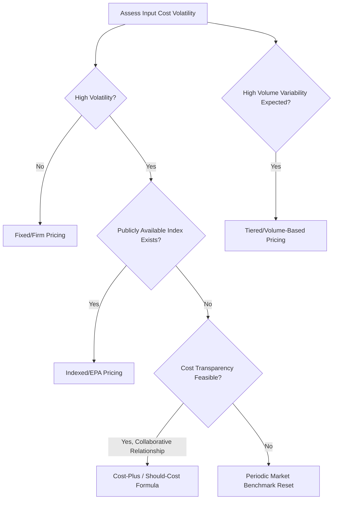

## Pricing Mechanisms and Price Adjustment Clauses

### Overview

Pricing mechanisms and price adjustment clauses define how contract pricing is calculated, structured, and updated over the life of an agreement. While contract type (see Contract Types and Structures) establishes the broad risk allocation framework, pricing mechanisms determine the specific formulas, indices, and triggers that govern what a buyer actually pays over time. In dual-sourcing programs, pricing mechanism design carries additional weight because it must remain comparable across two concurrent supplier agreements to support ongoing allocation decisions, while still accommodating legitimate differences in each supplier's cost structure.

### Core Pricing Mechanism Types

| Mechanism | Structure | Best Fit |
| --- | --- | --- |
| Fixed/firm pricing | Single price held constant for the contract term | Stable input costs, short-to-medium term |
| Indexed pricing | Price tied to a published index (commodity, FX, labor) | Long-term contracts with volatile input costs |
| Tiered/volume-based pricing | Price decreases at defined volume breakpoints | High-volume commodity purchases |
| Cost-plus pricing | Price derived from actual/allowable cost plus a margin | High-uncertainty or cost-reimbursable structures |
| Formula/should-cost pricing | Price calculated from a transparent cost-driver formula | Strategic, collaborative supplier relationships |
| Market-based/benchmark pricing | Price periodically reset to prevailing market rate | Categories with liquid, observable market pricing |

### Fixed and Firm Pricing

**Key Points**

- Provides maximum budget certainty for the buyer and maximum cost-control incentive for the supplier, but only functions well when input cost volatility over the contract term is low relative to margin
- Applying pure fixed pricing to a long-term contract in a volatile input-cost category (metals, energy-intensive processes, semiconductors) typically results in either inflated initial pricing (supplier prices in a risk premium) or supplier financial distress/renegotiation pressure if costs rise significantly

### Indexed (Economic Price Adjustment) Pricing

**Key Points**

- Ties price movement to a defined, publicly verifiable index rather than negotiated case-by-case, reducing dispute frequency and providing transparency to both parties
- Should specify: the exact index and source, the base period, the adjustment frequency, the portion of price subject to adjustment (rarely 100%, since labor/overhead/margin components are typically excluded), and any caps/collars limiting adjustment magnitude

**Example — Indexed Pricing Formula**

$$P_{new} = P_{base} \times \left[ (1 - w) + w \times \frac{I_{current}}{I_{base}} \right]$$

Where $P_{base}$ is the original contract price, $w$ is the weighted share of price attributable to the indexed input, and $I_{current}/I_{base}$ is the ratio of current to base-period index values.



```
Component               Value
Base Price               $10.00/unit
Material Weight (w)      0.45 (45% of price is aluminum content)
Base Index (LME, Jan)    $2,200/tonne
Current Index (LME, Jul) $2,530/tonne
Adjusted Price:           $10.00 × [(1-0.45) + 0.45 × (2530/2200)]
                          = $10.00 × [0.55 + 0.518]
                          = $10.68/unit
```

**Key Points**

- **Caps and collars** limit adjustment magnitude in either direction (e.g., no single adjustment exceeding ±8%), protecting both parties from extreme index volatility while still allowing the mechanism to track genuine cost trends
- Adjustment frequency should balance responsiveness against administrative burden — quarterly is common for moderately volatile inputs; monthly for highly volatile commodities; annual for stable categories with only inflationary drift

### Tiered/Volume-Based Pricing

**Key Points**

- Price breakpoints tied to committed or achieved volume tiers reward scale efficiency and can be structured as either **retroactive** (all units re-priced once a tier is reached) or **incremental** (only units above a threshold get the lower tier price)
- In dual-sourcing arrangements, volume-tiered pricing requires careful design: if allocation is split between two suppliers, neither may individually reach volume tiers that a single-source arrangement would achieve, potentially offsetting some of the unit-price benefit of consolidation — this trade-off should be explicitly quantified in the TCO comparison (see Total Cost and Value-Based Negotiation) supporting the dual-sourcing decision

**Example — Volume Tier Structure**



```
Annual Volume Tier        Unit Price
0 – 50,000 units            $5.20
50,001 – 150,000 units      $4.95
150,001+ units               $4.70
```

### Cost-Plus and Formula/Should-Cost Pricing

**Key Points**

- Cost-plus pricing ties price directly to demonstrated actual cost plus an agreed margin percentage or fixed fee — requires cost transparency (open-book arrangements) and audit rights to be credible and to avoid the perverse incentive structures associated with cost-plus-percentage-of-cost models
- Formula/should-cost pricing extends this into a fully transparent, jointly agreed cost-driver model (material, labor, overhead, margin) recalculated on a defined schedule — more collaborative and administratively intensive than indexed pricing, but produces the most defensible and dispute-resistant pricing for complex, engineered, or strategic categories
- Open-book cost transparency arrangements are increasingly used in strategic dual-sourcing relationships specifically because they allow the buyer to validate that pricing differences between two sources reflect genuine cost structure differences rather than opportunistic margin-setting

### Market-Based/Benchmark Pricing

**Key Points**

- Price is periodically reset (e.g., annually) to reflect then-current market rates, determined via reference to published indices, competitive benchmarking exercises, or re-solicitation of comparative quotes
- Requires a clearly defined benchmarking methodology and dispute-resolution mechanism in case the buyer and supplier disagree on what constitutes current market rate — vague "market rate" language without a defined process is a common source of contract dispute

### Pricing Mechanism Selection Framework



### Price Adjustment Triggers and Process

**Key Points**

- Distinguish **scheduled adjustments** (calendar-based, e.g., quarterly index review) from **triggered adjustments** (event-based, e.g., a raw material spike exceeding a defined threshold outside the normal review cycle)
- Define the exact notice and documentation requirements a supplier must provide to invoke a triggered adjustment (e.g., evidence of actual cost increase, not just index movement) to prevent speculative or opportunistic adjustment requests
- Specify whether adjustments require mutual agreement or apply automatically once the formula/index condition is met — automatic application reduces administrative friction and dispute risk but requires confidence in the formula's accuracy at contract drafting

**Example — Adjustment Governance Clause Summary**



```
Adjustment Type:     Scheduled (Quarterly) + Triggered (Emergency)
Scheduled Process:    Automatic application per indexed formula;
                       15-day notice to buyer before invoice impact
Triggered Threshold:   Single-event input cost increase >15% within
                        30 days
Triggered Process:     Supplier submits documented cost evidence;
                        buyer has 10 business days to review/dispute;
                        unresolved disputes escalate to Section 14
                        (Dispute Resolution)
```

### Application to Dual Sourcing

**Key Points**

- Pricing mechanism **type** (fixed, indexed, tiered) should generally be held consistent across dual-sourced suppliers to preserve comparability, even though the specific numeric parameters (base price, margin, tier breakpoints) will differ based on each supplier's cost structure and competitive position
- Indexed pricing referencing the same index and adjustment methodology across both suppliers allows genuine like-for-like price tracking over time, directly supporting ongoing volume-allocation decisions grounded in current comparative pricing rather than stale contract-signing prices
- Where volume-tiered pricing is used, buyers should model the **combined effective price** across both suppliers at the actual split allocation, not just each supplier's individual tier pricing in isolation, since the dual-sourcing volume split itself determines which tier each supplier actually achieves

$$P_{effective} = \frac{(P_A \times Q_A) + (P_B \times Q_B)}{Q_A + Q_B}$$

Where $P_A, P_B$ are each supplier's tier-applicable unit prices and $Q_A, Q_B$ are their respective allocated volumes.

### Common Pitfalls

**Key Points**

- **Vague "market rate" or "reasonable adjustment" language without a defined mechanism**: the most common source of pricing disputes; every adjustment clause needs an explicit, verifiable formula or process
- **No caps/collars on indexed adjustments**: exposes either party to extreme, uncapped swings from short-term index volatility unrelated to genuine underlying cost trends
- **Applying inconsistent pricing mechanisms across dual-sourced suppliers**: makes ongoing comparative allocation decisions difficult, since price movements become driven by mechanism differences rather than genuine market or cost differences
- **Ignoring the interaction between volume-tiered pricing and allocation splits**: evaluating each dual-sourced supplier's pricing in isolation without modeling the combined effective price at actual allocated volumes
- **Cost-plus-percentage-of-cost structures**: create a direct incentive for the supplier to increase costs; prohibited in many regulatory contexts and best avoided even where not explicitly prohibited

**Related Topics**

- Total Cost and Value-Based Negotiation
- Open-Book Costing and Cost Transparency Arrangements
- Volume Allocation Mechanisms Linked to Performance
- Contract Types and Structures
- Dispute Resolution Clause Design
- Commodity Risk Management and Hedging in Procurement