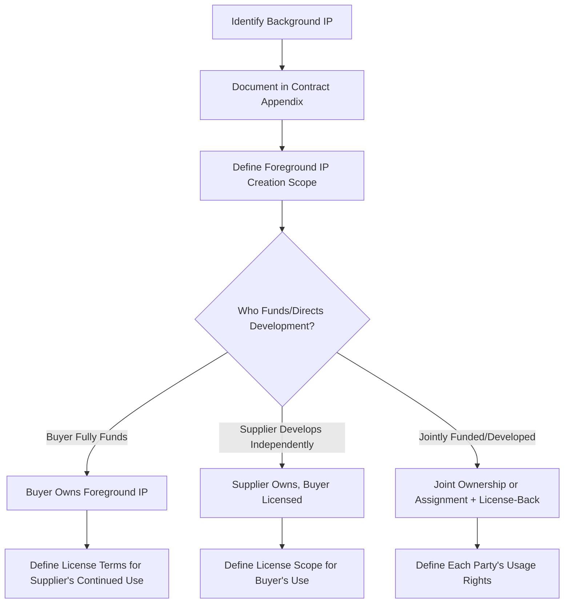

## Intellectual Property and Confidentiality Clauses

### Overview

Intellectual property (IP) and confidentiality clauses govern the ownership, licensing, and protection of proprietary information, inventions, and materials exchanged or created during a supplier relationship. These clauses are frequently underweighted relative to pricing and delivery terms during negotiation, yet disputes over IP ownership or confidentiality breaches are among the most costly and difficult to remediate after the fact — unlike a pricing dispute, an IP ownership error can permanently compromise a buyer's freedom to operate or a supplier's willingness to invest in joint development. In dual-sourcing programs, IP and confidentiality clauses carry additional complexity because the buyer must often transfer specifications, drawings, or process knowledge to a second supplier that may have originated from or been co-developed with the first.

### Core IP Categories in Supplier Contracts

| IP Category | Description | Ownership Consideration |
| --- | --- | --- |
| Background IP | Pre-existing IP each party brings into the relationship | Retained by originating party; licensed only as needed |
| Foreground IP | New IP created during contract performance | Ownership must be explicitly assigned — default rules vary by jurisdiction |
| Buyer-furnished IP | Specifications, drawings, tooling designs the buyer provides to the supplier | Buyer retains ownership; supplier granted limited use license |
| Joint IP | IP co-developed by both parties | Requires explicit joint ownership terms or assignment to one party with license-back |
| Derivative works | Improvements or modifications to existing IP made during performance | Ownership of derivatives should be addressed explicitly, not assumed |

**Key Points**

- Default IP ownership rules vary significantly by jurisdiction (e.g., who owns IP created by a contractor absent explicit contract language differs between common law and civil law systems), so IP ownership must be explicitly stated in the contract rather than relying on background legal defaults, particularly in cross-border dual-sourcing relationships
- Background IP should be explicitly identified (often via an appendix/schedule) at contract signing to create a clear baseline distinguishing what each party already owned from what is created or modified during the relationship

### Structuring IP Ownership Clauses



**Key Points**

- A common default structure: the buyer owns foreground IP for anything it specifically funds or directs (drawings, custom tooling designs, product specifications), while the supplier retains ownership of its own process improvements, manufacturing know-how, and general methods not specific to the buyer's product
- Even where the buyer owns the resulting IP, the supplier typically needs a **license-back** to use certain elements (e.g., general process improvements incorporated into a custom tool) for its broader business, unless full exclusivity is specifically negotiated and priced
- For dual-sourcing programs, the buyer should generally aim to **own or hold a fully transferable license** to specifications, drawings, and tooling designs specifically so this IP can be shared with a second qualified source — a supplier-owned specification creates a structural single-source lock-in that undermines the entire dual-sourcing strategy

### License Grant Structuring

**Key Points**

- License grants should specify: scope (what is licensed), exclusivity (exclusive, non-exclusive, or sole), territory, duration, and permitted use (manufacturing only, or including sublicensing/further development)
- **Non-exclusive licensing of buyer-furnished specifications to multiple suppliers is the core IP mechanism that makes dual sourcing legally viable** — without an explicit non-exclusive grant, providing the same drawing package to two suppliers may itself create IP disputes if the license terms were drafted assuming single-supplier use

**Example — License Grant Clause Structure**



```
Grant:          Buyer grants Supplier a non-exclusive, non-transferable,
                 royalty-free license to use Buyer-Furnished IP solely
                 for the manufacture of Products under this Agreement
Restriction:     Supplier shall not use Buyer-Furnished IP for any
                 purpose outside this Agreement, including manufacture
                 for any third party, without Buyer's prior written
                 consent
Term:            License terminates upon expiration or termination of
                 this Agreement, subject to wind-down provisions in
                 Section 11
Tooling:         Buyer-funded tooling remains Buyer property; Supplier
                 granted possession and use rights only for the
                 duration of this Agreement
```

### Buyer-Furnished Property and Tooling IP

**Key Points**

- Where the buyer funds tooling, molds, or fixtures, the contract should explicitly state buyer ownership, require identification/marking of the property as buyer-owned, and address return or disposal obligations upon contract termination
- This is especially critical for dual sourcing: buyer-owned tooling and specifications can be transferred to a second, qualified source relatively cleanly upon termination or performance failure of the first, whereas supplier-owned tooling embedding proprietary process knowledge creates significant switching friction that undermines the resilience benefit dual sourcing is meant to provide

### Confidentiality Clause Structure

**Key Points**

- Define **Confidential Information** broadly enough to cover the relevant exchange (specifications, pricing, forecasts, process data) but with clear carve-outs for information independently developed, publicly available, or already known prior to disclosure
- Specify obligations: standard of care for protection, permitted disclosures (e.g., to employees/subcontractors on a need-to-know basis with equivalent confidentiality obligations), and prohibition on reverse engineering where relevant
- Include survival terms — confidentiality obligations should typically survive contract termination for a defined period (commonly 3–7 years, or indefinitely for trade secrets), since the value of protecting sensitive information does not end when the commercial relationship does

**Example — Confidentiality Clause Elements**



```
Definition:        Confidential Information includes technical
                    specifications, pricing, forecasts, and business
                    plans disclosed in tangible or oral form and
                    marked/identified as confidential (or reasonably
                    understood as such given context)
Exclusions:         Publicly available information, independently
                    developed information, and information already
                    known prior to disclosure (with contemporaneous
                    documentation)
Permitted Use:      Solely for purposes of performing obligations
                    under this Agreement
Survival:           5 years post-termination (indefinite for trade
                    secrets as defined by applicable law)
Remedies:           Injunctive relief available in addition to
                    monetary damages, given the difficulty of
                    quantifying harm from disclosure
```

### Dual-Sourcing-Specific IP and Confidentiality Considerations

**Key Points**

- **Cross-supplier confidentiality walls**: where the buyer shares proprietary specifications with two competing suppliers, each supplier's contract should prohibit disclosure not only to third parties generally but specifically to competitors, and the buyer should have internal protocols preventing inadvertent cross-contamination of one supplier's process improvements or pricing into discussions with the other
- **IP transfer mechanics for second-source qualification**: the contract should specify how buyer-owned specifications and drawings are formally transferred/licensed to a newly qualified second source, including any technical assistance obligations (or restrictions) on the first supplier
- **Incumbent's process know-how vs. buyer specifications**: careful distinction is needed between the buyer-owned specification (transferable to a second source) and the incumbent supplier's own proprietary manufacturing process/know-how used to produce against that specification (generally not transferable) — conflating the two can create unrealistic expectations about how "easily" a second source can be qualified to produce an equivalent part
- **Non-compete and non-solicitation provisions**: some incumbent suppliers seek contractual restrictions on the buyer qualifying a competing second source, or on a second source hiring incumbent personnel; buyers pursuing a dual-sourcing strategy should scrutinize and generally resist broad restrictions that would foreclose or complicate future second-sourcing options

### Data Protection and Cybersecurity-Adjacent Clauses

**Key Points**

- Where confidential information includes personal data (e.g., customer data shared for a logistics or fulfillment supplier), confidentiality clauses should reference and incorporate applicable data protection law requirements (varying by jurisdiction) rather than relying on general confidentiality language alone
- Increasingly, contracts include specific cybersecurity requirements (encryption standards, breach notification timelines, security certification requirements such as ISO 27001) alongside traditional confidentiality obligations, particularly where digital specification files, CAD data, or system integrations are involved

### Common Pitfalls

**Key Points**

- **Silent IP ownership clauses**: relying on jurisdictional default rules rather than explicit assignment language, creating ambiguity that surfaces only when a dispute or second-sourcing need arises
- **Exclusive licenses granted where non-exclusivity is needed**: an exclusive license to a single supplier for specifications the buyer may need to share with a second source structurally blocks future dual sourcing unless renegotiated
- **No explicit buyer ownership of funded tooling/specifications**: leaves buyer-funded IP entangled with supplier-owned process knowledge, complicating both termination and second-source transfer
- **Confidentiality obligations without survival terms**: obligations that lapse at contract termination leave sensitive information (pricing history, specifications) unprotected exactly when a relationship is ending, often the highest-risk period for information misuse
- **Overly broad non-compete/restrictive covenants accepted from an incumbent supplier**: can foreclose or significantly complicate a buyer's future ability to execute a dual-sourcing strategy in that category

**Related Topics**

- Data Protection and Cybersecurity Requirements in Supplier Contracts
- Tooling Ownership and Buyer-Furnished Property Management
- Second-Source Qualification and Specification Transfer Process
- Contract Types and Structures
- Dispute Resolution Clause Design
- Trade Secret Protection in Supply Chain Relationships