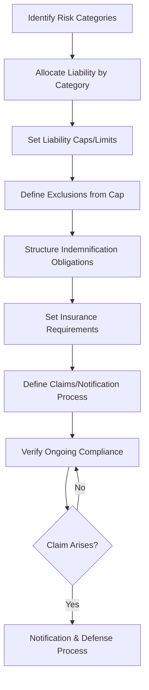

## Liability, Indemnification, and Insurance Requirements

### Overview

Liability, indemnification, and insurance requirements together form the risk-transfer architecture of a supplier contract — the mechanisms that determine who bears financial responsibility when something goes wrong, up to what limit, and how that responsibility is backed by verifiable financial capacity. These clauses are frequently the most heavily negotiated non-commercial terms in a contract, since they directly determine each party's worst-case financial exposure. In dual-sourcing programs, consistency and adequacy of these terms across both supplier agreements is particularly important, since a resilience strategy built on two sources provides limited practical protection if one source's liability terms leave the buyer inadequately protected relative to the other.

### Core Liability Framework



### Liability Caps and Limitation of Liability

**Key Points**

- A **limitation of liability (LoL)** clause caps the maximum financial exposure either party bears under the contract, typically expressed as a multiple of contract value, annual fees, or a fixed dollar amount
- **Direct damages** (the immediate, foreseeable cost of a breach — replacement cost, direct repair) are typically subject to the cap; **consequential/indirect damages** (lost profits, business interruption, reputational harm) are commonly excluded from recovery entirely via a mutual waiver, since these are harder to quantify and can be disproportionate to contract value
- Standard cap structures: a multiple of annual contract value (e.g., 1x–3x), a fixed dollar ceiling, or tiered caps that differ by claim type (e.g., higher cap for IP infringement or confidentiality breach than for general performance issues)

**Example — Tiered Liability Cap Structure**



```
Claim Category                          Cap
General contract breach                  1x annual contract value
IP infringement claims                    2x annual contract value
Confidentiality/data breach               3x annual contract value
Gross negligence / willful misconduct     Uncapped
Death/bodily injury/property damage       Uncapped (or per insurance limits)
```

**Key Points**

- Certain categories are typically carved out of any cap entirely — gross negligence, willful misconduct, fraud, death/bodily injury, and IP infringement are the most common uncapped exclusions, reflecting the principle that liability caps should not shield truly egregious or catastrophic conduct
- Mutual caps (applying symmetrically to both buyer and supplier) are increasingly standard practice; a one-sided cap that protects only the supplier while leaving the buyer fully exposed is a significant negotiation point and often a red flag regarding overall contract balance

### Indemnification Structure

**Key Points**

- Indemnification obligates one party to compensate the other for specified losses, typically arising from third-party claims — distinct from direct liability between the contracting parties themselves
- Common indemnification triggers in supplier contracts: IP infringement claims by third parties, product liability/personal injury claims, breach of confidentiality causing third-party harm, and violations of law (e.g., labor law violations triggering third-party claims against the buyer)
- Indemnification clauses should specify: the trigger events, the process for claim notification and control of defense, and whether indemnification is capped or sits outside the general liability cap

**Example — IP Indemnification Clause Structure**



```
Trigger:           Third-party claim alleging that Products, as
                    delivered per Buyer specifications, infringe a
                    valid patent, trademark, or copyright
Obligation:         Supplier shall defend, indemnify, and hold Buyer
                    harmless from resulting damages, costs, and
                    reasonable attorneys' fees
Exclusion:          Does not apply where infringement results solely
                    from Buyer-furnished designs or specifications
                    (allocated to Buyer per Section 9.3)
Process:            Indemnified party must provide prompt written
                    notice; indemnifying party controls defense and
                    settlement, subject to indemnified party's consent
                    for settlements admitting fault
```

**Key Points**

- The exclusion carving out buyer-furnished specifications from supplier IP indemnification is a critical and frequently contested clause — it correctly allocates infringement risk to whichever party controlled the design decision, and is especially relevant where the buyer has provided specifications to be replicated across dual-sourced suppliers (see Intellectual Property and Confidentiality Clauses)
- **Defense and control of claims**: specify whether the indemnifying party has the right to control defense/settlement, and whether the indemnified party retains consent rights over settlements that would admit liability or impose non-monetary obligations

### Insurance Requirements

**Key Points**

- Insurance requirements function as the financial backstop ensuring a supplier has verifiable capacity to meet its indemnification and liability obligations — a liability clause with no corresponding insurance requirement is only as strong as the supplier's balance sheet at the time a claim arises
- Common required coverage types and typical minimum considerations:

| Coverage Type | Purpose | Common in SRM Contracts |
| --- | --- | --- |
| Commercial General Liability (CGL) | Bodily injury, property damage from operations | Nearly universal baseline requirement |
| Product Liability | Claims arising from defective products supplied | Manufacturing/goods suppliers |
| Professional Liability (E&O) | Errors/omissions in services or advice provided | Services, engineering, consulting suppliers |
| Cyber Liability | Data breach, cyber incident response and liability | Suppliers with system access or data handling |
| Workers' Compensation/Employer's Liability | Employee injury claims | Required in most jurisdictions regardless of contract terms |
| Umbrella/Excess Liability | Coverage above primary policy limits | High-risk or high-value contracts |

**Key Points**

- Contracts should specify minimum coverage limits per occurrence and in aggregate, require the buyer be named as an **additional insured** where appropriate (extending direct coverage rights beyond mere indemnification), and require a **certificate of insurance (COI)** as ongoing proof of coverage, typically renewed annually
- **Waiver of subrogation**: often required so the supplier's insurer cannot pursue the buyer to recover a claim payout, preventing indirect exposure despite the buyer not being at fault
- Insurance requirements should be periodically re-verified during the contract term, not only checked at onboarding — lapsed coverage is a common and easily overlooked compliance gap

### Application to Dual Sourcing

**Key Points**

- **Consistency of liability and insurance terms across dual-sourced suppliers** is important for two reasons: it prevents one supplier relationship from carrying materially weaker buyer protection than the other (undermining the risk-mitigation rationale for dual sourcing itself), and it simplifies comparative risk assessment when making allocation decisions between sources
- Where a second source is a newer or smaller supplier relative to an established incumbent, insurance coverage limits and financial capacity to meet indemnification obligations should be scrutinized carefully during qualification (see Site Visits, Audits, and Certifications) — a second source that cannot financially back its contractual liability commitments provides less genuine risk mitigation than its qualification scorecard might suggest
- Liability allocation for a scenario where **both** dual-sourced suppliers are implicated in a shared failure (e.g., both used a common sub-tier supplier that failed) should be considered during contract drafting, since standard bilateral liability clauses may not clearly address multi-party causation scenarios

### Claims and Notification Process

**Key Points**

- Define specific notification timelines (e.g., "within 10 business days of becoming aware") for triggering events, since delayed notification can prejudice the ability to investigate, mitigate, or properly defend a claim
- Specify cooperation obligations — access to records, personnel, and facilities relevant to investigating a claim — particularly relevant where root-cause investigation spans both a supplier's own operations and the buyer's downstream use

### Common Pitfalls

**Key Points**

- **One-sided liability caps**: protecting only the supplier while leaving the buyer's own exposure uncapped creates a materially imbalanced risk allocation that should be identified and challenged during negotiation
- **No carve-outs for gross negligence/willful misconduct**: a cap that shields even egregious conduct removes meaningful deterrent effect and is increasingly viewed as an unreasonable term in many jurisdictions
- **Insurance requirements set but never re-verified**: COIs collected at onboarding and never refreshed, allowing coverage to lapse silently during the contract term
- **Indemnification clauses without clear defense-control provisions**: ambiguity over who controls litigation strategy and settlement authority creates friction and potential prejudice exactly when a claim is most urgent
- **Inconsistent liability/insurance terms across dual-sourced suppliers**: undermines the comparative risk assessment and equal protection rationale that should underpin a resilience-driven dual-sourcing strategy
- **No provision for shared/multi-party causation scenarios**: standard bilateral clauses can leave gaps when a failure implicates both dual-sourced suppliers or a common sub-tier source

[Inference] Specific liability cap multiples, insurance minimums, and indemnification carve-outs vary considerably by industry, jurisdiction, and contract value, so the structures and figures presented here should be treated as common market practice patterns rather than universal or legally mandated standards; legal counsel review is standard practice for finalizing these clauses.

**Related Topics**

- Certificate of Insurance (COI) Tracking and Renewal Management
- Dispute Resolution Clause Design
- Product Liability and Recall Management in Supplier Contracts
- Contract Types and Structures
- Site Visits, Audits, and Certifications
- Multi-Party Causation and Shared Liability in Supply Chain Failures