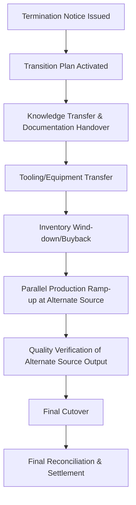

## Exit Clauses, Transition, and Termination Provisions

### Overview

Exit clauses, transition, and termination provisions govern how a supplier relationship ends — whether through natural contract expiry, early termination, or supplier failure — and how continuity of supply is preserved during the handover period. These clauses are frequently under-negotiated relative to entry and performance terms, yet a poorly structured exit is often more costly and disruptive than a poorly structured negotiation, since it occurs precisely when the relationship is most strained and time pressure is highest. In dual-sourcing programs, exit and transition provisions are foundational rather than peripheral: the entire strategic rationale for maintaining a second source depends on the buyer's practical ability to exit or de-emphasize one supplier without a supply disruption, which is only as reliable as the contractual transition mechanics actually written into each agreement.

### Termination Trigger Types

| Trigger Type | Description | Notice/Cure Requirements |
| --- | --- | --- |
| Termination for convenience | Either party may terminate without cause | Typically requires defined advance notice (30–180 days) |
| Termination for cause/default | Termination due to material breach | Typically requires notice and a defined cure period |
| Termination for insolvency | Termination triggered by bankruptcy, insolvency, or financial distress indicators | Often immediate, without cure period |
| Termination for change of control | Triggered by acquisition or ownership change of either party | Notice and consent rights, sometimes with termination option |
| Automatic/expiry-based | Contract simply reaches its defined end date | Renewal or non-renewal notice deadlines apply |

**Key Points**

- **Termination for convenience** clauses give the buyer flexibility to exit even absent supplier fault — critical for a dual-sourcing strategy where the buyer may wish to shift business toward a better-performing source without needing to establish formal breach
- **Cure periods** for termination-for-cause should be clearly defined (commonly 15–30 days for correctable breaches) and should distinguish breaches capable of cure from those that are not (e.g., repeated quality failures after multiple prior cure opportunities may justify immediate termination without a further cure window)
- Termination-for-convenience clauses often include compensation provisions (e.g., payment for work in progress, committed inventory, or a termination fee) to balance the buyer's flexibility against the supplier's reasonable reliance interest

### Notice Periods and Their Strategic Function

**Key Points**

- Notice period length should be calibrated to the realistic time required to execute a transition — qualifying and ramping a replacement source, transferring tooling, or building safety stock — not set arbitrarily short for buyer convenience or arbitrarily long for supplier protection
- In dual-sourcing programs, notice periods for the *primary* source can often be shorter than they would be in a single-source arrangement, since a qualified second source already exists to absorb increased volume — this is a concrete, quantifiable benefit of dual sourcing that should be reflected in contract negotiation, not just cited qualitatively

**Example — Notice Period Calibration**



```
Scenario                                   Typical Notice Period
Single-source, no qualified alternative     180+ days
Dual-sourced, qualified alternative exists   60–90 days
Commodity, readily available alternatives    30 days
Critical/regulated component (re-qualification required) 12+ months
```

### Transition and Transfer Obligations



**Key Points**

- **Transition assistance clauses** obligate the outgoing supplier to cooperate in good faith during handover — providing documentation, process knowledge, and reasonable support to a replacement source — for a defined transition period post-termination notice
- Without an explicit transition assistance obligation, an outgoing supplier (particularly one terminated for cause, or losing volume to a competitor) has little incentive to cooperate, and may be actively motivated not to, precisely when cooperation matters most
- **Tooling and buyer-furnished property return**: specify timelines and condition requirements for returning buyer-owned tooling, molds, and equipment (see Intellectual Property and Confidentiality Clauses), including who bears shipping/refurbishment costs
- **Inventory wind-down**: address disposition of committed raw materials, work-in-progress, and finished goods inventory at termination — common structures include buyer buyback obligations for inventory ordered per an agreed forecast, to avoid leaving the outgoing supplier with unsellable stranded inventory that could otherwise become a dispute

### Termination for Insolvency and Financial Distress

**Key Points**

- Insolvency-triggered termination rights typically allow immediate termination without the standard cure period, given that an insolvent supplier may be unable to cure regardless of notice given
- Should be paired with **early warning provisions** — financial reporting requirements, credit monitoring rights, or triggers tied to specific financial ratios — since discovering insolvency only at the point of actual failure eliminates the lead time needed to activate a transition plan
- For dual-sourced categories, financial distress at one supplier should trigger a pre-planned (ideally pre-negotiated) volume shift to the healthy alternate source, minimizing the gap between distress signal and functional mitigation

### Change of Control Provisions

**Key Points**

- Change of control clauses give the buyer notice rights, consent rights, or termination options if the supplier is acquired, merges, or undergoes significant ownership change — relevant because a new owner may change strategic priorities, quality standards, or willingness to maintain the relationship on existing terms
- For dual-sourced suppliers, particular attention should be paid to the scenario where one dual-sourced supplier acquires the other, which would collapse the intended diversification — a well-drafted change of control clause can give the buyer a termination or renegotiation right specifically in this scenario

### Post-Termination Survival Clauses

**Key Points**

- Certain obligations must explicitly survive termination to remain enforceable: confidentiality (see Intellectual Property and Confidentiality Clauses), IP ownership and license terms, warranty obligations on already-delivered goods, indemnification for pre-termination claims, and audit rights for a defined post-termination period
- A termination clause silent on survival can inadvertently extinguish protections the buyer assumed would continue — survival language should be explicit and itemized rather than implied

**Example — Survival Clause Structure**



```
The following provisions survive termination or expiration of this
Agreement:
- Section 7 (Confidentiality) — 5 years
- Section 9 (IP Ownership and License Terms) — indefinite
- Section 10 (Warranty) — through applicable warranty period on
  goods delivered prior to termination
- Section 11 (Indemnification) — for claims arising prior to
  termination, indefinite subject to applicable statute of limitations
- Section 13 (Audit Rights) — 2 years post-termination
```

### Dual-Sourcing-Specific Exit and Transition Design

**Key Points**

- **Pre-negotiated ramp-up commitments from the alternate source**: the practical value of a dual-sourcing strategy during an exit event depends on the *remaining* supplier's contractual willingness and capacity to absorb additional volume on short notice — this should be addressed proactively in that supplier's own contract (e.g., a stated maximum surge capacity commitment) rather than assumed
- **Staggered term structures**: as noted under Contract Types and Structures, avoiding simultaneous expiry/renewal dates across dual-sourced suppliers reduces the risk that an exit event at one supplier coincides with renewal uncertainty at the other
- **Transition rehearsal/testing**: for critical dual-sourced categories, periodically testing the alternate source's ability to absorb full volume (even briefly, via a planned trial run) converts a theoretical transition capability into a demonstrated one, surfacing gaps before an actual exit event forces discovery under pressure
- **Exit cost transparency**: transition and exit costs (tooling transfer, re-qualification testing, inventory buyback) should be estimated and included in the original TCO/risk-adjusted comparison supporting the dual-sourcing decision (see Total Cost and Value-Based Negotiation), since these are real costs that materialize specifically at the point of supplier transition

### Common Pitfalls

**Key Points**

- **Notice periods set without reference to actual transition time requirements**: either leaving insufficient time to execute a real transition, or unnecessarily locking the buyer into an underperforming relationship longer than needed
- **No transition assistance obligation**: leaves the buyer dependent on an outgoing supplier's voluntary goodwill precisely when incentives to cooperate are weakest
- **Survival clauses omitted or incomplete**: critical protections (confidentiality, IP, indemnification) can lapse unintentionally at termination if not explicitly itemized as surviving
- **No insolvency early-warning mechanism**: discovering financial distress only at the point of supplier failure eliminates lead time for transition planning
- **Treating the "second source exists" fact as sufficient mitigation without testing actual surge capacity**: a qualified but never-stress-tested alternate source may not actually be able to absorb full volume on the notice period assumed
- **Simultaneous contract expiry across dual-sourced suppliers**: recreates single-source-like disruption risk at the shared renewal point, undermining the staggered resilience the dual-sourcing strategy was intended to provide

**Related Topics**

- Transition Rehearsal and Surge Capacity Testing
- Supplier Financial Health Monitoring and Early Warning Indicators
- Inventory Buyback and Wind-down Cost Allocation
- Contract Types and Structures
- Total Cost and Value-Based Negotiation
- Business Continuity Planning (BCP) Verification for Dual Sourcing