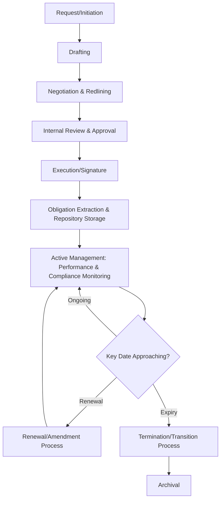
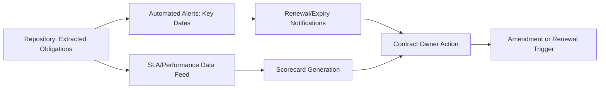

## Contract Lifecycle Management Processes and Tools

### Overview

Contract Lifecycle Management (CLM) is the end-to-end process and toolset for governing a contract from initial request through drafting, negotiation, execution, active management, and eventual renewal or termination. Where earlier chapter items addressed the *content* of contracts (types and structures, SLAs, pricing, IP, liability, exit provisions), CLM addresses the *operational infrastructure* that ensures those terms are actually created consistently, tracked accurately, and enforced in practice over the contract's life. In dual-sourcing programs, CLM discipline is what allows an organization to manage multiple concurrent, interrelated supplier agreements coherently rather than as isolated documents — tracking comparative obligations, synchronized (or deliberately staggered) key dates, and cross-contract consistency at scale.

### The Contract Lifecycle

### Stage 1: Request and Initiation

**Key Points**

- Standardized intake processes (contract request forms specifying type, value, risk tier, and counterparty) ensure contracts are routed to the appropriate template, approval workflow, and review depth based on materiality — a low-value, low-risk purchase order should not trigger the same review cycle as a strategic multi-year dual-sourcing agreement
- Early intake capture of whether a contract is part of a dual-sourcing initiative allows downstream CLM tooling to flag and link related agreements for coordinated management, rather than treating each supplier contract as fully independent

### Stage 2: Drafting and Template Management

**Key Points**

- **Clause libraries** — pre-approved, legally vetted standard language for common provisions (liability caps, confidentiality, termination) — allow drafters to assemble contracts consistently rather than starting from scratch or copying from potentially outdated precedent documents
- Template governance should distinguish **standard clauses** (rarely negotiable, legally pre-approved) from **negotiable clauses** (commercial terms expected to vary), with clear escalation paths when a counterparty requests deviation from standard language
- For dual-sourcing programs, maintaining a consistent base template across both supplier agreements — with deliberate, tracked variation only in commercial terms — directly supports the cross-contract consistency goals discussed under Contract Types and Structures and Liability, Indemnification, and Insurance Requirements

### Stage 3: Negotiation and Redlining

**Key Points**

- Version control during redlining is critical — CLM tools typically provide track-changes/redline comparison and version history so negotiating parties and internal reviewers can see exactly what changed between drafts, avoiding the common failure mode of losing track of which version reflects the current agreed position
- Negotiation playbooks (pre-approved fallback positions for common negotiated clauses, e.g., acceptable liability cap ranges) speed negotiation while keeping outcomes within pre-authorized bounds, reducing the need for case-by-case legal escalation on routine points

### Stage 4: Internal Review and Approval

**Key Points**

- Approval workflows should route contracts through required reviewers (legal, finance, procurement, and for high-risk categories, quality/compliance) based on contract value, risk tier, and clause deviations from standard templates
- Delegation of Authority (DOA) matrices (see Documenting Selection Rationale and Audit Trail) should be encoded into workflow logic where possible, so approval routing automatically reflects who has authority to approve at a given value/risk threshold rather than relying on manual judgment each time

### Stage 5: Execution

**Key Points**

- E-signature integration is now standard practice, providing a verifiable execution timestamp and audit trail as part of the signed record itself
- Fully executed contracts should be automatically captured into the central repository at the point of signature, eliminating the gap (a common source of "lost" or informally-tracked agreements) between execution and formal record-keeping

### Stage 6: Obligation Extraction and Repository Management

**Key Points**

- A central, searchable contract repository — as opposed to contracts scattered across email, shared drives, or individual procurement officers' files — is the foundational CLM capability that everything else depends on
- **Obligation extraction**: identifying and cataloguing specific ongoing obligations from within the executed contract text (SLA metrics, renewal notice deadlines, insurance certificate renewal dates, price adjustment review triggers) so these are tracked as discrete, actionable items rather than requiring someone to re-read the full contract to know what's due
- Modern CLM platforms increasingly use AI-assisted extraction to identify key clauses, dates, and obligations automatically from contract text, though extracted data should generally be human-verified for high-value or high-risk agreements given current extraction accuracy limitations

[Inference] The reliability of AI-assisted clause and obligation extraction varies by contract complexity and platform maturity; for strategic or high-value dual-sourcing agreements specifically, human verification of extracted obligations remains standard practice rather than relying on automated extraction alone.

### Stage 7: Active Management — Performance and Compliance Monitoring

**Key Points**

- Automated alerting for key dates — renewal notice deadlines, insurance certificate expiry, price adjustment review windows, termination notice windows — prevents the common failure of missing a contractually significant date simply because no one was tracking it manually
- Linking CLM obligation data to SLA/performance monitoring systems (see Service Level Agreements and Key Terms) creates a unified view connecting contractual commitments to actual measured performance, rather than maintaining these as separate, unreconciled data sources
- For dual-sourced categories, CLM tooling should support **cross-contract comparative views** — surfacing both suppliers' current pricing, SLA performance, and key dates side by side — since the value of dual sourcing depends on ongoing comparison, not just individual contract compliance

### Stage 8: Amendment and Change Management

**Key Points**

- Amendments should follow the same version-control and approval discipline as original contract execution — an informally agreed change via email that is never formally documented as an amendment creates the same audit trail gaps discussed under Documenting Selection Rationale and Audit Trail
- CLM systems should maintain a clear linkage between the original contract and all subsequent amendments, so the current effective terms can always be reconstructed accurately rather than requiring manual reconciliation of a document trail

### Stage 9: Renewal, Termination, and Archival

**Key Points**

- Renewal decision points should trigger a structured review (performance against SLA, market pricing benchmark check, continued strategic fit) rather than automatic/passive renewal, particularly for auto-renewing agreements where inertia can perpetuate a relationship past the point it remains competitive
- Terminated or expired contracts should move to a searchable archive (not deletion) to preserve historical record for audit, dispute defense, and institutional knowledge — see retention requirements discussed under Documenting Selection Rationale and Audit Trail

### CLM Tooling Landscape

| Tool Category | Function |
| --- | --- |
| Dedicated CLM platforms | Full lifecycle: drafting, negotiation, repository, obligation tracking, analytics |
| E-signature platforms | Execution and signature audit trail (often integrated with CLM platforms) |
| Contract analytics/AI extraction | Clause and obligation extraction, risk flagging from contract text |
| ERP/procurement suite modules | Contract management embedded within broader procurement/P2P systems |
| Document management systems | Basic repository function without dedicated obligation tracking |

**Key Points**

- Standalone document storage (shared drives, generic DMS) lacks the obligation-tracking, alerting, and workflow capabilities that differentiate true CLM tooling — organizations relying solely on document storage typically discover key-date misses reactively rather than proactively
- Integration between CLM tooling and supplier performance/SLA systems, and where applicable ERP purchase order data, is generally more valuable than any single platform's feature depth in isolation, since fragmented systems recreate the manual reconciliation burden CLM is meant to eliminate

### Application to Dual Sourcing

**Key Points**

- CLM tooling should support explicit **relationship tagging** — marking two or more contracts as part of a single dual-sourcing category — so that reporting, alerting, and comparative analysis can be generated at the category level rather than requiring manual cross-referencing of separately filed contracts
- Comparative dashboards showing both dual-sourced suppliers' current terms, performance, and upcoming key dates side by side directly support the ongoing allocation and governance decisions discussed under Service Level Agreements and Key Terms and Pricing Mechanisms and Price Adjustment Clauses
- Staggered key-date management (see Exit Clauses, Transition, and Termination Provisions) depends on CLM visibility into both contracts' renewal/expiry timelines simultaneously — without this cross-contract view, staggering is difficult to plan or maintain deliberately over time

### Common Pitfalls

**Key Points**

- **No central repository**: contracts scattered across individuals' files or email, making obligation tracking, audit response, and cross-contract comparison effectively impossible at scale
- **Manual key-date tracking**: reliance on individual memory or spreadsheets rather than automated alerting, leading to missed renewal notice windows or expired insurance certificates going unnoticed
- **Amendments tracked informally**: verbal or email-based changes never formally documented as amendments, creating ambiguity about current effective contract terms
- **Treating dual-sourced contracts as fully independent records**: missing the comparative visibility and staggered-date management that CLM tooling should specifically enable for coordinated multi-supplier governance
- **Over-reliance on unverified AI extraction for high-value agreements**: automated obligation extraction accelerates processing but should be verified for strategic or high-risk contracts rather than trusted without review

**Related Topics**

- Delegation of Authority (DOA) and Approval Workflow Design
- Clause Libraries and Negotiation Playbook Development
- Cross-Contract Comparative Reporting for Multi-Sourced Categories
- Documenting Selection Rationale and Audit Trail
- Service Level Agreements and Key Terms
- Renewal Governance and Auto-Renewal Risk Management