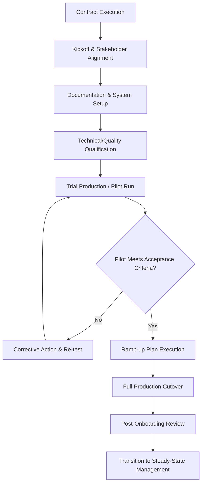

## Onboarding Process Design and Milestones


### Overview

Onboarding process design and milestones define the structured sequence by which a newly selected and contracted supplier is transitioned from "awarded" to "fully operational and integrated" into the buyer's supply chain. This phase sits between contract execution (see Contract Lifecycle Management Processes and Tools) and steady-state supplier management, and is frequently underestimated in complexity — a well-negotiated contract with a poorly executed onboarding still produces delayed first delivery, quality escapes, or integration failures. In dual-sourcing programs, onboarding design is especially consequential because a second source's practical value is zero until it has been fully onboarded and demonstrated capable of production-ready performance; the resilience benefit exists only from the moment onboarding milestones are actually complete, not from the moment the contract is signed.

### Onboarding Process Structure



### Phase 1: Kickoff and Stakeholder Alignment

**Key Points**

- A formal kickoff meeting bringing together procurement, quality, engineering, logistics, and the supplier's equivalent counterparts establishes shared understanding of scope, timeline, and roles before operational work begins
- Assign a **single onboarding owner** (internally) responsible for coordinating across functions — onboarding delays frequently stem from fragmented ownership where no one function has end-to-end accountability for the process
- For dual-sourcing onboarding specifically, kickoff should explicitly clarify the second source's intended role (parallel qualification only, or active volume from day one) since this materially affects urgency and milestone sequencing

### Phase 2: Documentation and System Setup

**Key Points**

- Administrative and system setup — vendor master record creation, tax/banking documentation, EDI or system integration configuration, user access provisioning — is often the longest-lead, least-visible onboarding component, and should be initiated in parallel with technical qualification rather than sequentially after it
- Documentation requirements should be templated and checklist-driven (W-9/tax forms, banking details, insurance certificates, compliance attestations) to avoid iterative back-and-forth that extends timeline unnecessarily
- Buyer-furnished specifications, drawings, and quality standards (see Intellectual Property and Confidentiality Clauses) should be formally transferred during this phase under the license terms established in the contract

**Example — Documentation Checklist**



```
[ ] Vendor master record created in ERP
[ ] Tax documentation (W-9 / equivalent) collected
[ ] Banking/payment details verified
[ ] Certificate of Insurance received and verified against contract minimums
[ ] NDA/confidentiality agreement executed (if not part of master contract)
[ ] EDI or system integration test connection established
[ ] Specification/drawing package formally transferred under license terms
[ ] Quality manual/requirements document acknowledged by supplier
```

### Phase 3: Technical and Quality Qualification

**Key Points**

- This phase validates the supplier's actual production capability against the specific product/service being sourced, building on (but going beyond) the general capability assessment conducted during supplier identification (see Site Visits, Audits, and Certifications)
- Common qualification activities: First Article Inspection (FAI), Production Part Approval Process (PPAP) or equivalent, process capability studies (Cpk/Ppk for critical dimensions), and test/validation protocols specific to the product category
- For regulated industries, this phase may include formal regulatory submission or approval steps (e.g., medical device or pharmaceutical supplier qualification) with externally imposed timelines the onboarding plan must accommodate

**Example — Qualification Milestone Set**



```
Milestone                          Target Date    Owner           Status
First Article Inspection Sample     Week 3          Supplier/QA     Pending
FAI Report Review & Approval        Week 4          Buyer QA        Pending
Process Capability Study (Cpk)      Week 5          Supplier        Pending
PPAP Submission                     Week 6          Supplier        Pending
PPAP Approval                       Week 7          Buyer QA        Pending
```

### Phase 4: Trial Production / Pilot Run

**Key Points**

- A pilot or trial production run at representative (though typically not full) volume validates that qualification-phase results hold under more realistic operating conditions, surfacing issues that small-batch qualification samples may not reveal
- Acceptance criteria for the pilot should be defined in advance — specific defect rate thresholds, on-time delivery of the pilot batch, documentation accuracy — rather than judged subjectively after the fact
- For dual-sourcing specifically, the pilot run is the first point at which genuine comparative data between the new second source and the existing primary source becomes available, and should be structured to generate metrics comparable to the SLA framework already governing the primary source (see Service Level Agreements and Key Terms)

### Phase 5: Ramp-up Plan Execution

**Key Points**

- Rather than an immediate full-volume cutover, ramp-up typically proceeds through defined volume stages, allowing issues to surface and be resolved at manageable scale before full dependency is placed on the new supplier
- Ramp-up pacing should be tied to sustained performance against acceptance thresholds at each stage — advancing to the next volume tier only after the current tier's performance criteria are met, not on a fixed calendar regardless of results

**Example — Ramp-up Volume Stages**



```
Stage 1: 10% of allocated volume — 4 weeks — Gate: OTD ≥ 95%, Defects ≤ target
Stage 2: 30% of allocated volume — 4 weeks — Gate: OTD ≥ 95%, Defects ≤ target
Stage 3: 60% of allocated volume — 4 weeks — Gate: OTD ≥ 95%, Defects ≤ target
Stage 4: 100% of allocated volume — Steady-state entry
```

- For dual-sourcing programs, ramp-up planning should explicitly coordinate with the primary source's capacity, ensuring that as the second source ramps up, any corresponding volume reduction at the primary source is communicated and managed to avoid unintended strain on that relationship

### Phase 6: Full Production Cutover and Post-Onboarding Review

**Key Points**

- Cutover to full allocated volume should be confirmed only after ramp-up gates are consistently met, with a formal sign-off from quality and operations stakeholders, not procurement alone
- A structured post-onboarding review (typically 60–90 days after full cutover) captures lessons learned, compares actual timeline/cost against the onboarding plan, and identifies process improvements for future onboarding cycles — particularly valuable for organizations running dual-sourcing programs repeatedly across multiple categories, where onboarding process maturity compounds over successive qualifications

### Onboarding Timeline Considerations by Category Complexity

| Category Type | Typical Onboarding Duration | Key Drivers |
| --- | --- | --- |
| Simple/commodity goods | 2–6 weeks | Documentation and basic quality verification only |
| Standard manufactured components | 2–4 months | FAI/PPAP, tooling setup, initial ramp-up |
| Regulated products (medical, aerospace, food) | 6–18 months | Regulatory approval, extensive validation protocols |
| Complex services/systems integration | 3–9 months | System integration testing, process alignment, training |

**Key Points**

- Dual-sourcing timeline planning should account for these category-specific durations realistically when setting expectations for *when* the resilience benefit of a second source actually becomes available — a regulated component's second source may take over a year to reach full qualification, a critical planning input often underestimated at the point the dual-sourcing decision is made

### Milestone Governance and Escalation

**Key Points**

- Define clear escalation triggers for milestone slippage — e.g., a qualification milestone missed by more than a defined threshold (2 weeks) triggers management review rather than passive schedule drift
- Track onboarding milestones within the same CLM/obligation-tracking infrastructure used for steady-state contract management (see Contract Lifecycle Management Processes and Tools) to avoid onboarding existing as an informally tracked, parallel process disconnected from the contract record

### Common Pitfalls

**Key Points**

- **No single onboarding owner**: fragmented accountability across functions is the most common cause of onboarding delay, with each function assuming another is driving the timeline
- **Sequential rather than parallel administrative and technical workstreams**: unnecessarily extends total onboarding duration when documentation/system setup could proceed alongside technical qualification
- **Undefined pilot/ramp-up acceptance criteria**: subjective "looks good" advancement decisions rather than pre-agreed, measurable gate criteria
- **Immediate full-volume cutover without staged ramp-up**: concentrates risk at the point of least operational experience with the new supplier — particularly dangerous for a dual-sourcing second source where the entire point is risk mitigation, not risk concentration
- **Underestimating category-specific onboarding duration**: assuming a regulated or complex category can onboard on a commodity-goods timeline, creating unrealistic expectations about when dual-sourcing resilience actually materializes
- **No post-onboarding review**: losing the opportunity to improve onboarding process maturity for subsequent supplier qualifications

**Related Topics**

- First Article Inspection (FAI) and PPAP Processes
- Ramp-up Volume Gating and Stage-Gate Criteria Design
- EDI and System Integration Setup for New Suppliers
- Site Visits, Audits, and Certifications
- Service Level Agreements and Key Terms
- Regulatory Qualification Timelines by Industry