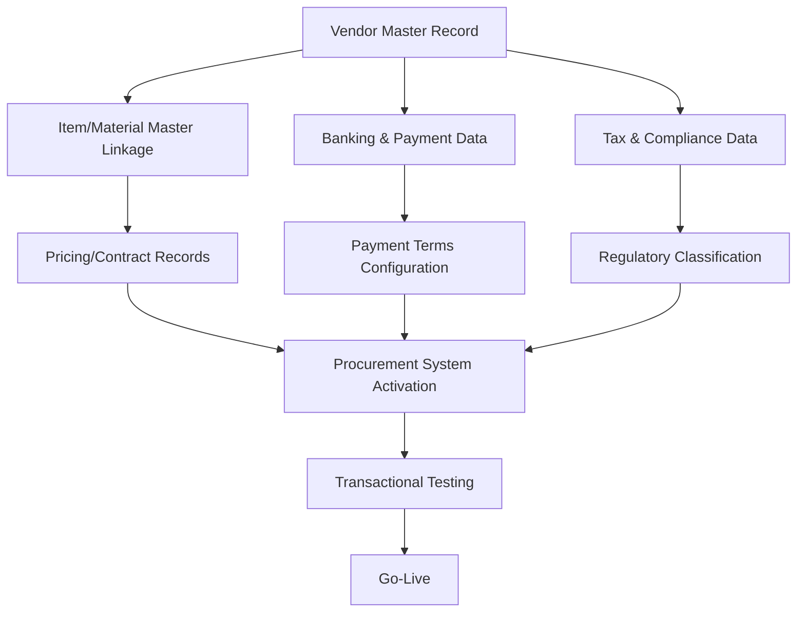
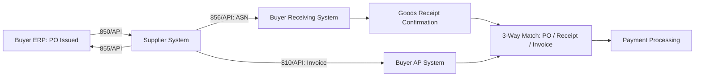

## Master Data Setup and System Integration

### Overview

Master data setup and system integration establish the technical and data foundation that allows a newly onboarded supplier to transact within the buyer's ERP, procurement, and operational systems accurately and reliably. Where onboarding process design (see Onboarding Process Design and Milestones) defines the overall sequence and milestones, this item addresses the specific data architecture and integration mechanics that make ongoing transactions — purchase orders, invoicing, receiving, payment — function correctly from day one. In dual-sourcing programs, master data and integration design carries additional weight because inconsistent data structures between two suppliers of the same category can undermine the comparative reporting, spend visibility, and allocation decisions that justify running a dual-source program in the first place.

### Core Master Data Domains



### Vendor Master Record Setup

**Key Points**

- The vendor master record is the central data object linking a supplier's identity, addresses, contacts, banking details, tax status, and payment terms within the ERP/procurement system — errors here propagate into every downstream transaction
- Duplicate vendor record prevention requires a defined matching/deduplication process (typically by tax ID or registration number) during setup, since duplicate records fragment spend visibility and complicate reporting, particularly problematic when tracking combined spend across dual-sourced suppliers who may share some overlapping corporate affiliations
- Vendor records should capture a standardized **risk/category classification** consistent with the tiering used during supplier identification (see Site Visits, Audits, and Certifications), so downstream systems can apply appropriate controls (approval routing, payment terms) automatically based on that classification

**Example — Vendor Master Record Core Fields**



```
Field                          Example Value
Vendor ID                       V-004821
Legal Entity Name               [Supplier Legal Name]
Tax ID/Registration Number      [Jurisdiction-specific ID]
Primary Address                 [Registered business address]
Remit-to Address                [If different from primary]
Banking Details                 [Account/routing, verified separately]
Payment Terms                   Net 45
Currency                        USD
Risk/Category Classification    Tier 2 — Standard Monitoring
Certifications on File          ISO 9001, ISO 14001
Approval Status                 Active
```

### Item/Material Master Linkage

**Key Points**

- Item or material master records define the specific parts, SKUs, or service categories a supplier is approved to provide, linked to the vendor master record via a **source list** or approved-supplier relationship
- For dual-sourced items specifically, the material master's source list should include both qualified suppliers with their respective allocation ratios, lead times, and current pricing — this is the data structure that operationally enables the volume-split mechanisms discussed under Pricing Mechanisms and Price Adjustment Clauses and Service Level Agreements and Key Terms
- Part number cross-referencing (buyer part number to each supplier's internal part number) should be explicitly mapped and maintained, since inconsistent part identification across systems is a common source of order errors, particularly when a second source uses different internal numbering conventions than the incumbent

**Example — Source List Structure for Dual-Sourced Item**



```
Buyer Part No.   Supplier      Supplier Part No.   Allocation %   Lead Time   Priority
PN-4471-A         Supplier A    SA-8821-X            65%            4 wks       1
PN-4471-A         Supplier B    SB-2290-Z            35%            6 wks       2
```

### Pricing and Contract Record Integration

**Key Points**

- Contract pricing terms (fixed price, indexed formula parameters, volume tiers — see Pricing Mechanisms and Price Adjustment Clauses) should be loaded into the procurement system as structured pricing records, not maintained only in the contract document, so purchase orders automatically reflect current agreed pricing rather than relying on manual price entry at time of order
- Where indexed or formula-based pricing is used, integration design should specify whether price updates are applied automatically (system-calculated based on an index feed) or require manual review/approval before taking effect — automatic application reduces administrative burden but requires confidence in data feed reliability and formula accuracy

### EDI and System-to-System Integration

**Key Points**

- **Electronic Data Interchange (EDI)** or API-based integration automates transactional document exchange (purchase orders, order acknowledgments, advance ship notices, invoices) between buyer and supplier systems, reducing manual entry errors and accelerating transaction cycle time
- Common EDI transaction sets relevant to supplier integration: 850 (Purchase Order), 855 (PO Acknowledgment), 856 (Advance Ship Notice/ASN), 810 (Invoice) — or their equivalent API-based data structures in more modern integration approaches
- Integration testing should validate both **happy-path** transactions (standard order flow) and **exception handling** (order changes, cancellations, partial shipments, invoice discrepancies) before go-live, since exception scenarios are where integration gaps most often surface in production



**Key Points**

- The **3-way match** (purchase order, goods receipt, and invoice) is a standard control validating that payment is only released for goods actually ordered and received at the agreed price — integration design should ensure all three data points flow into the matching system reliably, since a gap in any leg forces manual intervention and slows payment cycle time
- For dual-sourced suppliers, ensuring both integrations produce consistent, comparably structured transactional data is important for accurate combined spend reporting and performance comparison — a supplier integrated via modern API while the other still relies on manual order entry, for example, creates data quality asymmetry that can distort comparative SLA and spend analysis

### Integration Approach Selection

| Approach | Description | Best Fit |
| --- | --- | --- |
| Traditional EDI (X12/EDIFACT) | Structured batch file exchange via VAN or direct connection | Established suppliers with existing EDI capability |
| API/REST integration | Real-time, request-response data exchange | Modern systems, smaller/newer suppliers, faster implementation |
| Supplier portal | Web-based manual entry interface, no system integration | Low-volume or low-technical-maturity suppliers |
| Punch-out/catalog integration | Supplier catalog embedded directly in buyer's procurement system | High-frequency, catalog-based purchasing |

**Key Points**

- Integration approach should be matched to supplier technical capability and transaction volume — mandating full EDI integration for a low-volume, technically limited supplier can create unnecessary onboarding friction and cost disproportionate to the transaction value involved
- A supplier portal, while less automated, provides a reasonable fallback ensuring even lower-maturity suppliers can transact within the buyer's controlled environment rather than defaulting to fully manual, off-system processes that bypass standard controls

### Data Quality Validation and Testing

**Key Points**

- Before go-live, conduct parallel or test transaction runs validating that master data flows correctly through the full order-to-pay cycle — a test purchase order, simulated receipt, and test invoice matching, rather than discovering data errors on the first live transaction
- Common master data errors to specifically test for: incorrect currency/unit-of-measure conversions, tax calculation errors, payment term misconfiguration, and part number mapping mismatches — each of which can cause downstream payment delays or compliance issues if undetected before go-live

### Application to Dual Sourcing

**Key Points**

- Master data structures should be designed from the outset to support **category-level reporting across multiple suppliers**, not just per-supplier records in isolation — this is what enables the comparative dashboards and allocation analysis discussed under Contract Lifecycle Management Processes and Tools
- Consistent unit-of-measure, currency handling, and part-number cross-referencing across both dual-sourced suppliers' master data prevents subtle reporting distortions (e.g., one supplier's data reported in different units) that could bias comparative performance or cost analysis without being immediately obvious
- Source list allocation percentages should be a **live, updatable data field** rather than a static setup-time value, since allocation ratios are expected to shift over time based on the performance-linked mechanisms established in SLA and pricing terms (see Service Level Agreements and Key Terms)

### Common Pitfalls

**Key Points**

- **Duplicate vendor records**: fragmenting spend and performance data across multiple records for what should be a single supplier entity, undermining accurate reporting
- **Manual price entry instead of system-loaded contract pricing**: creates risk of orders processing at incorrect, outdated pricing, and complicates price adjustment clause enforcement
- **No exception-path integration testing**: happy-path testing alone leaves order change, cancellation, and discrepancy handling unvalidated until a live failure occurs
- **Inconsistent integration maturity across dual-sourced suppliers**: creates data quality asymmetry that distorts comparative spend and performance analysis between the two sources
- **Static source list allocation percentages**: failing to treat allocation ratios as a dynamic field prevents the master data system from reflecting real-time volume-shift decisions driven by SLA performance
- **Skipping parallel/test transaction validation before go-live**: discovering master data errors on live transactions rather than in controlled testing, risking payment delays or compliance issues

**Related Topics**

- Vendor Master Data Governance and Deduplication
- EDI Transaction Set Standards and Exception Handling
- Three-Way Match Controls in Procure-to-Pay
- Onboarding Process Design and Milestones
- Pricing Mechanisms and Price Adjustment Clauses
- Cross-Supplier Spend Reporting and Category Analytics