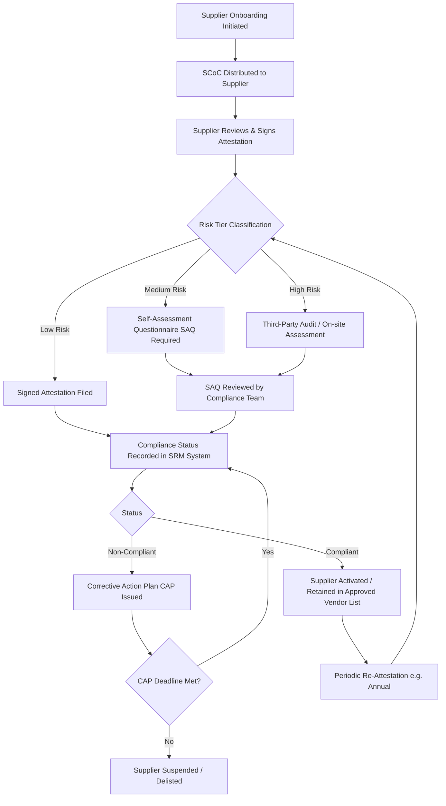
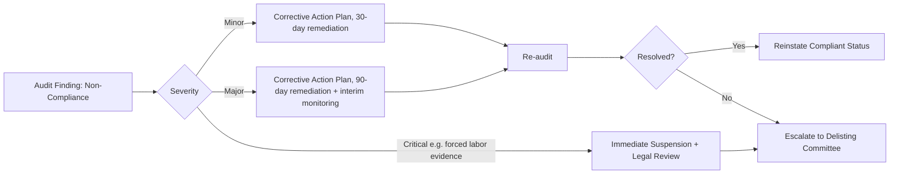

## Supplier Code of Conduct and Compliance Attestation

### Overview

A Supplier Code of Conduct (SCoC) is a formal document issued by a buying organization that defines the minimum ethical, legal, labor, environmental, and business-practice standards a supplier must meet to participate in the supply chain. Compliance Attestation is the formal process by which a supplier declares — typically via signed statement, self-assessment questionnaire (SAQ), or third-party audit — that it meets those standards. Together, these instruments form the contractual and governance backbone of supplier onboarding, converting abstract ethical expectations into enforceable, auditable obligations.

In a Dual Sourcing context, the Code of Conduct and attestation process must be applied consistently across both (or all) qualified suppliers for a given part/category, since divergence in compliance rigor between primary and secondary sources creates asymmetric risk exposure that undermines the redundancy benefit of dual sourcing itself.

### Key Points

- **Legal instrument, not just policy**: The SCoC is typically incorporated by reference into the Master Supply Agreement (MSA) or Purchase Order terms, making violation a breach of contract, not merely a policy infraction.
- **Attestation ≠ Verification**: A signed attestation is a self-declared assertion. It reduces legal/reputational exposure for the buyer but does not, by itself, confirm ground-truth compliance — this gap is closed through audits, scorecards, and evidence requests.
- **Tiered risk-based application**: Mature SRM programs do not apply identical attestation depth to all suppliers; depth scales with spend, category risk, and geography.
- **Cascading obligation**: Leading codes require suppliers to flow down equivalent standards to their own sub-tier suppliers (Tier 2, Tier 3), which is increasingly demanded by regulations such as the EU Corporate Sustainability Due Diligence Directive (CSDDD) and Germany's Supply Chain Due Diligence Act (LkSG).
- **Dual sourcing implication**: Attestation status becomes a qualifying gate for "activation" of a secondary source — a backup supplier that is not attestation-current cannot be safely activated during a disruption event without incurring compliance risk.

### Core Components of a Supplier Code of Conduct

1. **Labor and Human Rights**
   - Prohibition of child labor, forced/bonded labor, and human trafficking
   - Freedom of association and collective bargaining
   - Non-discrimination and anti-harassment
   - Working hours, wages, and benefits aligned to local law and/or ILO conventions
2. **Health and Safety**
   - Safe working conditions, emergency preparedness
   - Occupational injury/illness prevention systems
3. **Environmental Responsibility**
   - Regulatory compliance (emissions, waste, hazardous materials)
   - Resource efficiency, greenhouse gas disclosure (often tied to Scope 3 reporting obligations of the buyer)
4. **Business Ethics**
   - Anti-bribery and anti-corruption (e.g., FCPA, UK Bribery Act alignment)
   - Conflicts of interest disclosure
   - Fair competition / antitrust
   - Data privacy and IP protection
   - Anti-money laundering, trade sanctions/export control compliance
5. **Management Systems**
   - Requirement to maintain documented policies, training, and internal grievance mechanisms
   - Record retention for audit purposes

### The Attestation Lifecycle



### Risk-Tiering Logic (Illustrative Model)

A common quantitative approach scores suppliers on spend and category risk to determine attestation depth:

$$R_s = w_1 \cdot S_n + w_2 \cdot C_r + w_3 \cdot G_r$$

Where:

- $R_s$ = composite supplier risk score
- $S_n$ = normalized annual spend (0–1 scale)
- $C_r$ = category risk factor (e.g., electronics, minerals, apparel score higher)
- $G_r$ = geographic/country risk index (e.g., based on Transparency International CPI or similar)
- $w_1, w_2, w_3$ = weighting coefficients set by the compliance function, typically $w_1 + w_2 + w_3 = 1$

Suppliers exceeding a threshold (e.g., $R_s > 0.6$) are routed to mandatory on-site audit rather than SAQ-only attestation. [Inference: exact thresholds and weights vary significantly by industry and are not standardized — organizations calibrate these internally.]

### Attestation Document Structure (Practical Example)

A typical attestation record captures:

| Field | Example Value |
| --- | --- |
| Supplier Legal Name | Acme Component Manufacturing Ltd. |
| SCoC Version Signed | v4.2 (effective 2026-01-01) |
| Signatory Name/Title | J. Santos, Compliance Officer |
| Attestation Date | 2026-03-14 |
| Attestation Method | Self-signed SAQ (Tier 2 risk) |
| Sub-tier Cascade Confirmed | Yes — Tier 2 suppliers attested |
| Expiration / Re-attestation Due | 2027-03-14 |
| Exceptions/Deviations Noted | None |
| Supporting Evidence | ISO 45001 cert, labor audit report (attached) |

### Sample SAQ Excerpt (Structure Pattern)



```
Section 3: Labor Practices
3.1 Does your organization prohibit the employment of workers under
    the legal minimum age or age 15, whichever is higher? [Y/N]
3.2 Are all workers free to leave employment after providing
    reasonable notice, without penalty? [Y/N]
3.3 Provide the name and contact of your organization's
    grievance mechanism owner: ____________
3.4 Attach most recent third-party labor audit, if available.
```

### System Design Considerations for SRM Platforms

When modeling this in a Document Management System (such as a supplier onboarding module):

- **Data model**: `Supplier` → has many `AttestationRecord` → each linked to a `CodeOfConductVersion` (versioning matters — suppliers attest to a specific document version, not "the code" generically, since codes are periodically revised)
- **State machine**: Attestation status should be modeled as an explicit finite state machine (`Pending → Under Review → Compliant → Expired → Non-Compliant → Suspended`) rather than a boolean flag, since audit trails require reconstructing historical status at any point in time
- **Expiration triggers**: Automated reminders/workflows at T-90, T-30, T-0 days before re-attestation deadlines
- **Document immutability**: Signed attestation PDFs/records should be stored as immutable, versioned artifacts (e.g., write-once storage or checksum-verified) to preserve evidentiary integrity in disputes or audits
- **Dual sourcing linkage**: The system should block "activation" workflows for a secondary supplier if `AttestationStatus != Compliant`, preventing emergency sourcing decisions from bypassing governance controls under time pressure

### Example: Non-Compliance Escalation Path



### Common Pitfalls

- Treating attestation as a one-time onboarding gate rather than a continuously monitored obligation
- Failing to version-control which SCoC edition a supplier actually signed
- Applying uniform attestation depth regardless of spend/risk, wasting compliance resources on low-risk suppliers while under-scrutinizing high-risk ones
- Not extending attestation requirements equally to secondary/backup suppliers in a dual-sourcing pool, creating a weak link that surfaces precisely when the backup is activated under disruption pressure
- Relying solely on self-attestation for high-risk categories (conflict minerals, forced-labor-prone regions) without independent verification — a practice increasingly penalized under regulations like the U.S. Uyghur Forced Labor Prevention Act (UFLPA)

**Related Topics**

- Supplier Risk Scoring Models and Weighting Methodologies
- Third-Party Audit Program Design (Announced vs. Unannounced)
- Sub-Tier Supply Chain Mapping and Cascade Compliance
- Conflict Minerals Reporting (Dodd-Frank Section 1502 / OECD Due Diligence Guidance)
- Corrective Action Plan (CAP) Governance and Escalation Frameworks
- Regulatory Landscape: CSDDD, LkSG, UFLPA Comparative Requirements
- Supplier Scorecards and Continuous Compliance Monitoring
- Dual Sourcing Activation Criteria and Readiness Gates