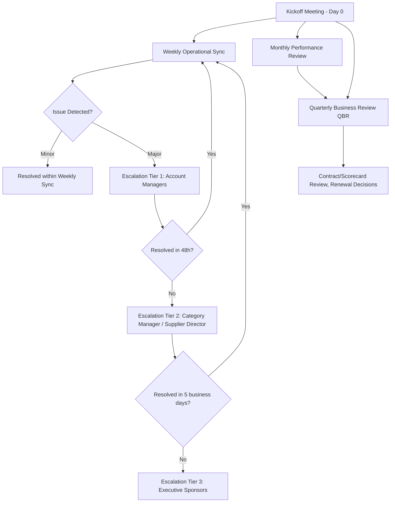
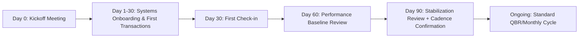

## Communication Protocols and Relationship Kickoff


### Overview

Communication Protocols and Relationship Kickoff refers to the structured set of processes, cadences, tools, and governance rules established at the start of a supplier relationship to ensure information flows predictably, escalations are unambiguous, and both parties share a common operating model from day one. This phase converts a signed contract into a functioning working relationship. In Dual Sourcing, this step is duplicated (not shared) across both suppliers — each supplier requires its own independent kickoff and protocol set, since conflating communication channels between competing/parallel suppliers introduces confidentiality risk and unclear accountability.

### Key Points

- **Kickoff is a project, not an event**: A single "kickoff meeting" is the visible artifact, but the underlying kickoff *process* includes pre-work, role mapping, systems provisioning, and protocol documentation that precede and follow it.
- **RACI clarity prevents early failure**: Most early-stage supplier relationship breakdowns trace back to ambiguous ownership of decisions (Responsible/Accountable/Consulted/Informed), not to bad faith.
- **Protocol asymmetry causes dual-sourcing risk**: If Supplier A gets weekly syncs and Supplier B gets monthly ones "because they're backup," B's data/quality visibility degrades exactly when it would need to be activated quickly.
- **Escalation paths must be pre-agreed, not improvised**: Defining escalation tiers before an issue occurs removes emotion and hierarchy politics from time-sensitive disputes.
- **Digital channel governance matters**: Which system is the "source of truth" (ERP portal vs. email vs. EDI vs. supplier portal) must be explicit, or duplicate/conflicting records emerge.

### Components of a Relationship Kickoff Program

1. **Pre-Kickoff Preparation**
   - Internal alignment meeting (procurement, quality, legal, logistics, finance stakeholders)
   - Supplier information packet: specifications, forecasts, quality standards, systems access requirements
   - Contact matrix draft (see RACI below)
2. **Kickoff Meeting Agenda (Typical Structure)**
   - Introductions and role mapping
   - Contract/scope recap (deliverables, SLAs, KPIs)
   - Systems and data exchange walkthrough (EDI, portal, APIs)
   - Communication cadence agreement
   - Escalation matrix review
   - Quality and compliance expectations (linkage to SCoC/attestation)
   - Q&A and open items log
3. **Protocol Documentation ("Working Agreement")**
   - Formalized in a Supplier Relationship Charter or Communication Plan document, appended to or referenced by the MSA
4. **Post-Kickoff Stabilization**
   - First 30/60/90-day check-in cadence
   - Early warning indicator review (first PO cycle, first delivery, first invoice)

### RACI Matrix (Illustrative Example)

| Activity | Buyer PM | Supplier Account Mgr | Quality Team | Logistics |
| --- | --- | --- | --- | --- |
| Weekly status call | A | R | C | I |
| Quality non-conformance | C | I | R/A | I |
| Delivery schedule change | R | A | I | C |
| Contract amendment | A | C | I | I |

*R = Responsible, A = Accountable, C = Consulted, I = Informed*

### Communication Cadence Framework



### Escalation Matrix (Illustrative Example)

| Tier | Trigger | Owner (Buyer Side) | Owner (Supplier Side) | Response SLA |
| --- | --- | --- | --- | --- |
| 1 | Operational issue (late shipment, minor quality deviation) | Category Buyer | Account Manager | 48 hours |
| 2 | Recurring issue, missed SLA, moderate financial impact | Category Manager | Sales/Ops Director | 5 business days |
| 3 | Contract breach risk, safety/compliance issue, major disruption | VP Procurement / Sponsor | Executive Sponsor | 24 hours (expedited) |

### Communication Channel Governance

| Channel | Purpose | System of Record? |
| --- | --- | --- |
| Supplier Portal | POs, ASN, invoices, forecasts | Yes (transactional) |
| EDI (e.g., 850/856/810) | Automated order-to-cash data exchange | Yes (transactional) |
| Email | Relationship correspondence, exceptions | No — must be logged into CRM/SRM if decision-relevant |
| Scheduled Calls | Status sync, relationship management | Minutes logged into SRM system |
| Instant messaging (Teams/Slack Connect) | Urgent operational coordination | No — informal only, not for contractual commitments |

[Inference: The above channel-to-purpose mapping reflects common industry practice; specific tool choices vary by organization's ERP/SRM stack.]

### Contact Matrix Template



```
Supplier: _______________________
Effective Date: _______________________

| Role                  | Buyer Contact      | Supplier Contact   | Escalation Tier |
|-----------------------|---------------------|----------------------|-----------------|
| Executive Sponsor     |                     |                      | 3               |
| Category Manager      |                     |                      | 2               |
| Buyer/Planner         |                     |                      | 1               |
| Quality Engineer      |                     |                      | 1/2             |
| Logistics Coordinator |                     |                      | 1               |
```

### Kickoff-to-Steady-State Timeline



### Dual Sourcing-Specific Considerations

- **Parallel, not shared, kickoffs**: Each supplier in a dual-sourcing arrangement receives an independent kickoff to avoid cross-contamination of pricing, volume allocation, or competitive information.
- **Consistent protocol depth**: Applying identical cadence and escalation rigor to both primary and secondary suppliers keeps the secondary supplier "warm" and ready for rapid activation.
- **Confidentiality clauses in kickoff materials**: Kickoff packets should explicitly reiterate that supplier-specific volume/pricing data is not to be inferred or shared across the dual-sourcing pool.
- **Differentiated volume messaging, not differentiated communication rigor**: It's acceptable (and common) for the secondary supplier to receive smaller/backup volume commitments — but the *communication infrastructure* (contacts, cadence, escalation) should remain equally robust.

### Common Pitfalls

- Treating the kickoff meeting as the entire onboarding process rather than the midpoint of a broader preparation-to-stabilization arc
- Leaving escalation tiers undefined until the first real conflict, when trust and urgency make negotiation harder
- Allowing email to become the de facto system of record for commitments that should live in the SRM/ERP system, creating audit gaps
- Under-investing in the secondary supplier's kickoff quality relative to the primary, which quietly erodes the reliability of the dual-sourcing hedge over time
- Not scheduling the 30/60/90-day stabilization reviews in advance, causing early-relationship issues to go unaddressed until the next scheduled QBR

**Related Topics**

- Supplier Relationship Charters and Working Agreement Documentation
- EDI Transaction Set Fundamentals (850, 856, 810) for Supplier Integration
- Supplier Scorecards and KPI Framework Design
- Quarterly Business Review (QBR) Structure and Facilitation
- Governance Models for Multi-Tier Supplier Ecosystems
- Dual Sourcing Volume Allocation Strategies
- Conflict Resolution Frameworks in Buyer-Supplier Relationships