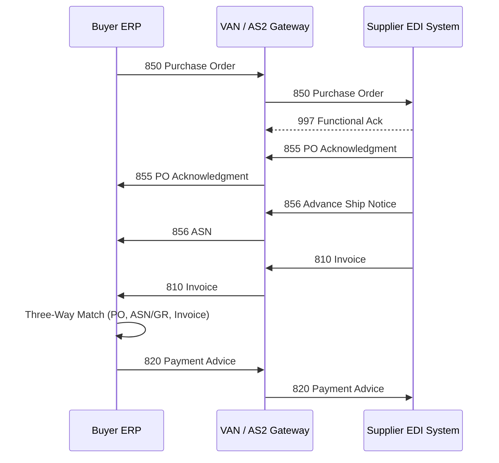
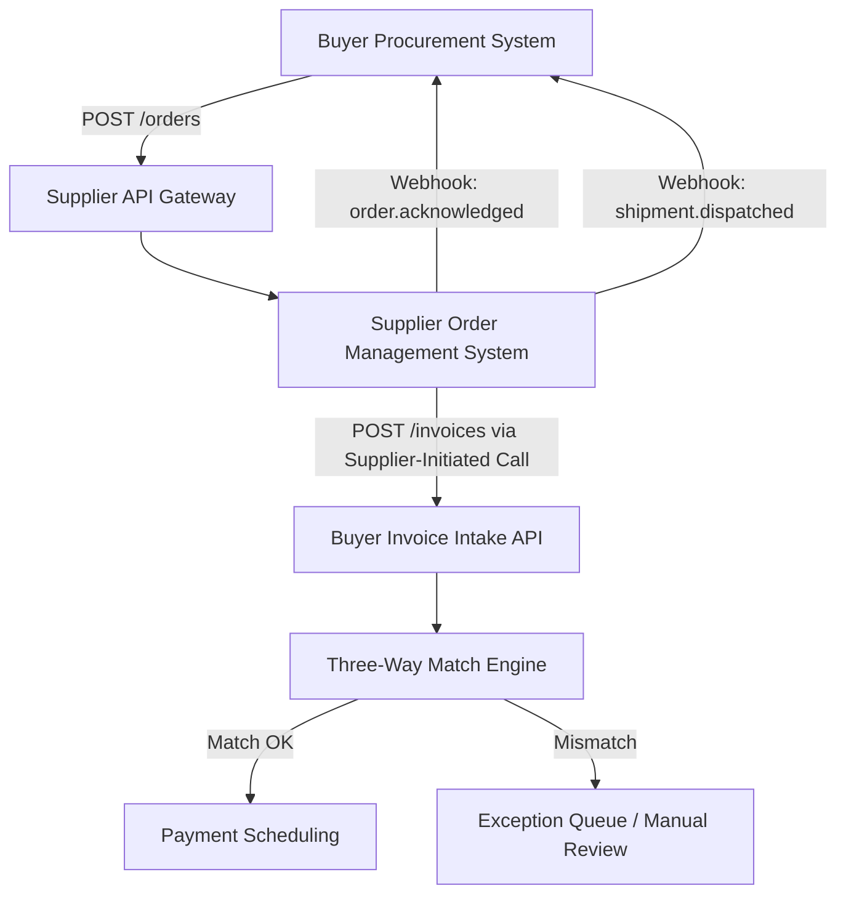
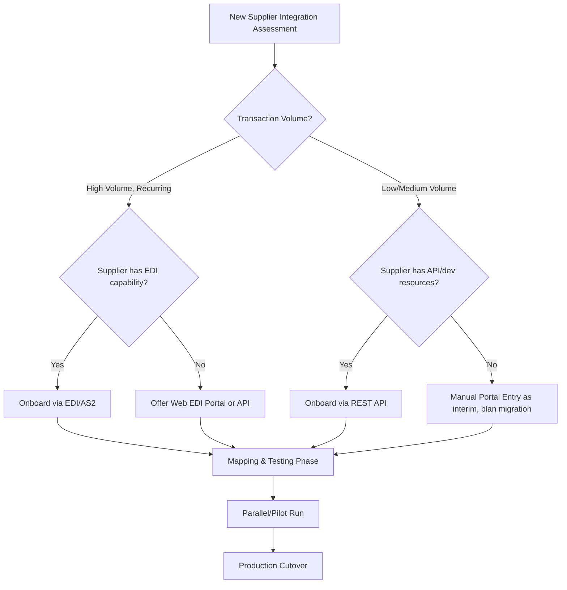

## EDI and API Integration for Orders and Invoices

### Overview

EDI (Electronic Data Interchange) and API-based integration are the two dominant technical architectures for exchanging transactional procurement documents — purchase orders, advance ship notices, invoices — between a buying organization and its suppliers without manual re-keying. EDI is a decades-old, standardized batch-messaging paradigm (X12, EDIFACT) still dominant in high-volume, mature supply chains; API integration (typically REST/JSON over HTTPS) is the modern alternative favored for real-time exchange, easier onboarding of smaller suppliers, and flexibility. Most enterprise SRM/procurement systems today operate a **hybrid model**, supporting both simultaneously depending on supplier size, technical maturity, and transaction volume — a consideration directly relevant to dual sourcing, where a primary supplier may be EDI-integrated while a backup supplier onboards faster via API or portal.

### Key Points

- **EDI standards are transport-agnostic message formats**: X12 (North America) and EDIFACT (international) define document structure; they are carried over separate transport protocols (AS2, SFTP, VAN).
- **APIs shift integration cost from the buyer's VAN infrastructure to point-to-point HTTPS calls**, but require the supplier to maintain an API-consuming or API-exposing capability — a real barrier for smaller/less mature suppliers.
- **Document parity, not format parity, is the integration goal**: Whether via EDI or API, the same logical documents (PO, ASN, Invoice) must flow; the mapping/translation layer reconciles format differences.
- **Three-way match remains the invoice control regardless of transport**: PO, goods receipt (ASN/GR), and invoice must reconcile before payment release — this business rule is independent of whether EDI 810 or a JSON invoice payload delivers the data.
- **Dual sourcing integration debt**: Onboarding a second supplier onto a *different* integration method than the primary (e.g., primary on EDI, backup on manual portal entry) creates asymmetric data latency that can delay activation during a supply disruption.

### Core EDI Transaction Sets (X12)

| EDI Transaction | Purpose | Direction |
| --- | --- | --- |
| 850 | Purchase Order | Buyer → Supplier |
| 855 | PO Acknowledgment | Supplier → Buyer |
| 856 | Advance Ship Notice (ASN) | Supplier → Buyer |
| 810 | Invoice | Supplier → Buyer |
| 820 | Payment/Remittance Advice | Buyer → Supplier |
| 997 | Functional Acknowledgment | Both (transport-level receipt confirmation) |

*(EDIFACT equivalents: ORDERS, ORDRSP, DESADV, INVOIC, REMADV)*

### EDI Transaction Flow



### Sample EDI 850 (X12) Segment Structure (Illustrative)



```
ST*850*0001
BEG*00*NE*PO123456**20260315
REF*DP*100
N1*ST*Batac LGU Warehouse*92*LOC001
PO1*1*100*EA*25.00**BP*SKU-4521
CTT*1
SE*8*0001
```

Key segments: `ST` (transaction set header), `BEG` (beginning of PO), `N1` (name/address loop), `PO1` (line item detail), `CTT` (transaction totals), `SE` (transaction set trailer).

### API-Based Integration Architecture



### Sample REST API Payload — Purchase Order (JSON)

```json
{
  "poNumber": "PO123456",
  "issueDate": "2026-03-15",
  "supplierId": "SUP-00231",
  "currency": "PHP",
  "lineItems": [
    {
      "lineNumber": 1,
      "sku": "SKU-4521",
      "description": "A4 Bond Paper, 80gsm",
      "quantity": 100,
      "unitPrice": 25.00,
      "uom": "EA"
    }
  ],
  "shipTo": {
    "name": "Batac LGU Warehouse",
    "address": "Batac City, Ilocos Norte, Philippines"
  }
}
```

### Sample Invoice Response Payload (Supplier → Buyer)

```json
{
  "invoiceNumber": "INV-98214",
  "poNumber": "PO123456",
  "invoiceDate": "2026-03-22",
  "lineItems": [
    { "lineNumber": 1, "sku": "SKU-4521", "quantityInvoiced": 100, "unitPrice": 25.00 }
  ],
  "totalAmount": 2500.00,
  "taxAmount": 300.00,
  "status": "submitted"
}
```

### Three-Way Match Logic (Pseudocode)

```python
def three_way_match(po, asn_or_gr, invoice, tolerance_pct=0.02):
    qty_variance = abs(invoice.quantity - asn_or_gr.quantity_received) / po.quantity
    price_variance = abs(invoice.unit_price - po.unit_price) / po.unit_price

    if qty_variance > tolerance_pct or price_variance > tolerance_pct:
        return "EXCEPTION"  # Route to manual review
    if invoice.quantity > po.quantity:
        return "EXCEPTION"  # Over-billing guard
    return "MATCHED"  # Eligible for payment scheduling
```

[Inference: tolerance thresholds like 2% are configurable business policy, not a technical standard — actual values vary by organization and category risk.]

### Transport Layer Comparison

| Dimension | EDI (AS2/VAN) | REST API |
| --- | --- | --- |
| Message format | X12/EDIFACT flat structure | JSON/XML |
| Transport | AS2 (point-to-point encrypted), SFTP, VAN | HTTPS/TLS |
| Onboarding time | Weeks (mapping, VAN setup, testing) | Days (API key, spec doc) |
| Best fit | High-volume, established enterprise suppliers | SMEs, fast-onboarding, low-volume suppliers |
| Real-time capability | Typically batch (near real-time with AS2) | Native real-time/webhook support |
| Error handling | 997 Functional Acknowledgment, TA1 | HTTP status codes, structured error payloads |

### Integration Onboarding Decision Path



### Dual Sourcing-Specific Considerations

- **Integration-method parity as an activation criterion**: A secondary supplier still on manual/portal-only integration should be flagged as "not activation-ready" for high-urgency substitution scenarios, since order/invoice latency will be higher than the primary.
- **Data mapping consistency**: SKU, UOM, and pricing field mappings should be normalized identically across both suppliers in the SRM master data layer, so switching volume between them doesn't require re-mapping at the moment of failover.
- **Sandbox/test environment parity**: Both suppliers' integrations should be validated against the same test-case suite (PO issuance, ASN receipt, invoice matching, error/exception handling) before either is considered production-ready.

### Common Pitfalls

- Treating EDI mapping as a one-time setup rather than a maintained artifact — supplier-side system changes silently break segment mappings
- Missing 997/acknowledgment monitoring, causing silent transaction failures to go undetected for days
- Allowing invoice tolerance thresholds to be set inconsistently across suppliers, creating uneven fraud/error exposure
- Onboarding a backup supplier via a lower-fidelity integration method "since they're just backup," then discovering data latency issues exactly when failover is needed
- Not validating character encoding and date format differences between X12 (often `CCYYMMDD`) and API JSON (`ISO 8601`) during mapping, causing silent data corruption

**Related Topics**

- AS2 Protocol Configuration and Certificate Management
- Master Data Governance (SKU, UOM Normalization Across Suppliers)
- Invoice Exception Handling and Dispute Workflow Design
- Supplier Portal vs. EDI vs. API: TCO Comparison Framework
- Webhook Reliability Patterns (Retry, Idempotency, Dead-Letter Queues)
- Three-Way and Two-Way Match Configuration Strategies
- Dual Sourcing Activation Readiness Criteria