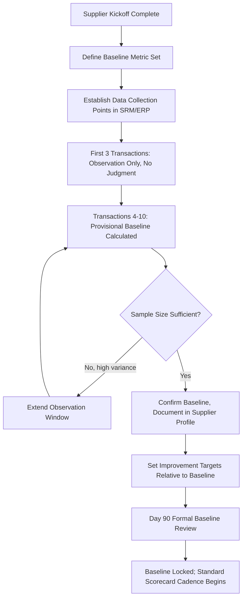
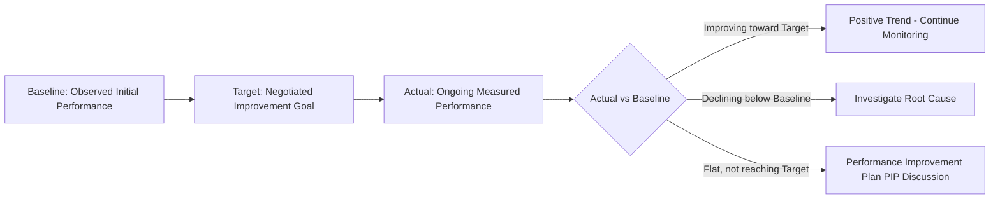

## Early-Stage Performance Baseline Setting

### Overview

Early-Stage Performance Baseline Setting is the process of establishing quantitative reference points for a new supplier's performance during the initial weeks/months of the relationship, before formal scorecarding and long-term trend analysis become statistically meaningful. The baseline serves as the "zero point" against which all future performance deviation is measured — without it, a decline from an undocumented starting state is undetectable until it becomes severe. In Dual Sourcing, baseline setting is especially critical for the secondary/backup supplier, since its performance data is often sparse (low order volume), making early, deliberate baseline capture the only reliable signal of readiness before an activation event forces reliance on it.

### Key Points

- **Baseline ≠ Target**: A baseline documents *actual observed initial performance*; a target is the *desired future state*. Conflating the two causes unrealistic expectations or, conversely, complacent acceptance of poor initial performance as "normal."
- **Small-sample statistics require care**: Early-stage data (first 3–10 transactions) has high variance; baselines set on too few data points risk being misleading. Confidence intervals — not single-point averages — should frame early conclusions.
- **Multi-dimensional, not single-metric**: A defensible baseline spans quality, delivery, responsiveness, and documentation accuracy, not just on-time delivery percentage.
- **Baseline drift must be intentional, not silent**: If a baseline is revised, the revision and rationale should be documented — otherwise scorecards lose historical comparability.
- **Dual sourcing baseline parity**: Comparing a primary supplier's mature, high-volume-derived scorecard against a secondary supplier's low-volume early baseline is statistically invalid; the secondary supplier needs its own accelerated baseline program rather than being judged against the primary's steady-state numbers.

### Core Baseline Metrics

| Category | Metric | Formula |
| --- | --- | --- |
| Delivery | On-Time Delivery Rate (OTD) | $\frac{\text{Orders Delivered On Time}}{\text{Total Orders}} \times 100$ |
| Delivery | Lead Time Variance | $\sigma$ of (Actual Lead Time − Quoted Lead Time) |
| Quality | Defect/Rejection Rate | $\frac{\text{Units Rejected}}{\text{Units Received}} \times 100$ |
| Quality | First Pass Yield (FPY) | $\frac{\text{Units Passing Inspection First Time}}{\text{Total Units Inspected}} \times 100$ |
| Responsiveness | Average Response Time to Inquiry | Mean(response timestamp − inquiry timestamp) |
| Documentation | Invoice Accuracy Rate | $\frac{\text{Invoices Matched Without Exception}}{\text{Total Invoices}} \times 100$ |
| Compliance | Attestation/Certification Currency | Boolean/percentage of required documents current |

### Baseline-Setting Timeline



### Provisional Baseline Calculation (Illustrative Example)

Given 6 initial deliveries with the following on-time status: [Yes, Yes, No, Yes, Yes, Yes]

$$\text{OTD}_{baseline} = \frac{5}{6} \times 100 = 83.3\%$$

Because $n = 6$ is small, a Wilson score interval (more robust than a normal approximation for small $n$ and proportions near 1) is preferable to communicate uncertainty:

$$CI = \frac{\hat{p} + \frac{z^2}{2n} \pm z\sqrt{\frac{\hat{p}(1-\hat{p})}{n} + \frac{z^2}{4n^2}}}{1 + \frac{z^2}{n}}$$

With $\hat{p} = 0.833$, $n = 6$, $z = 1.96$ (95% confidence), this yields a wide interval (approximately 44%–97%), which correctly signals that 83.3% should be treated as a provisional estimate rather than a confirmed steady-state rate. [Unverified: exact interval bounds depend on precise calculation; the qualitative point — small-sample OTD estimates carry wide uncertainty — is the operative takeaway.]

### Baseline Documentation Template



```
Supplier: _______________________
Baseline Period: _______________________ (e.g., first 90 days / first 10 orders)
Sample Size (n): _______________________

| Metric                  | Baseline Value | Sample Size | Confidence Note        |
|-------------------------|----------------|-------------|-------------------------|
| On-Time Delivery Rate   |                |             | Provisional / Confirmed |
| Defect Rate             |                |             |                          |
| Invoice Accuracy Rate   |                |             |                          |
| Avg. Response Time      |                |             |                          |

Baseline Confirmed By: _______________________
Date Baseline Locked: _______________________
Next Review Date: _______________________
```

### Baseline vs. Target vs. Actual Tracking



### Statistical Process Control (SPC) Framing for Early Data

Once baseline is confirmed, control limits can be established to distinguish normal variation from genuine performance shifts:

$$UCL = \bar{x} + 3\sigma, \quad LCL = \bar{x} - 3\sigma$$

Where $\bar{x}$ is the baseline mean and $\sigma$ is the baseline standard deviation. Early-stage baselines with small $n$ will have wider, less reliable control limits — a reason to treat the first 90-day baseline as provisional and re-calculate control limits once a larger sample (e.g., $n \geq 30$) accumulates. [Inference: the $n \geq 30$ threshold is a common statistical rule-of-thumb, not a fixed regulatory or contractual requirement.]

### Dual Sourcing-Specific Considerations

- **Accelerated baseline programs for secondary suppliers**: Since backup suppliers naturally receive lower order volume, consider deliberately routing a small number of "test orders" specifically to accumulate baseline data faster, rather than waiting passively for organic volume.
- **Cross-supplier metric definition consistency**: OTD, defect rate, and other formulas must be calculated identically for both primary and secondary suppliers — differing definitions (e.g., "on-time" measured to dock date vs. PO requested date) make cross-supplier comparison invalid.
- **Baseline as an activation gate**: A secondary supplier without a confirmed baseline represents an unknown-risk activation — SRM governance should flag this explicitly rather than assuming "no data" means "acceptable performance."

### Common Pitfalls

- Locking a baseline after only 1–2 transactions, producing a statistically meaningless reference point
- Silently revising baselines upward or downward without documenting rationale, undermining audit trail integrity
- Applying the primary supplier's mature scorecard thresholds directly to a newly baselined secondary supplier without adjustment
- Confusing "baseline" with "SLA target" in supplier-facing communication, creating disputes over what was actually promised versus observed
- Failing to re-baseline after a significant process change (new facility, new management, corrective action plan completion), causing stale reference points to persist

**Related Topics**

- Supplier Scorecard Design and KPI Weighting Methodologies
- Statistical Process Control (SPC) for Supplier Performance Monitoring
- Performance Improvement Plans (PIPs) and Corrective Action Governance
- Sample Size and Confidence Interval Methods for Small-n Performance Data
- Dual Sourcing Volume Allocation Strategies for Data Parity
- Quarterly Business Review (QBR) Metrics Reporting Structure