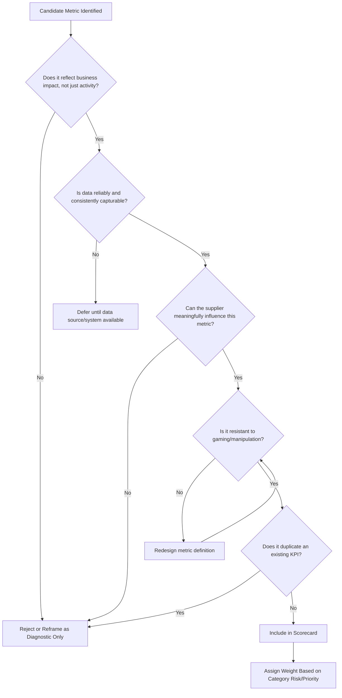
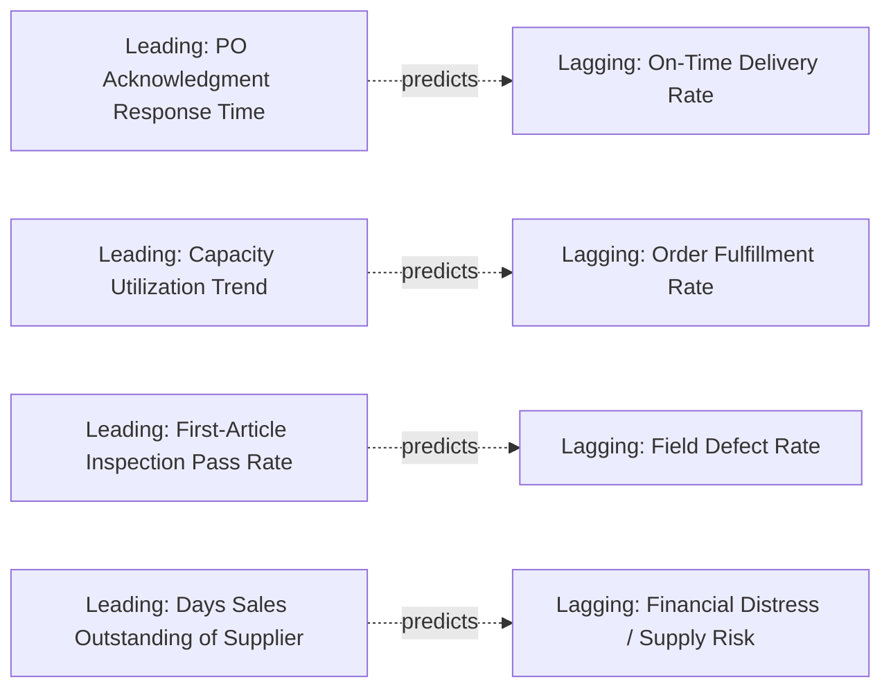

## KPI Design and Selection Principles


### Overview

KPI Design and Selection Principles govern how an organization chooses which supplier performance indicators to measure, how to define them precisely, and how to weight them into a coherent evaluation system. Poorly designed KPIs are a leading cause of dysfunctional supplier relationships — metrics that are easy to measure but disconnected from actual business risk, or that incentivize gaming rather than genuine performance improvement. In Dual Sourcing, KPI design carries additional weight: the same KPI framework must produce comparable, fair evaluations across suppliers of potentially different scale, maturity, and volume allocation, since these scores directly inform sourcing-split decisions.

### Key Points

- **Measure outcomes, not just activity**: A KPI should reflect business impact (e.g., stockout incidents caused by late delivery) rather than merely an operational count (e.g., number of shipments sent).
- **SMART criteria remain the baseline test**: Specific, Measurable, Achievable, Relevant, Time-bound — but for supplier KPIs, "Achievable" must be calibrated to what the *specific* supplier's contract and capability actually allow, not a generic industry benchmark.
- **Leading vs. lagging indicators serve different purposes**: Lagging KPIs (e.g., quarterly defect rate) confirm what happened; leading KPIs (e.g., capacity utilization trend, on-time PO acknowledgment rate) provide early warning before lagging metrics deteriorate.
- **Fewer, well-chosen KPIs outperform exhaustive dashboards**: Overloading a scorecard with 20+ metrics dilutes attention and creates conflicting signals; most mature SRM programs converge on 5–8 core KPIs per category.
- **Gaming resistance must be designed in**: Any KPI that can be satisfied without delivering the underlying intent (e.g., "on-time" defined loosely enough that early-but-incomplete shipments count) will eventually be gamed.
- **Dual sourcing requires KPI comparability, not identical targets**: The formula and data source for a KPI must be identical across suppliers; the *target* threshold can legitimately differ based on contractual commitments.

### The Four KPI Domains (Standard Framework)

| Domain | Purpose | Example KPIs |
| --- | --- | --- |
| Quality | Product/service conformance | Defect rate, First Pass Yield, Customer complaint rate |
| Delivery | Timeliness and reliability | On-Time Delivery (OTD), On-Time-In-Full (OTIF), Lead time variance |
| Cost | Financial performance and value | Price variance vs. contract, Cost avoidance/savings realized |
| Responsiveness/Service | Relationship and communication quality | Response time to inquiries, Issue resolution cycle time |

A fifth domain — **Compliance/Risk** (attestation currency, audit findings, financial health indicators) — is increasingly treated as a core pillar rather than a secondary consideration, particularly for regulated industries and dual-sourcing risk management.

### KPI Selection Decision Framework



### KPI Definition Template (Prevents Ambiguity)



```
KPI Name: On-Time-In-Full (OTIF)
Domain: Delivery
Formula: (Orders delivered on/before due date AND with full quantity) / Total Orders × 100
Data Source: ERP goods receipt timestamp vs. PO requested delivery date; ASN quantity vs. PO quantity
Measurement Frequency: Monthly, rolled up quarterly
Owner: Logistics/Buyer
Target: 95% (Tier 1 supplier); 90% (Tier 2 supplier)
Tolerance Band: ±2% before triggering review
Exclusions: Buyer-caused delays (e.g., late PO release, ASN not required for drop-ship items)
Gaming Safeguard: "Full" defined at line-item level, not order-level aggregate,
                   preventing partial-shipment inflation of the metric
```

### Weighted Scorecard Model (Illustrative)

$$S_{total} = \sum_{i=1}^{n} w_i \cdot k_i$$

Where $S_{total}$ is the composite supplier score, $k_i$ is the normalized (0–100) score for KPI $i$, and $w_i$ is its weight, with $\sum w_i = 1$.

| KPI | Weight ($w_i$) | Score ($k_i$) | Weighted Contribution |
| --- | --- | --- | --- |
| OTIF | 0.30 | 92 | 27.6 |
| Defect Rate (inverted) | 0.25 | 88 | 22.0 |
| Price Variance | 0.20 | 95 | 19.0 |
| Responsiveness | 0.15 | 80 | 12.0 |
| Compliance Currency | 0.10 | 100 | 10.0 |
| **Total** | **1.00** |  | **90.6** |

[Inference: specific weight distributions (e.g., 30/25/20/15/10) are illustrative — actual weighting should reflect category-specific risk priorities, calibrated by the procurement organization, not a universal standard.]

### Leading vs. Lagging Indicator Pairing



### Common Anti-Patterns in KPI Design

| Anti-Pattern | Problem | Fix |
| --- | --- | --- |
| Vanity metrics | Measures activity, not outcome (e.g., "number of emails sent") | Replace with outcome-linked metric |
| Metric without owner | No one accountable for acting on deviations | Assign explicit KPI owner |
| Unbounded target ("as fast as possible") | Not measurable/enforceable | Define explicit numeric threshold and timeframe |
| Single-point measurement | One bad month treated as trend | Require rolling window (e.g., 3-month average) before triggering escalation |
| Buyer-caused failure counted against supplier | Erodes trust, invites disputes | Build exclusion criteria into KPI formula |

### Dual Sourcing-Specific Considerations

- **Identical formula, differentiated target**: Both suppliers' OTIF should use the exact same calculation logic and data source fields; only the target/tolerance band should reflect differences in contracted service level.
- **Normalized scoring for volume disparity**: A secondary supplier receiving 10% of volume will have far fewer data points; percentage-based KPIs (rather than absolute counts) and confidence-adjusted scoring prevent unfair comparison against a high-volume primary.
- **Shared KPI dashboard visibility (internally)**: Procurement should be able to view both suppliers' scorecards side-by-side using consistent KPI definitions to make informed volume-reallocation decisions.
- **Risk/compliance KPI parity is non-negotiable**: Even if delivery/cost targets differ, compliance and quality KPI *definitions and minimum thresholds* should not be relaxed for a secondary supplier merely because it carries less volume.

### Common Pitfalls

- Selecting KPIs based on what's easy to extract from existing systems rather than what actually matters to the business
- Failing to define exclusions (buyer-caused delays, force majeure) up front, leading to disputes during review cycles
- Setting identical numeric targets for suppliers with fundamentally different contracted service levels, rather than differentiating targets while keeping formulas consistent
- Allowing KPI definitions to silently drift over time (e.g., changing what counts as "on-time") without version-controlling the change and re-baselining
- Building scorecards with too many KPIs, causing review meetings to become data recitation rather than decision-focused discussion

**Related Topics**

- Supplier Scorecard Design and Visualization Best Practices
- OTIF vs. OTD: Metric Selection for Delivery Performance
- Weighted Scoring Models and Sensitivity Analysis
- KPI Governance: Versioning, Change Control, and Re-Baselining
- Leading Indicator Frameworks for Supply Risk Early Warning
- Dual Sourcing Volume Allocation Based on Comparative Scorecards