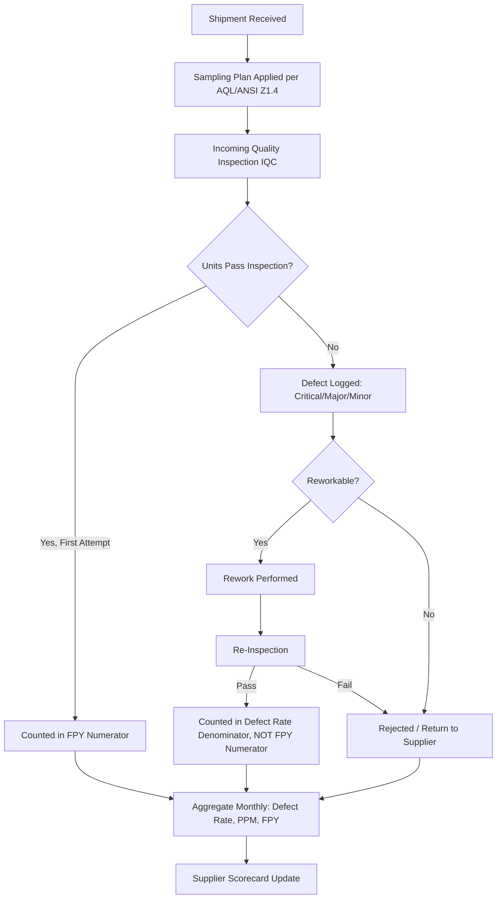
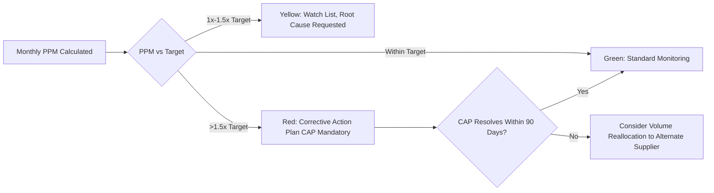

## Quality Metrics: Defect Rate, PPM, First-Pass Yield

### Overview

Defect Rate, Parts Per Million (PPM), and First-Pass Yield (FPY) are the three foundational quantitative metrics used to measure supplier-delivered product quality. They form a layered measurement system: Defect Rate provides a simple percentage-based view, PPM offers the precision needed for high-volume/low-defect environments where percentages become too small to be meaningful, and FPY measures process capability by tracking units that pass inspection without rework. In Dual Sourcing, these metrics are the primary quantitative basis for comparing quality reliability between suppliers and for setting objective activation/reallocation triggers.

### Key Points

- **PPM exists because percentages break down at scale**: A defect rate of "0.001%" is harder to communicate and compare than "10 PPM" — PPM is simply defect rate expressed at a finer granularity, standard in electronics, automotive, and precision manufacturing.
- **FPY measures process capability, not just outcome**: Unlike defect rate (pass/fail on final inspection), FPY reveals whether rework is masking underlying process issues — a supplier with high final-pass rates but low FPY is quietly absorbing cost/risk through rework rather than genuine capability.
- **Sampling methodology determines validity**: Defect rates and PPM calculated from statistically invalid sampling (e.g., inspecting only 2% of a shipment with no defined sampling plan) produce numbers that look precise but are not statistically defensible.
- **Metric definitions must be contractually fixed**: What counts as a "defect" (critical vs. major vs. minor, per AQL classification) must be defined in the quality agreement, not left to inspector discretion.
- **Dual sourcing requires identical inspection rigor**: If the primary supplier's shipments are inspected under a tighter AQL sampling plan than the secondary's, the resulting PPM/defect-rate comparison is not valid grounds for a reallocation decision.

### Metric Definitions and Formulas

**Defect Rate**

$$\text{Defect Rate} (\%) = \frac{\text{Number of Defective Units}}{\text{Total Units Inspected}} \times 100$$

**Parts Per Million (PPM)**

$$\text{PPM} = \frac{\text{Number of Defective Units}}{\text{Total Units Inspected}} \times 1{,}000{,}000$$

**First-Pass Yield (FPY)**

$$\text{FPY} (\%) = \frac{\text{Units Passing Inspection Without Rework}}{\text{Total Units Inspected}} \times 100$$

**Rolled Throughput Yield (RTY)** — for multi-step processes, the compounded yield across $n$ sequential process steps:

$$RTY = \prod_{i=1}^{n} FPY_i$$

This shows why a supplier with five process steps each at 98% FPY delivers an overall yield of only $0.98^5 \approx 90.4\%$, not 98% — a common misunderstanding when suppliers report only final-step FPY.

### Worked Example

A shipment of 5,000 units is inspected; 12 units are rejected for defects, and of the 4,988 accepted units, 40 required rework before passing:

$$\text{Defect Rate} = \frac{12}{5000} \times 100 = 0.24\%$$


$$\text{PPM} = \frac{12}{5000} \times 1{,}000{,}000 = 2{,}400 \text{ PPM}$$


$$\text{FPY} = \frac{5000 - 12 - 40}{5000} \times 100 = \frac{4948}{5000} \times 100 = 98.96\%$$

Note that the 0.24% defect rate looks excellent in isolation, but FPY reveals that 40 additional units (0.8% of the shipment) only passed after rework — a signal the defect rate alone would miss.

### Quality Inspection and Data Flow



### AQL Sampling Plan Reference (ANSI/ASQ Z1.4, Illustrative)

| Lot Size | Sample Size (General Inspection Level II) | AQL 1.0 Accept/Reject |
| --- | --- | --- |
| 501–1,200 | 80 | Ac 2 / Re 3 |
| 1,201–3,200 | 125 | Ac 3 / Re 4 |
| 3,201–10,000 | 200 | Ac 5 / Re 6 |

[Unverified: exact sample sizes and accept/reject numbers should be confirmed against the current published ANSI/ASQ Z1.4 or ISO 2859-1 tables, as this excerpt is illustrative of the structure rather than a verbatim reproduction of the full standard.]

### Defect Severity Classification (Typical Structure)

| Class | Definition | Example | Typical Action |
| --- | --- | --- | --- |
| Critical | Safety hazard or total functional failure | Structural failure, electrical short | Immediate rejection, root cause investigation mandatory |
| Major | Significant functional impairment | Missing component, dimensional out-of-spec | Reject lot or 100% sort, corrective action required |
| Minor | Cosmetic or negligible functional impact | Minor surface blemish | May be accepted with note, tracked for trend |

### PPM Trend Monitoring (Control Chart Logic)

```python
def check_ppm_trend(monthly_ppm_history, target_ppm=500, trend_window=3):
    recent = monthly_ppm_history[-trend_window:]
    avg_recent = sum(recent) / len(recent)

    if avg_recent > target_ppm * 1.5:
        return "ALERT: Sustained PPM exceeds 150% of target - trigger CAP"
    elif all(recent[i] < recent[i-1] for i in range(1, len(recent))):
        return "IMPROVING: Consecutive month-over-month PPM reduction"
    else:
        return "STABLE: Within normal variation"
```

### Quality Metric Escalation Thresholds (Illustrative)



### Industry Benchmark Context (Illustrative Ranges)

| Industry | Typical PPM Target Range |
| --- | --- |
| Automotive (Tier 1) | 10–100 PPM |
| Electronics/Semiconductor | 50–500 PPM |
| General Manufacturing/Government Procurement | 500–5,000 PPM |

[Speculation: these ranges are commonly cited industry heuristics and vary considerably by component criticality, contract terms, and maturity of the specific supply base — they should not be treated as fixed benchmarks without sector-specific validation.]

### Dual Sourcing-Specific Considerations

- **Identical AQL sampling plans across suppliers**: PPM/defect rate comparisons used to justify volume shifts between primary and secondary suppliers are only valid if both are inspected under the same sampling rigor and lot-size-to-sample-size mapping.
- **FPY as an early differentiator**: For a newly onboarded secondary supplier with limited shipment volume, FPY (measurable even on small lots) can provide an earlier capability signal than PPM, which requires larger sample sizes to stabilize statistically.
- **Quality data as a reallocation trigger, not just a scorecard entry**: Mature dual-sourcing programs define explicit PPM/defect-rate thresholds that automatically trigger a volume-split review, rather than relying solely on qualitative account manager judgment.

### Common Pitfalls

- Comparing PPM figures across suppliers inspected under different sampling plans or AQL levels, producing an apples-to-oranges conclusion
- Reporting only final defect rate while omitting FPY, hiding rework costs and process instability from performance reviews
- Using RTY-uninformed single-step FPY figures when the actual process involves multiple sequential steps, overstating true end-to-end yield
- Failing to define defect severity classification contractually, leading to disputes over whether a given issue counts as "major" or "minor"
- Drawing conclusions from PPM trends based on too few inspected units, before the sample size is large enough for the metric to be statistically stable

**Related Topics**

- AQL Sampling Plans and Statistical Lot Acceptance (ANSI/ASQ Z1.4, ISO 2859-1)
- Six Sigma and Process Capability Indices (Cpk, Cp) for Supplier Quality
- Root Cause Analysis Methods (5 Whys, Fishbone/Ishikawa, 8D Reports)
- Corrective Action Plan (CAP) Governance and Escalation Frameworks
- Rolled Throughput Yield and Multi-Step Process Quality Modeling
- Dual Sourcing Volume Reallocation Trigger Design