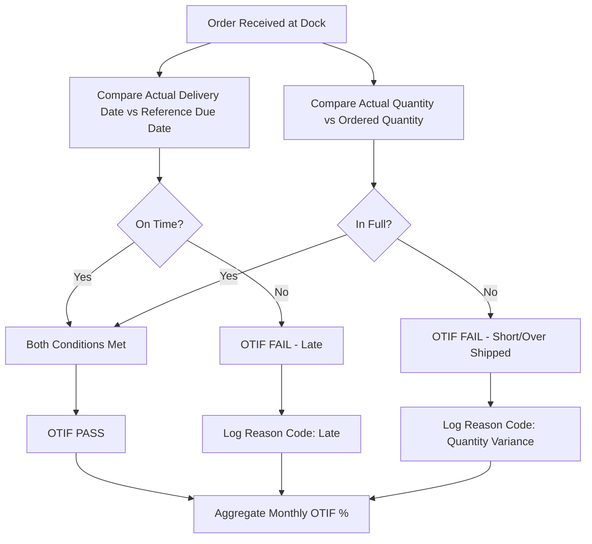
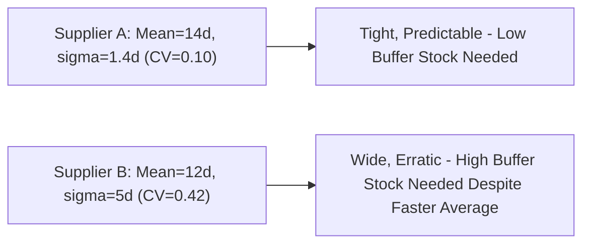

## Delivery Metrics: On-Time-in-Full and Lead-Time Reliability

### Overview

On-Time-in-Full (OTIF) and Lead-Time Reliability are the two primary metrics used to quantify a supplier's dependability in meeting delivery commitments. OTIF is a compound, binary-per-order metric that captures both timing and completeness in a single figure, while Lead-Time Reliability measures the consistency (not just average speed) of a supplier's quoted-to-actual lead time performance. Together they answer two distinct questions: "Did this specific order arrive correctly?" (OTIF) and "Can I predict when future orders will arrive?" (Lead-Time Reliability). In Dual Sourcing, lead-time reliability is often more operationally decisive than raw OTIF percentage, because a secondary supplier's *variance* in lead time — not just its average — determines how much safety stock or buffer time is required to make it a credible backup.

### Key Points

- **OTIF is compound and strict by design**: An order that arrives on time but short-shipped, or complete but late, both count as OTIF failures — this "AND" logic prevents suppliers from optimizing one dimension at the expense of the other.
- **Averages hide risk; variance reveals it**: Two suppliers with identical average lead time can present very different operational risk if one has tight variance and the other swings widely — this is why lead-time reliability must be measured as a distribution, not a single mean.
- **"On-time" requires an unambiguous reference point**: On-time relative to the *original requested date*, the *supplier-confirmed date*, or the *last-revised date* produce materially different OTIF results — the reference point must be fixed contractually.
- **Buffer/safety stock sizing is a direct function of lead-time variance**, not average lead time — this is the most consequential downstream use of this metric in inventory planning.
- **Dual sourcing viability hinges on reliability, not just speed**: A secondary supplier with a longer but highly consistent lead time can be operationally preferable to one with a shorter but erratic lead time.

### Metric Definitions and Formulas

**On-Time Delivery (OTD)** — timing only:

$$OTD (\%) = \frac{\text{Orders Delivered On or Before Due Date}}{\text{Total Orders}} \times 100$$

**In-Full Rate** — completeness only:

$$\text{In-Full} (\%) = \frac{\text{Orders Delivered at 100\% of Ordered Quantity}}{\text{Total Orders}} \times 100$$

**On-Time-In-Full (OTIF)** — compound, order counts only if BOTH conditions hold:

$$OTIF (\%) = \frac{\text{Orders Meeting BOTH On-Time AND In-Full Criteria}}{\text{Total Orders}} \times 100$$

Critically, $OTIF \neq OTD \times \text{In-Full}$ in general, since the two conditions can fail on overlapping or non-overlapping order sets; OTIF must be calculated per-order (both conditions checked on the same order), not derived by multiplying the two independent rates.

**Lead-Time Variance / Reliability** — using standard deviation of the delta between actual and quoted lead time:

$$\sigma_{LT} = \sqrt{\frac{1}{n}\sum_{i=1}^{n}(LT_{actual,i} - LT_{quoted,i})^2}$$

**Coefficient of Variation (CV)** — normalizes variance relative to mean, enabling comparison between suppliers with different average lead times:

$$CV_{LT} = \frac{\sigma_{LT}}{\bar{LT}_{actual}}$$

A lower CV indicates a more *predictable* supplier, independent of whether their absolute lead time is long or short.

### Worked Example

| Order | Quoted Lead Time (days) | Actual Lead Time (days) | Qty Ordered | Qty Delivered |
| --- | --- | --- | --- | --- |
| 1 | 14 | 13 | 500 | 500 |
| 2 | 14 | 17 | 500 | 500 |
| 3 | 14 | 14 | 500 | 480 |
| 4 | 14 | 15 | 500 | 500 |
| 5 | 14 | 14 | 500 | 500 |

- On-Time (≤ quoted date): Orders 1, 3, 5 → $OTD = 3/5 = 60\%$
- In-Full (100% qty): Orders 1, 2, 4, 5 → $\text{In-Full} = 4/5 = 80\%$
- OTIF (both conditions on same order): Only Orders 1 and 5 qualify → $OTIF = 2/5 = 40\%$

This illustrates why OTIF is typically lower than either component rate alone, and why reporting only OTD or In-Full separately can materially overstate actual delivery performance.

Lead-time deltas: $[-1, +3, 0, +1, 0]$

$$\bar{\Delta} = \frac{-1+3+0+1+0}{5} = 0.6 \text{ days (mean bias, slightly late on average)}$$

$$\sigma_{LT} = \sqrt{\frac{(-1.6)^2+(2.4)^2+(-0.6)^2+(0.4)^2+(-0.6)^2}{5}} \approx 1.36 \text{ days}$$

### OTIF Calculation Flow

### Reference Date Selection (Critical Configuration Decision)

| Reference Point | Description | Effect on OTIF |
| --- | --- | --- |
| Original PO Requested Date | Buyer's initial ask | Strictest — penalizes supplier for any negotiated extension |
| Supplier-Confirmed Date (PO Ack / EDI 855) | Date supplier committed to after acknowledgment | Fairer — measures adherence to supplier's own commitment |
| Last-Revised/Mutually Agreed Date | Most recent jointly agreed date | Most lenient — can mask chronic re-negotiation as good performance |

[Inference: Most mature SRM programs anchor OTIF to the supplier-confirmed date rather than the original request, since this measures reliability against what the supplier actually promised — but the specific choice is a policy decision, not a technical standard.]

### Lead-Time Reliability Distribution (Conceptual)

### Safety Stock Sizing from Lead-Time Variance (Standard Formula)

$$SS = z \cdot \sigma_{LT} \cdot \sqrt{\bar{D}} \quad \text{(demand variance negligible case)}$$

or more completely, incorporating both demand and lead-time variability:

$$SS = z \cdot \sqrt{\bar{LT} \cdot \sigma_D^2 + \bar{D}^2 \cdot \sigma_{LT}^2}$$

Where $z$ is the service-level factor (e.g., 1.65 for 95% service level), $\bar{D}$ is average demand, $\sigma_D$ is demand standard deviation, and $\sigma_{LT}$ is lead-time standard deviation. This formula demonstrates directly why a supplier's lead-time *variance* — not average lead time — is the operative driver of required safety stock. [Inference: this is a standard inventory-theory formula (Bookbinder & Tan style); real-world implementations may use variants depending on demand distribution assumptions.]

### OTIF Reason Code Taxonomy (for Root Cause Tracking)

| Reason Code | Category |
| --- | --- |
| LATE-PROD | Late due to supplier production delay |
| LATE-TRANS | Late due to transportation/logistics |
| SHORT-SHIP | Delivered less than ordered quantity |
| OVER-SHIP | Delivered more than ordered quantity (also an OTIF fail under strict definitions) |
| BUYER-DELAY | Buyer-caused (late PO release, ASN not required) — should be excluded from supplier's OTIF |
| DOC-MISMATCH | Documentation discrepancy despite correct physical delivery |

### Dual Sourcing-Specific Considerations

- **Lead-time CV as an activation-readiness filter**: A secondary supplier with a high coefficient of variation, even with an acceptable average lead time, should be treated cautiously for emergency activation scenarios where predictability matters more than raw speed.
- **Buffer-adjusted comparison, not raw OTIF comparison**: When comparing primary vs. secondary supplier delivery performance, factor in that the secondary may need a longer contractual lead time buffer to achieve comparable *reliability*, even if its OTIF percentage looks similar on paper.
- **Consistent reference-date policy across both suppliers**: Anchoring one supplier's OTIF to the original PO date and the other to a renegotiated date would make any comparative sourcing-allocation decision invalid.

### Common Pitfalls

- Reporting OTD and In-Full as separate percentages without also calculating true compound OTIF, overstating actual reliability
- Multiplying independent OTD and In-Full rates to "estimate" OTIF rather than calculating it per-order — this produces a statistically incorrect approximation
- Comparing suppliers on average lead time alone while ignoring variance, leading to inventory stockouts despite a "fast" average
- Allowing the on-time reference date to silently shift to the most recent renegotiated date, masking a pattern of chronic delay renegotiation as strong OTIF performance
- Failing to exclude buyer-caused delays from supplier OTIF calculations, creating unfair scorecards and relationship friction

**Related Topics**

- Safety Stock and Inventory Buffer Sizing Methodologies
- Statistical Process Control for Lead-Time Monitoring
- EDI 855/856 Data Capture for Delivery Performance Tracking
- Root Cause Coding and Reason Code Taxonomy Design
- Supplier Scorecard Weighting Between Speed and Predictability
- Dual Sourcing Buffer and Contingency Lead-Time Planning