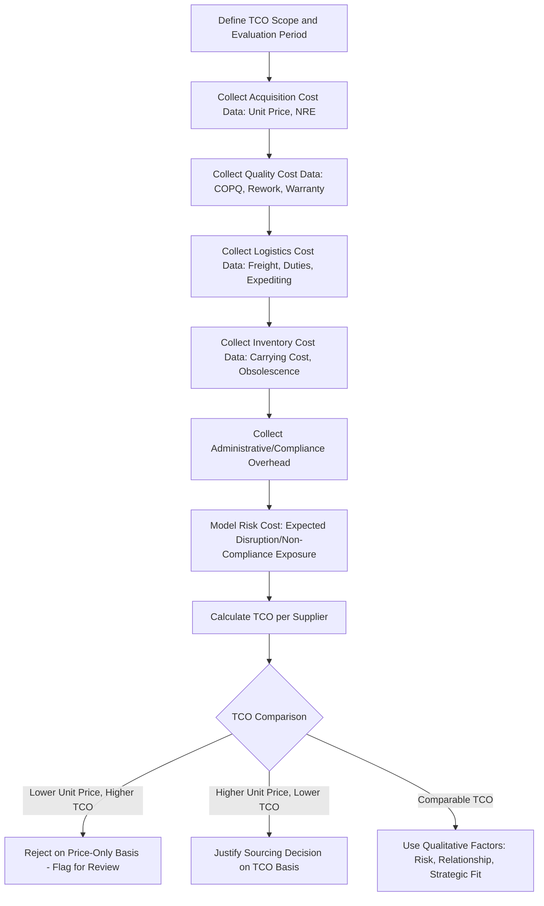
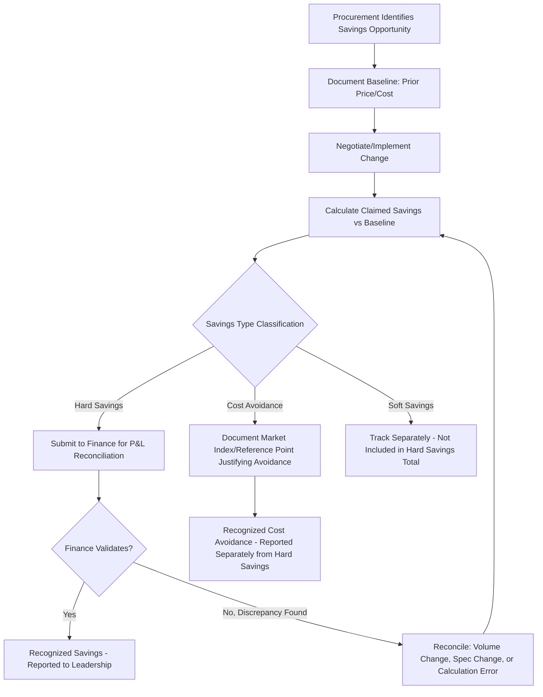

## Cost and Value Metrics: TCO and Savings Tracking

### Overview

Total Cost of Ownership (TCO) and Savings Tracking are the frameworks used to evaluate supplier cost performance beyond unit purchase price. TCO captures the full lifecycle economic impact of a sourcing decision — acquisition, operating, quality, logistics, and disposal costs — while Savings Tracking formalizes how procurement-driven cost improvements are measured, classified, and validated against a finance-recognized baseline. In Dual Sourcing, both frameworks matter for a specific reason: a slightly higher unit price from a secondary supplier can be economically justified once TCO (reduced supply-risk cost, avoided expediting fees, avoided stockout cost) is properly modeled — a comparison that unit-price-only analysis will systematically misjudge.

### Key Points

- **Unit price is a small fraction of TCO in most categories**: Freight, quality failure cost, inventory carrying cost, and administrative overhead are frequently understated or omitted entirely from naive price comparisons.
- **Savings must be reconciled against a finance baseline, not a procurement estimate**: "Savings" claimed by procurement that finance cannot trace to the P&L is a leading source of credibility loss for sourcing organizations.
- **Cost avoidance and cost reduction are distinct categories and must not be conflated**: Cost reduction lowers actual spend versus prior spend; cost avoidance prevents a cost increase that would otherwise have occurred (e.g., absorbing a raw material inflation increase) — both are legitimate, but mixing them in a single "savings" figure without labeling misleads stakeholders.
- **Dual sourcing has a quantifiable TCO benefit (risk mitigation value)** that a single-sourcing TCO model omits entirely — this value should be explicitly modeled, not treated as an unquantified qualitative benefit.
- **Should-cost modeling** provides an independent cost baseline against which supplier-quoted prices can be evaluated, reducing reliance on negotiation leverage alone.

### TCO Component Framework

| Cost Category | Examples |
| --- | --- |
| Acquisition Cost | Unit price, tooling, setup/NRE (non-recurring engineering) fees |
| Quality Cost | Cost of Poor Quality (COPQ): rework, scrap, warranty claims, inspection labor |
| Logistics Cost | Freight, customs/duties, packaging, expediting fees |
| Inventory Cost | Carrying cost of safety stock, obsolescence risk |
| Administrative Cost | PO processing, supplier management overhead, audit/compliance cost |
| Risk Cost | Expected cost of supply disruption, quality escape, non-compliance penalty |
| End-of-Life Cost | Disposal, warranty liability, decommissioning |

### TCO Formula (General Structure)

$$TCO = P_{unit} \times Q + C_{quality} + C_{logistics} + C_{inventory} + C_{admin} + C_{risk} - C_{disposal\_credit}$$

Where $P_{unit} \times Q$ is base acquisition spend and each $C$ term represents the category-specific cost accumulated over the evaluation period (typically annualized or per-contract-term).

### Worked TCO Comparison Example

| Cost Element | Supplier A (Primary, Lower Unit Price) | Supplier B (Secondary, Higher Unit Price) |
| --- | --- | --- |
| Unit Price × Annual Volume | $500,000 | $540,000 |
| Freight (higher for B, closer for A) | $15,000 | $8,000 |
| Cost of Poor Quality (COPQ) | $22,000 (higher defect rate) | $6,000 |
| Expediting Fees (A has longer, less reliable lead time) | $18,000 | $2,000 |
| Safety Stock Carrying Cost | $25,000 (higher due to lead-time variance) | $10,000 |
| **TCO Total** | **$580,000** | **$566,000** |

Despite Supplier B's higher unit price ($40,000 more), the fully loaded TCO is $14,000 *lower* once quality, logistics, and inventory-carrying costs are included — a conclusion invisible to unit-price-only comparison. [Inference: this is an illustrative worked example; actual cost figures must be derived from real supplier-specific data.]

### TCO Evaluation Workflow

### Savings Classification Taxonomy

| Category | Definition | P&L Impact | Example |
| --- | --- | --- | --- |
| Hard Savings (Cost Reduction) | Actual reduction in spend vs. prior period, same/comparable scope | Directly reduces budgeted spend | Renegotiated unit price from $10 to $9 |
| Cost Avoidance | Prevented cost increase that would otherwise have occurred | No P&L reduction, but avoids budget overrun | Held price flat despite a 5% market index increase |
| Soft Savings | Efficiency/productivity gains not directly tied to unit spend | Indirect/non-quantifiable in P&L terms | Reduced PO processing time via automation |
| Value Improvement | Non-cost benefit (quality, service, risk reduction) | Not a savings claim per se | Improved OTIF reducing stockout risk |

### Savings Validation and Reconciliation Flow

### Savings Calculation Example

Baseline price: $12.50/unit; negotiated new price: $11.75/unit; annual volume: 40,000 units

$$\text{Hard Savings} = (P_{baseline} - P_{new}) \times Q = (12.50 - 11.75) \times 40{,}000 = \$30{,}000$$

If, separately, a raw material index increase would have pushed the price to $13.20/unit absent negotiation:

$$\text{Cost Avoidance} = (P_{would\_have\_been} - P_{actual}) \times Q = (13.20 - 11.75) \times 40{,}000 = \$58{,}000$$

These two figures ($30,000 hard savings + $58,000 cost avoidance) must be reported as **separate line items**, not summed into a single "$88,000 in savings" claim, since only the hard savings portion is finance-traceable to actual reduced spend.

### Should-Cost Modeling (Independent Price Benchmark)

$$\text{Should-Cost} = C_{materials} + C_{labor} + C_{overhead} + C_{margin}$$

Where each component is independently estimated (e.g., material cost from commodity indices, labor from regional wage/productivity data, overhead from industry-standard burden rates, margin from typical category margin benchmarks) to produce a target price independent of the supplier's quote — used to identify negotiation gaps or validate that a quote is reasonable.

[Inference: should-cost modeling methodology and data sources vary significantly by category and are often supported by specialized third-party cost-modeling tools or services rather than built entirely in-house.]

### Dual Sourcing TCO: Risk-Adjusted Value

A key TCO extension for dual sourcing explicitly quantifies the value of supply continuity:

$$C_{risk} = P(\text{disruption}) \times \text{Impact}_{\text{disruption}}$$

Where $P(\text{disruption})$ is the estimated probability of a supply disruption from single-sourcing (informed by supplier risk scoring), and $\text{Impact}_{\text{disruption}}$ is the estimated cost of that disruption (lost production, expedited alternative sourcing, customer penalty exposure). Comparing single-sourcing TCO (lower acquisition cost, higher $C_{risk}$) against dual-sourcing TCO (potentially higher acquisition cost, near-zero $C_{risk}$) provides a defensible quantitative basis for dual-sourcing investment decisions, rather than treating risk mitigation as an unpriced qualitative argument.

### Common Pitfalls

- Comparing suppliers on unit price alone, ignoring freight, quality, and inventory-carrying cost differences that can reverse the economic conclusion
- Conflating cost avoidance with hard savings in leadership reporting, damaging procurement's credibility when finance cannot reconcile the claimed number
- Failing to define and document the baseline price/cost before negotiation, making savings claims unverifiable after the fact
- Treating dual-sourcing risk mitigation as a purely qualitative benefit rather than quantifying it via expected disruption cost, weakening the business case for maintaining a secondary source
- Using should-cost models built on stale commodity/labor data, producing benchmark prices that no longer reflect current market conditions

**Related Topics**

- Cost of Poor Quality (COPQ) Measurement and Allocation
- Should-Cost Modeling Techniques and Data Sources
- Procurement Savings Governance and Finance Reconciliation Processes
- Supply Risk Quantification and Expected Value Modeling
- Category Management and Total Cost Benchmarking
- Dual Sourcing Business Case Development