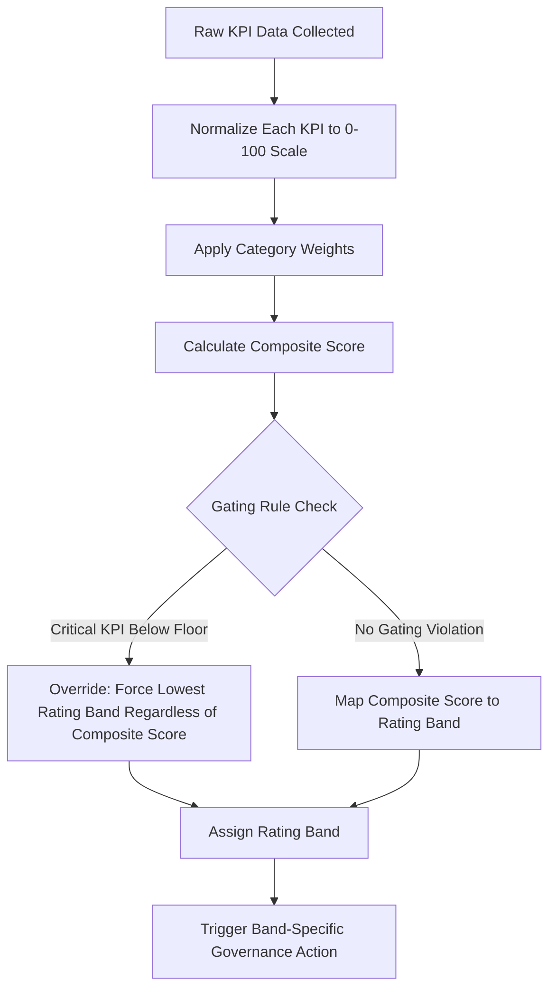
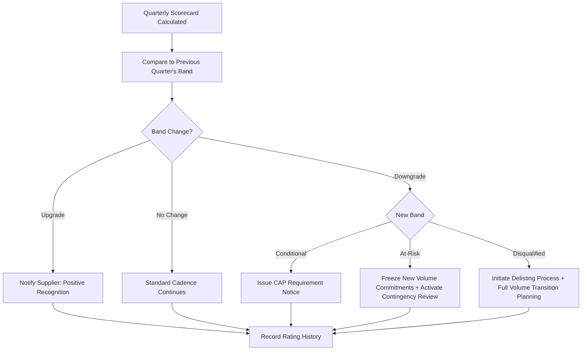

## Weighted Supplier Scorecards and Rating Bands

### Overview

Weighted Supplier Scorecards and Rating Bands are the mechanisms by which individual KPI measurements (quality, delivery, cost, responsiveness, compliance) are combined into a single composite score and translated into a categorical rating (e.g., Preferred, Approved, Conditional, At-Risk) that drives sourcing decisions. The scorecard is the aggregation layer sitting above individual KPIs; the rating band is the decision layer that converts a numeric score into an actionable classification. In Dual Sourcing, the scorecard and rating band system is the formal mechanism that determines volume allocation splits and triggers activation or deactivation of a secondary supplier — making its design and governance directly consequential to sourcing resilience, not merely a reporting exercise.

### Key Points

- **Weights encode strategic priority, not statistical importance**: A category assigned 30% weight isn't necessarily 30% "more variable" — it reflects that the organization considers it 30% as important to the sourcing decision, a policy choice requiring cross-functional agreement (procurement, quality, finance, operations).
- **Normalization is required before weighting**: Raw KPI values are on different scales (percentages, days, dollars); each must be normalized to a common scale (typically 0–100) before weights can be meaningfully applied.
- **Rating bands must have defined, non-overlapping boundaries with named actions attached**: A rating without a corresponding governance action (e.g., "Conditional" triggers mandatory CAP) is descriptive only and doesn't drive behavior.
- **Composite scores can mask category-level failure**: A supplier can achieve an acceptable overall score while failing critically in one domain (e.g., compliance) if weights allow strong performance elsewhere to compensate — many mature scorecards apply "gating" rules to prevent this.
- **Dual sourcing scorecards must be comparably calibrated**: Rating band thresholds and KPI weights must be identical across primary and secondary suppliers in the same category; otherwise, a "Preferred" rating for one and "Approved" for another isn't a meaningful basis for reallocation decisions.

### Scorecard Architecture



### KPI Normalization Methods

**Linear normalization (higher-is-better metrics, e.g., OTIF, FPY):**

$$k_{norm} = \frac{x - x_{min}}{x_{max} - x_{min}} \times 100$$

**Inverted normalization (lower-is-better metrics, e.g., defect rate, PPM):**

$$k_{norm} = \left(1 - \frac{x - x_{min}}{x_{max} - x_{min}}\right) \times 100$$

**Target-relative normalization (common in practice — score relative to a defined target, capped at 100):**

$$k_{norm} = \min\left(\frac{x}{x_{target}} \times 100,\ 100\right) \quad \text{(higher-is-better)}$$

[Inference: target-relative normalization is widely used in practice because it ties scoring directly to contractual targets rather than a floating min/max range that shifts as new data arrives — but the specific method chosen is an organizational policy decision.]

### Worked Composite Score Example

| KPI | Raw Value | Target | Normalized Score | Weight | Weighted Score |
| --- | --- | --- | --- | --- | --- |
| OTIF | 91% | 95% | $\min(91/95 \times 100, 100) = 95.8$ | 0.30 | 28.7 |
| Defect Rate (PPM) | 800 PPM | 500 PPM target (lower better) | $\min(500/800 \times 100, 100) = 62.5$ | 0.25 | 15.6 |
| Cost Variance | -1% (favorable) | 0% | 100 (capped, favorable variance) | 0.20 | 20.0 |
| Responsiveness | 1.2 days avg | 1.0 day target | $\min(1.0/1.2 \times 100, 100) = 83.3$ | 0.15 | 12.5 |
| Compliance Currency | 100% current | 100% | 100 | 0.10 | 10.0 |
| **Composite Score** |  |  |  | **1.00** | **86.8** |

### Rating Band Structure (Illustrative Model)

| Rating Band | Score Range | Typical Governance Action |
| --- | --- | --- |
| Preferred/Strategic | 90–100 | Eligible for volume growth, long-term contract renewal priority |
| Approved | 75–89 | Standard business continues, routine monitoring |
| Conditional | 60–74 | Mandatory Corrective Action Plan (CAP), increased review frequency |
| At-Risk | 40–59 | Volume freeze, executive review, contingency sourcing activated |
| Disqualified | Below 40 | Sourcing suspended, delisting review initiated |

[Inference: the specific numeric boundaries and band count above are illustrative — organizations calibrate these based on category risk tolerance, and some use as few as 3 bands (Green/Yellow/Red) or as many as 6.]

### Gating Rules (Preventing Compensatory Masking)

```python
def apply_gating_rules(composite_score, kpi_scores):
    # Gating rule: compliance/safety floors override composite score
    if kpi_scores.get("compliance_currency", 100) < 100:
        return "Disqualified"  # Non-negotiable floor
    if kpi_scores.get("critical_defect_ppm_score", 100) < 50:
        return "At-Risk"  # Force downgrade regardless of composite
    return map_score_to_band(composite_score)

def map_score_to_band(score):
    if score >= 90: return "Preferred"
    elif score >= 75: return "Approved"
    elif score >= 60: return "Conditional"
    elif score >= 40: return "At-Risk"
    else: return "Disqualified"
```

### Rating Band Transition and Governance Flow



### Scorecard Governance Documentation Template



```
Supplier: _______________________
Scorecard Period: Q___  ____ (Year)

| KPI Category      | Weight | Raw Value | Normalized Score | Weighted Score |
|--------------------|--------|-----------|-------------------|-----------------|
| Delivery (OTIF)    |        |           |                   |                 |
| Quality (PPM)      |        |           |                   |                 |
| Cost               |        |           |                   |                 |
| Responsiveness     |        |           |                   |                 |
| Compliance         |        |           |                   |                 |

Composite Score: _______
Gating Rule Triggered: Y/N — Detail: _______________________
Rating Band Assigned: _______________________
Previous Quarter Band: _______________________
Governance Action Required: _______________________
Reviewed By: _______________________
```

### Weight Sensitivity Analysis (Why Weight Governance Matters)

Using the worked example above, if Cost weight were increased from 0.20 to 0.35 (reallocating 0.15 from Quality):

$$\text{New Composite} = 28.7 + (0.10 \times 62.5) + (0.35 \times 100) + 12.5 + 10.0 = 28.7 + 6.25 + 35.0 + 12.5 + 10.0 = 92.45$$

This single reweighting shifts the supplier from "Approved" (86.8) to "Preferred" (92.45) *without any actual performance change* — demonstrating why weight-setting requires formal cross-functional governance and change control, not ad hoc adjustment by an individual category manager.

### Dual Sourcing-Specific Considerations

- **Identical weighting schema across suppliers in the same category**: Applying different weights to primary vs. secondary supplier scorecards (even with good intentions, such as "backup suppliers should be weighted more on reliability") undermines the comparability needed for objective reallocation decisions.
- **Rating band as the activation trigger**: A common dual-sourcing governance pattern ties secondary-supplier activation directly to rating band status — e.g., a secondary supplier must maintain "Approved" or better to remain eligible for immediate activation without additional review.
- **Band-transition symmetry**: The same downgrade triggers (Conditional → CAP, At-Risk → volume freeze) should apply equally to whichever supplier — primary or secondary — falls into that band, preventing an implicit "backup suppliers get a pass" bias.

### Common Pitfalls

- Allowing category weights to be adjusted informally or per-review-cycle without change control, enabling unintentional (or deliberate) score manipulation
- Omitting gating rules, allowing strong cost/delivery performance to numerically offset a critical compliance or safety failure
- Using different rating band thresholds for different suppliers "because they're different tiers," when the actual intent should be different KPI *targets* feeding into the same normalization and banding logic
- Failing to document rating band history, making it impossible to demonstrate the trajectory that led to a delisting decision if legally challenged
- Treating the composite score as precise to the decimal point rather than acknowledging it as a policy-weighted approximation, leading to disputes over marginal differences (e.g., 74.8 vs. 75.0 crossing a band boundary)

**Related Topics**

- KPI Normalization Techniques for Heterogeneous Metrics
- Gating Rules and Compensatory Scoring Risk in Composite Indices
- Supplier Rating Governance and Change Control Processes
- Corrective Action Plan (CAP) Triggers and Escalation Design
- Dual Sourcing Activation Criteria Tied to Scorecard Status
- Weight Sensitivity Analysis and Scorecard Audit Methods