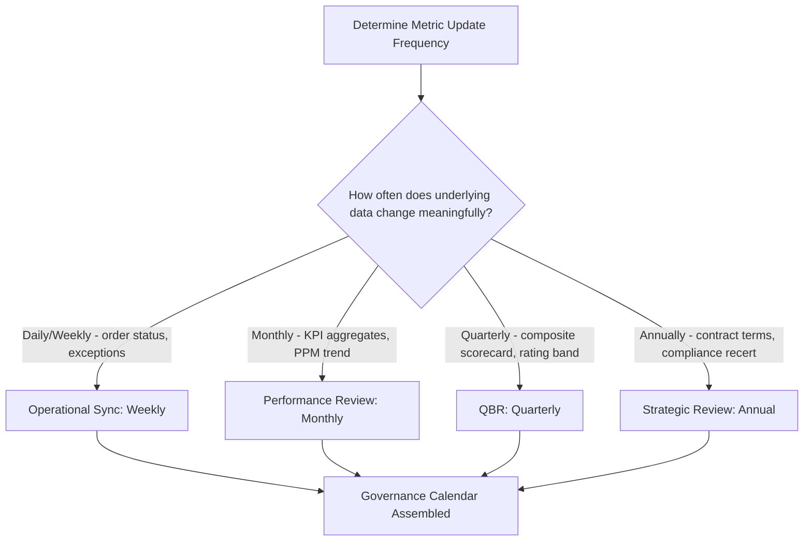
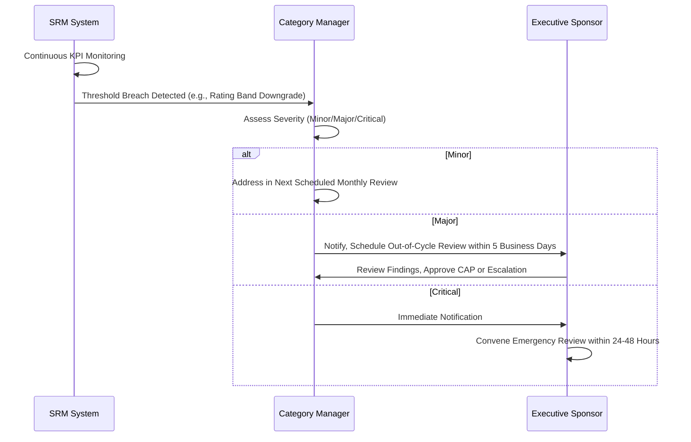
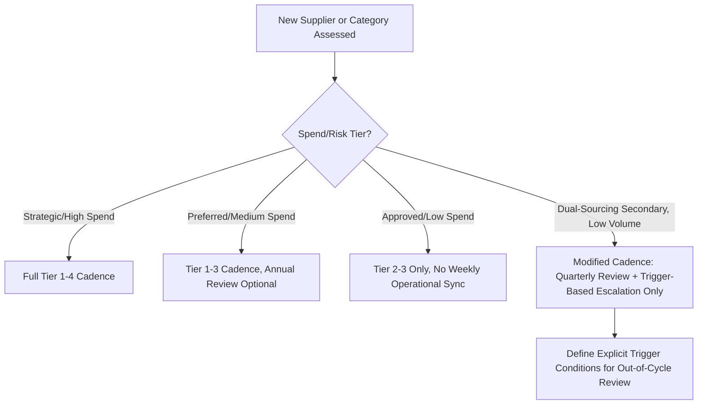

## Performance Review Cadence and Governance Meetings


### Overview

Performance Review Cadence and Governance Meetings define the recurring meeting structure through which supplier scorecards, KPI trends, and relationship issues are formally reviewed, escalated, and acted upon. Cadence design balances review frequency against the natural update rate of underlying data — reviewing too frequently produces noise-driven overreaction, while reviewing too infrequently allows problems to compound before detection. In Dual Sourcing, governance cadence must accommodate an asymmetry: the primary supplier typically warrants a full review rhythm, while a lower-volume secondary supplier needs a lighter-touch but still disciplined cadence to keep its readiness status current without consuming disproportionate governance resources.

### Key Points

- **Cadence should match the metric's natural update frequency, not an arbitrary calendar default**: Reviewing OTIF weekly when only 2 orders occurred that week produces statistically meaningless trend discussion; reviewing compliance attestation status monthly is unnecessary since it changes annually.
- **Tiered meeting structure serves different governance purposes**: Operational reviews solve immediate issues; tactical reviews assess trends and corrective actions; strategic reviews (QBRs) address the relationship's future and contractual direction.
- **Meeting without documented outcomes is not governance**: A review meeting must produce recorded action items with owners and due dates, or it functions as a status update rather than a governance mechanism.
- **Escalation meetings are distinct from scheduled reviews**: A scheduled cadence handles known, expected performance discussion; an escalation meeting is triggered reactively by a threshold breach and follows a separate, faster-moving process.
- **Dual sourcing cadence asymmetry must be deliberate, not neglectful**: A secondary supplier meeting less frequently should still have defined trigger conditions (e.g., any rating band downgrade) that force an out-of-cycle review, preventing "low cadence" from becoming "no oversight."

### Meeting Tier Structure

| Tier | Meeting Type | Frequency | Participants | Focus |
| --- | --- | --- | --- | --- |
| 1 | Operational Sync | Weekly/Bi-weekly | Buyer, Supplier Account Manager | Open orders, immediate issues, exceptions |
| 2 | Performance Review | Monthly | Category Manager, Quality, Supplier Ops Manager | Scorecard review, KPI trends, minor CAP tracking |
| 3 | Quarterly Business Review (QBR) | Quarterly | Procurement Director, Supplier Executive Sponsor, cross-functional stakeholders | Composite scorecard, strategic alignment, contract performance, major CAPs |
| 4 | Annual/Strategic Review | Annually | C-level/VP Procurement, Supplier C-level | Contract renewal, strategic roadmap, category strategy alignment |
| — | Escalation Review | Ad hoc, threshold-triggered | Varies by escalation tier | Specific breach/incident resolution |

### Cadence-to-Data-Maturity Mapping



### QBR Standard Agenda Template



```
1. Scorecard Review (15 min)
   - Composite score and rating band trend (trailing 4 quarters)
   - KPI category breakdown vs. targets

2. Open Corrective Action Plans (15 min)
   - Status of active CAPs, root cause findings, resolution timeline

3. Risk and Compliance Review (10 min)
   - Attestation currency, audit findings, financial health indicators

4. Cost and Value Discussion (10 min)
   - Savings/cost avoidance realized, TCO trend, upcoming pricing events

5. Relationship and Strategic Alignment (10 min)
   - Volume forecast alignment, capacity planning, innovation pipeline

6. Action Items and Next Steps (5 min)
   - Documented owners and due dates

7. [Dual Sourcing Context] Contingency Readiness Check (5 min)
   - Secondary supplier activation-readiness status, if applicable
```

### Governance Meeting Escalation Trigger Logic



### Action Item Tracking Structure

| Field | Example |
| --- | --- |
| Action ID | QBR-2026Q1-004 |
| Description | Supplier to submit updated ISO 45001 certification |
| Owner | Supplier Account Manager (Supplier side) |
| Due Date | 2026-04-15 |
| Status | Open / In Progress / Closed / Overdue |
| Linked KPI/Risk | Compliance Attestation Currency |
| Escalation if Overdue | Auto-flag to Category Manager after 5 days past due |

### Meeting Cadence Decision Framework



### Dual Sourcing-Specific Considerations

- **Trigger-based cadence for low-volume secondary suppliers**: Rather than a full monthly operational cadence (which may lack sufficient transaction volume to discuss meaningfully), define explicit trigger conditions — any rating band downgrade, any compliance lapse, any missed test-order commitment — that automatically escalate to an out-of-cycle review.
- **Annual joint readiness review**: Even absent performance issues, an annual review specifically assessing the secondary supplier's activation readiness (capacity confirmation, current pricing, current compliance status) should be calendared independently of volume-driven cadence.
- **Parallel QBR structure, not combined**: Primary and secondary supplier QBRs should be held separately (per the confidentiality principle established at kickoff), even though the internal governance calendar tracks both on a comparable schedule.

### Common Pitfalls

- Defaulting every supplier to the same review cadence regardless of spend/risk tier, wasting governance bandwidth on low-risk suppliers while under-reviewing high-risk ones
- Holding review meetings without producing documented, owned action items, causing the same issues to resurface unresolved quarter after quarter
- Allowing a low-volume secondary supplier's review cadence to lapse entirely due to "nothing to discuss," resulting in stale readiness status precisely when activation might be needed
- Conflating scheduled performance reviews with escalation meetings, causing urgent issues to wait for the next calendar slot rather than triggering immediate attention
- Failing to track overdue action items systematically, allowing governance meetings to become recurring restatements of the same unresolved commitments

**Related Topics**

- Corrective Action Plan (CAP) Governance and Escalation Frameworks
- Weighted Supplier Scorecards and Rating Band Design
- Action Item and Governance Tracking System Design
- Supplier Risk Tiering and Review Cadence Calibration
- Dual Sourcing Activation Readiness Review Protocols
- Meeting Governance Documentation and Audit Trail Practices