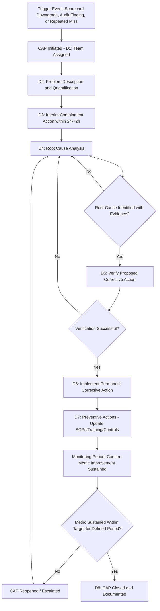
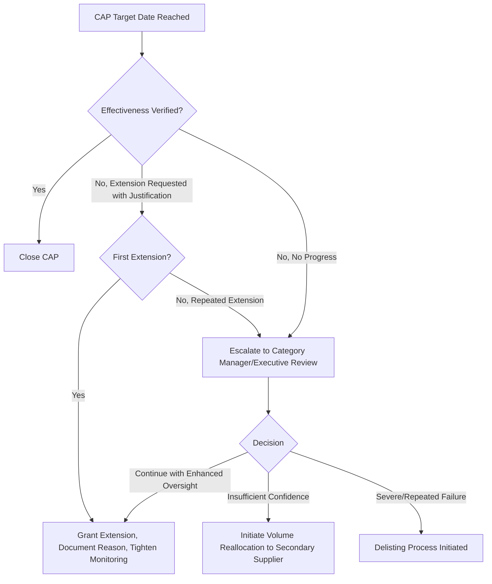

## Corrective Action Plans and Improvement Processes

### Overview

Corrective Action Plans (CAPs) and Improvement Processes are the formal mechanisms through which supplier performance deficiencies are investigated, root-caused, remediated, and verified as resolved. A CAP converts a scorecard downgrade or audit finding from a passive observation into an active, time-bound obligation with defined ownership and success criteria. In Dual Sourcing, a well-functioning CAP process is what determines whether a struggling primary supplier can be rehabilitated in place versus whether volume must shift to the secondary source — making CAP effectiveness and timeliness a direct input to sourcing continuity decisions, not merely a quality-department exercise.

### Key Points

- **CAPs must be triggered systematically, not discretionarily**: Tying CAP initiation to objective thresholds (rating band downgrade, PPM exceeding target by a defined margin, repeated OTIF misses) removes ambiguity about when the process begins.
- **Root cause analysis (RCA) is the difference between a CAP and a symptom patch**: A CAP that addresses the immediate defect without identifying and correcting the underlying process failure will see recurrence.
- **Containment and correction are distinct phases with different urgency**: Containment (stop the immediate problem from reaching the customer/next process step) must happen in hours/days; correction (fix the root cause) may reasonably take weeks.
- **Verification of effectiveness is the most frequently skipped step**: Closing a CAP because the corrective action was *implemented* — without confirming the metric actually improved — is a common failure mode that allows recurrence.
- **Dual sourcing changes CAP negotiating dynamics**: A supplier aware that volume can credibly shift to a qualified secondary source has stronger incentive to treat CAP deadlines seriously than one operating as a sole source.

### The 8D Problem-Solving Methodology (Industry Standard Structure)

| Discipline | Name | Purpose |
| --- | --- | --- |
| D1 | Establish the Team | Assign cross-functional owners with process knowledge |
| D2 | Describe the Problem | Quantify what, where, when, how much (5W2H framing) |
| D3 | Interim Containment Action | Immediate action to protect the customer/buyer from further impact |
| D4 | Root Cause Analysis | Identify true root cause(s), not symptoms |
| D5 | Verify Corrective Actions | Confirm proposed fix will resolve root cause before full rollout |
| D6 | Implement Permanent Corrective Action | Roll out the fix, remove interim containment |
| D7 | Prevent Recurrence | Update systems/procedures/training to prevent similar future issues |
| D8 | Recognize the Team | Close out and document lessons learned |

### CAP Lifecycle Flow



### Root Cause Analysis Techniques

**5 Whys (simple, sequential drilling):**



```
Problem: Shipment arrived with 40 defective units
Why? → Inspection process missed the defect
Why? → Inspector was using an outdated visual standard
Why? → Standard update wasn't communicated to inspection floor
Why? → No formal change-notification process exists for quality standards
Why? → Document control procedure doesn't include quality standard revisions
Root Cause: Gap in document control procedure for quality standard updates
```

**Fishbone/Ishikawa Diagram (categorical, for multi-factor problems)** — organizes potential causes into standard categories: Man (people), Machine (equipment), Method (process), Material, Measurement, Environment — useful when a single linear "why" chain is insufficient to capture interacting causes.

### CAP Documentation Template



```
CAP Number: CAP-2026-0142
Supplier: _______________________
Trigger: [Scorecard Downgrade / Audit Finding / Customer Complaint / Repeated KPI Miss]
Date Initiated: _______________________
Severity: [Minor / Major / Critical]

D2 - Problem Description:
  What: _______________________
  Where: _______________________
  When First Observed: _______________________
  Quantity/Scope Affected: _______________________

D3 - Containment Action:
  Action: _______________________
  Implemented By: _______________________  Date: _______________________

D4 - Root Cause:
  Method Used: [5 Whys / Fishbone / Other]
  Root Cause Identified: _______________________
  Supporting Evidence: _______________________

D5/D6 - Corrective Action:
  Action Description: _______________________
  Verification Method: _______________________
  Target Completion Date: _______________________
  Actual Completion Date: _______________________

D7 - Preventive Action:
  System/Process Change: _______________________

Effectiveness Verification:
  Monitoring Period: _______________________
  Metric Target: _______________________
  Metric Actual (Post-Implementation): _______________________
  Verified By: _______________________  Date: _______________________

CAP Status: [Open / Pending Verification / Closed / Reopened / Escalated]
```

### CAP Severity and Timeline Framework

| Severity | Trigger Example | Containment SLA | Root Cause SLA | Full Resolution SLA |
| --- | --- | --- | --- | --- |
| Critical | Safety issue, regulatory non-compliance | 24 hours | 5 business days | 30 days |
| Major | Rating band downgrade to At-Risk, PPM > 1.5x target | 72 hours | 10 business days | 60 days |
| Minor | Single KPI miss, Conditional band entry | 5 business days | 15 business days | 90 days |

[Inference: these SLA timeframes are illustrative and commonly seen in industry practice; actual SLAs should be defined in the quality agreement or supplier manual specific to the organization and category risk.]

### CAP Escalation on Non-Resolution



### Effectiveness Verification (Statistical Confirmation, Not Just Compliance Check)

Rather than closing a CAP once the corrective action is *implemented*, effectiveness verification requires confirming the metric has genuinely shifted, typically via a defined post-implementation monitoring window:

$$\text{Verification Criterion: } \bar{x}_{post} \text{ within target for } n \geq 3 \text{ consecutive measurement periods}$$

For metrics with meaningful variance, a control-chart-style check (post-implementation mean shift exceeding pre-implementation control limits) provides stronger evidence than a single good data point immediately following the fix. Premature closure based on one favorable data point is a common cause of CAP recurrence.

### Dual Sourcing-Specific Considerations

- **CAP timeline as a reallocation decision input**: When a primary supplier's CAP timeline extends repeatedly without effectiveness verification, the elapsed time itself becomes a quantifiable input to the decision of whether to shift volume to the secondary source while remediation continues.
- **Secondary supplier surge capacity confirmation during primary's CAP**: Initiating a CAP on the primary supplier should trigger a parallel, informal capacity-confirmation check with the secondary supplier, ensuring readiness is current if reallocation becomes necessary.
- **CAP transparency with secondary supplier (limited)**: While confidential details shouldn't be shared, informing the secondary supplier that increased order volume may occur in the near term (without disclosing the primary's specific issue) allows it to prepare capacity without breaching confidentiality principles.

### Common Pitfalls

- Closing a CAP based on implementation completion rather than verified, sustained metric improvement
- Addressing only the immediate symptom (patching the specific defective batch) without conducting genuine root cause analysis, leading to recurrence
- Allowing repeated CAP extensions without escalation, effectively normalizing chronic underperformance
- Failing to define objective CAP trigger thresholds in advance, resulting in inconsistent application (some suppliers escalated quickly, others given informal passes)
- Not maintaining a CAP history/trend view per supplier, missing patterns where the same root cause category recurs across multiple "resolved" CAPs

**Related Topics**

- 8D and A3 Problem-Solving Methodology Deep Dive
- Root Cause Analysis Techniques: 5 Whys vs. Fishbone vs. Fault Tree Analysis
- Statistical Process Control for Post-CAP Effectiveness Verification
- Supplier Delisting and Offboarding Governance Processes
- Weighted Supplier Scorecards and Rating Band Triggers
- Dual Sourcing Volume Reallocation Decision Frameworks