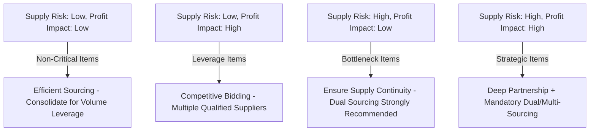
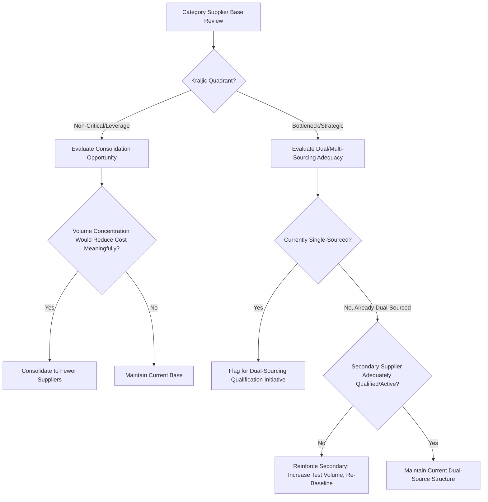
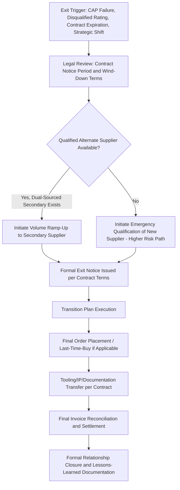
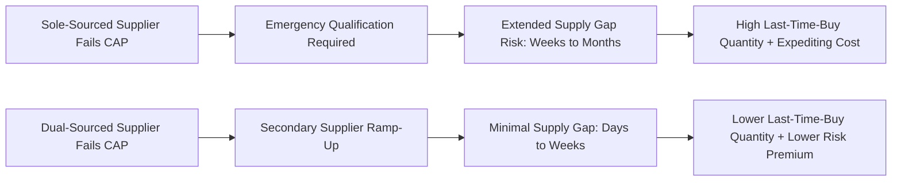

## Supplier Ranking, Rationalization, and Exit Decisions


### Overview

Supplier Ranking, Rationalization, and Exit Decisions are the portfolio-level processes through which an organization periodically evaluates its full supplier base, identifies consolidation or diversification opportunities, and executes formal offboarding when a supplier no longer meets strategic or performance requirements. Ranking produces the comparative ordering; rationalization is the strategic decision of how many suppliers a category should have and which to retain, consolidate, or add; exit is the operational and contractual process of formally ending a supplier relationship. In Dual Sourcing, this discipline is directly load-bearing: rationalization is the analysis that determines *whether* a category should remain dual-sourced at all, and exit governance determines how a failing primary supplier is offboarded without disrupting the operational transition to the secondary source.

### Key Points

- **Ranking, rationalization, and exit are sequential but distinct decisions**: A low rank doesn't automatically mean exit — it may mean reduced volume, a CAP, or continued monitoring. Conflating "poor performer" with "exit candidate" skips necessary intermediate governance steps.
- **Rationalization is a portfolio question, not a per-supplier question**: The right number of suppliers in a category depends on switching cost, market concentration, and risk tolerance — not simply "fewer is more efficient" or "more is safer."
- **Exit decisions require parallel transition planning, not sequential**: Beginning supplier exit only after fully deciding to exit (rather than planning transition logistics concurrently with the decision) extends operational risk exposure unnecessarily.
- **Exit is a contractual and legal process, not just an operational one**: Notice periods, wind-down clauses, IP/tooling ownership, and final settlement terms must be governed by the original contract, not improvised at exit time.
- **Dual sourcing materially de-risks exit decisions**: An organization with a qualified, ready secondary supplier can execute a primary supplier exit far more confidently and quickly than one facing exit from a sole-source position — this is arguably the single most direct operational payoff of maintaining dual sourcing.

### Supplier Ranking Methodology

Ranking typically builds on the weighted scorecard composite score (see Scorecard KPI content) but adds portfolio-context dimensions:

| Ranking Dimension | Source | Purpose |
| --- | --- | --- |
| Performance Composite Score | Weighted scorecard | Operational reliability |
| Strategic Importance | Category strategy classification (Kraljic matrix positioning) | Business criticality of the category/relationship |
| Switching Cost | Tooling investment, qualification lead time, IP dependency | Feasibility and cost of replacement |
| Relationship Tenure/Trust | Years engaged, historical dispute frequency | Relationship capital |
| Innovation Contribution | Joint development activity, technology roadmap alignment | Forward-looking strategic value |

### Kraljic Matrix (Standard Category Positioning Framework)



This matrix directly informs rationalization strategy: Bottleneck and Strategic quadrants are where dual sourcing delivers the greatest risk-adjusted value, while Non-Critical items are typically better served by consolidation to a single efficient supplier.

### Rationalization Decision Framework



### Supplier Portfolio Ranking Matrix (Illustrative Output)

| Rank | Supplier | Composite Score | Rating Band | Strategic Category | Switching Cost | Recommended Action |
| --- | --- | --- | --- | --- | --- | --- |
| 1 | Supplier A | 94.2 | Preferred | Strategic | High | Retain, deepen partnership |
| 2 | Supplier C | 88.1 | Approved | Bottleneck | Medium | Retain, monitor |
| 3 | Supplier B (Secondary) | 81.5 | Approved | Strategic | Low | Retain as qualified backup, maintain readiness |
| 4 | Supplier D | 58.3 | At-Risk | Leverage | Low | Rationalization candidate — evaluate exit |
| 5 | Supplier E | 39.0 | Disqualified | Non-Critical | Low | Exit process initiation |

### Exit Decision and Transition Governance Flow



### Exit Governance Checklist Template



```
Supplier: _______________________
Exit Trigger: [CAP Failure / Contract Expiration / Strategic Rationalization / Disqualification]
Contract Notice Period Required: _______________________ (per MSA clause ____)

Pre-Exit Verification:
[ ] Alternate/secondary supplier capacity confirmed sufficient
[ ] Transition timeline validated against alternate supplier's ramp-up capability
[ ] Outstanding POs and open orders inventoried
[ ] Tooling/IP ownership confirmed per contract terms
[ ] Last-time-buy quantity calculated (if applicable, to cover transition gap)

Exit Execution:
[ ] Formal written notice issued (date: _______)
[ ] Transition plan shared internally with logistics/quality/finance
[ ] Final quality/compliance audit conducted (if required by contract)
[ ] Volume ramp schedule to alternate supplier confirmed

Post-Exit:
[ ] Final invoice reconciliation completed
[ ] Tooling/documentation transferred or returned
[ ] Supplier removed from active vendor master
[ ] Lessons-learned review conducted and filed
```

### Last-Time-Buy Quantity Calculation (Common Exit Scenario)

When exiting a supplier for a component still needed until the alternate is fully qualified:

$$Q_{LTB} = (D_{avg} \times T_{gap}) + SS_{gap}$$

Where $D_{avg}$ is average demand rate, $T_{gap}$ is the time between exit and alternate supplier's full production readiness, and $SS_{gap}$ is additional safety stock to cover the qualification-gap uncertainty (typically larger than steady-state safety stock, given the one-time, non-repeatable nature of this buy).

### Exit Risk Comparison: Sole-Sourced vs. Dual-Sourced Category



### Dual Sourcing-Specific Considerations

- **Rationalization reviews should explicitly re-test single-sourced categories against the Kraljic matrix**: A category classified as Bottleneck or Strategic but still single-sourced should be flagged as a standing gap in every rationalization cycle, not just at initial category strategy setting.
- **Exit of a primary supplier is the dual-sourcing strategy's proof point**: The speed and low-friction nature of a primary exit when a qualified secondary exists is the clearest quantifiable evidence of dual sourcing's value — this should be captured and reported (time-to-full-transition, cost avoided vs. emergency sourcing) to justify continued investment in maintaining backup suppliers.
- **Secondary supplier promotion governance**: When a secondary is promoted to primary following an exit, a new secondary should be identified and qualification-initiated promptly, rather than allowing the category to silently revert to single-sourced status.

### Common Pitfalls

- Treating a low scorecard rank as an automatic exit trigger without considering switching cost, strategic importance, or CAP remediation potential
- Initiating exit proceedings before confirming contractual notice periods and wind-down obligations, creating legal exposure
- Beginning transition planning only after the exit decision is finalized, rather than running qualification/ramp-up of the alternate in parallel with the decision process
- Allowing a category to silently become single-sourced again after a dual-sourcing arrangement's primary is promoted or exited, without triggering a rationalization flag
- Failing to document lessons learned from exits, causing the same root causes (e.g., inadequate onboarding rigor) to recur with subsequent supplier relationships

**Related Topics**

- Kraljic Matrix and Category Sourcing Strategy Design
- Contract Wind-Down Clauses and Legal Exit Provisions
- Last-Time-Buy and End-of-Life Inventory Planning
- Supplier Qualification and Onboarding Timeline Compression
- Weighted Supplier Scorecards and Rating Band Triggers
- Dual Sourcing Business Case and ROI Measurement