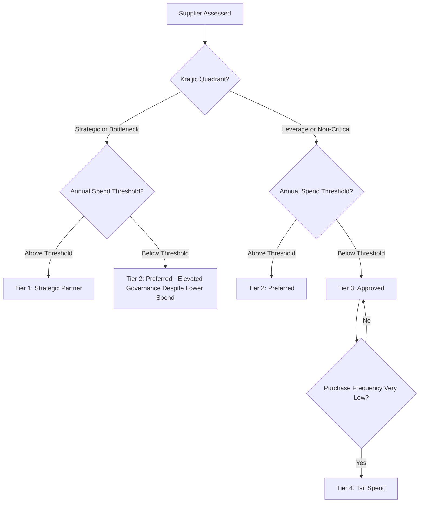
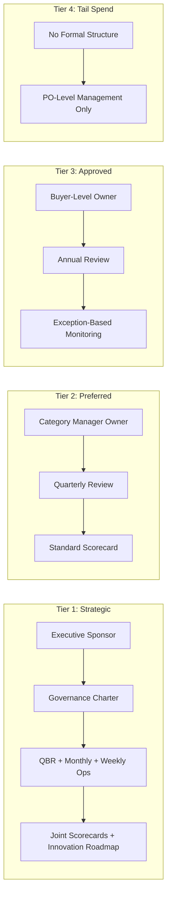
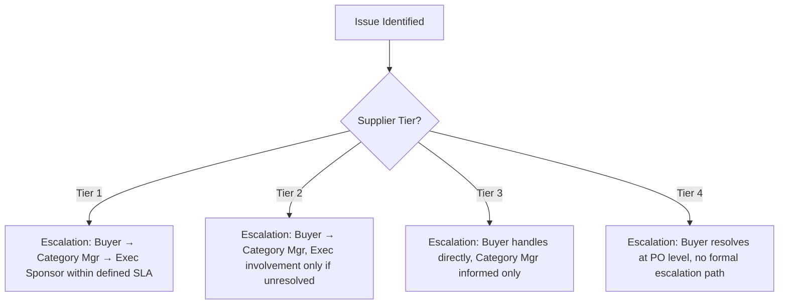

## Relationship Governance Structures and Tiers


### Overview

Relationship Governance Structures and Tiers define how the intensity, formality, and executive involvement in a buyer-supplier relationship scale according to that supplier's strategic importance. Rather than applying a uniform governance model to every supplier, mature SRM programs segment the supplier base into tiers, each with a distinct governance structure — reporting lines, meeting cadence, contractual depth, and executive sponsorship. In Dual Sourcing, tiering has a direct structural implication: primary and secondary suppliers in the same category may reasonably sit in different governance tiers reflecting their different volume/criticality profile, but both must remain within a formal tier (never informally ungoverned) since the secondary's governance quality determines how reliably it can be activated.

### Key Points

- **Tiering should follow the Kraljic-style risk/value classification**, not spend alone — a low-spend but high-criticality bottleneck supplier warrants a higher governance tier than its dollar volume alone would suggest.
- **Governance intensity is a resource allocation decision**: Applying Tier 1 (Strategic) governance rigor to every supplier is operationally unsustainable; under-governing a Tier 1 supplier is a genuine risk exposure.
- **Executive sponsorship must be genuinely engaged, not nominal**: A named executive sponsor who never attends reviews or engages with escalations provides no real governance value despite appearing on an org chart.
- **Governance structure should be documented and shared with the supplier**, not just held internally — ambiguity about who owns which decision on the supplier side, and who the supplier should escalate to on the buyer side, undermines the entire structure.
- **Dual sourcing tier assignment should reflect strategic role, not just current volume**: A secondary supplier holding 10% of volume but serving a Strategic/Bottleneck category should be tiered closer to the primary than its volume share alone would suggest, given its criticality if activated.

### Standard Supplier Tiering Model

| Tier | Classification | Typical Criteria | Governance Structure |
| --- | --- | --- | --- |
| Tier 1 | Strategic Partner | High spend, high supply risk, joint innovation, sole/dual-source of critical category | Executive sponsor, formal governance charter, QBR + monthly reviews, joint scorecards |
| Tier 2 | Preferred/Key Supplier | Moderate spend or moderate risk, established track record | Category manager ownership, quarterly reviews, standard scorecard |
| Tier 3 | Approved/Transactional | Low spend, low risk, commodity/leverage category | Buyer-level ownership, annual review, exception-based monitoring |
| Tier 4 | Tail Spend/Ad Hoc | Minimal spend, one-off or infrequent purchases | No formal governance structure; PO-level management only |

### Tiering Assignment Framework



### Governance Structure Components by Tier



### Governance Charter Template (Tier 1 Example)



```
Supplier: _______________________
Tier Classification: Tier 1 - Strategic Partner
Category: _______________________

Governance Roles:
  Executive Sponsor (Buyer): _______________________
  Executive Sponsor (Supplier): _______________________
  Category Manager: _______________________
  Quality Lead: _______________________
  Supplier Account Manager: _______________________

Meeting Cadence:
  Weekly Operational Sync: [Day/Time]
  Monthly Performance Review: [Day/Recurring]
  Quarterly Business Review: [Schedule]
  Annual Strategic Review: [Schedule]

Escalation Path:
  Tier 1 (Operational): _______________________  SLA: 48h
  Tier 2 (Tactical): _______________________  SLA: 5 business days
  Tier 3 (Executive): _______________________  SLA: 24-48h

Decision Rights (RACI Summary):
  Volume Allocation Changes: Accountable = _______________________
  Pricing Negotiation: Accountable = _______________________
  Contract Amendment: Accountable = _______________________

Review Cycle for This Charter: Annual
```

### Governance Escalation Path by Tier



### Tier Transition Triggers

| Trigger | Direction | Example |
| --- | --- | --- |
| Spend growth crosses threshold | Upgrade | Tail spend supplier awarded new significant contract |
| Category reclassified (Kraljic shift) | Upgrade | Commodity component becomes single-source-constrained due to market shift |
| Sustained poor performance | Downgrade | Tier 1 supplier repeatedly fails CAPs, relationship de-prioritized pending resolution |
| Contract non-renewal/reduced scope | Downgrade | Strategic supplier's contract scope narrowed significantly |
| Dual-sourcing activation | Upgrade | Secondary supplier assumes significant volume share following primary's exit |

### Dual Sourcing-Specific Considerations

- **Asymmetric but not absent governance**: A primary supplier at Tier 1 and its dual-sourced secondary at Tier 2 is a defensible structure reflecting volume difference — but the secondary should never sit at Tier 3/4 if the category itself is Strategic or Bottleneck, since that would leave the activation-critical backup under-governed.
- **Tier upgrade trigger built into contingency planning**: The governance framework should specify in advance that secondary supplier activation (full or partial volume shift) automatically triggers a tier review/upgrade, rather than leaving the secondary at its pre-activation governance level during a period of increased reliance.
- **Executive sponsor continuity across tier changes**: When a secondary supplier is promoted following a primary's exit, continuity of relationship knowledge (ideally via an already-engaged, even if less frequently active, executive sponsor) shortens the ramp-up compared to assigning a new sponsor at the moment of promotion.

### Common Pitfalls

- Assigning tier purely by spend, missing low-spend/high-criticality bottleneck suppliers that warrant elevated governance
- Naming an executive sponsor who has no real engagement with the relationship, creating a false sense of governance coverage
- Leaving a Strategic-category secondary supplier at a low governance tier because its current volume share is small, then discovering governance gaps precisely when activation is needed
- Failing to define automatic tier-review triggers tied to spend growth, category reclassification, or dual-sourcing activation events
- Not documenting or sharing the governance structure with the supplier itself, leading to confusion about escalation paths during a live issue

**Related Topics**

- Kraljic Matrix and Category Sourcing Strategy Design
- Performance Review Cadence and Governance Meeting Structures
- Escalation Matrix Design and Executive Sponsorship Models
- Supplier Segmentation and Portfolio Management
- Dual Sourcing Activation Readiness and Tier Upgrade Triggers
- RACI Frameworks for Supplier Relationship Decision Rights