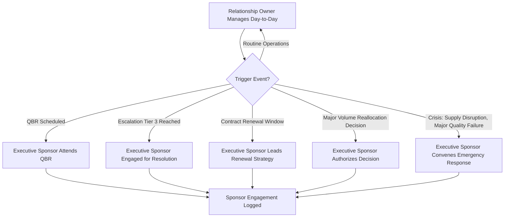
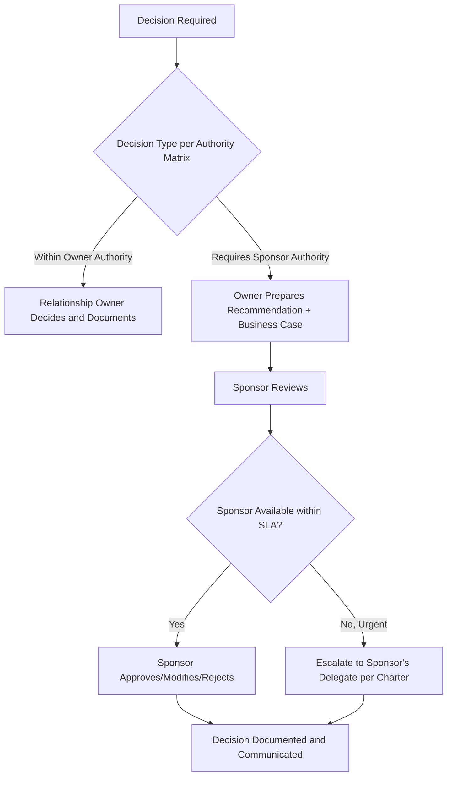
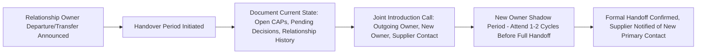

## Executive Sponsorship and Relationship Ownership

### Overview

Executive Sponsorship and Relationship Ownership defines who holds ultimate accountability for a supplier relationship's health and strategic direction, distinct from who handles its day-to-day operational management. An executive sponsor operates above the operational and tactical governance layers, engaging primarily at moments of strategic decision-making, unresolved escalation, or relationship inflection points (renewal, crisis, major expansion). Relationship ownership, more broadly, is the assignment of clear single-threaded accountability so that no supplier relationship exists without a named, accountable individual. In Dual Sourcing, sponsorship clarity is especially consequential because activation decisions — shifting volume from a struggling primary to a secondary source — are precisely the kind of high-stakes, cross-functional calls that require an engaged executive to authorize quickly.

### Key Points

- **Sponsorship is a role, not a title assignment**: Naming a VP as "executive sponsor" on a governance chart without genuine periodic engagement produces the appearance of oversight without its substance.
- **Ownership must be singular and unambiguous**: Shared or unclear ownership ("the category team owns this collectively") tends to produce accountability gaps precisely when fast decisions are needed.
- **Sponsorship activates at defined trigger points, not continuously**: Effective sponsors engage at contract renewal, major escalation, QBRs, and crisis moments — not by inserting themselves into routine operational matters, which would undermine the tiered governance structure.
- **Executive sponsorship should be mutual (buyer and supplier side)**: A governance structure with a buyer-side executive sponsor but no supplier-side counterpart creates an escalation dead-end when the issue requires supplier executive authority to resolve.
- **Dual sourcing decisions often require sponsor-level authority**: Reallocating significant volume between suppliers, especially under time pressure, typically exceeds category manager authority and requires the executive sponsor (or a defined sponsor-level body) to approve.

### Relationship Ownership vs. Executive Sponsorship (Distinction)

| Dimension | Relationship Owner | Executive Sponsor |
| --- | --- | --- |
| Typical Role | Category Manager / Supplier Account Manager | VP/Director Procurement, or C-level for Tier 1 |
| Engagement Frequency | Continuous/operational | Periodic, trigger-based |
| Decision Authority | Day-to-day operational and tactical decisions | Strategic decisions, major escalations, contract renewal |
| Accountability Scope | Scorecard performance, CAP follow-through, meeting cadence | Relationship health, strategic alignment, crisis resolution |
| Escalates To | Executive Sponsor | Peer executive (supplier side) or senior leadership |

### Sponsorship Engagement Model



### Executive Sponsorship Charter Template



```
Supplier: _______________________
Tier: _______________________

Executive Sponsor (Buyer Side): _______________________
  Title: _______________________
  Engagement Triggers: [QBR / Tier 3 Escalation / Contract Renewal / Crisis]
  Minimum Engagement Commitment: [e.g., attend 4 QBRs/year, respond to Tier 3 escalation within 24h]

Executive Sponsor (Supplier Side): _______________________
  Title: _______________________
  Counterpart Confirmed: Y/N

Relationship Owner: _______________________
  Title: _______________________
  Scope of Authority: _______________________
  Escalates to Sponsor When: [List specific trigger conditions]

Decision Authority Matrix:
| Decision Type                          | Owner Authority | Sponsor Authority Required |
|-----------------------------------------|-----------------|------------------------------|
| Routine PO/order management             | Yes              | No                           |
| CAP approval (Minor/Major)              | Yes              | No                           |
| CAP approval (Critical)                 | No               | Yes                          |
| Volume reallocation < 10%               | Yes              | No                           |
| Volume reallocation > 10%               | No               | Yes                          |
| Contract amendment                      | No               | Yes                          |
| Supplier exit initiation                | No               | Yes                          |
```

### Decision Authority Escalation Logic



### Relationship Ownership Continuity Risk

A frequently underestimated risk is ownership discontinuity — when a relationship owner changes roles or leaves the organization without a structured handover:



[Inference: the specific shadow-period length and handover structure above reflect common relationship-management practice; organizations formalize this differently based on relationship complexity and risk tolerance.]

### Dual Sourcing-Specific Considerations

- **Sponsor-level authority pre-authorized for activation scenarios**: Rather than requiring ad hoc sponsor approval at the moment of a supply disruption, mature dual-sourcing governance pre-defines the conditions under which the relationship owner may activate the secondary supplier without waiting for sponsor sign-off — reserving sponsor engagement for decisions exceeding pre-authorized thresholds.
- **Sponsor awareness of both suppliers, not just the primary**: The executive sponsor for a category should maintain visibility into both the primary and secondary relationships, even if day-to-day ownership of the secondary sits with a different or more junior relationship owner, so that reallocation decisions don't require the sponsor to be briefed from scratch during a crisis.
- **Cross-sponsor coordination when suppliers span categories**: If a secondary supplier for one category is also a strategic primary for another, sponsorship coordination across category teams prevents conflicting signals to that supplier.

### Common Pitfalls

- Naming an executive sponsor who never actually engages, creating a false sense of escalation coverage that fails when genuinely needed
- Leaving decision authority thresholds undefined, causing every reallocation or CAP decision to require ad hoc negotiation about who has authority to decide
- Allowing relationship ownership to transfer informally without documented handover, losing institutional knowledge of relationship history and open commitments
- Failing to establish a supplier-side executive counterpart, creating an escalation dead-end when an issue genuinely requires supplier executive authority
- Keeping the executive sponsor uninformed about the secondary supplier relationship, forcing a slower, less-informed decision at the exact moment activation speed matters most

**Related Topics**

- Relationship Governance Structures and Supplier Tiering Models
- RACI Frameworks and Decision Authority Matrix Design
- Escalation Path Design and SLA-Driven Governance
- Contract Renewal Strategy and Executive Engagement Timing
- Knowledge Transfer and Relationship Ownership Continuity Planning
- Dual Sourcing Pre-Authorized Activation Governance