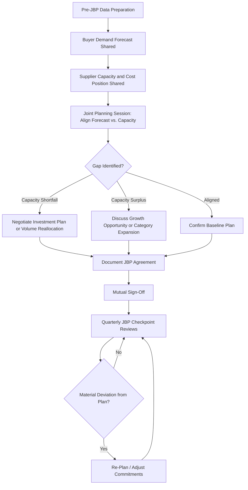
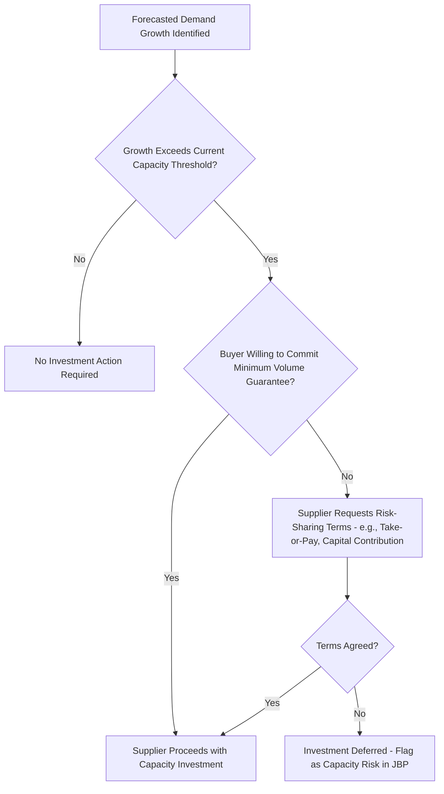

## Joint Business Planning Processes


### Overview

Joint Business Planning (JBP) is a structured, typically annual process in which a buyer and supplier collaboratively develop shared objectives, forecasts, and investment plans spanning a defined planning horizon (usually 1–3 years). Unlike routine performance reviews, which look backward at scorecard results, JBP looks forward: aligning demand forecasts, capacity investments, innovation roadmaps, and cost/value targets before they become operational commitments. In Dual Sourcing, JBP is the mechanism through which a secondary supplier's capacity investment and volume expectations are set deliberately — without it, a secondary supplier may under-invest in readiness because it has no forward visibility into how much volume it might realistically need to absorb if activated.

### Key Points

- **JBP is forward-looking and mutual; performance reviews are backward-looking and largely buyer-driven**: Conflating the two dilutes both — JBP discussions get pulled into scorecard defense, while performance issues get deferred into vague future promises.
- **Forecast sharing is the foundational input**: Without a reasonably reliable buyer-side demand forecast, supplier capacity and investment planning becomes guesswork, undermining the entire JBP premise.
- **JBP should produce documented, mutually signed commitments**, not just a shared conversation — volume ranges, investment triggers, and review checkpoints need to be written down to be actionable.
- **Capacity and investment commitments require explicit triggers**, since suppliers are generally unwilling to invest in capacity based on an unconditional forecast that carries no commitment weight from the buyer.
- **Dual sourcing JBP must address volume-split scenarios explicitly**: the secondary supplier's JBP should include a defined "activation scenario" volume range (what happens if it absorbs more volume due to primary supplier issues), not just its baseline planned allocation.

### JBP Process Structure



### JBP Document Structure (Typical Sections)



```
Joint Business Plan: [Supplier Name] — Planning Period: [Year(s)]

1. Executive Summary
   - Strategic context, relationship objectives for the period

2. Demand Forecast
   - Volume by SKU/category, confidence level, seasonality factors
   - Forecast accuracy commitment (buyer) / capacity commitment (supplier)

3. Capacity and Investment Plan
   - Current capacity vs. forecasted demand
   - Planned capacity investments, triggers, and timeline
   - Contingency capacity (relevant for dual-sourcing secondary suppliers)

4. Cost and Value Roadmap
   - Target cost reduction/avoidance initiatives
   - Should-cost alignment checkpoints
   - Value engineering opportunities

5. Quality and Compliance Roadmap
   - Certification renewal timeline
   - Process improvement commitments

6. Innovation and Technology Roadmap
   - Joint development projects
   - New product/technology introduction timeline

7. Risk and Contingency Planning
   - Named risks (supply, geopolitical, financial)
   - Dual-sourcing volume-split scenarios and activation triggers

8. Governance and Review Cadence
   - Checkpoint schedule, escalation path for plan deviations

Mutual Sign-Off:
   Buyer Executive Sponsor: _______________________  Date: _______________________
   Supplier Executive Sponsor: _______________________  Date: _______________________
```

### Demand Forecast Sharing Framework

| Forecast Horizon | Typical Granularity | Commitment Level |
| --- | --- | --- |
| 0–3 months | SKU-level, firm | Contractually committed (PO-backed) |
| 3–12 months | SKU-level, rolling | Directional, updated monthly/quarterly |
| 12–36 months | Category-level, aggregate | Planning guidance only, capacity-investment basis |

Forecast accuracy is often tracked as a bilateral metric — buyer forecast accuracy affects supplier capacity planning just as supplier delivery reliability affects buyer inventory planning:

$$\text{Forecast Accuracy} = \left(1 - \frac{|Actual - Forecast|}{Actual}\right) \times 100$$

### Capacity Investment Trigger Model



### JBP Checkpoint Review Cadence

| Checkpoint | Frequency | Focus |
| --- | --- | --- |
| Quarterly Business Review Overlay | Quarterly | Confirm forecast-vs-actual variance, adjust near-term plan |
| Mid-Year JBP Review | Semi-annual | Material re-planning if significant deviation from annual plan |
| Annual JBP Renewal | Annual | Full re-planning cycle for the next planning horizon |

### Dual Sourcing JBP: Activation Scenario Planning

A dual-sourcing-specific JBP extension explicitly models the secondary supplier's role under a disruption scenario, rather than only its steady-state allocation:



```
Dual Sourcing Activation Scenario — [Secondary Supplier Name]

Baseline Planned Volume Allocation: ____% of category demand
Activation Scenario Volume (if Primary Disrupted): ____% of category demand
Time-to-Ramp from Baseline to Activation Volume: ____ weeks
Capacity Reserved/Committed for Activation Scenario: [Yes/No, terms]
Pricing Terms Under Activation Scenario: [Same as baseline / Pre-negotiated surge terms]
Trigger Conditions for Activation: [Rating band downgrade, CAP failure, force majeure, etc.]
Last Joint Test of Activation Readiness: [Date of last surge/test order]
```

Embedding this scenario into the JBP — rather than treating it as an informal contingency assumption — ensures the secondary supplier has planned and, where appropriate, invested in the capacity needed to genuinely serve as a backup, and that pricing/terms for a surge scenario are pre-negotiated rather than negotiated under duress during an actual disruption.

### Dual Sourcing-Specific Considerations

- **Forecast transparency parity**: Both primary and secondary suppliers should receive forecast information sufficient for their respective planning role — the secondary needs visibility into its activation-scenario volume range, not just its steady-state allocation, to plan capacity meaningfully.
- **Pre-negotiated surge terms avoid disadvantageous crisis-time negotiation**: Pricing and lead-time terms for an activation scenario negotiated calmly during annual JBP are typically more favorable to the buyer than terms negotiated under the time pressure of an active supply disruption.
- **Joint activation readiness testing as a JBP deliverable**: Scheduling periodic test orders or capacity confirmation drills as part of the JBP cadence keeps the secondary supplier's readiness current rather than theoretical.

### Common Pitfalls

- Treating JBP as a one-way forecast presentation rather than a genuinely bilateral planning dialogue with supplier capacity/cost input
- Sharing forecasts without any accuracy accountability, causing suppliers to discount buyer forecasts as unreliable over time
- Failing to document capacity investment triggers explicitly, leading to disputes over whether a supplier under-invested relative to what was "promised"
- Omitting dual-sourcing activation scenarios from JBP entirely, leaving the secondary supplier's surge capacity and pricing terms undefined until an actual disruption forces urgent negotiation
- Allowing JBP documents to go unrevisited after annual sign-off, so material demand or capacity shifts during the year are never formally reconciled against the original plan

**Related Topics**

- Demand Forecasting Methods and Forecast Accuracy Measurement
- Capacity Investment Risk-Sharing Models (Take-or-Pay, Capital Contribution)
- Cost and Value Metrics: TCO and Savings Tracking
- Dual Sourcing Activation Readiness Testing and Surge Capacity Planning
- Innovation Roadmap Alignment and Joint Development Agreements
- Quarterly Business Review (QBR) Integration with Annual Planning Cycles