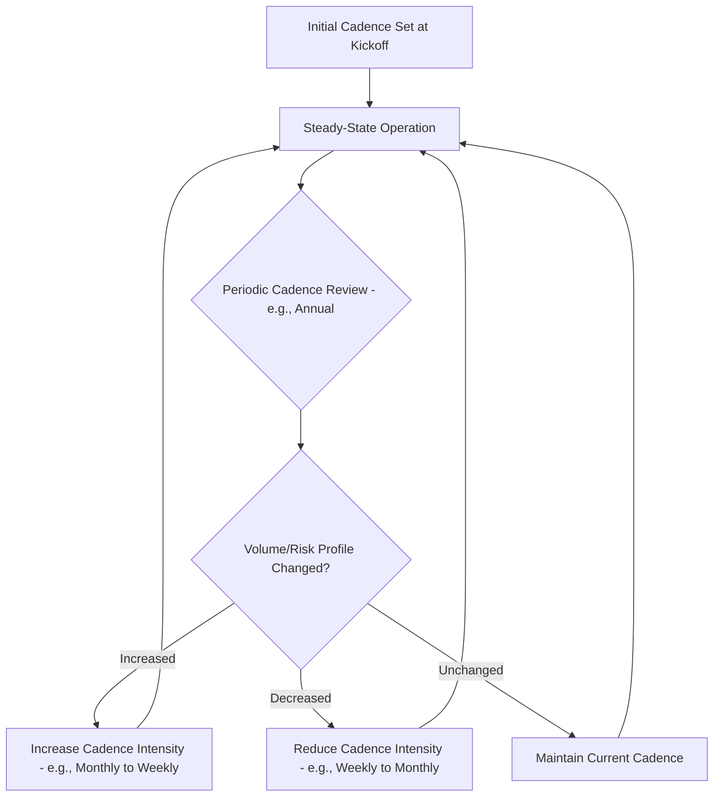
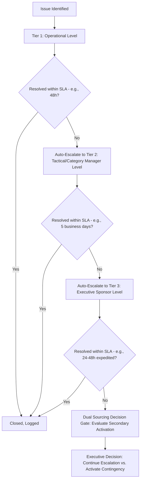
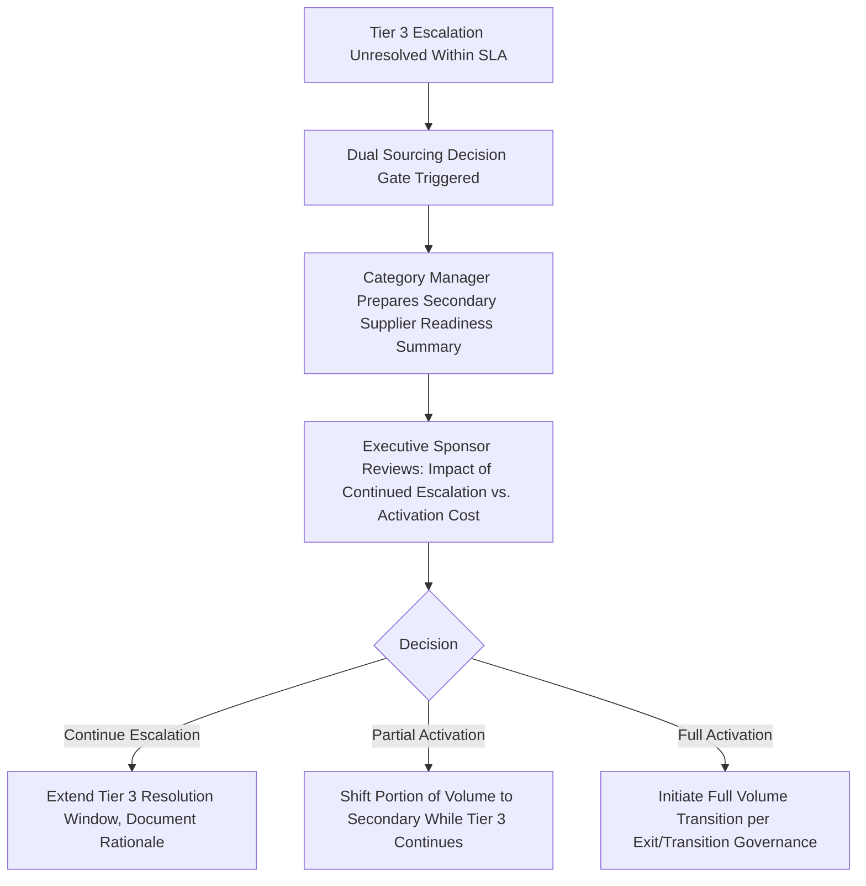

## Communication Cadences and Escalation Paths


### Overview

Communication Cadences and Escalation Paths formalize the ongoing rhythm of information exchange in a supplier relationship and the structured routes through which unresolved issues move to higher levels of authority. Where onboarding-phase communication protocols establish the initial framework, this discipline addresses its steady-state operation and maintenance over the life of the relationship — including how cadences and escalation structures should be reviewed, adjusted, and enforced over time. In Dual Sourcing, escalation-path design carries particular weight because a well-defined path is what prevents an unresolved issue with the primary supplier from lingering past the point where secondary-source activation should have been considered.

### Key Points

- **Cadence and escalation are complementary but distinct systems**: Cadence handles expected, scheduled information flow; escalation handles unexpected deviations that require faster, hierarchical routing outside the normal schedule.
- **Escalation paths must specify time-bound SLAs at each tier**, not just a hierarchy — "escalate to the category manager" without a response-time commitment produces the same delay as no escalation path at all.
- **Silent escalation failure is worse than no escalation path**: If Tier 2 fails to respond within SLA and the system doesn't automatically advance to Tier 3, issues stall invisibly rather than triggering visible urgency.
- **Cadence should be periodically re-evaluated against actual relationship needs**, not fixed permanently at onboarding — a relationship's appropriate cadence naturally evolves as volume, trust, and risk profile change.
- **Dual sourcing escalation paths should include an explicit "consider secondary activation" decision gate** at a defined tier, rather than leaving that consideration to appear informally whenever someone happens to think of it.

### Cadence Governance Over the Relationship Lifecycle



### Standard Cadence Framework (Steady-State)

| Cadence | Frequency | Primary Content | Typical Channel |
| --- | --- | --- | --- |
| Transactional Updates | Real-time/Daily | Order status, ASN, exceptions | EDI/API/Portal (automated) |
| Operational Sync | Weekly/Bi-weekly | Open issues, near-term schedule | Call/video |
| Performance Review | Monthly | Scorecard, KPI trends, CAP status | Call/video + written summary |
| Business Review (QBR) | Quarterly | Composite performance, strategic topics | In-person/video, formal agenda |
| Strategic/JBP Review | Annual | Forward planning, contract terms | In-person, executive-level |

### Escalation Path Structure (Standard Tiered Model)



### Escalation SLA Matrix

| Tier | Owner (Buyer) | Owner (Supplier) | Response SLA | Resolution SLA | Auto-Escalates If Missed |
| --- | --- | --- | --- | --- | --- |
| 1 — Operational | Buyer/Planner | Account Manager | 4 business hours | 48 hours | Yes → Tier 2 |
| 2 — Tactical | Category Manager | Sales/Ops Director | 1 business day | 5 business days | Yes → Tier 3 |
| 3 — Executive | VP Procurement/Sponsor | Executive Sponsor | 24 hours | 48-72 hours (expedited) | Yes → Dual Sourcing Decision Gate |

### Escalation Ticket/Log Template



```
Escalation ID: ESC-2026-0087
Supplier: _______________________
Date Raised: _______________________
Raised By: _______________________
Current Tier: [1 / 2 / 3]

Issue Description: _______________________
Business Impact: [Low / Medium / High / Critical]

Tier 1 Response:
  Response Time: _______________________  Within SLA: Y/N
  Action Taken: _______________________
  Resolved: Y/N — If No, Auto-Escalated: [Date/Time]

Tier 2 Response: (if escalated)
  Response Time: _______________________  Within SLA: Y/N
  Action Taken: _______________________
  Resolved: Y/N — If No, Auto-Escalated: [Date/Time]

Tier 3 Response: (if escalated)
  Response Time: _______________________  Within SLA: Y/N
  Decision: [Resolved / Continue Monitoring / Activate Contingency Source]

Final Status: [Closed / Ongoing / Escalated to Dual-Sourcing Decision]
Lessons Learned: _______________________
```

### Cadence Adjustment Decision Logic

```python
def evaluate_cadence_adjustment(current_cadence_days, volume_change_pct,
                                  recent_escalation_count, risk_tier):
    if recent_escalation_count >= 3 and current_cadence_days > 7:
        return "INCREASE: Reduce interval, escalation frequency signals need for tighter monitoring"
    if volume_change_pct > 50 and current_cadence_days > 14:
        return "INCREASE: Significant volume growth warrants closer cadence"
    if recent_escalation_count == 0 and volume_change_pct < -30 and risk_tier != "Strategic":
        return "DECREASE: Stable performance and reduced volume may allow lighter cadence"
    return "MAINTAIN: No trigger conditions met"
```

### Communication Channel-to-Escalation-Tier Mapping

| Channel | Appropriate for Tier | Notes |
| --- | --- | --- |
| Automated system alert (EDI/API exception) | Tier 1 trigger | Should auto-generate an escalation ticket, not rely on manual detection |
| Email | Tier 1-2 | Should be logged into SRM system if decision-relevant |
| Scheduled call | Tier 1-2 | Routine cadence, not escalation-specific |
| Direct phone call/urgent message | Tier 2-3 | Bypasses queue for time-sensitive issues |
| In-person/executive briefing | Tier 3 | Reserved for genuinely executive-level decisions |

### Dual Sourcing Decision Gate (Escalation Path Extension)



### Dual Sourcing-Specific Considerations

- **Explicit decision gate rather than informal consideration**: Building a named "Dual Sourcing Decision Gate" into the escalation path (triggered when Tier 3 SLA is missed) ensures secondary-source activation is formally considered at a defined point, rather than depending on someone remembering to raise it.
- **Escalation path parity across suppliers**: The same tiered SLA structure should apply to both primary and secondary suppliers, so that an issue with the secondary supplier (which might otherwise be treated less urgently due to lower volume) still receives timely resolution — its reliability is precisely what's being relied upon in a disruption scenario.
- **Escalation history as an input to activation decisions**: A pattern of repeated Tier 2/3 escalations with a given supplier, even if each individual issue was eventually resolved, is itself a data point that should inform reallocation and rationalization discussions.

### Common Pitfalls

- Defining escalation tiers without time-bound SLAs, making "escalation" a hierarchy chart rather than an operating mechanism
- Failing to build automatic advancement when an SLA is missed, allowing issues to stall silently at a given tier
- Never revisiting cadence after initial kickoff, leaving a relationship over- or under-governed as its volume and risk profile evolves
- Treating the decision to consider secondary-source activation as an informal judgment call rather than a defined, triggered gate in the escalation path
- Applying looser escalation SLAs to a lower-volume secondary supplier, degrading its reliability signal exactly when that reliability matters most

**Related Topics**

- Relationship Governance Structures and Supplier Tiering Models
- Performance Review Cadence and Governance Meeting Structures
- Executive Sponsorship and Relationship Ownership
- Corrective Action Plans and Escalation-Triggered Remediation
- Dual Sourcing Activation Criteria and Decision Governance
- SLA Design and Automated Escalation System Architecture